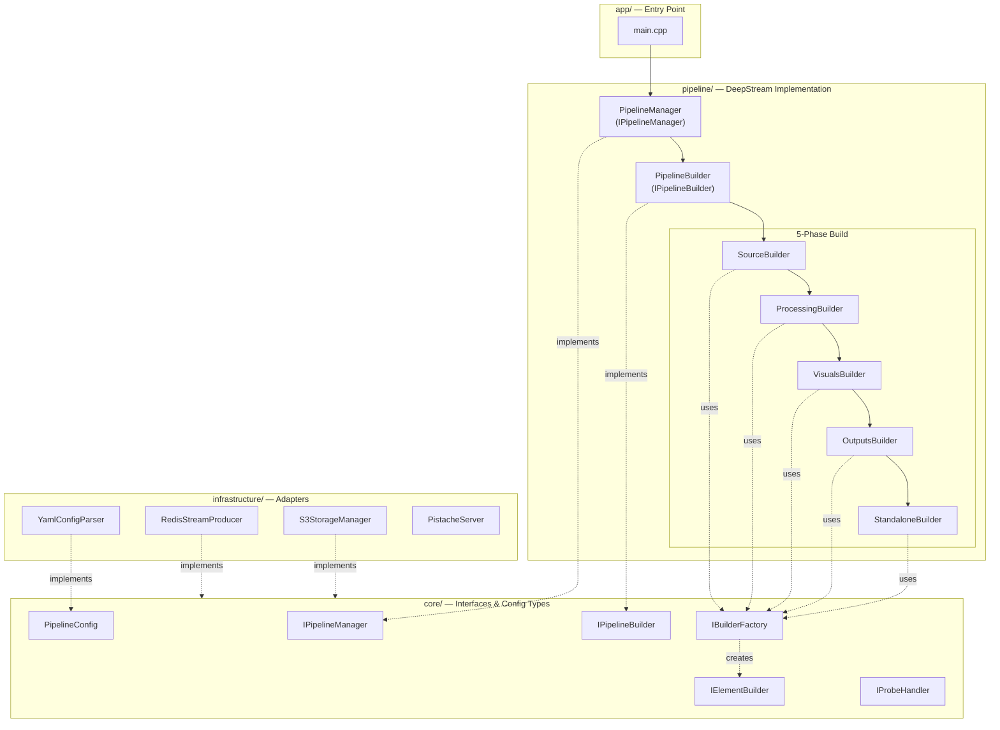
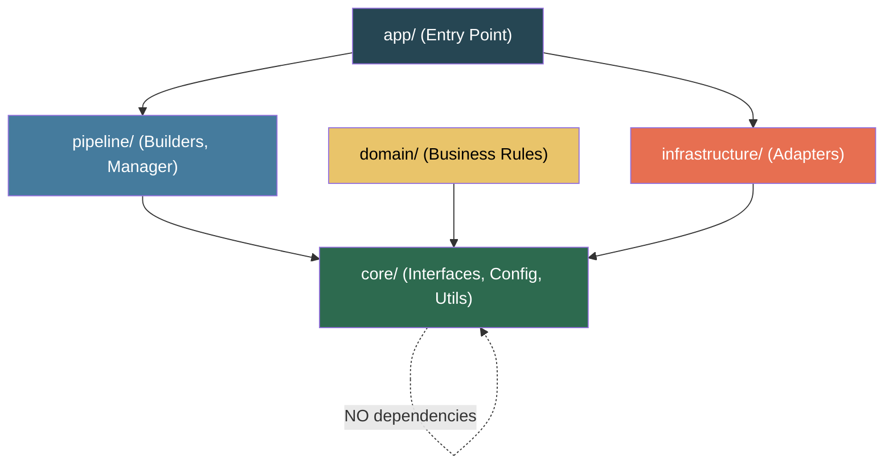
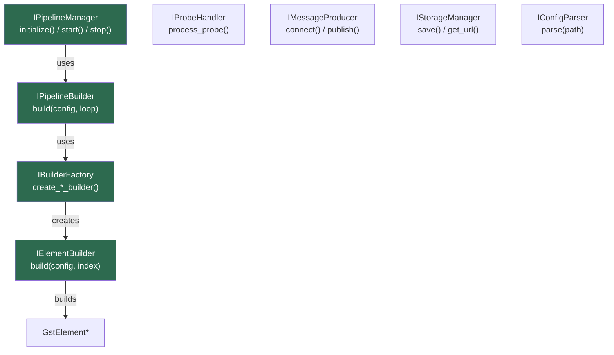
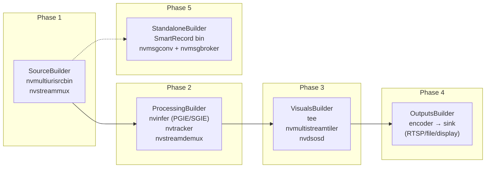
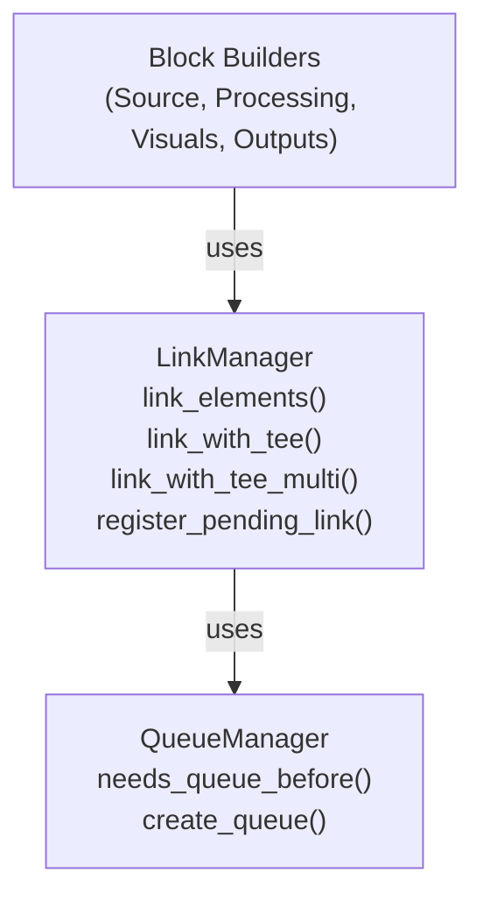
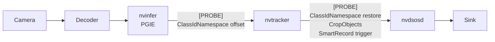
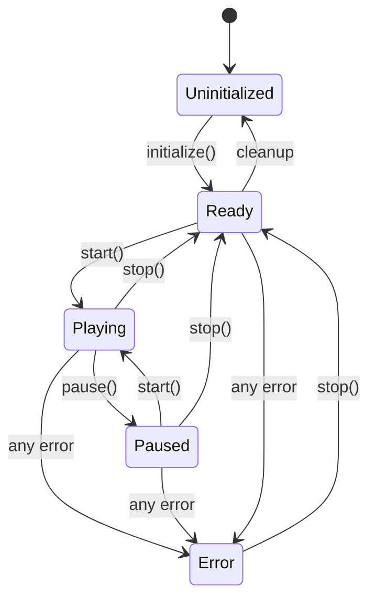
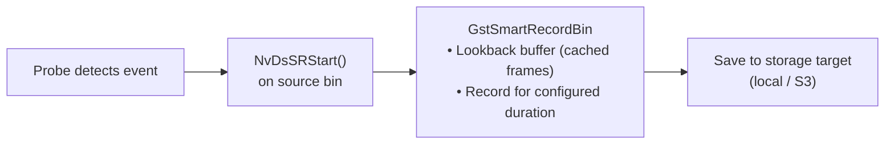
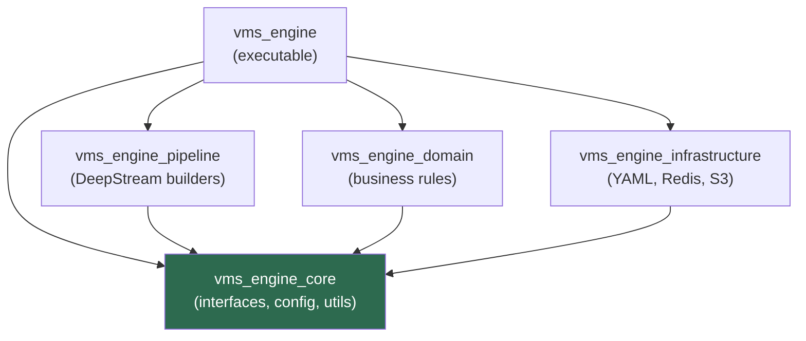

# VMS Engine — Architecture Blueprint

> **Clean Architecture + Builder Pattern + Strategy Pattern cho C++ Video Analytics**
> **DeepStream-Native · Config-Driven · Interface-First · Extensible**

---

## Mục lục

- [1. Overview](#1-overview)
- [2. Architecture Principles](#2-architecture-principles)
- [3. Technology Stack](#3-technology-stack)
- [4. Layer Structure](#4-layer-structure)
- [5. Core Interfaces (Ports)](#5-core-interfaces-ports)
- [6. Builder System](#6-builder-system)
- [7. Configuration System](#7-configuration-system)
- [8. Event & Probe System](#8-event--probe-system)
- [9. Infrastructure Adapters](#9-infrastructure-adapters)
- [10. Pipeline Lifecycle](#10-pipeline-lifecycle)
- [11. Output & Recording System](#11-output--recording-system)
- [12. Design Patterns](#12-design-patterns)
- [13. Memory Management](#13-memory-management)
- [14. Namespace & Naming](#14-namespace--naming)
- [15. Build System](#15-build-system)
- [16. Migration từ lantanav2](#16-migration-từ-lantanav2)
- [17. Quick Reference](#17-quick-reference)

---

## 1. Overview

**VMS Engine** — high-performance Video Management System engine trên **NVIDIA DeepStream SDK 8.0** với **C++17**. Xử lý real-time video từ nhiều camera (RTSP, file, URI) với AI inference (object detection, tracking, analytics) và output ra display, file recording, RTSP streaming, message brokers.

### Design Goals

| Goal | Mô tả |
|---|---|
| **Clean Architecture** | Business logic (domain) độc lập với infrastructure |
| **Interface-First** | Core layer define contracts; implementations ở layer riêng |
| **Config-Driven** | Pipeline topology 100% YAML — zero code changes cho deployments mới |
| **DeepStream-Native** | Single backend, không abstraction layer thừa cho multi-backend |
| **Builder Pattern** | Sequential pipeline construction với composable phases |
| **Extensible** | Plugin system cho custom event handlers, probes, external processing |
| **Observable** | Structured logging (spdlog), DOT graph export, GStreamer bus monitoring |

### High-Level Architecture



---

## 2. Architecture Principles

### 2.1 Dependency Rule — Dependencies Point Inward



> 🔒 **Rule**: Inner layers KHÔNG BAO GIỜ depend on outer layers. Core defines interfaces; infrastructure implements.

### 2.2 Interface-First (Ports & Adapters)

| Loại | Ví dụ | Vai trò |
|---|---|---|
| **Ports** (Interfaces) | `IPipelineManager`, `IBuilderFactory`, `IElementBuilder`, `IProbeHandler`, `IStorageManager`, `IMessageProducer` | Contracts giữa layers |
| **Driving Adapters** (Input) | `main.cpp`, REST API, CLI args | Push commands vào system |
| **Driven Adapters** (Output) | Redis, Kafka, S3, Local FS | System pushes data ra |

### 2.3 Single Backend — No Unnecessary Abstraction

> 📋 Khác với lantanav2 (abstract cả DeepStream/DLStreamer), vms-engine là **DeepStream-native**. Config types reference trực tiếp DeepStream options — không cần `std::variant` wrappers.

### 2.4 Config-Driven Pipeline

Pipeline topology 100% YAML. Zero code changes khi:
- Thêm/bớt cameras
- Đổi inference models
- Bật/tắt analytics
- Switch output modes
- Configure event handlers

---

## 3. Technology Stack

| Component | Technology | Purpose |
|---|---|---|
| **Language** | C++17 | Performance-critical video processing |
| **Build** | CMake 3.16+ + vcpkg | Cross-platform build + pkg management |
| **Video** | GStreamer 1.0 | Pipeline-based multimedia framework |
| **AI** | NVIDIA DeepStream SDK 8.0 | GPU-accelerated video analytics |
| **Inference** | TensorRT, CUDA | Model optimization & GPU execution |
| **Config** | YAML (yaml-cpp) | Human-readable pipeline config |
| **Logging** | spdlog + fmt | Structured, leveled logging |
| **Messaging** | Redis Streams, Kafka | Event publishing |
| **Storage** | Local FS, S3 (MinIO) | Snapshot/recording persistence |
| **REST API** | Pistache | Runtime control & monitoring |

---

## 4. Layer Structure

### Layer Overview

```
vms-engine/
├── app/                     # Application — Entry point, wiring
├── core/                    # Core — Interfaces, config types, utilities
│   ├── builders/            #   IPipelineBuilder, IBuilderFactory, IElementBuilder
│   ├── config/              #   PipelineConfig + all sub-config types
│   ├── pipeline/            #   IPipelineManager, PipelineState
│   ├── eventing/            #   event_types.hpp (ON_EOS, ON_DETECT, …)
│   ├── probes/              #   IProbeHandler
│   ├── messaging/           #   IMessageProducer, IMessageConsumer
│   ├── storage/             #   IStorageManager
│   ├── runtime/             #   IRuntimeParamManager, IRuntimeStreamManager
│   └── utils/               #   Logger, UUID, thread-safe queue
├── pipeline/                # Pipeline — DeepStream builder implementations
│   ├── block_builders/      #   Phase builders (Source, Processing, Visuals, Outputs, Standalone)
│   ├── builders/            #   Element builders (per GstElement type)
│   ├── linking/             #   LinkManager, QueueManager
│   └── probes/              #   ProbeHandlerManager, SmartRecord, CropObjects, ClassIdNamespace
├── domain/                  # Domain — Business rules & metadata processing
├── infrastructure/          # Infrastructure — YAML parser, Redis/Kafka, S3, REST API
├── plugins/                 # Plugins — Runtime-loadable .so handlers
├── configs/                 # YAML pipeline configs
└── dev/                     # Runtime data (git-ignored)
```

### Layer Dependency Rules

| Layer | Can Depend On | Cannot Depend On |
|---|---|---|
| **app/** | core, pipeline, infrastructure, domain | ∅ |
| **core/** | ∅ (std lib + GStreamer fwd-declares only) | pipeline, infra, domain |
| **pipeline/** | core | infra, domain |
| **domain/** | core | pipeline, infra |
| **infrastructure/** | core | pipeline, domain |
| **plugins/** | core | pipeline (linked at runtime) |

> 📋 **Chi tiết directory structure** → [01_directory_structure.md](deepstream/01_directory_structure.md)

---

## 5. Core Interfaces (Ports)

Core layer defines **pure abstract classes** (interfaces) — contracts giữa layers. Không implementation details nào leak vào core.

### Interface Hierarchy



### Key Interfaces

#### IPipelineManager — Lifecycle

```cpp
namespace engine::core::pipeline {
class IPipelineManager {
public:
    virtual ~IPipelineManager() = default;
    virtual bool initialize(PipelineConfig& config,
                           GMainLoop* main_loop_context = nullptr) = 0;
    virtual bool start() = 0;
    virtual bool stop() = 0;
    virtual bool pause() = 0;
    virtual PipelineState get_state() const = 0;
    virtual GstElement* get_gst_pipeline() const = 0;
};
}
```

#### IElementBuilder — Element Construction

```cpp
namespace engine::core::builders {
class IElementBuilder {
public:
    virtual ~IElementBuilder() = default;
    /// Receives FULL PipelineConfig — builder extracts section it needs.
    /// index meaningful for repeated sections (outputs[index], processing.elements[index]).
    virtual GstElement* build(const engine::core::config::PipelineConfig& config,
                              int index = 0) = 0;
};
}
```

#### IBuilderFactory — Factory

```cpp
namespace engine::core::builders {
class IBuilderFactory {
public:
    virtual ~IBuilderFactory() = default;
    virtual std::unique_ptr<IElementBuilder> create_source_builder() = 0;
    virtual std::unique_ptr<IElementBuilder> create_processing_builder(const std::string& role) = 0;
    virtual std::unique_ptr<IElementBuilder> create_visual_builder(const std::string& role) = 0;
    virtual std::unique_ptr<IElementBuilder> create_output_builder(const std::string& type) = 0;
};
}
```

#### Infrastructure Interfaces

```cpp
// Messaging
namespace engine::core::messaging {
class IMessageProducer {
public:
    virtual ~IMessageProducer() = default;
    virtual bool connect(const std::string& host, int port) = 0;
    virtual bool publish(const std::string& channel, const std::string& message) = 0;
    virtual void disconnect() = 0;
};
}

// Storage
namespace engine::core::storage {
class IStorageManager {
public:
    virtual ~IStorageManager() = default;
    virtual bool save(const std::string& path, const void* data, size_t size) = 0;
    virtual std::string get_url(const std::string& path) = 0;
};
}

// Config
namespace engine::core::config {
using ParseResult = std::variant<PipelineConfig, std::string>;
class IConfigParser {
public:
    virtual ~IConfigParser() = default;
    virtual ParseResult parse(const std::string& config_file_path) = 0;
};
}
```

> 📋 **Chi tiết interfaces** → [02_core_interfaces.md](deepstream/02_core_interfaces.md)

---

## 6. Builder System

Pipeline được build theo **5 phases tuần tự**. Mỗi phase là một `BaseBuilder` subclass tạo 1 `GstBin` chứa các elements liên quan.

### 5-Phase Pipeline Construction



### tails\_ Map — Phase Endpoint Tracking

Map theo dõi **last GstBin** của mỗi phase, cho phase tiếp theo biết connect ở đâu:

```cpp
std::map<std::string, GstElement*> tails_;

// Sau SourceBlockBuilder:     tails_["src"] = sources_bin
// Sau ProcessingBlockBuilder: tails_["src"] = processing_bin  
// Sau VisualsBlockBuilder:    tails_["src"] = visuals_bin
// Mỗi bin expose ghost "src" pad → gst_element_link(bin_a, bin_b) works naturally
```

### Full Config Pattern

> 🔒 **Rule**: Tất cả element builders nhận `const PipelineConfig&` (full config), **KHÔNG** nhận config slices.

**Lý do**: Cross-section access phát sinh tự nhiên — `SourceBuilder` cần `queue_defaults`, `OutputsBuilder` cần cả `outputs[i]` và `queue_defaults`. Pre-slicing bắt caller phải predict mọi dependency; full config makes mọi cross-section read miễn phí.

```cpp
// Mọi builder follow contract này:
class SourceBuilder : public IElementBuilder {
    GstElement* build(const PipelineConfig& config, int /*index*/ = 0) override {
        const auto& src = config.sources;          // section chính
        const auto& q   = config.queue_defaults;   // cross-section — free
    }
};
```

**Rules:**
- `config` luôn là `const PipelineConfig&` — read-only
- `index = 0` cho single-instance builders (sources, visuals blocks)
- `index > 0` meaningful cho repeated sections (outputs, processing.elements)
- Builders **KHÔNG được** store pointer/reference tới config ngoài `build()` call

### Linking System



**Tee Branching Topology (multi-output):**

```
src → queue → tee → queue → sink1
                 ├→ queue → sink2
                 └→ queue → sink3
```

> 📋 **Chi tiết builder system** → [03_pipeline_building.md](deepstream/03_pipeline_building.md)
> 📋 **Chi tiết linking** → [04_linking_system.md](deepstream/04_linking_system.md)

---

## 7. Configuration System

### YAML Root Structure

Schema mirror GStreamer pipeline topology — đọc top-to-bottom = pipeline left-to-right. `queue: {}` inline declares GstQueue trước element.

```yaml
version: "1.0.0"
pipeline:        # Metadata — id, name, log settings
queue_defaults:  # Default GstQueue params; mọi queue: {} kế thừa từ đây
sources:         # Single block → nvmultiurisrcbin (cameras[], smart_record)
processing:      # elements: [] — nvinfer, nvtracker, nvstreamdemux
visuals:         # elements: [] — nvmultistreamtiler, nvdsosd
outputs:         # [] output sinks (rtsp_client, filesink, appsink)
event_handlers:  # [] probe/signal callbacks (smart_record, crop_object)
```

### Queue Semantics

| `queue:` value | Hành vi |
|---|---|
| `queue: {}` | Insert GstQueue, inherit toàn bộ từ `queue_defaults` |
| `queue: { max_size_buffers: 20, ... }` | Insert GstQueue, override fields chỉ định |
| *(không có field queue)* | Không insert GstQueue trước element này |

> ⚠️ **Leaky semantics cho live streams:**
> - `leaky: 2` (downstream) — drop OLDEST buffer khi full → newest frame luôn vào ← **USE THIS cho realtime/AI**
> - `leaky: 1` (upstream) — drop NEWEST buffer khi full → giữ frame cũ, mất frame mới
> - `leaky: 0` (none) — block upstream → gây pipeline stall/latency spike trên live streams

### PipelineConfig — Root C++ Struct

```cpp
namespace engine::core::config {

struct QueueConfig {
    int   max_size_buffers  = 10;
    int   max_size_bytes_mb = 20;
    float max_size_time_sec = 0.5f;
    int   leaky             = 2;    // 2=downstream cho realtime
    bool  silent            = true;
};

struct PipelineConfig {
    std::string        version = "1.0.0";
    PipelineMetaConfig pipeline;
    QueueConfig        queue_defaults;

    SourcesConfig                    sources;
    ProcessingConfig                 processing;
    VisualsConfig                    visuals;
    std::vector<OutputConfig>        outputs;
    std::vector<EventHandlerConfig>  event_handlers;

    // Optional infrastructure
    std::optional<RestApiConfig>      rest_api;
    std::vector<BrokerConfig>         broker_configurations;
    std::vector<StorageTargetConfig>  storage_configurations;
};
}
```

### Key Config Sections

#### Sources — nvmultiurisrcbin

Single block (không phải array). YAML properties chia thành 3 groups matching GStreamer property ownership:

| Group | Scope | Ví dụ properties |
|---|---|---|
| 1 | nvmultiurisrcbin direct | `max_batch_size`, `mode`, `rest_api_port` |
| 2 | nvurisrcbin pass-through | `gpu_id`, `cudadec_memtype`, `select_rtp_protocol`, `rtsp_reconnect_*`, `latency` |
| 3 | nvstreammux pass-through | `width`, `height`, `batched_push_timeout`, `live_source` |
| Smart Record | nvmultiurisrcbin | `smart_record` (int enum), `smart_rec_dir_path`, `smart_rec_cache`, `smart_rec_default_duration` |

> ⚠️ **DS8 SIGSEGV**: `ip_address` property trên nvmultiurisrcbin **TUYỆT ĐỐI KHÔNG SET** qua `g_object_set` — crash ngay lập tức trong DeepStream 8.0.

#### Processing — Sequential Elements

```yaml
processing:
  elements:
    - id: pgie_detection
      type: nvinfer
      role: primary_inference   # primary_inference | secondary_inference
      unique_id: 1              # gie-unique-id
      config_file: "/path/to/config.pbtxt"
      process_mode: 1           # 1=Primary(full-frame) 2=Secondary(per-object)
      batch_size: 4
      queue: {}

    - id: tracker
      type: nvtracker
      ll_lib_file: "/opt/.../libnvds_nvmultiobjecttracker.so"
      tracker_width: 640
      tracker_height: 640
      compute_hw: 1             # 0=default 1=GPU 2=VIC(Jetson)
      queue: {}

    - id: demuxer
      type: nvstreamdemux
      queue: {}
```

#### Outputs — GStreamer Link Order

Mỗi output chứa `elements[]` list theo thứ tự link:

```yaml
outputs:
  - id: rtsp_out
    type: rtsp_client
    elements:
      - id: preencode_convert
        type: nvvideoconvert
        queue: {}
      - id: preencode_caps
        type: capsfilter
        caps: "video/x-raw(memory:NVMM), format=NV12, width=1920, height=1080"
      - id: encoder
        type: nvv4l2h264enc
        bitrate: 3000000
      - id: parser
        type: h264parse
        queue: { max_size_buffers: 20, leaky: 2 }
      - id: sink
        type: rtspclientsink
        location: rtsp://host:8554/stream
        protocols: tcp
        queue: {}
```

**Full RTSP chain**: `queue → nvvideoconvert → capsfilter → nvv4l2h264enc → queue → h264parse → queue → rtspclientsink`

> 📋 **Chi tiết configuration** → [05_configuration.md](deepstream/05_configuration.md)

---

## 8. Event & Probe System

### Probe Flow

GStreamer pad probes cho phép intercept data tại bất kỳ pad nào trong pipeline:



### class_id Namespacing (Multi-GIE)

Khi chạy nhiều detectors có `class_id` trùng, 2 probes bảo vệ tracker:

| Phase | Pad | Action |
|---|---|---|
| Before tracker | sink pad | Offset `class_id` bằng `unique_component_id` |
| After tracker | src pad | Restore `class_id` về giá trị gốc |

> Prevents label flickering trên OSD khi multiple inference engines produce overlapping class IDs.

> 📋 **Chi tiết probes** → [07_event_handlers_probes.md](deepstream/07_event_handlers_probes.md)
> 📋 **ClassId Namespacing** → [class_id_namespacing_handler.md](probes/class_id_namespacing_handler.md)
> 📋 **SmartRecord probe** → [smart_record_probe_handler.md](probes/smart_record_probe_handler.md)
> 📋 **CropObject probe** → [crop_object_handler.md](probes/crop_object_handler.md)

---

## 9. Infrastructure Adapters

### Messaging

| Adapter | Protocol | Interface | Use Case |
|---|---|---|---|
| `RedisStreamProducer` | Redis Streams | `IMessageProducer` | Real-time event publishing |
| `KafkaAdapter` | Apache Kafka | `IMessageProducer` | High-throughput event log |

```yaml
broker_configurations:
  - id: "redis_events"
    type: "redis"
    host: "redis"
    port: 6379
    channel: "vms:events"
```

### Storage

| Adapter | Backend | Interface | Use Case |
|---|---|---|---|
| `LocalStorageManager` | Local FS | `IStorageManager` | Dev, edge deployment |
| `S3StorageManager` | S3 / MinIO | `IStorageManager` | Cloud, shared storage |

### REST API — Runtime Control

| Endpoint | Action |
|---|---|
| `POST /api/v1/pipeline/start` | `PipelineManager::start()` |
| `POST /api/v1/pipeline/stop` | `PipelineManager::stop()` |
| `POST /api/v1/pipeline/pause` | `PipelineManager::pause()` |
| `GET /api/v1/pipeline/status` | `PipelineManager::get_info()` |
| `POST /api/v1/streams/add` | `RuntimeStreamManager::add_stream()` |
| `POST /api/v1/streams/remove` | `RuntimeStreamManager::remove_stream()` |

> 📋 **DeepStream REST API (CivetWeb)** → [10_rest_api.md](deepstream/10_rest_api.md)

---

## 10. Pipeline Lifecycle

### State Machine



### Lifecycle Phases

```cpp
// 1. Config Parsing
auto parser = std::make_shared<YamlConfigParser>();
auto result = parser->parse(config_file_path);
auto config = std::get<PipelineConfig>(result);

// 2. GStreamer Initialization
gst_init(&argc, &argv);
GMainLoop* main_loop = g_main_loop_new(nullptr, FALSE);

// 3. Pipeline Manager Creation + Initialization (builds graph)
auto manager = std::make_unique<PipelineManager>(builder, handler_manager);
manager->initialize(config, main_loop);

// 4. Start (GST_STATE_PLAYING)
manager->start();

// 5. Main Loop (blocks until signal/EOS/error)
g_main_loop_run(main_loop);

// 6. Cleanup
manager->stop();
g_main_loop_unref(main_loop);
gst_deinit();
```

### GstBus Message Handling

| Message Type | Action |
|---|---|
| `GST_MESSAGE_EOS` | Log, emit event, optionally restart pipeline |
| `GST_MESSAGE_ERROR` | Log error, transition to ERROR, quit loop |
| `GST_MESSAGE_WARNING` | Log warning |
| `GST_MESSAGE_STATE_CHANGED` | Log state transitions, export DOT file |

> 📋 **Chi tiết lifecycle** → [06_runtime_lifecycle.md](deepstream/06_runtime_lifecycle.md)

---

## 11. Output & Recording System

### Output Types

| Type | GstElement | Use Case |
|---|---|---|
| **Display** | `nveglglessink` / `nvdrmvideosink` | Local monitor display |
| **RTSP** | `nvv4l2h264enc → rtspclientsink` | Remote streaming |
| **File** | `nvv4l2h264enc → mux → filesink` | Recording to disk |
| **Fake** | `fakesink` | Headless processing (events only) |

### Smart Recording



**Config example:**

```yaml
sources:
  smart_record: 2          # 0=disable 1=cloud-only 2=multi
  smart_rec_dir_path: "/opt/engine/data/rec"
  smart_rec_cache: 10      # pre-event buffer seconds
  smart_rec_default_duration: 20
```

> 📋 **Chi tiết outputs & recording** → [09_outputs_smart_record.md](deepstream/09_outputs_smart_record.md)

---

## 12. Design Patterns

| Pattern | Ở đâu | Mục đích |
|---|---|---|
| **Builder** | `block_builders/`, `builders/` | Sequential pipeline construction từ config |
| **Abstract Factory** | `IBuilderFactory` / `BuilderFactory` | Create typed element builders (no config slice) |
| **Full Config** | All `IElementBuilder::build()` | Mỗi builder đọc section cần từ full config |
| **Strategy** | `IProbeHandler` | Interchangeable probe processing |
| **Observer** | GstBus watch, `pad-added` signals | Async event notification |
| **Chain of Responsibility** | `ProcessingBuilder` flow | Sequential processing stages |
| **Template Method** | `BaseBuilder.build()` | Common build flow, customizable steps |
| **Facade** | `PipelineManager` | Single entry point cho pipeline lifecycle |
| **Adapter** | `RedisStreamProducer`, `S3StorageManager` | External system integration |
| **Singleton** | Logger (`spdlog`) | Global logging instance |
| **Plugin** | `plugins/` + `HandlerRegistry` | Runtime-loadable handlers (.so) |
| **Composite** | `GstBin` containing `GstElement`s | Treat groups of elements as single unit |

---

## 13. Memory Management

> 📋 **Full RAII guide** → [RAII.md](RAII.md)
> Covers: heap, file handles, sockets, mutex/locks, timers, scope guards, GStreamer resources, NvDs rules, custom destructor classes, anti-patterns.

### GStreamer Ownership Rules

| Object | Obtained via | Release via | Notes |
|---|---|---|---|
| `GstElement*` (not in bin) | `gst_element_factory_make()` | `gst_object_unref()` | Caller owns until `gst_bin_add()` |
| `GstElement*` in bin | `gst_bin_add(bin, elem)` | _(bin owns)_ | **DO NOT unref after add** |
| `GstPad*` | `gst_element_get_static_pad()` | `gst_object_unref()` | Unref even read-only |
| `GstCaps*` | `gst_caps_new_*()` | `gst_caps_unref()` | Reference-counted |
| `GstBus*` | `gst_pipeline_get_bus()` | `gst_object_unref()` | |
| `GMainLoop*` | `g_main_loop_new()` | `g_main_loop_unref()` | |
| `gchar*` | `g_object_get()`, `g_strdup()` | `g_free()` | GLib heap allocation |
| `NvDsBatchMeta*` | `gst_buffer_get_nvds_batch_meta()` | **DO NOT FREE** | Pipeline owns |
| `NvDsFrameMeta*` | iterated from `batch_meta` | **DO NOT FREE** | |
| `NvDsObjectMeta*` | iterated from `frame_meta` | **DO NOT FREE** | |

### RAII Strategy — gst_utils.hpp

```cpp
namespace engine::core::utils {
// Element guard — call release() after successful gst_bin_add()
using GstElementPtr = std::unique_ptr<GstElement, decltype(&gst_object_unref)>;
inline GstElementPtr make_gst_element(const char* factory, const char* name) {
    return GstElementPtr(gst_element_factory_make(factory, name), gst_object_unref);
}

using GstCapsPtr   = std::unique_ptr<GstCaps,   decltype(&gst_caps_unref)>;
using GstPadPtr    = std::unique_ptr<GstPad,    decltype(&gst_object_unref)>;
using GstBusPtr    = std::unique_ptr<GstBus,    decltype(&gst_object_unref)>;
using GMainLoopPtr = std::unique_ptr<GMainLoop, decltype(&g_main_loop_unref)>;
using GCharPtr     = std::unique_ptr<gchar,     decltype(&g_free)>;
}
```

**Builder error-path pattern:**

```cpp
GstElement* SourceBuilder::build(const PipelineConfig& config, int index) {
    auto src = engine::core::utils::make_gst_element("nvmultiurisrcbin", "src");
    if (!src) { LOG_E("Failed to create nvmultiurisrcbin"); return nullptr; }

    g_object_set(G_OBJECT(src.get()), "max-batch-size",
                 (guint)config.sources.max_batch_size, nullptr);

    if (!gst_bin_add(GST_BIN(pipeline_), src.get())) {
        LOG_E("Failed to add src to pipeline");
        return nullptr;  // ~GstElementPtr → gst_object_unref() tự động
    }
    return src.release();  // pipeline owns — disarm guard
}
```

---

## 14. Namespace & Naming

### Root Namespace: `engine::`

| Namespace | Maps To |
|---|---|
| `engine::core::pipeline` | `core/include/engine/core/pipeline/` |
| `engine::core::builders` | `core/include/engine/core/builders/` |
| `engine::core::config` | `core/include/engine/core/config/` |
| `engine::core::events` | `core/include/engine/core/eventing/` |
| `engine::core::probes` | `core/include/engine/core/probes/` |
| `engine::core::messaging` | `core/include/engine/core/messaging/` |
| `engine::core::storage` | `core/include/engine/core/storage/` |
| `engine::core::runtime` | `core/include/engine/core/runtime/` |
| `engine::core::utils` | `core/include/engine/core/utils/` |
| `engine::pipeline` | `pipeline/include/engine/pipeline/` |
| `engine::pipeline::block_builders` | `pipeline/.../block_builders/` |
| `engine::pipeline::builders` | `pipeline/.../builders/` |
| `engine::pipeline::linking` | `pipeline/.../linking/` |
| `engine::pipeline::probes` | `pipeline/.../probes/` |
| `engine::domain` | `domain/include/engine/domain/` |
| `engine::infrastructure::config_parser` | `infrastructure/config_parser/` |
| `engine::infrastructure::messaging` | `infrastructure/messaging/` |
| `engine::infrastructure::storage` | `infrastructure/storage/` |
| `engine::infrastructure::rest_api` | `infrastructure/rest_api/` |

### Naming Conventions

| Element | Convention | Ví dụ |
|---|---|---|
| Namespaces | `snake_case` | `engine::core::pipeline` |
| Classes | `PascalCase` | `PipelineManager`, `BuilderFactory` |
| Interfaces | `IPascalCase` | `IPipelineManager`, `IProbeHandler` |
| Methods | `snake_case` | `build_pipeline()`, `get_state()` |
| Member vars | `snake_case_` | `pipeline_`, `config_`, `tails_` |
| Constants | `UPPER_SNAKE_CASE` | `DEFAULT_MBROKER_PORT` |
| Enum values | `PascalCase` | `PipelineState::Playing` |
| Files | `snake_case.hpp/.cpp` | `pipeline_manager.hpp` |
| Config IDs | `snake_case` (YAML) | `"pgie_detector"`, `"tracker_main"` |

> ❌ **NEVER** dùng `lantana::` namespace — đó là project cũ. Luôn dùng `engine::`.

---

## 15. Build System

> 📋 **Full CMake reference** → [CMAKE.md](CMAKE.md)

### CMake Structure

```
CMakeLists.txt (root)
├── app/CMakeLists.txt              # vms_engine executable
├── core/CMakeLists.txt             # vms_engine_core (static)
├── pipeline/CMakeLists.txt         # vms_engine_pipeline (static)
├── domain/CMakeLists.txt           # vms_engine_domain (static)
├── infrastructure/CMakeLists.txt   # vms_engine_infrastructure (static)
└── plugins/CMakeLists.txt          # Plugin shared libraries
```

### Library Dependencies



### Build Commands

```bash
# Configure (Debug)
cmake -S . -B build \
    -DCMAKE_BUILD_TYPE=Debug \
    -DCMAKE_EXPORT_COMPILE_COMMANDS=ON \
    -DDEEPSTREAM_DIR=/opt/nvidia/deepstream/deepstream \
    -G Ninja

# Build
cmake --build build -- -j$(nproc)

# Run
./build/bin/vms_engine -c configs/default.yml
```

---

## 16. Migration từ lantanav2

### Key Changes

| Aspect | lantanav2 (OLD) | vms-engine (NEW) |
|---|---|---|
| **Project name** | `lantana` | `vms_engine` |
| **Root namespace** | `lantana::` | `engine::` |
| **Include prefix** | `lantana/core/`, `lantana/backends/deepstream/` | `engine/core/`, `engine/pipeline/` |
| **Backend structure** | `backends/deepstream/` + `backends/dlstreamer/` | `pipeline/` (single, flat) |
| **Backend config** | `std::variant<DeepStream, DLStreamer>` | Direct DeepStream types |
| **Builder factory** | `DsBuilderFactory` (passes config slices) | `BuilderFactory` (no config at creation) |
| **Builder signature** | `build(const SpecificConfig& slice, int idx)` | `build(const PipelineConfig& cfg, int idx)` |
| **Element builders** | `ds_source_builder.hpp` | `source_builder.hpp` |
| **Executable** | `lantana` | `vms_engine` |
| **Library names** | `liblantana_*.so` | `libvms_engine_*.a` |
| **YAML sources** | `sources[].backend_options.deepstream.*` | `sources.cameras[]` + flat fields |
| **YAML queue** | Implicit / QueueManager heuristics | Explicit `queue: {}` inline per element |

### File Mapping (Key Files)

| lantanav2 | vms-engine |
|---|---|
| `core/.../lantana/core/pipeline/ipipeline_manager.hpp` | `core/.../engine/core/pipeline/ipipeline_manager.hpp` |
| `backends/deepstream/.../ds_pipeline_manager.hpp` | `pipeline/.../engine/pipeline/pipeline_manager.hpp` |
| `backends/deepstream/.../ds_builder_factory.hpp` | `pipeline/.../engine/pipeline/builder_factory.hpp` |
| `backends/deepstream/.../builders/ds_*.hpp` | `pipeline/.../engine/pipeline/builders/*.hpp` |
| `backends/deepstream/.../probes/*.hpp` | `pipeline/.../engine/pipeline/probes/*.hpp` |

### Migration Checklist

- [ ] Create new directory structure per blueprint
- [ ] Copy & rename files (drop `ds_` prefix, `lantana` → `engine`)
- [ ] Update `#include` paths (`lantana/` → `engine/`)
- [ ] Update namespace declarations (`lantana::` → `engine::`)
- [ ] Remove DLStreamer code + `std::variant` wrappers
- [ ] Flatten `backends/deepstream/` → `pipeline/`
- [ ] Update CMakeLists.txt, Dockerfiles, config references
- [ ] Test build & runtime

---

## 17. Quick Reference

### Common Operations

| Task | Command / Action |
|---|---|
| Build (debug) | `cmake --build build -- -j$(nproc)` |
| Run | `./build/bin/vms_engine -c configs/default.yml` |
| Export DOT graph | Set `dot_file_dir` in YAML; auto-exported |
| View DOT graph | `dot -Tpng graph.dot -o graph.png` |
| Add element builder | Create in `pipeline/builders/`, register in `BuilderFactory` |
| Add probe handler | Implement `IProbeHandler`, register in `ProbeHandlerManager` |
| Add messaging adapter | Implement `IMessageProducer` in `infrastructure/messaging/` |
| Add storage backend | Implement `IStorageManager` in `infrastructure/storage/` |

### Logging Macros

```cpp
#include "engine/core/utils/logger.hpp"

LOG_T("Trace: detailed debug");
LOG_D("Debug: {}", variable);
LOG_I("Info: Pipeline started with {} sources", count);
LOG_W("Warning: deprecated config field used");
LOG_E("Error: Failed to create element: {}", name);
LOG_C("Critical: Pipeline initialization failed");
```

---

## Cross-References

| Document | Chủ đề |
|---|---|
| [deepstream/README.md](deepstream/README.md) | Index & reading order cho DeepStream docs |
| [RAII.md](RAII.md) | GStreamer/CUDA memory management & RAII patterns |
| [CMAKE.md](CMAKE.md) | Build system reference (CMake + vcpkg + FetchContent) |
| [AGENTS.md](../../AGENTS.md) | AI agent context cho code generation |

---

**Last Updated**: 2025
**Based On**: lantanav2 architecture + Clean Architecture principles
**Target**: vms-engine — NVIDIA DeepStream SDK 8.0 + C++17
