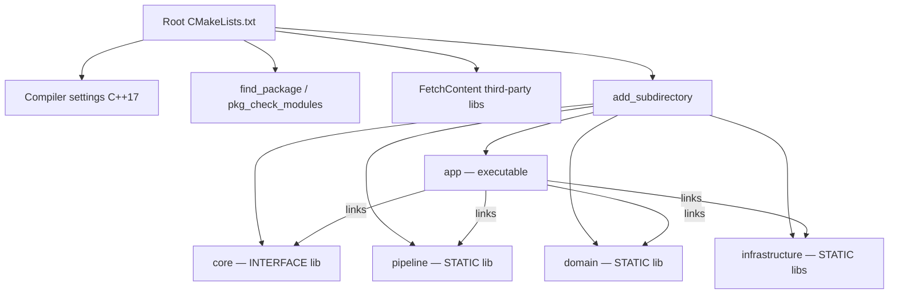
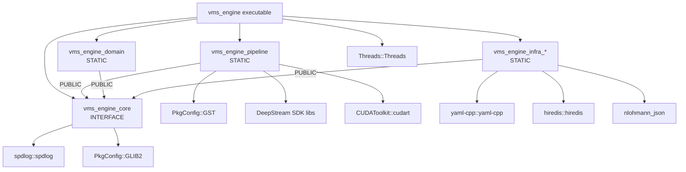

# VMS Engine — CMake Build System Reference

> **CMake 3.16+ · C++17 · Ninja or Make · NVIDIA DeepStream 8.0**
> Hướng dẫn chi tiết cấu trúc, cách sử dụng, và các pattern CMake trong dự án.

---

## Mục lục

1. [Tổng quan Build System](#1-tổng-quan-build-system)
2. [Cấu trúc CMakeLists Files](#2-cấu-trúc-cmakelists-files)
3. [Configure & Build Commands](#3-configure--build-commands)
4. [Build Types](#4-build-types)
5. [Dependencies Management](#5-dependencies-management)
6. [Target & Library System](#6-target--library-system)
7. [Include Directories](#7-include-directories)
8. [Compiler Flags & Warnings](#8-compiler-flags--warnings)
9. [Conditional Compilation](#9-conditional-compilation)
10. [Custom Targets](#10-custom-targets)
11. [Generator Expressions](#11-generator-expressions)
12. [FetchContent — Third-party Libraries](#12-fetchcontent--third-party-libraries)
13. [Output Directories & Post-Build](#13-output-directories--post-build)
14. [CMake Presets](#14-cmake-presets)
15. [Common Errors & Fix](#15-common-errors--fix)
16. [Anti-patterns to Avoid](#16-anti-patterns-to-avoid)
17. [Quick Reference Cheat Sheet](#17-quick-reference-cheat-sheet)

---

## 1. Tổng quan Build System

### Build Flow



### Nguyên tắc cốt lõi

| Nguyên tắc | Ý nghĩa |
|---|---|
| **Target-based** | Dùng `target_*` thay vì global `include_directories()` |
| **PUBLIC / PRIVATE / INTERFACE** | Kiểm soát propagation của includes và link libs |
| **Dependency-ordered subdirectories** | Thư viện phụ thuộc phải được `add_subdirectory()` trước |
| **Interface-first** | `core/` không phụ thuộc gì ngoài std + GStreamer forward-decl |

---

## 2. Cấu trúc CMakeLists Files

### Root `CMakeLists.txt` — Nhiệm vụ

```cmake
cmake_minimum_required(VERSION 3.16 FATAL_ERROR)
project(vms_engine VERSION 1.0.0 LANGUAGES CXX)

# 1. Compiler settings         ← C++17, warnings
# 2. Build type default         ← Debug nếu không chỉ định
# 3. Output directories         ← bin/, lib/
# 4. Project options            ← VMS_WITH_DEEPSTREAM, VMS_WITH_KAFKA...
# 5. find_package / pkg_check   ← System deps (GStreamer, CUDA)
# 6. FetchContent               ← Third-party (spdlog, yaml-cpp, hiredis)
# 7. DeepStream SDK discovery   ← find_library cho nvds_* libs
# 8. add_subdirectory(...)      ← core → pipeline → domain → infra → app
# 9. Custom targets             ← format, tidy (optional)
```

### Module Pattern

```cmake
# --- Source files ---
set(SOURCES
    src/my_class.cpp
    src/another_class.cpp
)

# --- Library target ---
add_library(vms_engine_core STATIC ${SOURCES})

# --- Include directories ---
target_include_directories(vms_engine_core
    PUBLIC  ${CMAKE_CURRENT_SOURCE_DIR}/include   # consumers cũng cần
    PRIVATE ${CMAKE_CURRENT_SOURCE_DIR}/src        # chỉ khi build lib này
)

# --- Link dependencies ---
target_link_libraries(vms_engine_core
    PUBLIC  spdlog::spdlog      # propagate đến consumer
    PRIVATE PkgConfig::GST      # chỉ cần khi build lib này
)

# --- C++ standard ---
target_compile_features(vms_engine_core PRIVATE cxx_std_17)
```

### Cấu trúc thư mục

```
vms-engine/
├── CMakeLists.txt              ← Root: global config, deps, add_subdirectory
├── app/CMakeLists.txt          ← add_executable(vms_engine main.cpp)
├── core/CMakeLists.txt         ← add_library(vms_engine_core INTERFACE)
├── pipeline/CMakeLists.txt     ← add_library(vms_engine_pipeline STATIC ...)
├── domain/CMakeLists.txt       ← add_library(vms_engine_domain STATIC ...)
└── infrastructure/
    ├── CMakeLists.txt          ← add_subdirectory cho từng sub-module
    ├── config_parser/CMakeLists.txt
    ├── messaging/CMakeLists.txt
    └── storage/CMakeLists.txt
```

---

## 3. Configure & Build Commands

### Commands cơ bản

```bash
# === Configure ===
cmake -S . -B build \
    -DCMAKE_BUILD_TYPE=Debug \
    -DCMAKE_EXPORT_COMPILE_COMMANDS=ON \
    -DDEEPSTREAM_DIR=/opt/nvidia/deepstream/deepstream \
    -G Ninja

# === Build ===
cmake --build build -- -j$(nproc)         # parallel build
cmake --build build --target vms_engine   # chỉ build executable
cmake --build build -- -j$(nproc) -v      # verbose output

# === Clean ===
cmake --build build --target clean        # xóa build artifacts
rm -rf build                              # clean hoàn toàn
```

### Useful CMake flags

| Flag | Mục đích |
|---|---|
| `-DCMAKE_BUILD_TYPE=Debug` | Debug symbols, no opt (`-g -O0`) |
| `-DCMAKE_BUILD_TYPE=Release` | Full opt (`-O3 -DNDEBUG`) |
| `-DCMAKE_BUILD_TYPE=RelWithDebInfo` | Optimized + debug symbols |
| `-G Ninja` | Ninja generator (~2x nhanh hơn Make) |
| `-DCMAKE_EXPORT_COMPILE_COMMANDS=ON` | Tạo `compile_commands.json` cho clangd |
| `-DCMAKE_VERBOSE_MAKEFILE=ON` | In full compile commands |
| `--fresh` | Force reconfigure (CMake 3.24+) |

---

## 4. Build Types

```cmake
# Đặt default nếu user không chỉ định
if(NOT CMAKE_BUILD_TYPE AND NOT CMAKE_CONFIGURATION_TYPES)
    set(CMAKE_BUILD_TYPE Debug CACHE STRING "Choose the type of build." FORCE)
    set_property(CACHE CMAKE_BUILD_TYPE PROPERTY STRINGS
        "Debug" "Release" "MinSizeRel" "RelWithDebInfo")
endif()
```

| Type | Flags (GCC/Clang) | Dùng khi |
|---|---|---|
| `Debug` | `-g -O0` | Development — GDB debugging |
| `Release` | `-O3 -DNDEBUG` | Production — tắt assert |
| `RelWithDebInfo` | `-O2 -g -DNDEBUG` | Profiling |
| `MinSizeRel` | `-Os -DNDEBUG` | Embedded / constrained env |

### Kiểm tra build type trong C++

```cpp
#ifndef NDEBUG
    LOG_D("Debug-only: frame_count={}", count);
#endif
```

---

## 5. Dependencies Management

### Dependency Graph



### 5.1 System deps — `find_package`

```cmake
find_package(Threads REQUIRED)          # → Threads::Threads
find_package(CUDAToolkit REQUIRED)      # → CUDAToolkit::cudart
```

### 5.2 System deps — `pkg_check_modules`

```cmake
find_package(PkgConfig REQUIRED)

pkg_check_modules(GST REQUIRED IMPORTED_TARGET
    gstreamer-1.0>=1.14
    gstreamer-base-1.0>=1.14
    gstreamer-video-1.0>=1.14
    gstreamer-app-1.0>=1.14
    gstreamer-rtsp-1.0>=1.14
)

pkg_check_modules(GLIB2 REQUIRED IMPORTED_TARGET
    glib-2.0>=2.56  gobject-2.0>=2.56  gio-2.0>=2.56
)

# Sử dụng: target_link_libraries(my_lib PRIVATE PkgConfig::GST)
```

### 5.3 Manual discovery — DeepStream SDK

```cmake
set(DEEPSTREAM_DIR "/opt/nvidia/deepstream/deepstream"
    CACHE PATH "Path to DeepStream installation")

if(NOT EXISTS "${DEEPSTREAM_DIR}/sources/includes/nvdsgstutils.h")
    message(FATAL_ERROR "DeepStream not found at: ${DEEPSTREAM_DIR}")
endif()

find_library(NVDS_META_LIB     nvds_meta      HINTS ${DEEPSTREAM_DIR}/lib REQUIRED)
find_library(NVDSGST_META_LIB  nvdsgst_meta   HINTS ${DEEPSTREAM_DIR}/lib REQUIRED)
find_library(NVDSGST_UTILS_LIB nvdsgstutils   HINTS ${DEEPSTREAM_DIR}/lib REQUIRED)
find_library(NVDS_OSD_LIB      nvosd          HINTS ${DEEPSTREAM_DIR}/lib REQUIRED)
find_library(NVBUFSURFACE_LIB  nvbufsurface   HINTS ${DEEPSTREAM_DIR}/lib REQUIRED)

set(DEEPSTREAM_LIBS
    ${NVDS_META_LIB} ${NVDSGST_META_LIB} ${NVDSGST_UTILS_LIB}
    ${NVDS_OSD_LIB} ${NVBUFSURFACE_LIB}
)
set(DEEPSTREAM_INCLUDE_DIRS "${DEEPSTREAM_DIR}/sources/includes")
```

### 5.4 FetchContent — Third-party

```cmake
include(FetchContent)

FetchContent_Declare(spdlog        GIT_REPOSITORY https://github.com/gabime/spdlog.git        GIT_TAG v1.14.1)
FetchContent_Declare(yaml-cpp      GIT_REPOSITORY https://github.com/jbeder/yaml-cpp.git      GIT_TAG 0.8.0)
FetchContent_Declare(hiredis       GIT_REPOSITORY https://github.com/redis/hiredis.git         GIT_TAG v1.3.0)
FetchContent_Declare(nlohmann_json GIT_REPOSITORY https://github.com/nlohmann/json.git         GIT_TAG v3.11.3)

# ⚠️ Set options TRƯỚC MakeAvailable
set(SPDLOG_BUILD_PIC ON CACHE BOOL "" FORCE)
set(BUILD_SHARED_LIBS OFF CACHE BOOL "" FORCE)

FetchContent_MakeAvailable(spdlog yaml-cpp hiredis nlohmann_json)
# Sources tại: build/_deps/<name>-src/
```

> ⚠️ **FetchContent cần internet** lần configure đầu tiên. Offline: dùng `FETCHCONTENT_SOURCE_DIR_<NAME>` để chỉ local path.

---

## 6. Target & Library System

### Loại targets

| Type | Output | Khi nào dùng |
|---|---|---|
| `STATIC` | `.a` (archive) | Linked at compile time — hầu hết modules |
| `SHARED` | `.so` | Linked at runtime — plugins |
| `INTERFACE` | Không có file | Header-only — `core/` |
| `OBJECT` | `.o` files | Share objects giữa nhiều targets |

### INTERFACE cho core/ (header-only)

```cmake
add_library(vms_engine_core INTERFACE)
target_include_directories(vms_engine_core INTERFACE
    ${CMAKE_CURRENT_SOURCE_DIR}/include
)
target_link_libraries(vms_engine_core INTERFACE
    spdlog::spdlog  PkgConfig::GLIB2
)
```

### Visibility — PUBLIC / PRIVATE / INTERFACE

| Keyword | Khi build chính lib | Khi consumer link vào |
|---|---|---|
| `PUBLIC` | ✅ Cần | ✅ Cần |
| `PRIVATE` | ✅ Cần | ❌ Không cần |
| `INTERFACE` | ❌ Không cần | ✅ Cần |

> 📋 **Rule of thumb**: `PUBLIC` cho dependencies xuất hiện trong public headers. `PRIVATE` cho implementation-only.

---

## 7. Include Directories

```cmake
# ❌ KHÔNG dùng global — ảnh hưởng tất cả targets
include_directories(${DEEPSTREAM_INCLUDE_DIRS})

# ✅ Scoped per target
target_include_directories(vms_engine_pipeline PRIVATE ${DEEPSTREAM_INCLUDE_DIRS})
```

### Module include pattern

```
pipeline/
├── include/engine/pipeline/builders/infer_builder.hpp
└── src/builders/infer_builder.cpp
```

```cmake
target_include_directories(vms_engine_pipeline
    PUBLIC  ${CMAKE_CURRENT_SOURCE_DIR}/include    # expose engine/pipeline/* headers
    PRIVATE ${CMAKE_CURRENT_SOURCE_DIR}/src         # internal headers
    PRIVATE ${DEEPSTREAM_INCLUDE_DIRS}              # SDK headers
)
```

```cpp
// Consumer include:
#include "engine/pipeline/builders/infer_builder.hpp"  // clean path
```

---

## 8. Compiler Flags & Warnings

```cmake
if(CMAKE_CXX_COMPILER_ID MATCHES "GNU|Clang")
    target_compile_options(vms_engine_pipeline PRIVATE
        -Wall -Wextra -Wpedantic
        -Wshadow -Wformat=2 -Wunused
        # Strict mode (optional):
        # -Werror -Wconversion -Wnon-virtual-dtor -Wold-style-cast
    )
endif()
```

### Optional: LTO (Release only)

```cmake
include(CheckIPOSupported)
check_ipo_supported(RESULT ipo_supported)
if(ipo_supported AND CMAKE_BUILD_TYPE STREQUAL "Release")
    set_property(TARGET vms_engine_pipeline PROPERTY INTERPROCEDURAL_OPTIMIZATION TRUE)
endif()
```

### PIC (cho .so hoặc static libs linked into .so)

```cmake
set(CMAKE_POSITION_INDEPENDENT_CODE ON)
```

---

## 9. Conditional Compilation

### CMake options

```cmake
option(VMS_WITH_DEEPSTREAM   "Enable NVIDIA DeepStream support" ON)
option(VMS_WITH_KAFKA        "Enable Kafka messaging support"   OFF)
option(VMS_WITH_S3           "Enable AWS S3 storage support"    OFF)
option(VMS_ENABLE_TESTS      "Build unit and integration tests" OFF)

if(VMS_WITH_DEEPSTREAM)
    target_compile_definitions(vms_engine_pipeline PRIVATE VMS_WITH_DEEPSTREAM)
endif()
```

### Dùng trong C++

```cpp
#ifdef VMS_WITH_DEEPSTREAM
    pipeline_ = std::make_unique<PipelineManager>(config);
#else
    #error "VMS Engine requires DeepStream."
#endif

#ifdef VMS_WITH_KAFKA
    producer_ = std::make_unique<KafkaProducer>(config);
#else
    producer_ = std::make_unique<RedisProducer>(config);
#endif
```

### Conditional subdirectory

```cmake
add_subdirectory(config_parser)   # luôn build
add_subdirectory(messaging)       # luôn build

if(VMS_WITH_S3)
    add_subdirectory(storage_s3)
else()
    add_subdirectory(storage_local)
endif()
```

---

## 10. Custom Targets

### Format — `clang-format`

```cmake
find_program(CLANG_FORMAT_EXE clang-format)
if(CLANG_FORMAT_EXE)
    file(GLOB_RECURSE ALL_SOURCE_FILES
        "${CMAKE_SOURCE_DIR}/app/*.cpp"
        "${CMAKE_SOURCE_DIR}/core/include/**/*.hpp"
        "${CMAKE_SOURCE_DIR}/pipeline/include/**/*.hpp"
        "${CMAKE_SOURCE_DIR}/pipeline/src/**/*.cpp"
        "${CMAKE_SOURCE_DIR}/domain/**/*.hpp"
        "${CMAKE_SOURCE_DIR}/domain/**/*.cpp"
        "${CMAKE_SOURCE_DIR}/infrastructure/**/*.hpp"
        "${CMAKE_SOURCE_DIR}/infrastructure/**/*.cpp"
    )

    add_custom_target(format
        COMMAND ${CLANG_FORMAT_EXE} -i --style=file ${ALL_SOURCE_FILES}
        COMMENT "Running clang-format..."
        VERBATIM
    )
endif()
```

### Tidy — `clang-tidy`

```cmake
find_program(CLANG_TIDY_EXE clang-tidy)
if(CLANG_TIDY_EXE AND CMAKE_EXPORT_COMPILE_COMMANDS)
    add_custom_target(tidy
        COMMAND ${CLANG_TIDY_EXE}
            -p ${CMAKE_BINARY_DIR}
            --header-filter=.*/engine/.*
            --fix
            ${ALL_SOURCE_FILES}
        COMMENT "Running clang-tidy..."
        VERBATIM
    )
endif()
```

### Chạy custom targets

```bash
cmake --build build --target format         # format code
cmake --build build --target tidy           # static analysis
```

---

## 11. Generator Expressions

Generator expressions được evaluate **lúc generate** (sau configure), không phải lúc configure.

### Syntax

| Expression | Ý nghĩa |
|---|---|
| `$<CONDITION:value>` | Nếu true → value, ngược lại → "" |
| `$<IF:cond,true,false>` | If-else |
| `$<$<CONFIG:Debug>:value>` | Value chỉ trong Debug build |
| `$<TARGET_FILE:t>` | Full path đến output file |
| `$<TARGET_FILE_DIR:t>` | Directory chứa output file |

### Ví dụ thực tế

```cmake
# Link khác nhau theo build type
target_link_libraries(vms_engine PRIVATE
    $<$<CONFIG:Debug>:asan_lib>
    $<$<CONFIG:Release>:tcmalloc>
)

# Compiler-specific flags
target_compile_options(vms_engine_pipeline PRIVATE
    $<$<CXX_COMPILER_ID:GNU>:-Wno-missing-field-initializers>
    $<$<CXX_COMPILER_ID:Clang>:-Wno-unknown-warning-option>
)

# Post-build copy
add_custom_command(TARGET vms_engine POST_BUILD
    COMMAND ${CMAKE_COMMAND} -E copy_directory
        ${CMAKE_SOURCE_DIR}/configs
        $<TARGET_FILE_DIR:vms_engine>/config
    COMMENT "Copying configs to build output"
)
```

---

## 12. FetchContent — Third-party Libraries

### Pattern đầy đủ

```cmake
include(FetchContent)

# Bước 1: Declare (metadata + pin version)
FetchContent_Declare(
    <name>
    GIT_REPOSITORY <url>
    GIT_TAG        <tag/commit>     # ← BẮT BUỘC pin để reproducible
)

# Bước 2: MakeAvailable (download + configure + tạo targets)
FetchContent_MakeAvailable(<name>)
```

> ⚠️ **Set options TRƯỚC `MakeAvailable`** — set sau sẽ bị ignored:
>
> ```cmake
> # ✅ Đúng
> set(SPDLOG_BUILD_PIC ON CACHE BOOL "" FORCE)
> FetchContent_MakeAvailable(spdlog)
>
> # ❌ Sai — quá muộn
> FetchContent_MakeAvailable(spdlog)
> set(SPDLOG_BUILD_PIC ON CACHE BOOL "" FORCE)  # ignored!
> ```

### Override với local source (dev mode)

```cmake
set(FETCHCONTENT_SOURCE_DIR_SPDLOG /path/to/local/spdlog CACHE PATH "")
FetchContent_MakeAvailable(spdlog)  # dùng local thay vì download
```

---

## 13. Output Directories & Post-Build

### Output directories

```cmake
set(CMAKE_ARCHIVE_OUTPUT_DIRECTORY ${CMAKE_BINARY_DIR}/lib)  # .a files
set(CMAKE_LIBRARY_OUTPUT_DIRECTORY ${CMAKE_BINARY_DIR}/lib)  # .so files
set(CMAKE_RUNTIME_OUTPUT_DIRECTORY ${CMAKE_BINARY_DIR}/bin)  # executable
```

Sau khi build:

```
build/
├── bin/vms_engine                 ← executable
├── lib/
│   ├── libvms_engine_pipeline.a
│   └── libvms_engine_domain.a
└── _deps/                         ← FetchContent sources
    ├── spdlog-src/
    └── yaml-cpp-src/
```

### Post-build copy configs

```cmake
add_custom_command(TARGET vms_engine POST_BUILD
    COMMAND ${CMAKE_COMMAND} -E copy_directory
        ${CMAKE_SOURCE_DIR}/configs
        $<TARGET_FILE_DIR:vms_engine>/config
    COMMENT "Copying configs to output directory"
    VERBATIM
)
```

### Symlink `compile_commands.json` cho clangd

```cmake
add_custom_target(compile_commands_symlink ALL
    COMMAND ${CMAKE_COMMAND} -E create_symlink
        ${CMAKE_BINARY_DIR}/compile_commands.json
        ${CMAKE_SOURCE_DIR}/compile_commands.json
    DEPENDS ${CMAKE_BINARY_DIR}/compile_commands.json
)
```

---

## 14. CMake Presets

CMake Presets (`CMakePresets.json`) cho phép define cấu hình build được version-controlled. Yêu cầu CMake 3.19+.

### Ví dụ `CMakePresets.json`

```json
{
  "version": 6,
  "configurePresets": [
    {
      "name": "debug",
      "description": "Debug build with compile commands",
      "binaryDir": "${sourceDir}/build/debug",
      "generator": "Ninja",
      "cacheVariables": {
        "CMAKE_BUILD_TYPE": "Debug",
        "CMAKE_EXPORT_COMPILE_COMMANDS": "ON",
        "DEEPSTREAM_DIR": "/opt/nvidia/deepstream/deepstream"
      }
    },
    {
      "name": "release",
      "description": "Optimized release build",
      "binaryDir": "${sourceDir}/build/release",
      "generator": "Ninja",
      "cacheVariables": {
        "CMAKE_BUILD_TYPE": "Release",
        "DEEPSTREAM_DIR": "/opt/nvidia/deepstream/deepstream"
      }
    }
  ],
  "buildPresets": [
    { "name": "debug",   "configurePreset": "debug",   "jobs": 0 },
    { "name": "release", "configurePreset": "release", "jobs": 0 }
  ]
}
```

### Sử dụng

```bash
cmake --list-presets                    # liệt kê presets
cmake --preset debug                   # configure
cmake --build --preset debug           # build
```

---

## 15. Common Errors & Fix

### `Could not find module FindXxx.cmake`

```
CMake Error: By not providing "FindDeepStream.cmake" in CMAKE_MODULE_PATH
```

> ✅ **Fix**: Dùng `find_library` + `find_path` thủ công thay vì `find_package`:
>
> ```cmake
> find_library(NVDS_META_LIB nvds_meta HINTS ${DEEPSTREAM_DIR}/lib REQUIRED)
> ```

### `undefined reference to symbol`

```
undefined reference to `gst_element_factory_make'
```

> ✅ **Fix**: Thiếu link dependency hoặc sai thứ tự (linker reads left-to-right):
>
> ```cmake
> target_link_libraries(my_target PRIVATE PkgConfig::GST)
> ```

### `FetchContent failed (network unavailable)`

> ✅ **Fix**: Pre-clone và dùng local source:
>
> ```cmake
> set(FETCHCONTENT_SOURCE_DIR_SPDLOG /opt/deps/spdlog CACHE PATH "")
> ```

### Include paths không được tìm thấy

```
fatal error: engine/pipeline/builders/infer_builder.hpp: No such file
```

> ✅ **Fix**: Đổi visibility từ `PRIVATE` sang `PUBLIC`:
>
> ```cmake
> target_include_directories(vms_engine_pipeline
>     PUBLIC ${CMAKE_CURRENT_SOURCE_DIR}/include   # ← PUBLIC, không phải PRIVATE
> )
> ```

### `CUDA not found` trong container

> ✅ **Fix**:
>
> ```bash
> export PATH=/usr/local/cuda/bin:$PATH
> export LD_LIBRARY_PATH=/usr/local/cuda/lib64:$LD_LIBRARY_PATH
> ```

---

## 16. Anti-patterns to Avoid

| ❌ Anti-pattern | ✅ Đúng cách |
|---|---|
| `include_directories(path)` — global | `target_include_directories(t PRIVATE path)` |
| `link_libraries(lib)` — global | `target_link_libraries(t PRIVATE lib)` |
| `add_compile_options(-Wall)` — ảnh hưởng FetchContent | `target_compile_options(t PRIVATE -Wall)` |
| Hardcode paths: `/home/user/include` | `${CMAKE_CURRENT_SOURCE_DIR}/include` |
| FetchContent không pin: `GIT_TAG main` | `GIT_TAG v1.14.1` — reproducible |
| Sai thứ tự `add_subdirectory`: app trước core | Dependency order: core → pipeline → app |
| `CMAKE_SOURCE_DIR` cho subdirectory files | `CMAKE_CURRENT_SOURCE_DIR` |

> 🔒 **Rule**: Mọi `include_directories`, `link_libraries`, `add_compile_options` đều phải scoped bằng `target_*`.

---

## 17. Quick Reference Cheat Sheet

```bash
# === Configure ===
cmake -S . -B build -DCMAKE_BUILD_TYPE=Debug -G Ninja
cmake -S . -B build -DCMAKE_BUILD_TYPE=Release -G Ninja
cmake --preset debug                                        # với CMakePresets.json

# === Build ===
cmake --build build -- -j$(nproc)                          # build all
cmake --build build --target vms_engine -- -j$(nproc)      # build exe only
cmake --build build -- -j$(nproc) -v                        # verbose

# === Custom targets ===
cmake --build build --target format                        # clang-format
cmake --build build --target tidy                          # clang-tidy

# === Info ===
cmake --build build --target help                          # list targets
cmake -L build                                             # list cache variables
cmake -LH build                                            # list với descriptions

# === Clean ===
cmake --build build --target clean
rm -rf build && cmake -S . -B build ...                    # full clean rebuild
```

---

## Tài liệu liên quan

| Document | Nội dung |
|---|---|
| [RAII.md](RAII.md) | C++ resource management patterns |
| [ARCHITECTURE_BLUEPRINT.md](ARCHITECTURE_BLUEPRINT.md) | Tổng quan kiến trúc hệ thống |
| [AGENTS.md](../../AGENTS.md) | Build commands quick reference |
| [deepstream/README.md](deepstream/README.md) | Index tài liệu DeepStream |
