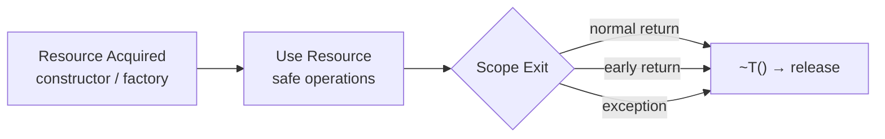
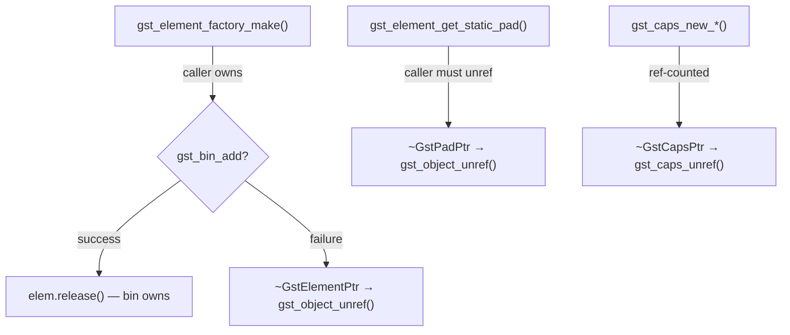
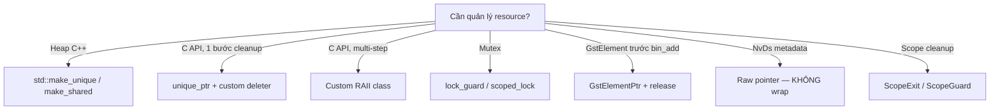

# VMS Engine — RAII Reference Guide

> **RAII = Resource Acquisition Is Initialization**
> Bind resource lifetime to a C++ stack object. `~T()` runs unconditionally on scope exit — normal return, early return, or exception unwind. Cleanup is deterministic. C++ has **no garbage collector** — RAII is the primary safety mechanism.
>
> 📖 **Liên quan**: [ARCHITECTURE_BLUEPRINT.md](ARCHITECTURE_BLUEPRINT.md) · [CMAKE.md](CMAKE.md) · [`gst_utils.hpp`](../../core/include/engine/core/utils/gst_utils.hpp)

---

## Mục Lục

- [1. Why RAII?](#1-why-raii)
- [2. Smart Pointers — Memory (Heap)](#2-smart-pointers--memory-heap)
- [3. File Handles / Sockets](#3-file-handles--sockets)
- [4. Mutex / Locks (Multi-threading)](#4-mutex--locks-multi-threading)
- [5. Timers / Profiling Scopes](#5-timers--profiling-scopes)
- [6. Scope Guard / Scope Exit](#6-scope-guard--scope-exit)
- [7. GStreamer & GLib Resources](#7-gstreamer--glib-resources)
- [8. NvDs Metadata — DO NOT WRAP](#8-nvds-metadata--do-not-wrap)
- [9. Custom RAII Class with Destructor](#9-custom-raii-class-with-destructor)
- [10. Choosing the Right RAII Tool](#10-choosing-the-right-raii-tool)
- [11. Anti-patterns](#11-anti-patterns)
- [12. Rule of Five — Move Semantics](#12-rule-of-five--move-semantics)
- [13. GPU / CUDA Resources](#13-gpu--cuda-resources)
- [14. RAII in Containers](#14-raii-in-containers)
- [15. `[[nodiscard]]` — Enforce RAII Usage](#15-nodiscard--enforce-raii-usage)
- [16. Exception Safety Guarantees](#16-exception-safety-guarantees)

---

## 1. Why RAII?



| Guarantee        | Description                                              |
| ---------------- | -------------------------------------------------------- |
| **Auto-release** | `~T()` runs on scope exit — no manual unref/free/close   |
| **Exception-safe**| Stack unwinding calls all destructors                    |
| **No leak**      | Lifecycle encoded once in `~T()`, not scattered per branch|

**Side-by-side comparison**:

```cpp
// ❌ WITHOUT RAII: caps leaks when exception propagates
void bad() {
    GstCaps* caps = gst_caps_new_simple("video/x-raw", nullptr);
    some_op_that_may_throw();   // exception → next line skipped → LEAK
    gst_caps_unref(caps);
}

// ✅ WITH RAII: destructor guaranteed regardless of scope exit path
void good() {
    GstCapsPtr caps(gst_caps_new_simple("video/x-raw", nullptr), gst_caps_unref);
    some_op_that_may_throw();   // exception → ~GstCapsPtr → gst_caps_unref ✅
}
```

---

## 2. Smart Pointers — Memory (Heap)

| Pointer                 | Ownership           | Copy | Move | Use When                              |
| ----------------------- | ------------------- | ---- | ---- | ------------------------------------- |
| `unique_ptr`            | Sole, exclusive     | ❌   | ✅   | One owner; default choice             |
| `shared_ptr`            | Shared, ref-counted | ✅   | ✅   | Multiple owners; longer lifetimes     |
| `weak_ptr`              | Non-owning observer | ✅   | ✅   | Cache, back-pointer, break cycles     |
| `unique_ptr` + deleter  | Custom release      | ❌   | ✅   | C API handles (GstCaps, FILE, fd...)  |

### `std::unique_ptr` — sole ownership

```cpp
auto config = std::make_unique<PipelineConfig>();
config->version = "2.0";

// Custom deleter for C API
std::unique_ptr<FILE, decltype(&fclose)> file(
    fopen("pipeline.log", "w"), &fclose);
fprintf(file.get(), "Pipeline started\n");
// fclose() auto-called
```

### `std::shared_ptr` — shared ownership

```cpp
auto factory = std::make_shared<BuilderFactory>();
SourceBuilder     src_builder(pipeline_, factory, &config, link_mgr_);
ProcessingBuilder proc_builder(pipeline_, factory, &config, link_mgr_, ...);
// Resource deleted when last shared_ptr dies
```

### `std::weak_ptr` — non-owning observer

```cpp
std::weak_ptr<HandlerManager> manager_ref_;
void use() {
    if (auto mgr = manager_ref_.lock()) {  // returns shared_ptr or nullptr
        mgr->shutdown_all();
    }
}
```

---

## 3. File Handles / Sockets

### File handle via `unique_ptr`

```cpp
std::unique_ptr<FILE, decltype(&fclose)> fp(
    fopen("/opt/engine/data/rec/metadata.json", "w"), &fclose);
if (!fp) { LOG_E("Failed to open file"); return false; }
std::fputs(R"({"event":"start"})", fp.get());
// fclose auto-called
```

### Custom RAII — POSIX file descriptor

```cpp
class FileDescriptorGuard {
public:
    explicit FileDescriptorGuard(int fd) noexcept : fd_(fd) {}
    ~FileDescriptorGuard() { if (fd_ >= 0) ::close(fd_); }

    FileDescriptorGuard(const FileDescriptorGuard&)            = delete;
    FileDescriptorGuard& operator=(const FileDescriptorGuard&) = delete;
    FileDescriptorGuard(FileDescriptorGuard&& o) noexcept : fd_(o.fd_) { o.fd_ = -1; }

    int get() const noexcept { return fd_; }
    bool valid() const noexcept { return fd_ >= 0; }
private:
    int fd_ = -1;
};
```

### Custom RAII — TCP socket

```cpp
class SocketGuard {
public:
    explicit SocketGuard(int domain, int type, int protocol)
        : sock_(::socket(domain, type, protocol)) {}
    ~SocketGuard() { if (sock_ >= 0) ::close(sock_); }

    SocketGuard(const SocketGuard&)            = delete;
    SocketGuard& operator=(const SocketGuard&) = delete;
    SocketGuard(SocketGuard&& o) noexcept : sock_(o.sock_) { o.sock_ = -1; }

    int get() const noexcept { return sock_; }
    bool valid() const noexcept { return sock_ >= 0; }
private:
    int sock_ = -1;
};
```

---

## 4. Mutex / Locks (Multi-threading)

> 📋 GStreamer runs pad probes and signal handlers on **different threads**. Always protect shared state with RAII locks.

| Type           | Condition Wait | Manual Unlock | Use When                          |
| -------------- | -------------- | ------------- | --------------------------------- |
| `lock_guard`   | ❌             | ❌            | Simple scope protection           |
| `unique_lock`  | ✅             | ✅            | `condition_variable`, deferred    |
| `scoped_lock`  | ❌             | ❌            | Multiple mutexes, deadlock-safe   |
| `shared_lock`  | ❌             | ✅            | Read-many / write-one             |

### `std::lock_guard` — simple scoped lock

```cpp
void register_element(const std::string& id, GstElement* element) {
    std::lock_guard<std::mutex> lock(registry_mutex_);
    element_registry_[id] = element;
}  // ~lock_guard → unlock — even if exception thrown
```

### `std::unique_lock` — conditional wait

```cpp
std::string pop() {
    std::unique_lock<std::mutex> lock(mtx_);
    cv_.wait(lock, [this]{ return !events_.empty(); });
    std::string e = std::move(events_.front());
    events_.erase(events_.begin());
    return e;  // unlock on return
}
```

### `std::scoped_lock` — multiple mutexes (C++17)

```cpp
void safe_transfer() {
    std::scoped_lock lock(mtx_a, mtx_b);  // acquires both atomically
    // ...
}  // unlocks both
```

---

## 5. Timers / Profiling Scopes

### ScopedTimer — log duration on scope exit

```cpp
class ScopedTimer {
public:
    explicit ScopedTimer(const char* label)
        : label_(label), start_(std::chrono::steady_clock::now()) {}
    ~ScopedTimer() {
        auto us = std::chrono::duration_cast<std::chrono::microseconds>(
            std::chrono::steady_clock::now() - start_).count();
        LOG_D("[PERF] {}: {} µs", label_, us);
    }
    ScopedTimer(const ScopedTimer&) = delete;
    ScopedTimer& operator=(const ScopedTimer&) = delete;
private:
    const char* label_;
    std::chrono::steady_clock::time_point start_;
};

// Usage in pad probe
GstPadProbeReturn my_probe(GstPad*, GstPadProbeInfo*, void*) {
    ScopedTimer t("inference_probe");
    // ... process NvDsBatchMeta ...
    return GST_PAD_PROBE_OK;
}  // ~ScopedTimer prints duration
```

### ScopedCounter — track in-flight operations

```cpp
class ScopedCounter {
public:
    explicit ScopedCounter(std::atomic<int>& c) : c_(c) { ++c_; }
    ~ScopedCounter() { --c_; }
    ScopedCounter(const ScopedCounter&) = delete;
    ScopedCounter& operator=(const ScopedCounter&) = delete;
private:
    std::atomic<int>& c_;
};
```

---

## 6. Scope Guard / Scope Exit

Run arbitrary cleanup code at scope exit without a dedicated RAII class.

### ScopeExit — always runs

```cpp
template<typename F>
class ScopeExit {
public:
    explicit ScopeExit(F f) : f_(std::move(f)) {}
    ~ScopeExit() { f_(); }
    ScopeExit(const ScopeExit&) = delete;
    ScopeExit& operator=(const ScopeExit&) = delete;
private:
    F f_;
};
template<typename F> ScopeExit(F) -> ScopeExit<F>;

#define SCOPE_EXIT(code) auto _scope_exit_##__LINE__ = ScopeExit([&](){ code; })

// Usage
void init() {
    gst_init(nullptr, nullptr);
    SCOPE_EXIT(gst_deinit());  // always called, even on early return
    auto pipeline = gst_pipeline_new("test");
    if (!pipeline) return;     // gst_deinit() still runs
}
```

### ScopeGuard — dismiss on success

```cpp
template<typename F>
class ScopeGuard {
public:
    explicit ScopeGuard(F f) : f_(std::move(f)), active_(true) {}
    ~ScopeGuard() { if (active_) f_(); }
    void dismiss() noexcept { active_ = false; }
    ScopeGuard(const ScopeGuard&) = delete;
    ScopeGuard& operator=(const ScopeGuard&) = delete;
private:
    F f_; bool active_;
};
template<typename F> ScopeGuard(F) -> ScopeGuard<F>;

// Usage — rollback on failure
bool configure() {
    gst_init(nullptr, nullptr);
    ScopeGuard rollback([](){ gst_deinit(); });
    if (!configure_elements(pipeline)) return false;  // gst_deinit runs
    rollback.dismiss();  // success — don't run cleanup
    return true;
}
```

---

## 7. GStreamer & GLib Resources

### Ownership Rules



| Object                   | Obtained Via                     | Release Via                                  | Notes                        |
| ------------------------ | -------------------------------- | -------------------------------------------- | ---------------------------- |
| `GstElement*` (not in bin)| `gst_element_factory_make()`    | `gst_object_unref()`                        | Caller owns until `bin_add`  |
| `GstElement*` in bin     | `gst_bin_add(bin, elem)`         | *(bin owns)*                                 | **Do NOT unref after add**   |
| `GstPad*` (static)       | `gst_element_get_static_pad()`  | `gst_object_unref()`                        | Must unref even read-only    |
| `GstPad*` (request)      | `gst_element_get_request_pad()` | `release_request_pad()` + `gst_object_unref()` | Release THEN unref       |
| `GstCaps*`               | `gst_caps_new_*()`              | `gst_caps_unref()`                           | Ref-counted                  |
| `GstBus*`                | `gst_pipeline_get_bus()`        | `gst_object_unref()`                         |                              |
| `GMainLoop*`             | `g_main_loop_new()`             | `g_main_loop_unref()`                        |                              |
| `GError*`                | GStreamer out param              | `g_error_free()`                              | Check non-null before free   |
| `gchar*`                 | `g_object_get()`, `g_strdup()`  | `g_free()`                                   | GLib heap allocation         |

### `gst_utils.hpp` — RAII Type Aliases

```cpp
// core/include/engine/core/utils/gst_utils.hpp
namespace engine::core::utils {
    using GstElementPtr = std::unique_ptr<GstElement, decltype(&gst_object_unref)>;
    [[nodiscard]] inline GstElementPtr make_gst_element(const char* factory, const char* name) {
        return GstElementPtr(gst_element_factory_make(factory, name), gst_object_unref);
    }
    using GstCapsPtr   = std::unique_ptr<GstCaps,   decltype(&gst_caps_unref)>;
    using GstPadPtr    = std::unique_ptr<GstPad,    decltype(&gst_object_unref)>;
    using GstBusPtr    = std::unique_ptr<GstBus,    decltype(&gst_object_unref)>;
    using GMainLoopPtr = std::unique_ptr<GMainLoop, decltype(&g_main_loop_unref)>;
    using GErrorPtr    = std::unique_ptr<GError,    decltype(&g_error_free)>;
    using GCharPtr     = std::unique_ptr<gchar,     decltype(&g_free)>;
}
```

### Builder Error-Path Pattern

```cpp
GstElement* InferBuilder::build(const PipelineConfig& config, int index) {
    const auto& elem = config.processing.elements[index];
    auto infer = make_gst_element("nvinfer", elem.id.c_str());
    if (!infer) { LOG_E("Failed to create '{}'", elem.id); return nullptr; }  // auto-unref

    g_object_set(G_OBJECT(infer.get()),
        "config-file-path", elem.config_file->c_str(), nullptr);

    if (!gst_bin_add(GST_BIN(bin_), infer.get())) return nullptr;  // auto-unref
    return infer.release();  // bin owns — disarm guard
}
```

### Common Usages

```cpp
// Pad probe
GstPadPtr pad(gst_element_get_static_pad(element, "src"), gst_object_unref);
gst_pad_add_probe(pad.get(), GST_PAD_PROBE_TYPE_BUFFER, callback, nullptr, nullptr);

// String from g_object_get
gchar* raw = nullptr;
g_object_get(G_OBJECT(src), "uri", &raw, nullptr);
GCharPtr uri(raw, g_free);
LOG_I("URI: {}", uri.get());

// GMainLoop
GMainLoopPtr loop(g_main_loop_new(nullptr, FALSE), g_main_loop_unref);
g_main_loop_run(loop.get());
```

---

## 8. NvDs Metadata — KHÔNG BAO GIỜ Wrap

> ❌ **Quy tắc tuyệt đối**: NvDsBatchMeta, NvDsFrameMeta, NvDsObjectMeta do **pipeline sở hữu**. KHÔNG dùng `unique_ptr`, `shared_ptr`, hoặc bất kỳ RAII wrapper nào.

```cpp
// ❌ SAI — unique_ptr sẽ gọi delete khi scope kết thúc → CRASH
auto* batch = gst_buffer_get_nvds_batch_meta(buffer);
auto guard = std::unique_ptr<NvDsBatchMeta>(batch);  // 💥 double-free

// ✅ ĐÚNG — raw pointer, chỉ đọc/ghi metadata, KHÔNG giải phóng
NvDsBatchMeta* batch = gst_buffer_get_nvds_batch_meta(buffer);
for (NvDsMetaList* l = batch->frame_meta_list; l; l = l->next) {
    auto* frame = (NvDsFrameMeta*)(l->data);
    for (NvDsMetaList* lo = frame->obj_meta_list; lo; lo = lo->next) {
        auto* obj = (NvDsObjectMeta*)(lo->data);
        // Đọc: obj->class_id, obj->confidence, obj->rect_params
        // KHÔNG gọi free/delete/unref trên bất kỳ con trỏ nào
    }
}
```

| NvDs Resource | Allocation | Release | RAII? |
|---|---|---|---|
| `NvDsBatchMeta*` | `gst_buffer_get_nvds_batch_meta()` | Pipeline tự quản lý | ❌ Raw pointer |
| `NvDsFrameMeta*` | Iterate từ `batch_meta` | Pipeline tự quản lý | ❌ Raw pointer |
| `NvDsObjectMeta*` | Iterate từ `frame_meta` | Pipeline tự quản lý | ❌ Raw pointer |
| `NvDsEventMsgMeta*` | Attached bởi event handler | Freed bởi framework | ❌ Raw pointer |

---

## 9. Custom RAII Class — Multi-step Cleanup

Dùng **class riêng** (không phải `unique_ptr` alias) khi cleanup cần **nhiều bước có thứ tự**.

### Khi nào cần viết class

| Tình huống | `unique_ptr` alias đủ? | Giải pháp |
|---|---|---|
| Giải phóng 1 lần (`gst_object_unref`) | ✅ Đủ | Type alias |
| 2 bước có thứ tự (remove_watch → unref) | ❌ | Custom class |
| Cleanup phức tạp (set_state(NULL) → unref) | ❌ | Custom class |
| Cần track thêm state khi teardown | ❌ | Custom class |

### GstBusGuard — Two-step Cleanup

```cpp
class GstBusGuard {
public:
    explicit GstBusGuard(GstElement* pipeline)
        : bus_(gst_pipeline_get_bus(GST_PIPELINE(pipeline))) {}

    ~GstBusGuard() {
        if (bus_) {
            gst_bus_remove_watch(bus_);  // bước 1: detach message watch
            gst_object_unref(bus_);      // bước 2: release ref
        }
    }

    GstBusGuard(const GstBusGuard&)            = delete;
    GstBusGuard& operator=(const GstBusGuard&) = delete;
    GstBusGuard(GstBusGuard&& o) noexcept : bus_(o.bus_) { o.bus_ = nullptr; }
    GstBusGuard& operator=(GstBusGuard&& o) noexcept {
        if (this != &o) { this->~GstBusGuard(); bus_ = o.bus_; o.bus_ = nullptr; }
        return *this;
    }

    GstBus* get() const noexcept { return bus_; }

private:
    GstBus* bus_ = nullptr;
};
```

### GstPipelineOwner — Drain then Unref

```cpp
class GstPipelineOwner {
public:
    explicit GstPipelineOwner(const std::string& name)
        : pipeline_(gst_pipeline_new(name.c_str())) {}

    ~GstPipelineOwner() {
        if (pipeline_) {
            gst_element_set_state(pipeline_, GST_STATE_NULL);  // bước 1: drain
            gst_object_unref(pipeline_);                        // bước 2: release
        }
    }

    GstPipelineOwner(const GstPipelineOwner&)            = delete;
    GstPipelineOwner& operator=(const GstPipelineOwner&) = delete;
    GstPipelineOwner(GstPipelineOwner&& o) noexcept
        : pipeline_(o.pipeline_) { o.pipeline_ = nullptr; }

    GstElement* get() const noexcept { return pipeline_; }

private:
    GstElement* pipeline_ = nullptr;
};
```

### ✅ Custom RAII Class Checklist

- [ ] `= delete` copy constructor + copy assignment (unique ownership)
- [ ] Move constructor + move assignment nếu cần lưu trong container
- [ ] Move constructor: `other.resource_ = nullptr` để tránh double-free
- [ ] Destructor: kiểm tra valid state trước khi release (`if (resource_)`)
- [ ] Destructor luôn `noexcept`
- [ ] Cung cấp `get()` accessor (trả raw pointer/handle)

---

## 10. Chọn RAII Tool Phù hợp



| Tình huống | Tool | Ví dụ |
|---|---|---|
| Heap allocation (unique) | `std::make_unique<T>()` | `auto cfg = std::make_unique<Config>()` |
| Heap allocation (shared) | `std::make_shared<T>()` | Observer pattern |
| C API single-step cleanup | `unique_ptr` + custom deleter | `GstPadPtr`, `GstCapsPtr` |
| C API multi-step cleanup | Custom class | `GstBusGuard`, `GstPipelineOwner` |
| File handle (POSIX) | `FileDescriptorGuard` | Section 3 |
| TCP socket | `SocketGuard` | Section 3 |
| Mutex protection | `std::lock_guard` / `std::scoped_lock` | Section 4 |
| Conditional wait | `std::unique_lock` + `condition_variable` | Producer-consumer |
| Profiling scope | `ScopedTimer` | Section 5 |
| Arbitrary scope cleanup | `ScopeExit` / `ScopeGuard` | Section 6 |
| GstElement (trước bin_add) | `GstElementPtr` + `make_gst_element()` | Builder pattern |
| GstPad, GstCaps, GstBus, GMainLoop | Type alias | `gst_utils.hpp` |
| GstBus (có watch) | `GstBusGuard` | Section 9 |
| Top-level GstPipeline | `GstPipelineOwner` | Section 9 |
| NvDs metadata | **Raw pointer — KHÔNG wrap** | Section 8 |
| CUDA device memory | `CudaDeviceBuffer` | Section 13 |
| CUDA stream | `CudaStreamGuard` | Section 13 |

---

## 11. Anti-patterns — Những Lỗi Cần Tránh

### ❌ Manual cleanup branches (C-style)

```cpp
// ❌ Dễ quên unref khi thêm exit path mới
GstElement* elem = gst_element_factory_make("nvinfer", "pgie");
if (!elem)            { return nullptr; }
if (!configure(elem)) { gst_object_unref(elem); return nullptr; }
if (!add(elem))       { gst_object_unref(elem); return nullptr; }
return elem;

// ✅ RAII loại bỏ mọi cleanup branch
auto elem = engine::core::utils::make_gst_element("nvinfer", "pgie");
if (!elem)                    return nullptr;   // auto-unref
if (!configure(elem.get()))   return nullptr;   // auto-unref
if (!gst_bin_add(GST_BIN(bin_), elem.get())) return nullptr;
return elem.release();  // success → bin owns
```

### ❌ Quên `release()` sau `gst_bin_add` → Double-free

```cpp
// ❌ scope end: ~GstElementPtr unrefs, nhưng bin CŨNG owns → CRASH
auto elem = make_gst_element("queue", "q");
gst_bin_add(GST_BIN(bin_), elem.get());
return elem.get();  // 💥

// ✅ Luôn release() sau bin_add thành công
gst_bin_add(GST_BIN(bin_), elem.get());
return elem.release();  // bin takes ownership
```

### ❌ Wrap NvDs metadata → CRASH

```cpp
// ❌ Pipeline owns metadata — unique_ptr sẽ double-free
auto guard = std::unique_ptr<NvDsBatchMeta>(batch);  // 💥

// ✅ Raw pointer only
NvDsBatchMeta* batch = gst_buffer_get_nvds_batch_meta(buffer);
```

### ❌ Raw mutex lock/unlock → Deadlock risk

```cpp
// ❌ Nếu do_work() throw, mutex bị lock vĩnh viễn
mtx_.lock();
do_work();
mtx_.unlock();

// ✅ Exception-safe
std::lock_guard<std::mutex> lock(mtx_);
do_work();  // ~lock_guard → unlock dù có exception
```

---

## 12. Rule of Five — Move Semantics

> 📋 Bất kỳ class nào quản lý resource (file, socket, GstElement, CUDA memory) **phải** định nghĩa hoặc `= delete` cả 5 special member functions.

### 5 Functions

| Function | Mục đích |
|---|---|
| `~T()` destructor | Giải phóng resource |
| `T(const T&)` copy ctor | Deep-copy hoặc `= delete` |
| `T& operator=(const T&)` copy assign | Deep-copy hoặc `= delete` |
| `T(T&&) noexcept` move ctor | Transfer ownership |
| `T& operator=(T&&) noexcept` move assign | Transfer ownership |

### Full Example — GpuBufferOwner

```cpp
class GpuBufferOwner {
public:
    explicit GpuBufferOwner(std::size_t bytes)
        : size_(bytes), ptr_(nullptr) {
        if (cudaMalloc(&ptr_, bytes) != cudaSuccess || !ptr_)
            throw std::runtime_error("cudaMalloc failed");
    }

    ~GpuBufferOwner() noexcept { if (ptr_) cudaFree(ptr_); }          // ①

    GpuBufferOwner(const GpuBufferOwner&)            = delete;         // ②
    GpuBufferOwner& operator=(const GpuBufferOwner&) = delete;         // ③

    GpuBufferOwner(GpuBufferOwner&& o) noexcept                       // ④
        : size_(o.size_), ptr_(o.ptr_) {
        o.ptr_ = nullptr; o.size_ = 0;  // disarm source
    }

    GpuBufferOwner& operator=(GpuBufferOwner&& o) noexcept {          // ⑤
        if (this != &o) {
            if (ptr_) cudaFree(ptr_);
            ptr_ = o.ptr_; size_ = o.size_;
            o.ptr_ = nullptr; o.size_ = 0;
        }
        return *this;
    }

    void*       get()  const noexcept { return ptr_; }
    std::size_t size() const noexcept { return size_; }

private:
    std::size_t size_;
    void*       ptr_;
};
```

### Rule of Zero — Ưu tiên khi có thể

Nếu class **chỉ chứa RAII members** (smart pointers, `std::string`, `std::vector`...) → compiler tự generate cả 5 functions đúng:

```cpp
// ✅ Rule of Zero — tất cả members tự quản lý
struct PipelineConfig {
    std::string            name;
    std::vector<SourceCfg> sources;
    std::optional<InferCfg> pgie;
    // Không cần viết destructor, copy, move — compiler handles
};
```

### Quyết định nhanh

| Class chứa... | Copy | Move | Destructor |
|---|---|---|---|
| Chỉ value types / smart ptrs | `= default` | `= default` | `= default` |
| Raw resource (sole owner) | `= delete` | ✅ Viết | ✅ Viết |
| Raw resource (shared) | ✅ Viết (ref-count) | ✅ Viết | ✅ Viết |
| Non-transferable (mutex) | `= delete` | `= delete` | ✅ Viết |

---

## 13. GPU / CUDA Resources

> ⚠️ GPU memory và CUDA streams phải được giải phóng bằng đúng API (`cudaFree`, `cudaStreamDestroy`, `NvBufSurfaceDestroy`) — **KHÔNG** dùng `delete` hay `free`.

### CudaDeviceBuffer

```cpp
class CudaDeviceBuffer {
public:
    explicit CudaDeviceBuffer(std::size_t bytes) : bytes_(bytes) {
        if (cudaMalloc(&ptr_, bytes) != cudaSuccess)
            throw std::runtime_error("cudaMalloc failed");
    }
    ~CudaDeviceBuffer() noexcept { if (ptr_) cudaFree(ptr_); }

    CudaDeviceBuffer(const CudaDeviceBuffer&)            = delete;
    CudaDeviceBuffer& operator=(const CudaDeviceBuffer&) = delete;
    CudaDeviceBuffer(CudaDeviceBuffer&& o) noexcept
        : bytes_(o.bytes_), ptr_(o.ptr_) { o.ptr_ = nullptr; }

    void*       get()  const noexcept { return ptr_; }
    std::size_t size() const noexcept { return bytes_; }

private:
    std::size_t bytes_ = 0;
    void*       ptr_   = nullptr;
};
```

### CudaStreamGuard

> ⚠️ **Luôn synchronize trước destroy** — nếu không, GPU operations đang chạy sẽ bị abort.

```cpp
class CudaStreamGuard {
public:
    CudaStreamGuard() {
        if (cudaStreamCreate(&stream_) != cudaSuccess)
            throw std::runtime_error("cudaStreamCreate failed");
    }
    ~CudaStreamGuard() noexcept {
        if (stream_) {
            cudaStreamSynchronize(stream_);  // drain before destroy
            cudaStreamDestroy(stream_);
        }
    }

    CudaStreamGuard(const CudaStreamGuard&)            = delete;
    CudaStreamGuard& operator=(const CudaStreamGuard&) = delete;
    CudaStreamGuard(CudaStreamGuard&& o) noexcept : stream_(o.stream_) {
        o.stream_ = nullptr;
    }

    cudaStream_t get() const noexcept { return stream_; }

private:
    cudaStream_t stream_ = nullptr;
};
```

### NvBufSurfaceGuard

```cpp
class NvBufSurfaceGuard {
public:
    explicit NvBufSurfaceGuard(NvBufSurfaceCreateParams params) : surf_(nullptr) {
        if (NvBufSurfaceCreate(&surf_, 1, &params) != 0)
            throw std::runtime_error("NvBufSurfaceCreate failed");
    }
    ~NvBufSurfaceGuard() noexcept { if (surf_) NvBufSurfaceDestroy(surf_); }

    NvBufSurfaceGuard(const NvBufSurfaceGuard&)            = delete;
    NvBufSurfaceGuard& operator=(const NvBufSurfaceGuard&) = delete;

    NvBufSurface* get() const noexcept { return surf_; }

private:
    NvBufSurface* surf_;
};
```

### CUDA Memory Ownership

| Resource | Allocate | Release | RAII Wrapper |
|---|---|---|---|
| Device memory | `cudaMalloc` | `cudaFree` | `CudaDeviceBuffer` |
| Pinned host memory | `cudaMallocHost` | `cudaFreeHost` | Custom class |
| Unified memory | `cudaMallocManaged` | `cudaFree` | Custom class |
| CUDA stream | `cudaStreamCreate` | `cudaStreamDestroy` | `CudaStreamGuard` |
| NvBufSurface | `NvBufSurfaceCreate` | `NvBufSurfaceDestroy` | `NvBufSurfaceGuard` |
| NvDsBatchMeta | Pipeline-managed | **KHÔNG FREE** | Raw pointer only |

---

## 14. RAII trong Containers

### `std::vector` — Objects phải movable

```cpp
// ✅ vector<unique_ptr> — luôn safe
std::vector<std::unique_ptr<PipelineConfig>> configs;
configs.push_back(std::make_unique<PipelineConfig>());

// ✅ vector of movable RAII objects
std::vector<GstPipelineOwner> pipelines;
pipelines.emplace_back("pipeline_0");

// ❌ SAI — mutex không movable
// std::vector<std::mutex> mutexes;  // COMPILE ERROR
// ✅ Wrap trong unique_ptr
std::vector<std::unique_ptr<std::mutex>> mutexes;
```

### `std::unordered_map` — Named resource management

```cpp
// HandlerManager pattern
std::unordered_map<std::string, std::unique_ptr<IEventHandler>> handlers_;

handlers_["crop"]   = std::make_unique<CropObjectHandler>(config, producer, storage);
handlers_["record"] = std::make_unique<SmartRecordHandler>(config, producer);

// Non-owning access
IEventHandler* get_handler(const std::string& id) {
    auto it = handlers_.find(id);
    return (it != handlers_.end()) ? it->second.get() : nullptr;
}
// All handlers freed khi handlers_ bị destroy
```

### `std::optional` — Conditional ownership

```cpp
class PipelineManager {
    std::optional<GstBusGuard> bus_guard_;

public:
    bool init(GstElement* pipeline) {
        bus_guard_.emplace(pipeline);  // construct in-place
        return true;
    }
    void teardown() {
        bus_guard_.reset();  // gọi ~GstBusGuard
    }
};
```

### Container Patterns Summary

| Tình huống | Pattern |
|---|---|
| Sole ownership + polymorphism | `vector<unique_ptr<Base>>` |
| Shared ownership | `vector<shared_ptr<T>>` |
| Non-owning view | `vector<T*>` hoặc `span<T>` |
| Named/keyed resource | `unordered_map<string, unique_ptr<T>>` |
| Optional resource | `optional<T>` (T phải movable) |

---

## 15. `[[nodiscard]]` — Bắt buộc Sử dụng RAII

> 📋 Đánh dấu factory functions và handle-returning functions với `[[nodiscard]]` để compiler **cảnh báo** khi caller bỏ qua RAII wrapper.

### Trên factory function

```cpp
// Không có [[nodiscard]] → dễ misuse
make_gst_element("nvinfer", "pgie");  // guard bị destroy ngay → resource mất!

// Có [[nodiscard]] → compiler warning
[[nodiscard]] GstElementPtr make_gst_element(const char* factory, const char* name);
make_gst_element("nvinfer", "pgie");     // ⚠️ warning: ignoring return value
auto e = make_gst_element("nvinfer", "pgie");  // ✅ correct
```

### Trên RAII class (C++17)

```cpp
struct [[nodiscard]] ScopeExitGuard {
    template<typename F>
    explicit ScopeExitGuard(F f) : f_(std::move(f)) {}
    ~ScopeExitGuard() { f_(); }
private:
    std::function<void()> f_;
};

ScopeExitGuard([](){ gst_deinit(); });             // ⚠️ warning: temporary destroyed
auto guard = ScopeExitGuard([](){ gst_deinit(); }); // ✅ correct
```

### Trên error-returning functions

```cpp
[[nodiscard]] bool configure_elements(GstElement* bin);
[[nodiscard]] bool link_elements(GstElement* src, GstElement* sink);

configure_elements(bin);               // ⚠️ warning: result ignored
if (!configure_elements(bin)) { ... }  // ✅ correct
```

---

## 16. Exception Safety Guarantees

### 3 Mức Đảm bảo

| Mức | Đảm bảo | Ví dụ |
|---|---|---|
| **No-throw** (`noexcept`) | Không bao giờ throw. State không đổi | Destructors, move operations |
| **Strong** (commit-or-rollback) | Nếu throw, state giữ nguyên như trước lời gọi | Copy-and-swap, RAII builders |
| **Basic** | Nếu throw, object vẫn valid (nhưng state không xác định). Không leak | Hầu hết các functions |

### Destructor phải `noexcept`

> ❌ **KHÔNG BAO GIỜ throw từ destructor.** Nếu exception đang unwind và destructor cũng throw → `std::terminate`.

```cpp
// ✅ ĐÚNG
~GstPipelineOwner() noexcept {
    if (pipeline_) {
        gst_element_set_state(pipeline_, GST_STATE_NULL);  // log errors, don't throw
        gst_object_unref(pipeline_);
    }
}

// ❌ SAI
~BadResource() {
    if (!release_resource(resource_))
        throw std::runtime_error("release failed");  // 💥 std::terminate
}
```

### Strong Guarantee — Copy-and-swap

```cpp
class ConfigOwner {
public:
    explicit ConfigOwner(const std::string& path)
        : config_(load_config(path)) {}  // throw nếu file missing → object chưa tồn tại

    ConfigOwner& operator=(ConfigOwner other) noexcept {  // copy trong param
        swap(*this, other);        // noexcept swap
        return *this;
        // old value destroyed trong 'other' destructor — clean rollback
    }

    friend void swap(ConfigOwner& a, ConfigOwner& b) noexcept {
        using std::swap;
        swap(a.config_, b.config_);
    }

private:
    PipelineConfig config_;
};
```

### ScopeGuard cho Multi-step Init

```cpp
// Strong guarantee: nếu bất kỳ bước nào fail, tất cả resources được release
bool PipelineBuilder::build_phase(const PipelineConfig& cfg) {
    auto infer = make_gst_element("nvinfer", "pgie");
    if (!infer) return false;

    auto tracker = make_gst_element("nvtracker", "tracker");
    if (!tracker) return false;   // infer auto-released

    if (!gst_bin_add(GST_BIN(bin_), infer.get())) return false;
    infer.release();  // bin owns

    if (!gst_bin_add(GST_BIN(bin_), tracker.get())) return false;
    tracker.release();

    return true;
    // Strong guarantee: mọi false return giữ bin nguyên trạng
}
```

### Exception Safety Summary

| Code Pattern | Mức đạt được |
|---|---|
| Destructor-only cleanup | Basic |
| RAII + `noexcept` move + swap | Strong |
| `[[nodiscard]]` + RAII trên mọi resource | Strong |
| `= delete` copy + `noexcept` move | Strong |
| Throw từ destructor | **Undefined Behaviour** ❌ |

---

## Tham chiếu Chéo

| Tài liệu | Mô tả |
|---|---|
| [ARCHITECTURE_BLUEPRINT.md](ARCHITECTURE_BLUEPRINT.md) | Tổng quan kiến trúc, memory management policy |
| [CMAKE.md](CMAKE.md) | Build system, FetchContent, compiler flags |
| [`gst_utils.hpp`](../../core/include/engine/core/utils/gst_utils.hpp) | GStreamer RAII type aliases (file cần tạo) |
| [02_core_layer.md](../plans/phase1_refactor/02_core_layer.md) | Task tạo `gst_utils.hpp` |
| [07_event_handlers_probes.md](deepstream/07_event_handlers_probes.md) | Probe handlers — nơi dùng raw NvDs pointers |
| [06_runtime_lifecycle.md](deepstream/06_runtime_lifecycle.md) | Pipeline state machine, GstBus usage |
