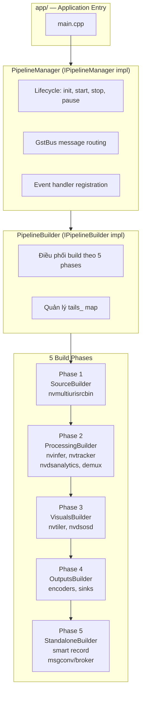
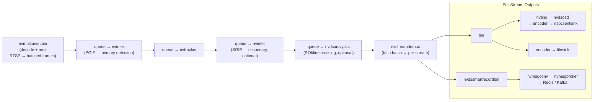
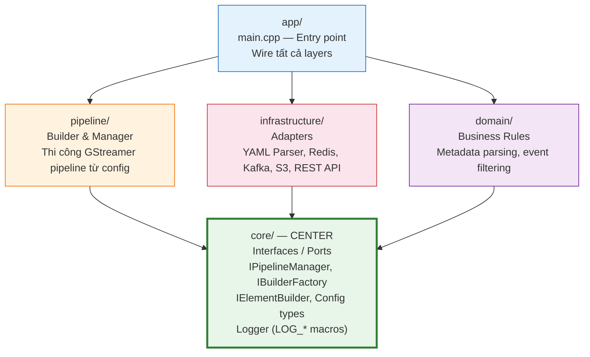

# 00. VMS Engine — Tổng quan dự án

## Mục lục

- [1. Giới thiệu](#1-giới-thiệu)
- [2. Tech Stack](#2-tech-stack)
- [3. Tính năng chính](#3-tính-năng-chính)
- [4. Kiến trúc tổng quan](#4-kiến-trúc-tổng-quan)
- [5. Luồng xử lý Pipeline](#5-luồng-xử-lý-pipeline)
- [6. Dependency Rule (Clean Architecture)](#6-dependency-rule-clean-architecture)
- [7. Namespace convention](#7-namespace-convention)
- [Tài liệu liên quan](#tài-liệu-liên-quan)

---

## 1. Giới thiệu

**VMS Engine** là Video Management System engine xây dựng trên nền tảng **NVIDIA DeepStream SDK 8.0**, sử dụng **C++17** và **GStreamer 1.0**. Ứng dụng xử lý video thời gian thực từ nhiều nguồn (RTSP, file, URI) với AI inference (object detection, tracking, analytics) và xuất ra display, file recording, RTSP streaming, message brokers.

Đây là **phiên bản refactor** của `lantanav2`:

| Mục | lantanav2 (cũ) | vms-engine (mới) |
|-----|----------------|-------------------|
| Namespace | `lantana::` | `engine::` |
| Include prefix | `lantana/core/` | `engine/core/` |
| DeepStream SDK | 7.1 | **8.0** |
| Backend | DeepStream + DLStreamer (multi-backend) | **DeepStream-native only** |
| Config variants | `std::variant` cho backend options | Config struct trực tiếp (không variant) |
| Pipeline layer | `backends/deepstream/` | `pipeline/` |
| Executable | `lantana` | `vms_engine` |

---

## 2. Tech Stack

| Component | Technology | Phiên bản |
|-----------|-----------|-----------|
| Language | C++17 | — |
| Build System | CMake + vcpkg | 3.16+ |
| Video Framework | GStreamer | 1.0 |
| AI Backend | NVIDIA DeepStream SDK | **8.0** |
| GPU Inference | TensorRT, CUDA | — |
| Configuration | YAML (yaml-cpp) | — |
| Logging | spdlog + fmt | — |
| Messaging | Redis Streams, Kafka | — |
| Storage | Local FS, S3 (MinIO) | — |
| REST API | Pistache HTTP | — |

---

## 3. Tính năng chính

### 3.1 Video Input

- **Multi-source**: `nvmultiurisrcbin` — xử lý batching nội bộ (không cần `nvstreammux` tách biệt)
- **Dynamic add/remove**: thêm/bỏ camera qua REST API khi đang chạy
- **RTSP reconnect**: tự động kết nối lại với các thông số cấu hình

### 3.2 AI Processing

| Thành phần | Vai trò | GStreamer Element |
|-----------|---------|-------------------|
| Primary Inference (PGIE) | Object detection toàn frame | `nvinfer` (TensorRT) / `nvinferserver` (Triton) |
| Secondary Inference (SGIE) | Classification, LPR, attribute recognition — per-object | `nvinfer` / `nvinferserver` |
| Tracker | NvDCF, IOU, DeepSORT | `nvtracker` |
| Analytics | ROI filtering, line crossing, overcrowding, direction detection | `nvdsanalytics` |

### 3.3 Output & Recording

| Loại output | Element(s) | Mô tả |
|-------------|-----------|-------|
| Display | `nveglglessink` / `nv3dsink` | Hiển thị X11 |
| File Recording | `nvv4l2h264enc` → `filesink` | MP4/MKV, H.264/H.265 |
| RTSP Streaming | `nvv4l2h264enc` → `rtspclientsink` | Re-stream qua RTSP |
| Smart Record | `nvmultiurisrcbin` tích hợp | Pre/post event recording với buffer |
| Message Broker | `nvmsgconv` → `nvmsgbroker` | Redis Streams, Kafka |

### 3.4 Runtime Control

- **REST API** (Pistache): thêm/bỏ camera, trigger smart record, query status
- **Runtime Parameters**: thay đổi inference interval, threshold, tracking params

---

## 4. Kiến trúc tổng quan



---

## 5. Luồng xử lý Pipeline



> ⚠️ **Lưu ý**: Các element trong ngoặc `[]` là optional — bật/tắt qua YAML config.

---

## 6. Dependency Rule (Clean Architecture)



> 🔒 **Quy tắc tuyệt đối**: `core/` không bao giờ `#include` header của `pipeline/`, `infrastructure/`, hay `domain/`.

---

## 7. Namespace convention

| Namespace | Maps to |
|-----------|---------|
| `engine::core::pipeline` | `core/include/engine/core/pipeline/` |
| `engine::core::builders` | `core/include/engine/core/builders/` |
| `engine::core::config` | `core/include/engine/core/config/` |
| `engine::pipeline` | `pipeline/include/engine/pipeline/` |
| `engine::domain` | `domain/include/engine/domain/` |
| `engine::infrastructure` | `infrastructure/include/engine/infrastructure/` |

### Logging macros

> ✅ Dùng `LOG_*` với underscore — khác với lantanav2 dùng `LOG*`.

```cpp
#include "engine/core/utils/logger.hpp"

LOG_T("Trace detail");
LOG_D("Debug: element={}", name);
LOG_I("Info: pipeline started, sources={}", count);
LOG_W("Warning: deprecated config key '{}'", key);
LOG_E("Error: gst_element_factory_make failed: {}", element_name);
LOG_C("Critical: pipeline init failed — aborting");
```

---

## Tài liệu liên quan

| Tài liệu | Mô tả |
|-----------|-------|
| [01_directory_structure.md](01_directory_structure.md) | Cấu trúc thư mục chi tiết |
| [02_core_interfaces.md](02_core_interfaces.md) | Core interfaces & contracts |
| [03_pipeline_building.md](03_pipeline_building.md) | Quy trình build pipeline theo phases |
| [../ARCHITECTURE_BLUEPRINT.md](../ARCHITECTURE_BLUEPRINT.md) | Blueprint kiến trúc tổng thể |
| [../CMAKE.md](../CMAKE.md) | CMake build system |
