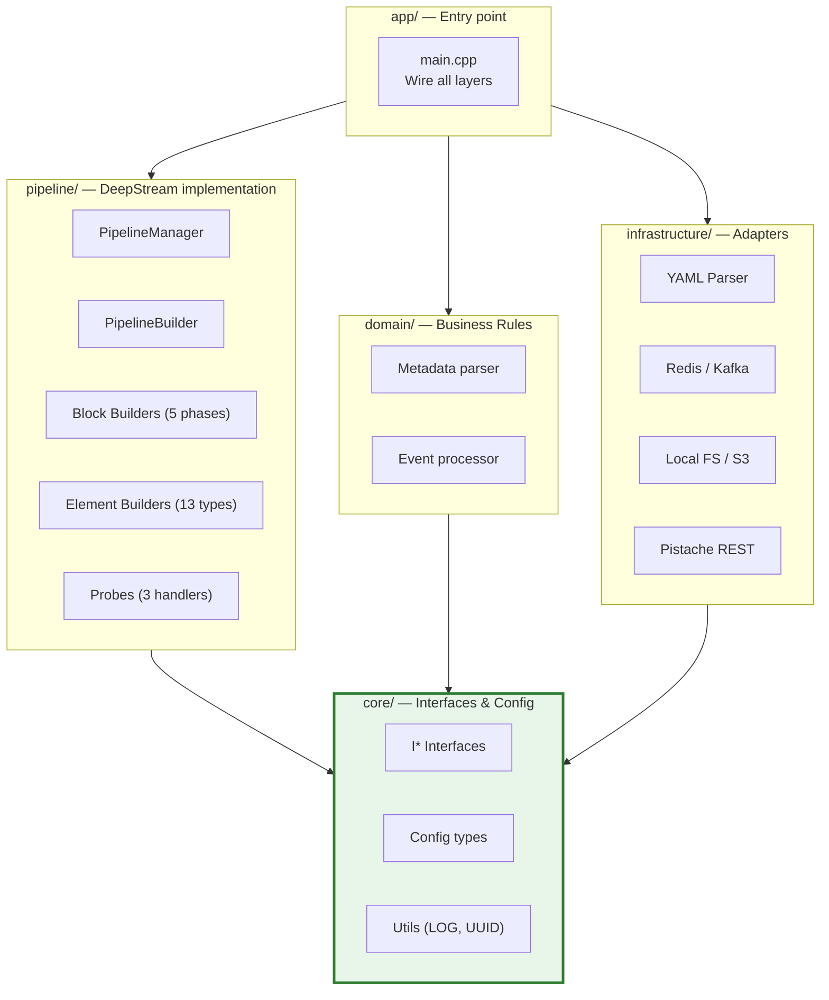

# 01. Cấu trúc thư mục chi tiết

## Mục lục

- [1. Root Directory](#1-root-directory)
- [2. Application Entry (app/)](#2-application-entry-app)
- [3. Core Layer (core/)](#3-core-layer-core)
- [4. Pipeline Layer (pipeline/)](#4-pipeline-layer-pipeline)
- [5. Domain Layer (domain/)](#5-domain-layer-domain)
- [6. Infrastructure Layer (infrastructure/)](#6-infrastructure-layer-infrastructure)
- [7. Configuration Files (configs/)](#7-configuration-files-configs)
- [8. Runtime Data (dev/)](#8-runtime-data-dev)
- [9. Build Output (build/)](#9-build-output-build)
- [Tổng quan layers](#tổng-quan-layers)
- [Tài liệu liên quan](#tài-liệu-liên-quan)

---

## 1. Root Directory

```
vms-engine/
├── CMakeLists.txt          # Root CMake — project setup, deps (vcpkg), subdirs
├── Dockerfile              # Production image (DeepStream runtime + binary)
├── Dockerfile.image        # Base image build (DeepStream SDK)
├── docker-compose.yml      # Dev container orchestration
├── .env / .env.example     # Container env vars (APP_UID, APP_GID, DEEPSTREAM_DIR)
├── README.md               # Quick start guide
└── AGENTS.md               # AI agent context — conventions, build commands
```

---

## 2. Application Entry (`app/`)

```
app/
├── CMakeLists.txt          # Links vms_engine binary
└── main.cpp                # Entry point
```

### Luồng khởi động `main.cpp`

```cpp
int main(int argc, char* argv[]) {
    // 1. Parse CLI arguments (-c <config_file>)
    auto config_path = parse_args(argc, argv);

    // 2. Parse YAML config
    engine::infrastructure::config_parser::YamlConfigParser parser;
    auto result = parser.parse(config_path);
    if (!result.ok()) { LOG_C("Config error: {}", result.error()); return 1; }
    const auto& config = result.value();

    // 3. Initialize GStreamer
    gst_init(&argc, &argv);

    // 4. Initialize logger (từ config.pipeline.log_level)
    engine::core::utils::initialize_logger(config);

    // 5. Create GMainLoop
    GMainLoop* loop = g_main_loop_new(nullptr, FALSE);

    // 6. Create & initialize PipelineManager
    auto manager = std::make_unique<engine::pipeline::PipelineManager>();
    if (!manager->initialize(config, loop)) { return 1; }

    // 7. Register event handlers từ config.custom_handlers
    manager->register_event_handlers(config.custom_handlers);

    // 8. Setup signal handlers (SIGINT, SIGTERM → graceful shutdown)
    setup_signal_handlers(manager.get(), loop);

    // 9. Start pipeline
    manager->start();

    // 10. Run main loop (blocks until signal or EOS)
    g_main_loop_run(loop);

    // 11. Cleanup
    manager->stop();
    g_main_loop_unref(loop);
    gst_deinit();
    return 0;
}
```

> 📋 Luồng tuần tự: **Parse config** → **GStreamer init** → **Logger init** → **Build pipeline** → **Start** → **Main loop** → **Cleanup**.

---

## 3. Core Layer (`core/`)

> 🔒 **Quy tắc**: `core/` chỉ phụ thuộc vào C++ standard library và GStreamer forward-declarations. **Không** include DeepStream headers.

```
core/
├── CMakeLists.txt
├── include/engine/core/
│   │
│   ├── builders/                       # Interfaces cho builder system
│   │   ├── ibuilder_factory.hpp        # IBuilderFactory — tạo element builders
│   │   ├── ielement_builder.hpp        # IElementBuilder — build GstElement
│   │   └── ipipeline_builder.hpp       # IPipelineBuilder — orchestrate build
│   │
│   ├── config/                         # Config types (pure data, no logic)
│   │   ├── config_types.hpp            # Root PipelineConfig + tất cả sub-configs
│   │   ├── source_config.hpp           # SourceConfig (nvmultiurisrcbin props)
│   │   ├── muxer_config.hpp            # StreamMuxerConfig (legacy/standalone mux)
│   │   ├── inference_config.hpp        # InferenceConfig (nvinfer / nvinferserver)
│   │   ├── tracker_config.hpp          # TrackerConfig (NvDCF, IOU, DeepSORT)
│   │   ├── analytics_config.hpp        # AnalyticsConfig (ROI, line crossing)
│   │   ├── tiler_config.hpp            # TilerConfig (grid layout)
│   │   ├── osd_config.hpp              # OsdConfig (bbox, text display)
│   │   ├── sink_config.hpp             # OutputConfig (display, file, RTSP)
│   │   ├── encoding_config.hpp         # EncodingConfig (H.264/H.265)
│   │   ├── recording_config.hpp        # SmartRecordConfig
│   │   ├── iconfig_parser.hpp          # IConfigParser interface
│   │   └── iconfig_validator.hpp       # IConfigValidator interface
│   │
│   ├── pipeline/                       # Pipeline lifecycle interface
│   │   ├── ipipeline_manager.hpp       # IPipelineManager
│   │   ├── pipeline_state.hpp          # PipelineState enum
│   │   └── pipeline_info.hpp           # PipelineInfo struct
│   │
│   ├── eventing/                       # Event handling interfaces
│   │   ├── ievent_handler.hpp          # IEventHandler (signal-based)
│   │   ├── ievent_manager.hpp          # IEventManager (registration)
│   │   ├── ievent_listener.hpp         # IEventListener (subscription)
│   │   └── event_types.hpp             # Event type constants
│   │
│   ├── probes/
│   │   └── iprobe_handler.hpp          # IProbeHandler (pad probe)
│   │
│   ├── handlers/
│   │   ├── ihandler.hpp                # Base IHandler interface
│   │   └── handler_registry.hpp        # Plugin handler discovery
│   │
│   ├── messaging/
│   │   ├── imessage_producer.hpp       # IMessageProducer (publish)
│   │   └── imessage_consumer.hpp       # IMessageConsumer (receive)
│   │
│   ├── storage/
│   │   ├── istorage_manager.hpp        # IStorageManager (snapshots)
│   │   └── storage_types.hpp           # StorageTarget, StoragePath
│   │
│   ├── runtime/
│   │   ├── iruntime_param_manager.hpp  # IRuntimeParamManager
│   │   └── iruntime_stream_manager.hpp # IRuntimeStreamManager
│   │
│   └── utils/
│       ├── logger.hpp                  # LOG_T/D/I/W/E/C macros
│       ├── spdlog_logger.hpp           # spdlog initialization
│       ├── uuid_v7_generator.hpp       # Time-ordered UUIDv7
│       └── thread_safe_queue.hpp       # Lock-free concurrent queue
│
└── src/
    ├── utils/
    │   ├── spdlog_logger.cpp
    │   └── uuid_v7_generator.cpp
    └── handlers/
        └── handler_registry.cpp
```

### Tổng hợp sub-directories trong core

| Sub-directory | Vai trò | Key interfaces |
|---------------|---------|----------------|
| `builders/` | Builder system contracts | `IBuilderFactory`, `IElementBuilder`, `IPipelineBuilder` |
| `config/` | Config types (pure data) | `PipelineConfig`, `IConfigParser`, `IConfigValidator` |
| `pipeline/` | Pipeline lifecycle | `IPipelineManager`, `PipelineState` |
| `eventing/` | Event handling | `IEventHandler`, `IEventManager`, `IEventListener` |
| `probes/` | Pad probe contract | `IProbeHandler` |
| `handlers/` | Plugin handler | `IHandler`, `HandlerRegistry` |
| `messaging/` | Message broker | `IMessageProducer`, `IMessageConsumer` |
| `storage/` | Storage abstraction | `IStorageManager` |
| `runtime/` | Runtime control | `IRuntimeParamManager`, `IRuntimeStreamManager` |
| `utils/` | Utilities | `LOG_*` macros, UUIDv7, thread-safe queue |

---

## 4. Pipeline Layer (`pipeline/`)

> 📦 Đây là nơi chứa toàn bộ **DeepStream-specific implementation**. Tương đương `backends/deepstream/` trong lantanav2 nhưng là layer cấp cao hơn, không phải "backend".

```
pipeline/
├── CMakeLists.txt
├── include/engine/pipeline/
│   │
│   ├── pipeline_manager.hpp            # PipelineManager : IPipelineManager
│   ├── builder_factory.hpp             # BuilderFactory : IBuilderFactory
│   ├── link_manager.hpp                # LinkManager (element connections)
│   ├── queue_manager.hpp               # QueueManager (auto queue insertion)
│   │
│   ├── block_builders/                 # Phase builders (tạo GstBin theo phases)
│   │   ├── base_builder.hpp            # BaseBuilder (abstract base)
│   │   ├── pipeline_builder.hpp        # PipelineBuilder : IPipelineBuilder
│   │   ├── source_builder.hpp          # Phase 1: Sources (nvmultiurisrcbin)
│   │   ├── processing_builder.hpp      # Phase 2: PGIE + SGIE + Tracker + Analytics
│   │   ├── visuals_builder.hpp         # Phase 3: Tiler + OSD
│   │   ├── outputs_builder.hpp         # Phase 4: Encoder + Sinks
│   │   └── standalone_builder.hpp      # Phase 5: Smart Record + MQ Publisher
│   │
│   ├── builders/                       # Element builders (từng GstElement)
│   │   ├── source_builder.hpp          # nvmultiurisrcbin
│   │   ├── muxer_builder.hpp           # nvstreammux (standalone mode)
│   │   ├── infer_builder.hpp           # nvinfer / nvinferserver
│   │   ├── tracker_builder.hpp         # nvtracker
│   │   ├── analytics_builder.hpp       # nvdsanalytics
│   │   ├── demuxer_builder.hpp         # nvstreamdemux
│   │   ├── tiler_builder.hpp           # nvmultistreamtiler
│   │   ├── osd_builder.hpp             # nvdsosd
│   │   ├── encoder_builder.hpp         # nvv4l2h264enc / nvv4l2h265enc
│   │   ├── sink_builder.hpp            # nveglglessink / filesink / rtspclientsink
│   │   ├── smart_record_builder.hpp    # nvdssmartrecordbin
│   │   ├── msgconv_broker_builder.hpp  # nvmsgconv + nvmsgbroker
│   │   └── queue_builder.hpp           # GstQueue element
│   │
│   ├── probes/                         # GStreamer pad probe implementations
│   │   ├── probe_handler_manager.hpp   # ProbeHandlerManager
│   │   ├── class_id_namespace_handler.hpp  # class_id offset (multi-SGIE)
│   │   ├── crop_object_handler.hpp     # Crop detected objects → storage
│   │   └── smart_record_probe_handler.hpp  # Smart record triggers via probe
│   │
│   ├── event_handlers/                 # Signal-based event handlers
│   │   ├── handler_manager.hpp         # HandlerManager (lifecycle)
│   │   ├── crop_detected_obj_handler.hpp # Crop on appsink
│   │   ├── ext_proc_handler.hpp        # External HTTP processing
│   │   └── smart_record_handler.hpp    # nvdssmartrecordbin signal handler
│   │
│   ├── config/
│   │   └── config_validator.hpp        # ConfigValidator : IConfigValidator
│   │
│   └── services/
│       └── ext_proc_service.hpp        # ExtProcService (HTTP client)
│
└── src/
    ├── pipeline_manager.cpp
    ├── builder_factory.cpp
    ├── link_manager.cpp
    ├── block_builders/                 # (source/processing/visuals/outputs/standalone)
    ├── builders/                       # (source/infer/tracker/.../queue)
    └── probes/                         # (probe_handler_manager/class_id/crop/smart_record)
```

### Phân biệt `block_builders/` vs `builders/`

| Loại | Thư mục | Vai trò | Ví dụ |
|------|---------|---------|-------|
| **Block builder** | `block_builders/` | Điều phối 1 phase — gọi nhiều element builders | `SourceBuilder`, `ProcessingBuilder` |
| **Element builder** | `builders/` | Build 1 GstElement cụ thể | `InferBuilder`, `TrackerBuilder` |

---

## 5. Domain Layer (`domain/`)

```
domain/
├── CMakeLists.txt
└── include/engine/domain/
    ├── runtime_param_rules.hpp     # Validation rules cho runtime params
    ├── metadata_parser.hpp         # NvDs metadata → domain objects
    └── event_processor.hpp         # Event filtering, dedup, routing
```

---

## 6. Infrastructure Layer (`infrastructure/`)

```
infrastructure/
├── CMakeLists.txt
│
├── config_parser/
│   ├── include/engine/infrastructure/config_parser/
│   │   └── yaml_config_parser.hpp      # YamlConfigParser : IConfigParser
│   └── src/
│       ├── yaml_config_parser.cpp      # Main parse() entry
│       ├── yaml_parser_application.cpp # pipeline: section
│       ├── yaml_parser_sources.cpp     # sources: section
│       ├── yaml_parser_processing.cpp  # processing: section
│       ├── yaml_parser_visuals.cpp     # visuals: section
│       ├── yaml_parser_outputs.cpp     # outputs: section
│       ├── yaml_parser_recording.cpp   # smart_record: section
│       ├── yaml_parser_messaging.cpp   # message_broker: section
│       └── yaml_parser_helpers.hpp     # Shared parsing utilities
│
├── messaging/
│   ├── include/engine/infrastructure/messaging/
│   │   ├── redis_stream_producer.hpp   # RedisStreamProducer : IMessageProducer
│   │   └── kafka_adapter.hpp           # KafkaAdapter : IMessageProducer
│   └── src/
│
├── storage/
│   ├── include/engine/infrastructure/storage/
│   │   ├── local_storage_manager.hpp   # LocalStorageManager : IStorageManager
│   │   └── s3_storage_manager.hpp      # S3StorageManager : IStorageManager
│   └── src/
│
└── rest_api/
    ├── include/engine/infrastructure/rest_api/
    │   └── pistache_server.hpp         # PistacheServer (runtime HTTP API)
    └── src/
```

### Tổng hợp Infrastructure adapters

| Adapter | Interface | Protocol | Use case |
|---------|-----------|----------|----------|
| `YamlConfigParser` | `IConfigParser` | YAML (yaml-cpp) | Đọc config file |
| `RedisStreamProducer` | `IMessageProducer` | Redis Streams (hiredis) | Real-time event publishing |
| `KafkaAdapter` | `IMessageProducer` | Apache Kafka (librdkafka) | High-throughput event log |
| `LocalStorageManager` | `IStorageManager` | Local FS | Dev, edge deployment |
| `S3StorageManager` | `IStorageManager` | S3 / MinIO | Cloud, shared storage |
| `PistacheServer` | — | HTTP REST (Pistache) | Runtime control API |

---

## 7. Configuration Files (`configs/`)

```
configs/
├── default.yml                     # Default multi-source pipeline (reference config)
├── example_single_source.yml       # Single RTSP stream
├── example_multi_camera.yml        # Multi-camera detection
├── example_smart_parking.yml       # Parking analytics config
├── nvinfer/                        # nvinfer TensorRT config files (.txt / .yml)
│   ├── pgie_config.txt
│   ├── pgie_yolo11_config.txt
│   └── sgie_lpr_config.txt
├── tracker/
│   └── nvdcf_config.yml            # NvDCF tracker config
└── analytics/                      # (auto-generated at runtime)
```

> 📖 **Tài liệu config YAML đầy đủ** → [05_configuration.md](05_configuration.md)

---

## 8. Runtime Data (`dev/`)

> ⚠️ Chỉ `dev/.gitkeep` được track bởi git. Tất cả data khác tạo tự động khi chạy.

```
dev/
├── .gitkeep
├── logs/
│   ├── app.log                     # spdlog output
│   └── de1_build_graph.dot         # DOT graph (visualize bằng Graphviz)
├── rec/
│   ├── lsr_cam_01_*.mp4            # Smart record clips
│   └── objects/
│       └── *.jpg                   # Cropped object snapshots
└── config/
    └── (generated tracker/analytics configs)
```

### Visualize DOT Graph

```bash
# Export graph nếu dot_file_dir được set trong YAML:
dot -Tpng dev/logs/de1_build_graph.dot -o pipeline.png

# Hoặc xem trực tiếp:
xdot dev/logs/de1_build_graph.dot
```

---

## 9. Build Output (`build/`)

```
build/
├── bin/
│   └── vms_engine                  # Main executable
├── lib/
│   ├── libvms_engine_core.a
│   ├── libvms_engine_pipeline.a
│   ├── libvms_engine_domain.a
│   └── libvms_engine_infra.a
└── compile_commands.json           # clangd language server database
```

---

## Tổng quan layers



> 🔒 Mũi tên chỉ hướng dependency: tất cả đều **hướng vào** `core/`.

---

## Tài liệu liên quan

| Tài liệu | Mô tả |
|-----------|-------|
| [00_project_overview.md](00_project_overview.md) | Tổng quan dự án, tech stack |
| [02_core_interfaces.md](02_core_interfaces.md) | Chi tiết từng interface trong `core/` |
| [03_pipeline_building.md](03_pipeline_building.md) | Quy trình build 5 phases |
| [../CMAKE.md](../CMAKE.md) | CMake build system chi tiết |
| [../ARCHITECTURE_BLUEPRINT.md](../ARCHITECTURE_BLUEPRINT.md) | Blueprint kiến trúc tổng thể |
