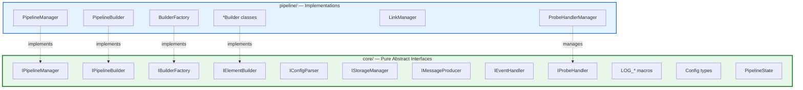
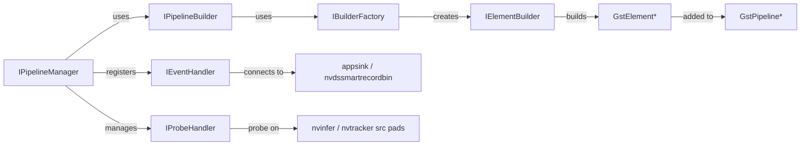

# 02. Core Interfaces & Contracts

## Mục lục

- [1. Tổng quan](#1-tổng-quan)
- [2. IPipelineManager](#2-ipipipelinemanager)
- [3. IPipelineBuilder](#3-ipipipelinebuilder)
- [4. IBuilderFactory](#4-ibuilderfactory)
- [5. IElementBuilder](#5-ielementbuilder)
- [6. Configuration Types](#6-configuration-types)
- [7. Logger Interface](#7-logger-interface)
- [8. IProbeHandler](#8-iprobehandler)
- [9. IEventHandler](#9-ieventhandler)
- [Quan hệ giữa các interfaces](#quan-hệ-giữa-các-interfaces)
- [Tài liệu liên quan](#tài-liệu-liên-quan)

---

## 1. Tổng quan

Core layer (`core/`) định nghĩa các **pure abstract interfaces** (contracts) mà các layer khác phải tuân thủ. Core **không phụ thuộc** vào bất kỳ external library cụ thể nào — không có DeepStream headers, không có yaml-cpp, không có spdlog trong interface definitions.



### Tổng hợp Interfaces

| Interface | File | Vai trò |
|-----------|------|---------|
| `IPipelineManager` | `core/pipeline/ipipeline_manager.hpp` | Quản lý toàn bộ pipeline lifecycle |
| `IPipelineBuilder` | `core/builders/ipipeline_builder.hpp` | Điều phối build pipeline (5 phases) |
| `IBuilderFactory` | `core/builders/ibuilder_factory.hpp` | Factory tạo typed element builders |
| `IElementBuilder` | `core/builders/ielement_builder.hpp` | Build 1 GstElement/GstBin cụ thể |
| `IConfigParser` | `core/config/iconfig_parser.hpp` | Parse config file → `PipelineConfig` |
| `IConfigValidator` | `core/config/iconfig_validator.hpp` | Validate config trước khi build |
| `IStorageManager` | `core/storage/istorage_manager.hpp` | Lưu trữ snapshots/recordings |
| `IMessageProducer` | `core/messaging/imessage_producer.hpp` | Publish events (Redis/Kafka) |
| `IEventHandler` | `core/eventing/ievent_handler.hpp` | Signal-based event handling |
| `IProbeHandler` | `core/probes/iprobe_handler.hpp` | GStreamer pad probe handling |

---

## 2. IPipelineManager

**File**: `core/include/engine/core/pipeline/ipipeline_manager.hpp`

Quản lý **toàn bộ lifecycle** của GStreamer pipeline.

### PipelineState Enum

| State | Mô tả |
|-------|--------|
| `Uninitialized` | Chưa gọi `initialize()` |
| `Ready` | Pipeline đã build, sẵn sàng start |
| `Playing` | Đang chạy |
| `Paused` | Tạm dừng (frames buffered) |
| `Stopped` | Đã dừng, resources released |
| `Error` | Lỗi không thể recover |

### Interface Definition

```cpp
namespace engine::core::pipeline {

class IPipelineManager {
public:
    virtual ~IPipelineManager() = default;

    // ── Lifecycle ──────────────────────────────────
    virtual bool initialize(
        engine::core::config::PipelineConfig& config,
        GMainLoop* main_loop_context = nullptr) = 0;

    virtual bool register_event_handlers(
        std::vector<engine::core::config::CustomHandlerConfig>& handlers) = 0;

    virtual bool start() = 0;
    virtual bool stop() = 0;
    virtual bool pause() = 0;

    // ── State Query ────────────────────────────────
    virtual PipelineState get_state() const = 0;
    virtual PipelineInfo get_info() const = 0;

    /// Truy cập GstPipeline thô — ownership giữ bởi manager.
    virtual GstElement* get_gst_pipeline() const = 0;
};

} // namespace engine::core::pipeline
```

### Implementation: `PipelineManager`

```cpp
// pipeline/include/engine/pipeline/pipeline_manager.hpp
namespace engine::pipeline {

class PipelineManager final : public engine::core::pipeline::IPipelineManager {
private:
    std::shared_ptr<engine::core::builders::IPipelineBuilder>  builder_;
    GstElement*          pipeline_ = nullptr;
    guint                bus_watch_id_ = 0;
    GMainLoop*           main_loop_  = nullptr;
    std::atomic<PipelineState> state_{PipelineState::Uninitialized};
    mutable std::mutex   error_mutex_;
    std::string          last_error_;

    std::shared_ptr<HandlerManager>      handler_manager_;
    std::shared_ptr<ProbeHandlerManager> probe_manager_;

    static gboolean bus_cb(GstBus* bus, GstMessage* msg, gpointer user_data);
    gboolean handle_bus_message(GstBus* bus, GstMessage* msg);
};

} // namespace engine::pipeline
```

> 📖 Chi tiết lifecycle → [06_runtime_lifecycle.md](06_runtime_lifecycle.md)

---

## 3. IPipelineBuilder

**File**: `core/include/engine/core/builders/ipipeline_builder.hpp`

Điều phối việc **xây dựng toàn bộ GStreamer pipeline** từ `PipelineConfig`.

```cpp
namespace engine::core::builders {

class IPipelineBuilder {
public:
    virtual ~IPipelineBuilder() = default;

    /**
     * @brief Build GStreamer pipeline từ configuration.
     *
     * Implementation phải:
     *  1. Tạo GstPipeline
     *  2. Gọi từng block builder theo thứ tự (5 phases)
     *  3. Link elements qua LinkManager
     *  4. Export DOT graph nếu config yêu cầu
     */
    virtual bool build(const engine::core::config::PipelineConfig& config,
                       GMainLoop* main_loop) = 0;

    virtual GstElement* get_pipeline() const = 0;
};

} // namespace engine::core::builders
```

### Implementation: `PipelineBuilder`

```cpp
// pipeline/include/engine/pipeline/block_builders/pipeline_builder.hpp
class PipelineBuilder : public engine::core::builders::IPipelineBuilder {
private:
    GstElement*   pipeline_ = nullptr;
    std::shared_ptr<engine::core::builders::IBuilderFactory> factory_;
    std::shared_ptr<LinkManager> link_manager_;
    std::map<std::string, GstElement*> tails_;  // upstream endpoint tracking
};
```

> 📋 **`tails_` map**: Tracks upstream endpoint của mỗi phase. Phase N+1 đọc `tails_["phase_N"]` để biết link từ đâu.

> 📖 Chi tiết 5-phase build → [03_pipeline_building.md](03_pipeline_building.md)

---

## 4. IBuilderFactory

**File**: `core/include/engine/core/builders/ibuilder_factory.hpp`

Factory tạo các **typed IElementBuilder instances**.

> 🔒 **Full Config Pattern**: Factory chỉ tạo builder — config được truyền khi gọi `build()`, **không** truyền khi khởi tạo.

```cpp
namespace engine::core::builders {

class IBuilderFactory {
public:
    virtual ~IBuilderFactory() = default;

    // Sources
    virtual std::unique_ptr<IElementBuilder> create_source_builder() = 0;

    // Processing — role: "primary_inference" | "secondary_inference"
    //                     "tracker" | "demuxer"
    virtual std::unique_ptr<IElementBuilder> create_processing_builder(
        const std::string& role) = 0;

    // Visuals — role: "tiler" | "osd"
    virtual std::unique_ptr<IElementBuilder> create_visual_builder(
        const std::string& role) = 0;

    // Output — type: "display" | "file" | "rtsp" | "fake"
    virtual std::unique_ptr<IElementBuilder> create_sink_builder(
        const std::string& type) = 0;

    // Encoder — codec: "h264" | "h265"
    virtual std::unique_ptr<IElementBuilder> create_encoder_builder(
        const std::string& codec) = 0;

    // Standalone
    virtual std::unique_ptr<IElementBuilder> create_smart_record_builder() = 0;
    virtual std::unique_ptr<IElementBuilder> create_msgbroker_builder() = 0;
    virtual std::unique_ptr<IElementBuilder> create_analytics_builder() = 0;
    virtual std::unique_ptr<IElementBuilder> create_queue_builder() = 0;
};

} // namespace engine::core::builders
```

### Implementation: `BuilderFactory` dispatch

```cpp
// pipeline/include/engine/pipeline/builder_factory.hpp
std::unique_ptr<IElementBuilder> create_processing_builder(
    const std::string& role) override
{
    if (role == "primary_inference" || role == "secondary_inference")
        return std::make_unique<InferBuilder>();
    if (role == "tracker")
        return std::make_unique<TrackerBuilder>();
    if (role == "demuxer")
        return std::make_unique<DemuxerBuilder>();
    LOG_E("Unknown processing role: {}", role);
    return nullptr;
}
```

---

## 5. IElementBuilder

**File**: `core/include/engine/core/builders/ielement_builder.hpp`

Interface cho việc **xây dựng một GstElement / GstBin cụ thể**.

```cpp
namespace engine::core::builders {

class IElementBuilder {
public:
    virtual ~IElementBuilder() = default;

    /**
     * @brief Build GstElement từ full pipeline configuration.
     *
     * Full Config Pattern: builder nhận TOÀN BỘ PipelineConfig thay vì
     * slice nhỏ. Builder tự tìm phần config liên quan dựa trên id + role.
     *
     * Caller (block builder) chịu trách nhiệm:
     *   - Thêm element vào pipeline/bin (gst_bin_add)
     *   - Link element với elements khác
     */
    virtual GstElement* build(
        const engine::core::config::PipelineConfig& config,
        const std::string& element_id,
        GstElement* parent_bin) = 0;
};

} // namespace engine::core::builders
```

### Ví dụ: `InferBuilder`

```cpp
GstElement* InferBuilder::build(
    const engine::core::config::PipelineConfig& config,
    const std::string& element_id,
    GstElement* parent_bin)
{
    // 1. Tìm config cho element_id
    const auto* infer_cfg = find_processing_element(config, element_id);
    if (!infer_cfg) {
        LOG_E("No config found for element: {}", element_id);
        return nullptr;
    }

    // 2. Chọn GStreamer element type
    const char* type = (infer_cfg->type == "nvinferserver")
                       ? "nvinferserver" : "nvinfer";

    // 3. Tạo element với RAII guard
    auto elem = engine::core::utils::make_gst_element(type, element_id.c_str());
    if (!elem) return nullptr;

    // 4. Set properties (PHẢI kết thúc bằng nullptr)
    g_object_set(G_OBJECT(elem.get()),
        "config-file-path", infer_cfg->config_file.c_str(),
        "unique-id",        infer_cfg->unique_id,
        "process-mode",     infer_cfg->process_mode,
        "batch-size",       infer_cfg->batch_size,
        "gpu-id",           infer_cfg->gpu_id,
        nullptr);

    // 5. Bin takes ownership → release guard
    if (!gst_bin_add(GST_BIN(parent_bin), elem.get())) {
        LOG_E("gst_bin_add failed for: {}", element_id);
        return nullptr;
    }
    return elem.release();
}
```

> ⚠️ **RAII pattern**: `make_gst_element()` trả về `GstElementPtr` (unique_ptr). Nếu thất bại trước `gst_bin_add()`, tự động unref. Sau `gst_bin_add()`, gọi `.release()` vì bin đã sở hữu.

---

## 6. Configuration Types

**File**: `core/include/engine/core/config/config_types.hpp`

```cpp
namespace engine::core::config {

struct PipelineConfig {
    std::string version = "1.0.0";

    struct PipelineMeta {
        std::string id;
        std::string name;
        std::string log_level = "INFO";
        std::string gst_log_level = "*:1";
        std::string dot_file_dir;
        std::string log_file;
    } pipeline;

    struct QueueDefaults {
        int    max_size_buffers = 10;
        int    max_size_bytes_mb = 20;
        double max_size_time_sec = 0.5;
        int    leaky = 2;  // 0=none, 1=upstream, 2=downstream
        bool   silent = true;
    } queue_defaults;

    SourceConfig    sources;
    std::vector<ProcessingElementConfig> processing;
    VisualsConfig   visuals;
    std::vector<OutputConfig> outputs;

    std::optional<SmartRecordConfig>       smart_record;
    std::optional<MessageBrokerConfig>     message_broker;
    std::optional<AnalyticsConfig>         analytics;
    std::optional<RestApiConfig>           rest_api;

    std::vector<StorageTargetConfig>   storage_configurations;
    std::vector<ExternalServiceConfig> external_services;
    std::vector<CustomHandlerConfig>   custom_handlers;
};

} // namespace engine::core::config
```

> 🔒 **Khác biệt so với lantanav2**: Không dùng `std::variant<DeepStreamInferenceConfig, DLStreamerInferenceConfig>`. Vì vms-engine là **DeepStream-native**, `ProcessingElementConfig` chứa trực tiếp DeepStream properties.

> 📖 Full YAML schema → [05_configuration.md](05_configuration.md)

---

## 7. Logger Interface

**File**: `core/include/engine/core/utils/logger.hpp`

Global logging macros — dùng xuyên suốt codebase.

| Macro | spdlog level | Use case |
|-------|-------------|----------|
| `LOG_T(...)` | `trace` | Very verbose debug |
| `LOG_D(...)` | `debug` | Development debug |
| `LOG_I(...)` | `info` | Business events, milestones |
| `LOG_W(...)` | `warn` | Deprecated fields, edge cases |
| `LOG_E(...)` | `error` | Recoverable errors |
| `LOG_C(...)` | `critical` | Fatal, cannot recover |

```cpp
#include "engine/core/utils/logger.hpp"

LOG_I("Pipeline started, n={}", source_count);
LOG_E("Failed to link {} → {}", src_name, sink_name);
```

> ⚠️ **Luôn dùng `LOG_*` với underscore** (không phải `LOG*` như lantanav2). Tất cả macros thread-safe sau khi gọi `initialize_logger()`.

---

## 8. IProbeHandler

**File**: `core/include/engine/core/probes/iprobe_handler.hpp`

```cpp
namespace engine::core::probes {

class IProbeHandler {
public:
    virtual ~IProbeHandler() = default;

    virtual bool attach(GstElement* element,
                        const std::string& pad_name,
                        GstPadProbeType probe_type) = 0;

    virtual void detach() = 0;

    virtual GstPadProbeReturn on_buffer(
        GstPad* pad, GstPadProbeInfo* info) = 0;

    virtual std::string name() const = 0;
};

} // namespace engine::core::probes
```

> 📖 Probe implementations → [07_event_handlers_probes.md](07_event_handlers_probes.md) và `probes/` docs

---

## 9. IEventHandler

**File**: `core/include/engine/core/eventing/ievent_handler.hpp`

```cpp
namespace engine::core::eventing {

class IEventHandler {
public:
    virtual ~IEventHandler() = default;

    virtual bool connect(
        GstElement* element,
        const engine::core::config::CustomHandlerConfig& config) = 0;

    virtual void disconnect() = 0;
    virtual std::string name() const = 0;
};

} // namespace engine::core::eventing
```

---

## Quan hệ giữa các interfaces



> 📋 **Luồng build**: `IPipelineManager` → `IPipelineBuilder` → `IBuilderFactory` → `IElementBuilder` → `GstElement*` → thêm vào `GstPipeline`.

---

## Tài liệu liên quan

| Tài liệu | Mô tả |
|-----------|-------|
| [01_directory_structure.md](01_directory_structure.md) | Vị trí file của từng interface |
| [03_pipeline_building.md](03_pipeline_building.md) | 5-phase build orchestration |
| [05_configuration.md](05_configuration.md) | Full YAML schema & config types |
| [06_runtime_lifecycle.md](06_runtime_lifecycle.md) | Pipeline state machine |
| [07_event_handlers_probes.md](07_event_handlers_probes.md) | Probe & event handler flow |
| [../RAII.md](../RAII.md) | GStreamer resource management |
