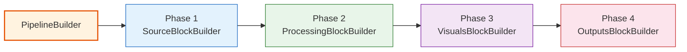
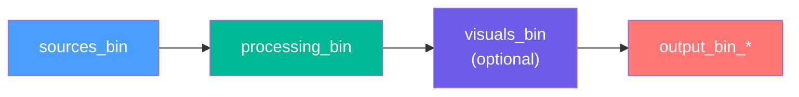
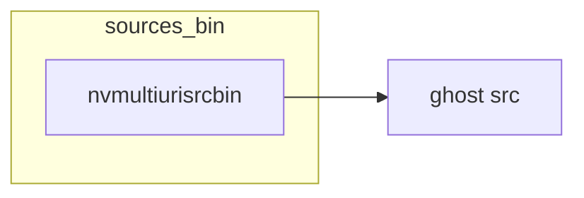
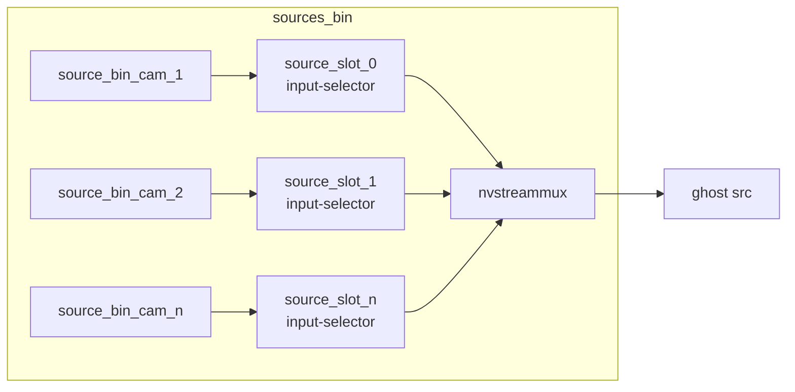
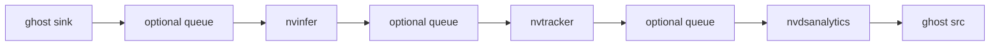
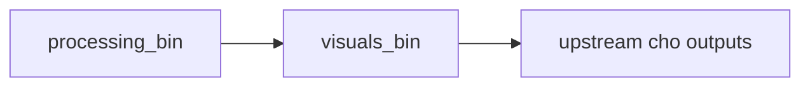
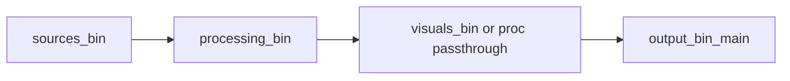
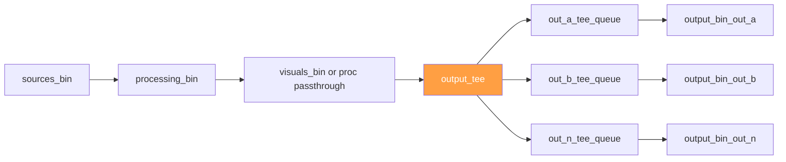

# 03. Xây dựng Pipeline - 4 Phases

## Mục lục

- [1. Tổng quan](#1-tong-quan)
- [2. Block topology hiện tại](#2-block-topology-hien-tai)
- [3. `tails_` map hiện tại](#3-tails_-map-hien-tai)
- [4. Phase 1 - Sources](#4-phase-1---sources)
- [5. Phase 2 - Processing](#5-phase-2---processing)
- [6. Phase 3 - Visuals](#6-phase-3---visuals)
- [7. Phase 4 - Outputs](#7-phase-4---outputs)
- [8. Hai topology đầu ra phổ biến](#8-hai-topology-dau-ra-pho-bien)
- [9. DOT graph export](#9-dot-graph-export)
- [10. Error handling](#10-error-handling)
- [Tổng hợp 4 phases](#tong-hop-4-phases)
- [Tài liệu liên quan](#tai-lieu-lien-quan)

---

## 1. Tổng quan

`PipelineBuilder` hiện build pipeline theo **4 phases tuần tự**. Mỗi phase delegate cho một block builder riêng, còn `PipelineBuilder` chỉ làm nhiệm vụ orchestration, cleanup, và DOT dump.



Thứ tự này được hard-code trong `pipeline/src/pipeline_builder.cpp`, và hiện tại **không còn Phase 5 standalone** trong block-building flow nữa.

---

## 2. Block topology hiện tại

Ở mức top-level `GstPipeline`, các block đang link với nhau như sau:



Khi `visuals` bị tắt hoặc không có element nào, `OutputsBlockBuilder` sẽ lấy upstream trực tiếp từ `processing_bin`. Khi có nhiều output, một `tee` sẽ được chèn giữa upstream cuối cùng và các `output_bin_*`.

Điểm quan trọng của kiến trúc hiện tại:

- `sources_bin`, `processing_bin`, `visuals_bin` là các `GstBin` có ghost pads để block-level linking chỉ cần `gst_element_link()`.
- Mỗi `output_bin_{id}` chỉ expose **ghost sink pad**, vì output là đầu cuối của pipeline.
- Internal elements được link bên trong từng bin; external linking chỉ diễn ra giữa các bin hoặc giữa upstream block và `tee`.

---

## 3. `tails_` map hiện tại

`tails_` không còn là một tail duy nhất bị overwrite sau mỗi phase. Implementation hiện tại dùng các key cố định theo block:

```cpp
std::unordered_map<std::string, GstElement*> tails_;

tails_["src"] = sources_bin;
tails_["proc"] = processing_bin;
tails_["vis"] = visuals_bin;
```

Các quy tắc đang áp dụng trong code:

- `SourceBlockBuilder` luôn ghi `tails_["src"]`.
- `ProcessingBlockBuilder` ghi `tails_["proc"]`; nếu không có processing elements thì pass-through bằng `tails_["proc"] = tails_["src"]`.
- `VisualsBlockBuilder` ghi `tails_["vis"]`; nếu visuals bị skip thì pass-through bằng `tails_["vis"] = tails_["proc"]`.
- `OutputsBlockBuilder` chỉ **đọc** `vis` hoặc `proc`; phase này không ghi tail mới vì outputs là terminal branches.

Nói ngắn gọn, logic chọn upstream cho phase 4 là:

```cpp
GstElement* upstream = nullptr;
if (tails_.count("vis")) {
    upstream = tails_["vis"];
} else if (tails_.count("proc")) {
    upstream = tails_["proc"];
}
```

---

## 4. Phase 1 - Sources

**Block builder**: `SourceBlockBuilder`

Phase 1 luôn tạo đúng một block đầu vào ở top-level tên `sources_bin` hoặc dùng `config.sources.id` khi manual mode yêu cầu tên cụ thể.

```cpp
GstElement* sources_bin = gst_bin_new(sources_bin_name.c_str());

const bool ok = uses_manual_sources(config.sources.type)
                    ? build_manual_sources_block(sources_bin, config)
                    : build_multiurisrc_block(sources_bin, config);

gst_bin_add(GST_BIN(pipeline_), sources_bin);
tails_["src"] = sources_bin;
```

### 4.1 `nvmultiurisrcbin` mode

Trong mode này, `sources_bin` chứa một `nvmultiurisrcbin` duy nhất. Block chỉ expose ghost `src` trỏ tới static `src` pad của element đó.



### 4.2 Manual `nvurisrcbin -> nvstreammux` mode

Trong mode manual, `sources_bin` chứa:

- một `nvstreammux` standalone do `MuxerBuilder` tạo,
- nhiều `source_bin_<camera_id>` do `RuntimeStreamManager` thêm vào,
- nhiều `source_slot_<index>` cố định, mỗi slot chứa một `input-selector` trước mux sink pad tương ứng,
- mỗi source bin có thể chứa `nvurisrcbin` và optional branch elements như `nvvideoconvert`, `capsfilter`, `queue`.



`SourceBlockBuilder` không tự link từng camera vào mux. Việc đó được giao cho `RuntimeStreamManager`, nơi mỗi camera:

1. preallocate `source_slot_<index>` và request đúng một `nvstreammux.sink_%u` cố định cho slot đó,
2. build `source_bin_<camera_id>`,
3. link source branch vào slot tương ứng thay vì link thẳng vào mux,
4. giữ source mới ở placeholder cho tới khi có decoded buffer đầu tiên rồi mới switch selector sang live,
5. nếu source active bị đứng hình quá lâu, switch selector về placeholder để không giữ cả batch,
6. khi source hồi lại và có buffer mới, switch selector trở lại live,
7. slot trống thật sự để `active-pad = nullptr` (idle) thay vì lấp đen toàn bộ tiler.

Ở cuối phase, top-level chỉ nhìn thấy một block `sources_bin` với đúng một ghost `src` batched pad.

Điểm quan trọng của kiến trúc fixed-slot này:

- `nvstreammux sink_%u` pads sống suốt vòng đời pipeline, nên runtime add/remove không phải churn request pads.
- `sync_inputs=true` vẫn dùng được trong steady-state, vì source bị stall sẽ bị cô lập ở selector thay vì kéo cả mux chờ vô hạn.
- visual layout phía sau không còn bị ép đầy bởi slot rỗng; chỉ source active hoặc source đang ở placeholder-recovery mới chiếm ô hiển thị.

---

## 5. Phase 2 - Processing

**Block builder**: `ProcessingBlockBuilder`

Phase này tạo `processing_bin`, build toàn bộ chain `config.processing.elements[]` bên trong bin, rồi link block này với `sources_bin`.

```cpp
GstElement* proc_bin = gst_bin_new("processing_bin");
GstElement* first_elem = nullptr;
GstElement* prev = nullptr;

for (const auto& elem_cfg : proc.elements) {
    if (elem_cfg.has_queue) {
        GstElement* q = q_builder.build(elem_cfg.queue, elem_cfg.id + "_queue");
        if (!first_elem) first_elem = q;
        if (prev) gst_element_link(prev, q);
        prev = q;
    }

    GstElement* elem = build_processing_element(elem_cfg);
    if (!first_elem) first_elem = elem;
    if (prev) gst_element_link(prev, elem);
    prev = elem;
}

expose_ghost(proc_bin, first_elem, "sink", "sink");
expose_ghost(proc_bin, prev, "src", "src");
gst_bin_add(GST_BIN(pipeline_), proc_bin);
gst_element_link(tails_["src"], proc_bin);
tails_["proc"] = proc_bin;
```

Topology nội bộ của block này luôn là **linear chain**. Queue, nếu có, được chèn **ngay trước element tương ứng**.



Nếu `config.processing.elements` rỗng thì phase này không tạo `processing_bin`; code hiện tại chỉ pass-through bằng `tails_["proc"] = tails_["src"]`.

---

## 6. Phase 3 - Visuals

**Block builder**: `VisualsBlockBuilder`

Phase này hoạt động tương tự processing nhưng chỉ dành cho `config.visuals.elements[]`, thường là `nvmultistreamtiler` và `nvdsosd`.

```cpp
if (!config.visuals.enable) {
    tails_["vis"] = tails_["proc"];
    return true;
}

GstElement* vis_bin = gst_bin_new("visuals_bin");
...
gst_bin_add(GST_BIN(pipeline_), vis_bin);
gst_element_link(tails_["proc"], vis_bin);
tails_["vis"] = vis_bin;
```

Điểm cần lưu ý:

- `visuals` bị disable: không tạo `visuals_bin`, chỉ pass-through.
- `visuals.enable = true` nhưng `elements` rỗng: cũng pass-through.
- Khi build thật, block expose cả ghost `sink` và `src` giống processing.



---

## 7. Phase 4 - Outputs

**Block builder**: `OutputsBlockBuilder`

Phase này không tạo một `outputs_bin` chung. Thay vào đó, nó tạo **một `output_bin_{id}` cho mỗi output** trong config.

### 7.1 Chọn upstream đầu vào

`OutputsBlockBuilder` lấy upstream theo thứ tự ưu tiên:

1. `tails_["vis"]` nếu tồn tại,
2. ngược lại `tails_["proc"]`.

### 7.2 Một output

Nếu chỉ có một output, block-level link rất thẳng:

```cpp
GstElement* out_bin = build_output_bin(config, 0);
gst_element_link(upstream, out_bin);
```

### 7.3 Nhiều output

Nếu có nhiều output, phase 4 chèn thêm:

- một `tee` tên `output_tee` ở top-level pipeline,
- một queue tên `<output_id>_tee_queue` cho mỗi nhánh,
- rồi mới link vào `output_bin_{id}` tương ứng.

```cpp
tee = make_gst_element("tee", "output_tee");
gst_bin_add(GST_BIN(pipeline_), tee);
gst_element_link(upstream, tee);

for (auto& output : config.outputs) {
    GstElement* q = q_builder.build(default_q, output.id + "_tee_queue");
    gst_element_link(tee, q);

    GstElement* out_bin = build_output_bin(...);
    gst_element_link(q, out_bin);
}
```

### 7.4 Bên trong mỗi `output_bin_{id}`

`build_output_bin()` tạo linear chain của output đó. Queue, nếu có, tiếp tục được chèn **trước** element tương ứng.

Một điểm quan trọng của implementation hiện tại:

- `output_bin_{id}` chỉ expose ghost `sink` pad.
- Không có ghost `src` vì output branch kết thúc ở sink hoặc broker.
- Không có `tails_["out"]` vì outputs là terminal blocks.

---

## 8. Hai topology đầu ra phổ biến

### 8.1 Single output



### 8.2 Multiple outputs



Trong implementation hiện tại **không có block-level `nvstreamdemux`** và cũng không có per-stream tails như `stream_0`, `vis_0`.

---

## 9. DOT graph export

Sau khi build xong, `PipelineBuilder` dump DOT graph nếu `config.pipeline.dot_file_dir` khác rỗng:

```cpp
gst_debug_bin_to_dot_file(
    GST_BIN(pipeline_),
    GST_DEBUG_GRAPH_SHOW_ALL,
    (pipeline_id + "_build_graph").c_str());
```

Lệnh convert:

```bash
dot -Tpng <dot-file>.dot -o pipeline.png
```

---

## 10. Error handling

Mỗi phase trả về `bool`. Nếu phase nào fail thì `PipelineBuilder::build()` sẽ cleanup toàn bộ `pipeline_` và `tails_` rồi dừng.

```cpp
if (!blk.build(config)) {
    LOG_E("Phase X failed");
    cleanup_pipeline();
    return false;
}
```

Điều này đảm bảo không có pipeline half-built bị trả ra ngoài `PipelineManager`.

---

## Tổng hợp 4 phases

| Phase         | Block builder            | Input chính                    | Link với upstream                  | Tail ghi ra                       |
| ------------- | ------------------------ | ------------------------------ | ---------------------------------- | --------------------------------- |
| 1. Sources    | `SourceBlockBuilder`     | `config.sources`               | top-level add only                 | `tails_["src"]`                   |
| 2. Processing | `ProcessingBlockBuilder` | `config.processing.elements[]` | `sources_bin -> processing_bin`    | `tails_["proc"]`                  |
| 3. Visuals    | `VisualsBlockBuilder`    | `config.visuals.elements[]`    | `processing_bin -> visuals_bin`    | `tails_["vis"]` hoặc pass-through |
| 4. Outputs    | `OutputsBlockBuilder`    | `config.outputs[]`             | `vis/proc -> tee? -> output_bin_*` | không ghi tail mới                |

---

## Tài liệu liên quan

| Tài liệu                                       | Mô tả                                                           |
| ---------------------------------------------- | --------------------------------------------------------------- |
| [02_core_interfaces.md](02_core_interfaces.md) | IPipelineBuilder và các interface liên quan                     |
| [04_linking_system.md](04_linking_system.md)   | Chi tiết cách link giữa bins, queues, tee và manual source pads |
| [05_configuration.md](05_configuration.md)     | Schema YAML cho `sources`, `processing`, `visuals`, `outputs`   |
| [10_rest_api.md](10_rest_api.md)               | Runtime add/remove streams cho manual source mode               |
| [../RAII.md](../RAII.md)                       | RAII wrappers cho `GstElement*`, `GstPad*`, `GstCaps*`          |
