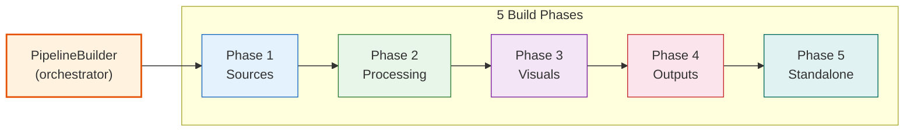

# 03. Xây dựng Pipeline — 5 Phases

## Mục lục

- [1. Tổng quan](#1-tổng-quan)
- [2. `tails_` Map Pattern](#2-tails_-map-pattern)
- [3. Phase 1 — Sources](#3-phase-1--sources)
- [4. Phase 2 — Processing](#4-phase-2--processing)
- [5. Phase 3 — Visuals](#5-phase-3--visuals)
- [6. Phase 4 — Outputs](#6-phase-4--outputs)
- [7. Phase 5 — Standalone](#7-phase-5--standalone)
- [8. DOT Graph Export](#8-dot-graph-export)
- [9. Error Handling](#9-error-handling)
- [Tổng hợp 5 Phases](#tổng-hợp-5-phases)
- [Tài liệu liên quan](#tài-liệu-liên-quan)

---

## 1. Tổng quan

Pipeline building được thực hiện bởi `PipelineBuilder` theo **5 phases tuần tự**. Mỗi phase được delegate cho một **block builder** chuyên biệt. `PipelineBuilder` đóng vai trò **orchestrator** — nó không tạo trực tiếp GstElement, mà điều phối qua factory + block builders.



> 📋 **Pattern quan trọng**: `tails_` map — track **cuối cùng của mỗi upstream path** để biết link tới element tiếp theo ở đâu.

---

## 2. `tails_` Map Pattern

`tails_` là trái tim của linking system. Sau khi refactor sang **GstBin architecture**, mỗi phase tạo ra một sub-bin và lưu con trỏ bin đó vào `tails_`. Linking giữa các phase dùng `gst_element_link(bin_a, bin_b)` thông qua ghost pads.

```cpp
std::unordered_map<std::string, GstElement*> tails_;

// Sau Phase 1: sources_bin với ghost src pad
tails_["src"] = sources_bin;

// Sau Phase 2: processing_bin với ghost sink + src pads
tails_["src"] = processing_bin;  // cập nhật tail về bin mới nhất

// Sau Phase 3: visuals_bin với ghost sink + src pads
tails_["src"] = visuals_bin;

// Sau Phase 4: outputs là đuôi pipeline — không cần update
```

> 📋 **Tại sao GstBin?** Wrapping mỗi stage trong GstBin giúp:
> - Isolate internal linking (elements chỉ link trong cùng bin)
> - DOT graph rõ ràng hơn (group elements theo stage)
> - Ghost pads cung cấp consistent interface giữa phases

### Update flow

```cpp
bool PipelineBuilder::build_sources(const PipelineConfig& config) {
    auto builder = std::make_unique<SourceBlockBuilder>(pipeline_, tails_);
    if (!builder->build(config)) return false;
    // tails_["src"] = sources_bin  (set inside SourceBlockBuilder)
    return true;
}

bool PipelineBuilder::build_processing(const PipelineConfig& config) {
    auto builder = std::make_unique<ProcessingBlockBuilder>(pipeline_, tails_);
    if (!builder->build(config)) return false;
    // tails_["src"] updated to processing_bin
    return true;
}
```

---

## 3. Phase 1 — Sources

**Block builder**: `SourceBlockBuilder`

Phase 1 tạo `sources_bin` — một `GstBin` chứa `nvmultiurisrcbin`. Expose ghost src pad để downstream bins link.

```cpp
bool SourceBlockBuilder::build(const PipelineConfig& config) {
    // 1. Tạo sources_bin
    GstElement* sources_bin = gst_bin_new("sources_bin");

    // 2. Build nvmultiurisrcbin bên trong
    builders::SourceBuilder src_builder(sources_bin);
    GstElement* source = src_builder.build(config, 0);

    // 3. Expose ghost src pad
    GstPad* src_pad = gst_element_get_static_pad(source, "src");
    GstPad* ghost_src = gst_ghost_pad_new("src", src_pad);
    gst_element_add_pad(sources_bin, ghost_src);

    // 4. Add sources_bin vào pipeline
    gst_bin_add(GST_BIN(pipeline_), sources_bin);
    tails_["src"] = sources_bin;
    return true;
}
```

**SourceBuilder** cấu hình `nvmultiurisrcbin`:

```cpp
GstElement* SourceBuilder::build(const PipelineConfig& config, int) {
    const auto& src = config.sources;
    const std::string id = src.id.empty() ? std::string("sources") : src.id;
    auto elem = make_gst_element("nvmultiurisrcbin", id.c_str());

    // Group 1 — Direct properties
    const std::string rest_port_str = std::to_string(src.rest_api_port);
    g_object_set(G_OBJECT(elem.get()),
        "port",           rest_port_str.c_str(),  // string! "0"=disable
        "max-batch-size", (gint) src.max_batch_size,
        "mode",           (gint) src.mode,
        nullptr);

    // Group 2 — nvurisrcbin pass-through
    g_object_set(G_OBJECT(elem.get()),
        "gpu-id",                  (gint) src.gpu_id,
        "select-rtp-protocol",     (gint) src.select_rtp_protocol,
        "rtsp-reconnect-interval", (gint) src.rtsp_reconnect_interval,
        "drop-pipeline-eos",       (gboolean) src.drop_pipeline_eos,
        nullptr);

    // Group 3 — nvstreammux pass-through
    g_object_set(G_OBJECT(elem.get()),
        "width",  (gint) src.width,
        "height", (gint) src.height,
        "live-source", (gboolean) src.live_source,
        nullptr);

    gst_bin_add(GST_BIN(bin_), elem.get());
    return elem.release();
}
```

> ⚠️ **DS8 SIGSEGV Bug**: `ip-address` **KHÔNG** được set — gọi `g_object_set("ip-address", ...)` gây crash trong DeepStream 8.0. Server luôn bind `0.0.0.0`. Xem [10_rest_api.md](10_rest_api.md).

---

## 4. Phase 2 — Processing

**Block builder**: `ProcessingBuilder`

Xử lý **tuần tự** theo thứ tự elements trong `config.processing`:

```yaml
processing:
  elements:
    - id: "pgie"
      role: "primary_inference"
      queue: {}               # Auto-insert GstQueue
      type: "nvinfer"
      config_file_path: "configs/nvinfer/pgie_config.txt"
      unique_id: 1
      process_mode: 1         # 1=primary
      batch_size: 4

    - id: "tracker"
      role: "tracker"
      queue: {}
      ll_lib_file: "/.../libnvds_nvmultiobjecttracker.so"

    - id: "sgie_lpr"
      role: "secondary_inference"
      queue: {}
      type: "nvinfer"
      process_mode: 2         # 2=secondary
      operate_on_gie_id: 1
      operate_on_class_ids: "2"

    - id: "demuxer"
      role: "demuxer"
      queue: {}
```

```cpp
bool ProcessingBuilder::build_phase(const PipelineConfig& config, ...) {
    GstElement* tail = tails["source"];

    for (const auto& elem : config.processing) {
        // Queue insertion (nếu elem có queue: {})
        if (elem.has_queue_config()) {
            auto* q = build_queue_for(elem, config.queue_defaults, pipeline);
            link_manager_->link_elements(tail, q);
            tail = q;
        }

        // Tạo builder từ factory theo role
        auto builder = factory_->create_processing_builder(elem.role);
        auto* gst_elem = builder->build(config, elem.id, pipeline);
        if (!gst_elem) return false;

        link_manager_->link_elements(tail, gst_elem);
        tail = gst_elem;
    }

    tails["processing_tail"] = tail;
    return true;
}
```

### Special Case: `nvstreamdemux`

`nvstreamdemux` tạo **dynamic source pads** (1 per stream). Dùng `pad-added` signal:

```cpp
g_signal_connect(demux, "pad-added",
    G_CALLBACK([](GstElement*, GstPad* pad, gpointer data) {
        // Xác định stream ID từ pad name "src_0", "src_1"...
        // Lưu pad owner vào tails_["stream_0"], tails_["stream_1"]...
    }), pipeline);
```

> 📖 Chi tiết dynamic pads → [04_linking_system.md](04_linking_system.md)

---

## 5. Phase 3 — Visuals

**Block builder**: `VisualsBuilder`

> 📋 **Tùy chọn** — skip nếu `config.visuals.enabled = false`.

```cpp
bool VisualsBuilder::build_phase(const PipelineConfig& config, ...) {
    if (!config.visuals.enabled) return true;

    for (const auto& stream_id : get_stream_ids(config)) {
        GstElement* tail = tails["stream_" + stream_id];

        // Tiler (optional)
        if (config.visuals.tiler.enabled) {
            auto* tiler = factory_->create_visual_builder("tiler")
                ->build(config, "tiler", pipeline);
            link_manager_->link(tail, tiler);
            tail = tiler;
        }

        // OSD (optional)
        if (config.visuals.osd.enabled) {
            auto* q = build_queue("osd_queue_" + stream_id, ...);
            link_manager_->link(tail, q);
            auto* osd = factory_->create_visual_builder("osd")
                ->build(config, "osd_" + stream_id, pipeline);
            link_manager_->link(q, osd);
            tail = osd;
        }

        tails["vis_" + stream_id] = tail;
    }
    return true;
}
```

---

## 6. Phase 4 — Outputs

**Block builder**: `OutputsBuilder`

Tạo `tee` → nhiều sinks cho mỗi stream:

```cpp
bool OutputsBuilder::build_phase(const PipelineConfig& config, ...) {
    for (const auto& output : config.outputs) {
        GstElement* tail = tails["vis_" + output.stream_id];

        // Tee nếu multiple outputs cho cùng stream
        if (output.requires_tee) {
            auto* tee = gst_element_factory_make("tee", ...);
            gst_bin_add(GST_BIN(pipeline), tee);
            link_manager_->link(tail, tee);
            tail = tee;
        }

        for (const auto& sink_cfg : output.sinks) {
            auto* q = build_queue("enc_q_" + sink_cfg.id, ...);

            // Encoder (nếu cần)
            GstElement* encode_tail = q;
            if (sink_cfg.needs_encoding()) {
                auto* enc = factory_->create_encoder_builder(sink_cfg.codec)
                    ->build(config, sink_cfg.id + "_enc", pipeline);
                link_manager_->link(q, enc);
                encode_tail = enc;
            }

            // Sink
            auto* sink = factory_->create_sink_builder(sink_cfg.type)
                ->build(config, sink_cfg.id, pipeline);
            link_manager_->link(encode_tail, sink);
        }
    }
    return true;
}
```

---

## 7. Phase 5 — Standalone

**Block builder**: `StandaloneBuilder`

Các elements **không nằm trong main pipeline chain** — cấu hình sau khi linking hoàn tất:

```cpp
bool StandaloneBuilder::build_phase(const PipelineConfig& config, ...) {
    // Smart Record (embedded trong nvmultiurisrcbin)
    if (config.smart_record.has_value()) {
        const auto& sr = config.smart_record.value();
        auto* src_elem = tails["source"];
        g_object_set(G_OBJECT(src_elem),
            "smart-record",               sr.mode,
            "smart-rec-dir-path",         sr.output_dir.c_str(),
            "smart-rec-file-prefix",      sr.file_prefix.c_str(),
            "smart-rec-cache",            sr.post_event_duration_sec,
            "smart-rec-default-duration", sr.default_duration_sec,
            nullptr);
    }

    // Message Broker (linked từ probe handler, không từ main chain)
    if (config.message_broker.has_value()) {
        factory_->create_msgbroker_builder()
            ->build(config, "msgconv", pipeline);
    }

    return true;
}
```

---

## 8. DOT Graph Export

Sau khi build hoàn tất, nếu `config.pipeline.dot_file_dir` được set:

```cpp
if (!config.pipeline.dot_file_dir.empty()) {
    setenv("GST_DEBUG_DUMP_DOT_DIR",
           config.pipeline.dot_file_dir.c_str(), 1);

    GST_DEBUG_BIN_TO_DOT_FILE(
        GST_BIN(pipeline_),
        GST_DEBUG_GRAPH_SHOW_ALL,
        "vms_engine_pipeline");
}
```

```bash
# Convert DOT → PNG
dot -Tpng dev/logs/vms_engine_pipeline.dot -o pipeline.png
```

---

## 9. Error Handling

Mỗi phase trả về `bool`. Build dừng ngay khi bất kỳ phase nào fail:

```cpp
bool PipelineBuilder::build(const PipelineConfig& config, GMainLoop* loop) {
    pipeline_ = gst_pipeline_new(config.pipeline.id.c_str());
    if (!pipeline_) { LOG_E("gst_pipeline_new failed"); return false; }

    if (!build_sources(config))     { cleanup(); return false; }
    if (!build_processing(config))  { cleanup(); return false; }
    if (!build_visuals(config))     { cleanup(); return false; }
    if (!build_outputs(config))     { cleanup(); return false; }
    if (!build_standalone(config))  { cleanup(); return false; }

    LOG_I("Pipeline '{}' built successfully", config.pipeline.name);
    return true;
}

void PipelineBuilder::cleanup() {
    if (pipeline_) {
        gst_object_unref(pipeline_);
        pipeline_ = nullptr;
    }
    tails_.clear();
}
```

---

## Tổng hợp 5 Phases

| Phase | Block Builder | Input | Output | Optional? |
|-------|--------------|-------|--------|-----------|
| **1. Sources** | `SourceBlockBuilder` | `config.sources` | `tails_["src"]` = sources_bin | ❌ Bắt buộc |
| **2. Processing** | `ProcessingBuilder` | `config.processing[]` | `tails_["processing_tail"]` | ❌ Bắt buộc |
| **3. Visuals** | `VisualsBuilder` | `config.visuals` | `tails_["vis_*"]` | ✅ Optional |
| **4. Outputs** | `OutputsBuilder` | `config.outputs[]` | Sinks (terminal) | ❌ Bắt buộc |
| **5. Standalone** | `StandaloneBuilder` | `smart_record`, `message_broker` | Side-effects only | ✅ Optional |

---

## Tài liệu liên quan

| Tài liệu | Mô tả |
|-----------|-------|
| [02_core_interfaces.md](02_core_interfaces.md) | IPipelineBuilder, IBuilderFactory, IElementBuilder |
| [04_linking_system.md](04_linking_system.md) | Static/dynamic linking, ghost pads |
| [05_configuration.md](05_configuration.md) | YAML schema cho processing/outputs/visuals |
| [09_outputs_smart_record.md](09_outputs_smart_record.md) | Smart Record architecture |
| [../RAII.md](../RAII.md) | RAII guards cho GstElement* |
