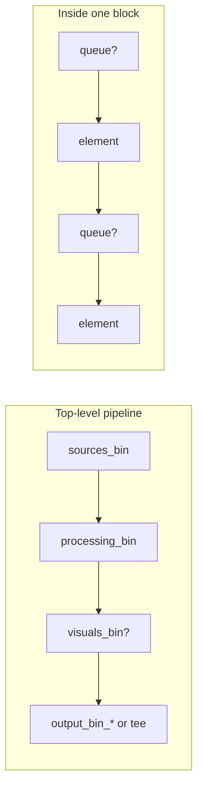
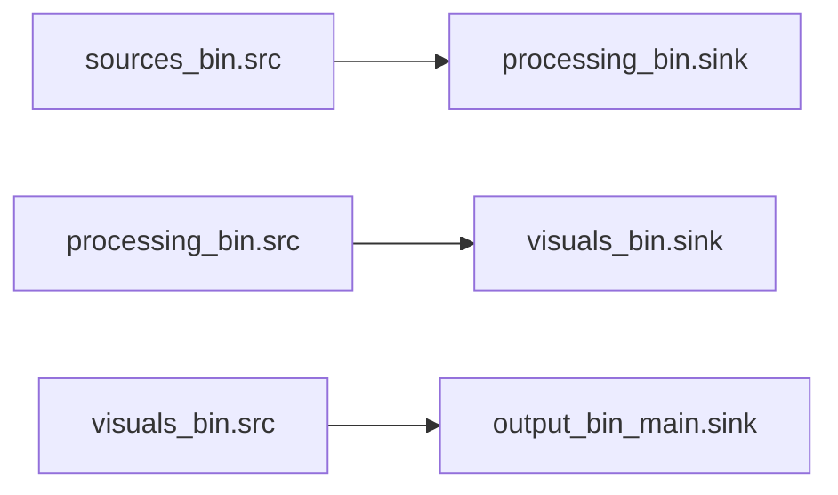
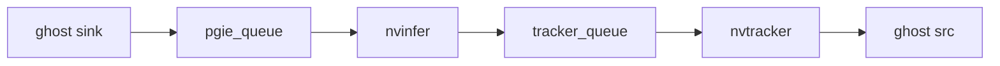
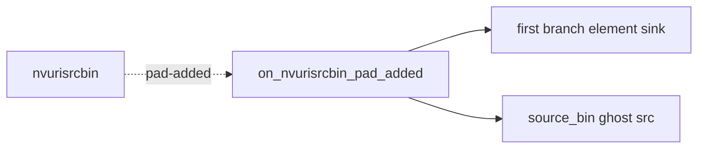
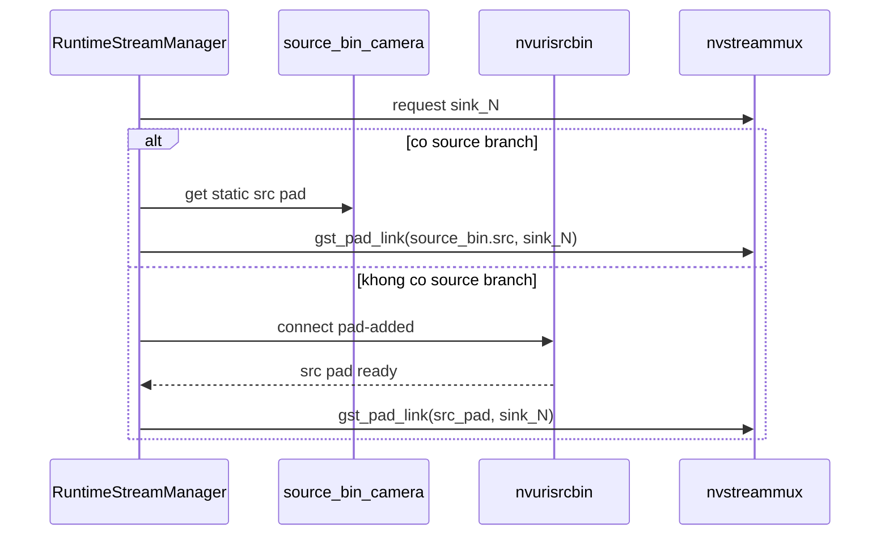
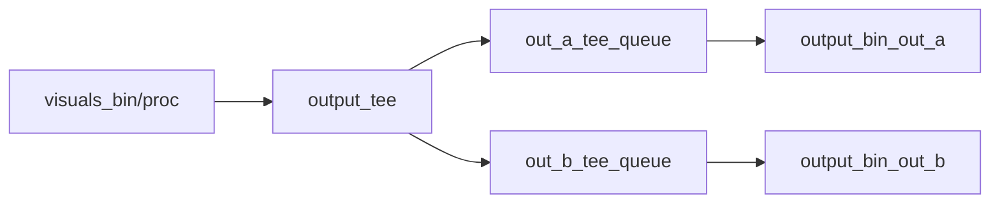

# 04. Linking System - Kết nối giữa các block và elements

> **Phạm vi**: block-level linking qua ghost pads, internal chain linking trong từng `GstBin`, dynamic linking ở manual source mode, và output branching qua `tee`.

---

## Mục lục

- [1. Tổng quan](#1-tong-quan)
- [2. Block-level linking qua ghost pads](#2-block-level-linking-qua-ghost-pads)
- [3. Internal chain linking trong từng block](#3-internal-chain-linking-trong-tung-block)
- [4. Dynamic linking ở manual source mode](#4-dynamic-linking-o-manual-source-mode)
- [5. Output branching với `tee`](#5-output-branching-voi-tee)
- [6. Queue insertion pattern](#6-queue-insertion-pattern)
- [7. Ghost pads và ownership](#7-ghost-pads-va-ownership)
- [8. Debugging links](#8-debugging-links)
- [Tham chiếu chéo](#tham-chieu-cheo)

---

## 1. Tổng quan

Linking trong implementation hiện tại có hai lớp:

1. **Block-level linking**: link giữa `sources_bin`, `processing_bin`, `visuals_bin`, `output_bin_*` bằng `gst_element_link()` qua ghost pads.
2. **Internal linking**: link chain các elements bên trong mỗi block bằng `gst_element_link()` hoặc `gst_pad_link()` tùy loại pad.



Điểm quan trọng:

- Chuỗi block hiện tại **không dùng `nvstreamdemux`** ở phase linking chính.
- Dynamic pads hiện chủ yếu xuất hiện ở manual source mode khi link `nvurisrcbin` vào source branch hoặc `nvstreammux`.

---

## 2. Block-level linking qua ghost pads

Ba block đầu tiên expose interface rõ ràng để top-level pipeline chỉ cần `gst_element_link()`:

- `sources_bin`: ghost `src`
- `processing_bin`: ghost `sink` và `src`
- `visuals_bin`: ghost `sink` và `src`
- `output_bin_{id}`: ghost `sink`

Ví dụ link thực tế trong code:

```cpp
gst_element_link(tails_["src"], proc_bin);
gst_element_link(tails_["proc"], vis_bin);
gst_element_link(upstream, out_bin);
```

Vì dùng ghost pads, top-level không cần biết element đầu hay cuối bên trong block là gì.



---

## 3. Internal chain linking trong từng block

`ProcessingBlockBuilder`, `VisualsBlockBuilder`, và `OutputsBlockBuilder::build_output_bin()` đều dùng cùng một pattern:

```cpp
GstElement* first_elem = nullptr;
GstElement* prev = nullptr;

for (const auto& elem_cfg : elements) {
    if (elem_cfg.has_queue) {
        GstElement* q = q_builder.build(elem_cfg.queue, elem_cfg.id + "_queue");
        if (!first_elem) first_elem = q;
        if (prev) gst_element_link(prev, q);
        prev = q;
    }

    GstElement* elem = build_element(elem_cfg);
    if (!first_elem) first_elem = elem;
    if (prev) gst_element_link(prev, elem);
    prev = elem;
}
```

Hệ quả của pattern này:

- chain luôn là **linear**,
- queue luôn nằm **trước** element mà nó bảo vệ,
- `first_elem` được dùng để expose ghost `sink`,
- `prev` cuối cùng được dùng để expose ghost `src` nếu block cần đầu ra.

Ví dụ một processing chain:



---

## 4. Dynamic linking ở manual source mode

Manual source mode có hai lớp dynamic linking khác nhau.

### 4.1 Bên trong `source_bin_<camera>`

`NvUriSrcBinBuilder` build một `source_bin_<camera_id>` bao quanh `nvurisrcbin` và optional source-branch elements. Vì `nvurisrcbin` có thể phát `src` pad trễ, builder đăng ký callback `pad-added`:

```cpp
g_signal_connect(source_elem, "pad-added",
                 G_CALLBACK(on_nvurisrcbin_pad_added), pad_context);
```

Callback này xử lý theo hai trường hợp:

- có source branch: link pad của `nvurisrcbin` vào `sink` pad của branch element đầu tiên,
- không có source branch: gán pad đó làm target cho ghost `src` của `source_bin_<camera>`.



### 4.2 Từ `source_bin_<camera>` sang `nvstreammux`

`RuntimeStreamManager` request mux pad `sink_N`, sau đó link source vào mux.

```cpp
GstPad* mux_sink_pad = gst_element_request_pad_simple(muxer_, sink_pad_name.c_str());
```

Flow thực tế:

- nếu source branch tồn tại, manager lấy static `src` pad của `source_bin_<camera>` rồi link trực tiếp vào `mux_sink_pad`,
- nếu không có source branch, manager lấy raw `nvurisrcbin` trong source bin, đăng ký thêm `pad-added`, rồi link pad động đó vào `mux_sink_pad`.



Đây là điểm khác biệt lớn so với tài liệu cũ: dynamic linking hiện gắn với **manual source ingestion**, không phải `nvstreamdemux` ở output side.

---

## 5. Output branching với `tee`

Nếu có nhiều output, `OutputsBlockBuilder` chèn một `tee` ở top-level pipeline:

```cpp
tee = make_gst_element("tee", "output_tee");
gst_bin_add(GST_BIN(pipeline_), tee);
gst_element_link(upstream, tee);
```

Mỗi nhánh output sau đó có thêm một queue top-level riêng:

```cpp
GstElement* q = q_builder.build(default_q, output.id + "_tee_queue");
gst_element_link(tee, q);
gst_element_link(q, out_bin);
```

GStreamer sẽ tự request `src_%u` pad trên `tee` khi gọi `gst_element_link(tee, q)`.



Nếu chỉ có một output thì không có `tee`; upstream link thẳng vào `output_bin_{id}`.

---

## 6. Queue insertion pattern

Có hai chỗ queue xuất hiện trong implementation hiện tại.

### 6.1 Queue trước từng configured element

Áp dụng cho processing, visuals, outputs. Nếu `elem_cfg.has_queue` là `true`, queue sẽ được build ngay trước element đó, với tên `<element_id>_queue`.

```cpp
std::string q_name = elem_cfg.id + "_queue";
GstElement* q = q_builder.build(elem_cfg.queue, q_name);
```

### 6.2 Queue sau `tee`

Áp dụng cho multi-output. Queue này không nằm trong `output_bin`, mà nằm ở top-level pipeline để tách backpressure giữa các branches.

Tên queue là `<output_id>_tee_queue`.

---

## 7. Ghost pads và ownership

Pattern chung của block builders:

1. build internal elements,
2. expose ghost pads từ element đầu hoặc cuối,
3. add cả block bin vào `pipeline_`,
4. mới thực hiện external linking.

Ví dụ:

```cpp
expose_ghost(proc_bin, first_elem, "sink", "sink");
expose_ghost(proc_bin, prev, "src", "src");
gst_bin_add(GST_BIN(pipeline_), proc_bin);
gst_element_link(tails_["src"], proc_bin);
```

Điều này giúp:

- interface giữa các block ổn định,
- DOT graph dễ đọc,
- internal topology của block được đóng gói,
- top-level pipeline không phụ thuộc vào element đầu/cuối cụ thể.

---

## 8. Debugging links

Một vài cách debug topology hiện tại:

```bash
# Dump DOT graph sau build
GST_DEBUG_DUMP_DOT_DIR=dev/logs ./build/bin/vms_engine -c configs/default.yml

# Convert DOT -> PNG
dot -Tpng dev/logs/*.dot -o pipeline.png

# Tìm lỗi link trong log
./build/bin/vms_engine -c configs/default.yml 2>&1 | grep -iE "link|pad-added|mux"
```

Các lỗi thường gặp:

| Lỗi                                        | Nguyên nhân thường gặp                       | Gợi ý                                                        |
| ------------------------------------------ | -------------------------------------------- | ------------------------------------------------------------ |
| `failed to link upstream -> tee`           | upstream block không expose đúng ghost `src` | kiểm tra block trước đó đã expose `src` pad chưa             |
| `failed to request nvstreammux pad sink_N` | `max_sources` hoặc `batch_size` không đủ     | tăng `sources.mux.max_sources` hoặc `sources.mux.batch_size` |
| `failed to link nvurisrcbin pad`           | pad đến muộn hoặc caps không khớp branch     | kiểm tra source branch và callback `pad-added`               |
| `failed to link tee -> queue`              | branch queue chưa add đúng pipeline          | kiểm tra queue được build bằng `QueueBuilder(pipeline_)`     |

---

## Tham chiếu chéo

| Tài liệu                                           | Liên quan                                             |
| -------------------------------------------------- | ----------------------------------------------------- |
| [03_pipeline_building.md](03_pipeline_building.md) | Flow 4 phases và block topology tổng thể              |
| [05_configuration.md](05_configuration.md)         | YAML schema cho queue, outputs, manual sources        |
| [10_rest_api.md](10_rest_api.md)                   | Runtime add/remove streams cho manual source mode     |
| [../RAII.md](../RAII.md)                           | RAII helpers cho `GstElement*`, `GstPad*`, `GstCaps*` |
