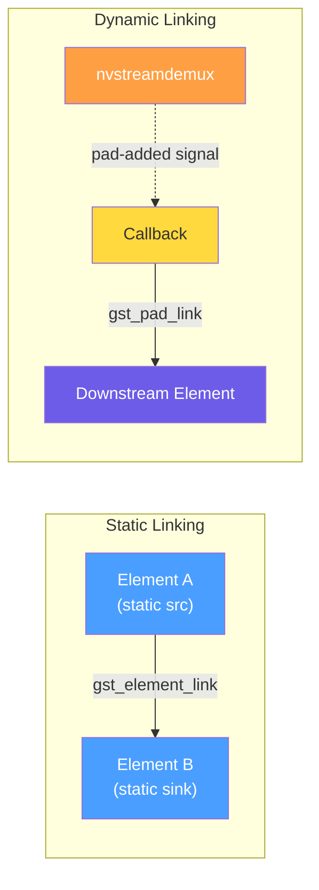
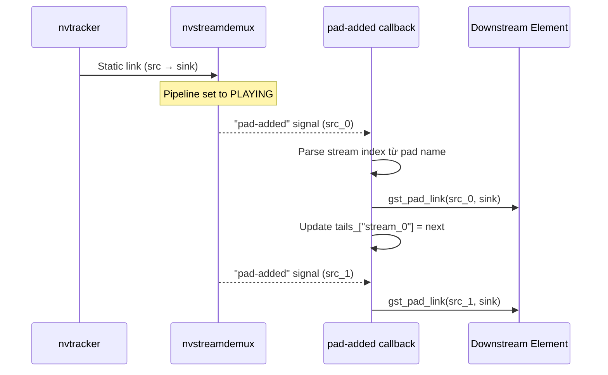
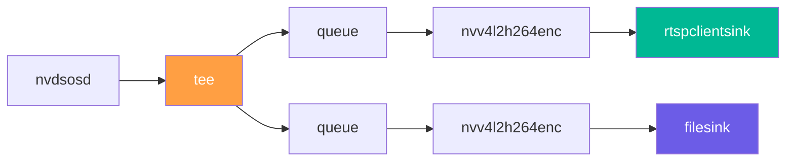

# 04. Linking System — Kết nối GStreamer Elements

> **Phạm vi**: Static pad linking, dynamic pad linking (nvstreamdemux), queue insertion pattern, tee branching, RAII guards cho linking objects.
>
> **Đọc trước**: [03_pipeline_building.md](03_pipeline_building.md) — hiểu 5-phase build trước khi đọc linking details.

---

## Mục lục

- [1. Tổng quan](#1-tổng-quan)
- [2. Static Pad Linking](#2-static-pad-linking)
- [3. Dynamic Pad Linking — nvstreamdemux](#3-dynamic-pad-linking--nvstreamdemux)
- [4. Queue Insertion — `queue: {}` Pattern](#4-queue-insertion--queue--pattern)
- [5. Tee Element — Multiple Outputs](#5-tee-element--multiple-outputs)
- [6. RAII cho GStreamer Objects](#6-raii-cho-gstreamer-objects)
- [7. Debugging Links](#7-debugging-links)
- [Tham chiếu chéo](#tham-chiếu-chéo)

---

## 1. Tổng quan

Pipeline linking thực hiện trực tiếp qua GStreamer API (`gst_element_link`, `gst_pad_link`) trong các block builder — không có wrapper class.



| Loại | API GStreamer | Khi nào dùng |
|------|-------------|--------------|
| **Static pad** | `gst_element_link()` | Elements có fixed src/sink pads (nvinfer, nvtracker, osd, ...) |
| **Dynamic pad** | `gst_pad_link()` + `pad-added` signal | nvstreamdemux — tạo src pads khi stream join |

---

## 2. Static Pad Linking

Đa số elements trong DeepStream có **static sink/src pads** — link trực tiếp:

```
nvmultiurisrcbin.src → [queue] → nvinfer.sink
nvinfer.src          → [queue] → nvtracker.sink
nvtracker.src        → [queue] → nvinfer_sgie.sink
```

```cpp
// Block builders gọi trực tiếp GStreamer API
if (!gst_element_link(src, sink)) {
    LOG_E("Failed to link '{}' → '{}'",
          GST_ELEMENT_NAME(src), GST_ELEMENT_NAME(sink));
    return false;
}
LOG_D("Linked: '{}' → '{}'", GST_ELEMENT_NAME(src), GST_ELEMENT_NAME(sink));
```

> 📋 **Pattern**: Luôn log cả success (`LOG_D`) lẫn failure (`LOG_E`) khi linking — giúp debug pipeline topology.

---

## 3. Dynamic Pad Linking — nvstreamdemux

`nvstreamdemux` không tạo src pads ngay — chúng chỉ xuất hiện khi stream được demuxed (**dynamic pads**).

### Luồng hoạt động



### Implementation

```cpp
// OutputsBlockBuilder — connect signal trước khi set PLAYING
g_signal_connect(demux, "pad-added",
                 G_CALLBACK(on_demux_pad_added), &context);

// Callback xử lý từng dynamic pad
static void on_demux_pad_added(GstElement* demux, GstPad* new_pad,
                                gpointer user_data) {
    auto* ctx = static_cast<BuildContext*>(user_data);

    // Parse stream index: "src_0" → 0
    std::string pad_name = GST_PAD_NAME(new_pad);
    int stream_idx = std::stoi(pad_name.substr(4));

    // Tìm downstream element cho stream này
    auto it = ctx->stream_next.find(stream_idx);
    if (it == ctx->stream_next.end()) {
        LOG_W("No downstream element for stream {}", stream_idx);
        return;
    }

    GstPad* sink_pad = gst_element_get_static_pad(it->second, "sink");
    if (!sink_pad) {
        sink_pad = gst_element_request_pad_simple(it->second, "sink_%u");
    }
    if (!sink_pad) {
        LOG_E("Cannot get sink pad for stream_{}", stream_idx);
        return;
    }

    GstPadLinkReturn ret = gst_pad_link(new_pad, sink_pad);
    if (ret != GST_PAD_LINK_OK) {
        LOG_E("gst_pad_link failed for stream_{}: {}", stream_idx, ret);
    } else {
        LOG_D("Linked demux src_{} → {}", stream_idx,
              GST_ELEMENT_NAME(it->second));
        ctx->tails["stream_" + std::to_string(stream_idx)] = it->second;
    }
    gst_object_unref(sink_pad);
}
```

> ⚠️ **Timing quan trọng**: `g_signal_connect` phải được gọi **trước** `gst_element_set_state(pipeline, GST_STATE_PLAYING)` — nếu không sẽ miss các pad-added signals.

---

## 4. Queue Insertion — `queue: {}` Pattern

Bất kỳ element có key `queue: {}` trong YAML sẽ được tự động insert `GstQueue` phía trước — tách biệt processing threads.

### YAML Config

```yaml
processing:
  elements:
    - id: "pgie"
      queue: {}              # Dùng queue_defaults
      ...
    - id: "tracker"
      queue:                 # Override riêng
        max_size_buffers: 20
        leaky: 2
      ...
```

### Build Logic

```cpp
GstElement* build_queue_for(const ProcessingElementConfig& elem,
                             const QueueDefaults& defaults,
                             GstElement* pipeline) {
    const auto& q_cfg = elem.queue_config.value_or(defaults);

    auto q = make_gst_element("queue", (elem.id + "_prequeue").c_str());
    if (!q) return nullptr;

    g_object_set(G_OBJECT(q.get()),
        "max-size-buffers", (guint) q_cfg.max_size_buffers,
        "max-size-bytes",   (guint)(q_cfg.max_size_bytes_mb * 1024 * 1024),
        "max-size-time",    (guint64)(q_cfg.max_size_time_sec * GST_SECOND),
        "leaky",            leaky_mode_from_string(q_cfg.leaky),
        "silent",           (gboolean) q_cfg.silent,
        nullptr);

    gst_bin_add(GST_BIN(pipeline), q.get());
    return q.release();
}
```

> 📋 **Naming convention**: Queue ID = `<element_id>_prequeue` (ví dụ: `pgie_prequeue`, `tracker_prequeue`).

---

## 5. Tee Element — Multiple Outputs

Khi một stream cần đi vào **nhiều sinks** đồng thời (display + record):



```cpp
GstElement* tee = gst_element_factory_make("tee", "output_tee_0");
gst_bin_add(GST_BIN(pipeline), tee);
gst_element_link(osd_element, tee);

// Branch 1: RTSP
auto* q1 = make_queue("rtsp_q_0");
auto* enc1 = make_h264_encoder("enc_rtsp_0");
auto* rtsp_sink = make_rtsp_sink("rtsp_0");
gst_bin_add_many(GST_BIN(pipeline), q1, enc1, rtsp_sink, nullptr);
gst_element_link_many(tee, q1, enc1, rtsp_sink, nullptr);

// Branch 2: File
auto* q2 = make_queue("file_q_0");
auto* enc2 = make_h264_encoder("enc_file_0");
auto* file_sink = make_file_sink("file_0");
gst_bin_add_many(GST_BIN(pipeline), q2, enc2, file_sink, nullptr);
gst_element_link_many(tee, q2, enc2, file_sink, nullptr);
```

> 📋 **Tee auto-pads**: `tee` tự động tạo src pads với pattern `src_%u` khi downstream element được linked.

---

## 6. RAII cho GStreamer Objects

Mọi `GstElement*` tạo bởi `gst_element_factory_make()` phải được quản lý qua RAII helpers:

```cpp
#include "engine/core/utils/gst_utils.hpp"

// ─── Element guard ────────────────────────────────────
auto elem = engine::core::utils::make_gst_element("nvinfer", "pgie");
if (!configure_infer(elem.get(), config)) {
    return nullptr;  // elem tự unref khi ra scope
}
// Sau gst_bin_add → bin owns → disarm guard
if (!gst_bin_add(GST_BIN(pipeline), elem.get())) return nullptr;
return elem.release();  // Transfer ownership

// ─── Pad guard ────────────────────────────────────────
engine::core::utils::GstPadPtr src_pad(
    gst_element_get_static_pad(element, "src"), gst_object_unref);
// gst_object_unref tự động khi ra scope

// ─── Caps guard ───────────────────────────────────────
engine::core::utils::GstCapsPtr caps(
    gst_caps_new_simple("video/x-raw", "format", G_TYPE_STRING, "NV12",
                        nullptr),
    gst_caps_unref);
```

| RAII Type | Tạo bởi | Cleanup |
|-----------|---------|---------|
| `GstElementPtr` | `make_gst_element()` | `gst_object_unref` — disarm via `.release()` |
| `GstPadPtr` | `gst_element_get_static_pad()` | `gst_object_unref` |
| `GstCapsPtr` | `gst_caps_new_*()` | `gst_caps_unref` |

> 🔒 **Quy tắc**: Sau `gst_bin_add()` thành công → gọi `.release()` để bin quản lý lifetime. Nếu `gst_bin_add()` fail → RAII guard tự cleanup.

---

## 7. Debugging Links

```bash
# Export DOT graph
GST_DEBUG_DUMP_DOT_DIR=dev/logs ./build/bin/vms_engine -c configs/default.yml

# Convert DOT → PNG
dot -Tpng dev/logs/*.dot -o pipeline.png

# Grep link failures
./build/bin/vms_engine -c configs/default.yml 2>&1 | grep -iE "link|LINK"
```

### Common Link Errors

| Lỗi | Nguyên nhân | Fix |
|-----|-------------|-----|
| `gst_element_link FAILED` | Caps không tương thích | Thêm `capsfilter` hoặc `nvvideoconvert` |
| `Could not link src to sink` | Thứ tự sai: link trước add | Kiểm tra `gst_bin_add` trước `gst_element_link` |
| pad-added callback không gọi | Signal connect timing sai | `g_signal_connect` phải **trước** `set_state(PLAYING)` |
| Deadlock khi linking dynamic pads | Link trên pipeline thread | Dùng `post_pad_link_message` để defer |

---

## Tham chiếu chéo

| Tài liệu | Liên quan |
|-----------|-----------|
| [03_pipeline_building.md](03_pipeline_building.md) | 5-phase build sử dụng linking system |
| [05_configuration.md](05_configuration.md) | YAML `queue: {}` config schema |
| [09_outputs_smart_record.md](09_outputs_smart_record.md) | Tee pattern cho output branching |
| [../RAII.md](../RAII.md) | Chi tiết RAII types cho GStreamer |
| [07_event_handlers_probes.md](07_event_handlers_probes.md) | Pad probes gắn sau khi linking hoàn tất |
