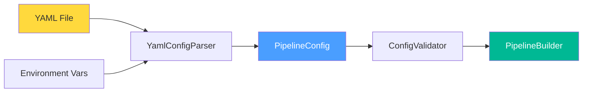
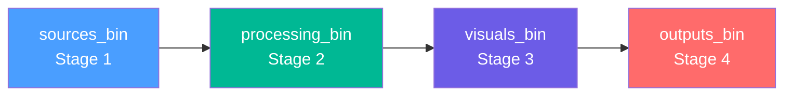
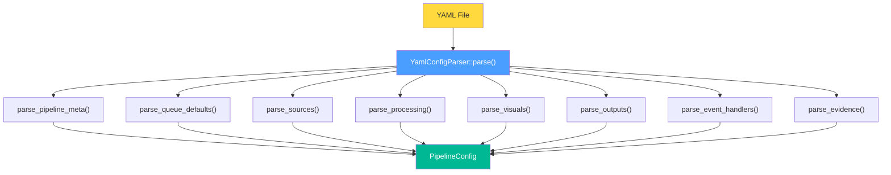

# 05. Configuration System — YAML Config Schema

> **Phạm vi**: YAML convention, full schema reference, nvinfer/tracker config files, parsing architecture, env var substitution, validation.
>
> **Đọc trước**: [02_core_interfaces.md](02_core_interfaces.md) — PipelineConfig struct definition.

---

## Mục lục

- [05. Configuration System — YAML Config Schema](#05-configuration-system--yaml-config-schema)
  - [Mục lục](#mục-lục)
  - [1. Tổng quan](#1-tổng-quan)
  - [2. YAML Conventions Bắt Buộc](#2-yaml-conventions-bắt-buộc)
    - [2.1 Property Names — snake_case → kebab-case](#21-property-names--snake_case--kebab-case)
    - [2.2 Enum Fields là Integers](#22-enum-fields-là-integers)
    - [2.3 `queue: {}` Pattern](#23-queue--pattern)
  - [3. Schema Đầy Đủ](#3-schema-đầy-đủ)
    - [Pipeline Topology](#pipeline-topology)
    - [Stage 1 — Sources](#stage-1--sources)
    - [Stage 2 — Processing](#stage-2--processing)
    - [Stage 3 — Visuals](#stage-3--visuals)
    - [Stage 4 — Outputs](#stage-4--outputs)
    - [Messaging](#messaging)
    - [Evidence](#evidence)
    - [Event Handlers](#event-handlers)
    - [Frame Events handler](#frame-events-handler)
    - [Queue Defaults \& Pipeline Metadata](#queue-defaults--pipeline-metadata)
  - [4. nvinfer Config File (.txt)](#4-nvinfer-config-file-txt)
  - [5. Tracker Config File (.yml)](#5-tracker-config-file-yml)
  - [6. YAML Parsing Architecture](#6-yaml-parsing-architecture)
  - [7. Environment Variable Substitution](#7-environment-variable-substitution)
  - [8. Config Validation](#8-config-validation)
  - [Tham chiếu chéo](#tham-chiếu-chéo)

---

## 1. Tổng quan

VMS Engine hoàn toàn **config-driven**: pipeline topology, inference models, output sinks, smart record, messaging — tất cả trong file YAML. Không cần recompile để thay đổi deployment.



Canonical reference: [`configs/deepstream_default.yml`](../../configs/deepstream_default.yml)

---

## 2. YAML Conventions Bắt Buộc

### 2.1 Property Names — snake_case → kebab-case

YAML parser tự động convert `_` → `-` khi set GStreamer properties:

| YAML (snake_case)  | GStreamer property (kebab-case) |
| ------------------ | ------------------------------- |
| `config_file_path` | `config-file-path`              |
| `ll_lib_file`      | `ll-lib-file`                   |
| `max_size_buffers` | `max-size-buffers`              |

### 2.2 Enum Fields là Integers

Tất cả enum properties trong GStreamer → **integer** trong YAML:

```yaml
smart_record: 1 # 0=off, 1=audio+video, 2=video-only
process_mode: 1 # 1=primary (PGIE), 2=secondary (SGIE)
compute_hw: 0 # 0=default, 1=GPU, 2=VIC
```

### 2.3 `queue: {}` Pattern

Thêm `queue: {}` vào element để auto-insert GstQueue trước nó:

```yaml
- id: "pgie"
  queue: {} # Dùng queue_defaults

- id: "tracker"
  queue: # Override cụ thể
    max_size_buffers: 20
    leaky: 2
```

> 📋 **Queue naming**: Element `pgie` có queue → ID = `pgie_prequeue`. Xem [04_linking_system.md](04_linking_system.md#4-queue-insertion--queue--pattern).

---

## 3. Schema Đầy Đủ

### Pipeline Topology



### Stage 1 — Sources

```yaml
sources:
  id: sources # manual-mode source layer id
  type: nvurisrcbin # "nvmultiurisrcbin" | "nvurisrcbin"

  # Group 1 — nvmultiurisrcbin direct (ignored when type: nvurisrcbin)
  rest_api_port: 9000 # 0=disable REST API, >0=enable CivetWeb
  max_batch_size: 4 # compatibility fallback; prefer mux.batch_size below
  mode: 0 # 0=video  1=audio

  # Group 2 — nvurisrcbin passthrough
  gpu_id: 0
  num_extra_surfaces: 9
  cudadec_memtype: 0 # 0=device  1=pinned  2=unified
  dec_skip_frames: 0 # 0=all  1=non-ref  2=key-only
  drop_frame_interval: 0
  select_rtp_protocol: 4 # 0=multi  4=TCP-only
  rtsp_reconnect_interval: 10
  rtsp_reconnect_attempts: -1
  latency: 400
  udp_buffer_size: 4194304
  disable_audio: false
  disable_passthrough: false
  drop_on_latency: false # giữ jitterbuffer không drop late RTP quá gắt
  drop_pipeline_eos: true

  # Group 3 — source-bin branch + standalone mux
  width: 1920 # nvmultiurisrcbin legacy/internal mux path only
  height: 1080 # nvmultiurisrcbin legacy/internal mux path only
  batched_push_timeout: 40000 # compatibility fallback; prefer mux.batched_push_timeout_us
  live_source: true # nvmultiurisrcbin legacy/internal mux path only
  sync_inputs: false # compatibility fallback; prefer mux.sync_inputs

  branch:
    elements:
      - id: pre_convert
        type: nvvideoconvert
        enabled: true
        gpu_id: 0
      - id: pre_caps
        type: capsfilter
        enabled: true
        caps: video/x-raw(memory:NVMM),format=NV12,width=1920,height=1080
      - id: pre_mux_queue
        type: queue
        enabled: true
        max_size_buffers: 10
        max_size_bytes_mb: 20
        max_size_time_sec: 0.5
        leaky: 2
        silent: true

  mux:
    id: batch_mux
    implementation: new
    batch_size: 4
    max_sources: 4
    batched_push_timeout_us: 40000
    sync_inputs: true
    max_latency_ns: 100000000
    attach_sys_ts: true
    frame_duration: -1 # milliseconds; -1 = disable frame-rate correction
    drop_pipeline_eos: true
    # config_file_path: "/opt/vms_engine/dev/configs/nvstreammux_live_adaptive.txt"

  cameras:
    - id: camera-01
      uri: rtsp://192.168.1.99:8554/view_cam_camera-01
    - id: camera-02
      uri: rtsp://192.168.1.99:8554/view_cam_camera-02

  # Smart Record
  smart_record: 2 # 0=disable  1=cloud-only  2=multi
  smart_rec_dir_path: "/opt/engine/data/rec"
  smart_rec_file_prefix: "lsr"
  smart_rec_cache: 10 # pre-event buffer (sec)
  smart_rec_default_duration: 20
  smart_rec_mode: 0 # 0=audio+video  1=video  2=audio
  smart_rec_container: 0 # 0=mp4  1=mkv
```

> 📋 **Batch sizing rule**: `sources.max_batch_size` là compatibility ceiling của Stage 1; với manual mode, giá trị thực tế nên đọc từ `sources.mux.batch_size` và `sources.mux.max_sources`.
>
> - `type: nvmultiurisrcbin` → map sang `max-batch-size` của DeepStream source bin.
> - `type: nvurisrcbin` → map sang `sources.mux.batch_size` của mux standalone, với mux element id lấy từ `sources.mux.id`.
>
> Nếu pipeline hỗ trợ dynamic add/remove camera, hãy set giá trị này theo số camera đồng thời lớn nhất cần support ngay từ lúc build pipeline. Add camera vượt quá giới hạn đó sẽ bị từ chối.

> ⚠️ **`config_file_path` cho live RTSP**: không nên bật mặc định. Trong repo này, file mẫu `nvstreammux_live_adaptive.txt` ép `overall-min/max-fps=30` và đã gây slow start, lag và broken frames ở RTSP output khi nguồn live không ổn định đúng 30 FPS. Chỉ dùng `config_file_path` khi đã tune file mux đúng theo FPS ingress thực tế.
>
> `camera.id` là source identity phía ứng dụng. DeepStream vẫn giữ `frame_meta->source_id` dạng integer để match `nvstreammux sink_%u` pads.
>
> `sources.branch.elements` mô tả pre-mux branch của từng camera theo kiểu element list. Hiện implementation support `nvvideoconvert`, `capsfilter`, và `queue`, đều có thể bật/tắt bằng `enabled`.
>
> Với `type: nvurisrcbin`, app bật `USE_NEW_NVSTREAMMUX=yes` trước `gst_init()` để dùng plugin nvstreammux mới. Theo tài liệu NVIDIA hiện tại, `nvmultiurisrcbin` vẫn là path legacy riêng và không nên ép sang mux mới.

> ⚠️ **New mux behavior**: standalone nvstreammux mới không còn scale toàn batch về một resolution chung. Các field `width`, `height`, và `live_source` trong schema này chỉ còn ý nghĩa cho path internal/legacy của `nvmultiurisrcbin`.

> ⚠️ **DS8 SIGSEGV**: `ip_address` **KHÔNG ĐƯỢC** config — setter gây crash. Server luôn bind `0.0.0.0`. Xem [10_rest_api.md](10_rest_api.md).

### Stage 2 — Processing

```yaml
processing:
  elements:
    - id: pgie_detection
      type: nvinfer
      role: primary_inference
      unique_id: 1
      config_file: "/opt/engine/data/components/pgie_detection/config.yml"
      process_mode: 1 # 1=primary  2=secondary
      interval: 3
      batch_size: 4
      gpu_id: 0
      queue: {}

    - id: tracker
      type: nvtracker
      ll_lib_file: "/opt/nvidia/deepstream/deepstream/lib/libnvds_nvmultiobjecttracker.so"
      ll_config_file: "/opt/engine/data/config/tracker_NvDCF_perf.yml"
      tracker_width: 640
      tracker_height: 640
      gpu_id: 0
      compute_hw: 1 # 0=default  1=GPU  2=VIC
      user_meta_pool_size: 512
      queue: {}
```

### Stage 3 — Visuals

```yaml
visuals:
  enable: true
  elements:
    - id: tiler
      type: nvmultistreamtiler
      gpu_id: 0
      rows: 2
      columns: 2
      width: 1920
      height: 1080
      queue: {}

    - id: osd
      type: nvdsosd
      gpu_id: 0
      process_mode: 1 # 0=CPU  1=GPU  2=auto
      display_bbox: true
      display_text: false
      display_mask: false
      queue: {}
```

### Stage 4 — Outputs

```yaml
outputs:
  - id: rtsp_out
    type: rtsp_client
    elements:
      - id: preencode_convert
        type: nvvideoconvert
        nvbuf_memory_type: nvbuf-mem-cuda-device
        queue: {}
      - id: preencode_caps
        type: capsfilter
        caps: "video/x-raw(memory:NVMM), format=(string)NV12"
      - id: encoder
        type: nvv4l2h264enc
        bitrate: 3000000
        control_rate: cbr
        profile: main
        iframeinterval: 30
      - id: parser
        type: h264parse
        config_interval: -1
        queue:
          max_size_buffers: 20
          leaky: 2
      - id: sink
        type: rtspclientsink
        location: rtsp://192.168.1.99:8554/de1
        protocols: tcp
        async: false
        queue: {}
```

> 📋 **RTSP output tuning**: với path `nvurisrcbin + new nvstreammux`, cấu hình `h264parse.config_interval=-1` giúp client vào muộn vẫn nhận lại codec config theo IDR, còn `rtspclientsink.async=false` bám theo khuyến nghị NVIDIA để tránh hành vi bất ổn của sink khi pipeline dùng new mux.

> 📋 **Observed live tuning**: ngoài parser/sink tuning, `drop_on_latency: false` ở `nvurisrcbin` là knob hữu ích để tránh jitterbuffer drop late RTP quá mạnh khi debug live RTSP. Đây là input-side tuning, độc lập với `rtspclientsink`.

### Messaging

```yaml
messaging:
  type: redis # "redis" | "kafka"
  host: 192.168.1.99
  port: 6379 # Redis default; 9092 cho Kafka

evidence:
  enable: true
  request_channel: worker_lsr_evidence_request
  ready_channel: worker_lsr_evidence_ready
  save_dir: "/opt/vms_engine/dev/rec/frames"
  frame_cache_ttl_ms: 10000
  max_frame_gap_ms: 250
  overview_jpeg_quality: 85
  cache_on_frame_events: true
  cache_backend: nvbufsurface_copy
  max_frames_per_source: 16
  encode_dedupe_ttl_ms: 30000
  max_recent_encoded_refs: 256
```

| Broker                 | Reconnect                                 | Message handling khi broker down |
| ---------------------- | ----------------------------------------- | -------------------------------- |
| **Redis** (hiredis)    | Exponential backoff 5s→60s, retry forever | Messages **dropped** + logged    |
| **Kafka** (librdkafka) | Built-in 5s→60s, automatic                | Messages **queued** indefinitely |

### Evidence

`evidence:` là top-level block điều khiển workflow `evidence_request -> evidence_ready`.

<!-- markdownlint-disable MD060 -->

| Field                     | Type   | Default                          | Notes                                             |
| ------------------------- | ------ | -------------------------------- | ------------------------------------------------- |
| `enable`                  | bool   | false                            | Bật request-driven evidence subsystem             |
| `request_channel`         | string | `""`                             | Stream/topic nhận `evidence_request`              |
| `ready_channel`           | string | `""`                             | Stream/topic publish `evidence_ready`             |
| `save_dir`                | string | `/opt/vms_engine/dev/rec/frames` | Root directory chứa overview/crop materialized    |
| `frame_cache_ttl_ms`      | int    | 10000                            | TTL cho emitted frame snapshots                   |
| `max_frame_gap_ms`        | int    | 250                              | Nearest-frame fallback tolerance                  |
| `overview_jpeg_quality`   | int    | 85                               | JPEG quality hiện dùng cho overview và crop       |
| `cache_on_frame_events`   | bool   | true                             | Cache emitted frames khi evidence bật             |
| `cache_backend`           | string | `nvbufsurface_copy`              | Backend snapshot hiện tại                         |
| `max_frames_per_source`   | int    | 16                               | Bound per `(pipeline_id, source_name, source_id)` |
| `encode_dedupe_ttl_ms`    | int    | 30000                            | TTL cho recent dedupe map sau materialization     |
| `max_recent_encoded_refs` | int    | 256                              | Hard bound cho recent dedupe map                  |

<!-- markdownlint-enable MD060 -->

`frame_events` payload chỉ publish deterministic `overview_ref` và `crop_ref` tương đối theo `save_dir`; ref dùng flat filename prefix kiểu `pipeline_id_source_name_...jpg`, không tạo folder lồng. `EvidenceRequestService` sẽ join các ref đó với `evidence.save_dir` để tạo file path thực tế khi encode.

### Event Handlers

```yaml
event_handlers:
  - id: smart_record
    enable: true
    type: on_detect
    probe_element: tracker
    source_element: sources
    trigger: smart_record
    channel: worker_lsr
    label_filter: [bike, bus, car, person, truck]
    pre_event_sec: 2
    post_event_sec: 20
    min_interval_sec: 2

  - id: frame_events
    enable: true
    type: on_detect
    probe_element: tracker
    pad_name: src
    trigger: frame_events
    channel: worker_lsr_frame_events
    label_filter:
      [bike, bus, car, person, truck, helmet, head, hands, foot, smoke, flame]
    frame_events:
      heartbeat_interval_ms: 1000
      min_emit_gap_ms: 250
      motion_iou_threshold: 0.85
      center_shift_ratio_threshold: 0.05
      emit_on_first_frame: true
      emit_on_object_set_change: true
      emit_on_label_change: true
      emit_on_parent_change: true
      emit_empty_frames: false

  - id: crop_objects
    enable: true
    type: on_detect
    probe_element: tracker
    trigger: crop_objects
    channel: worker_lsr_snap
    label_filter: [bike, bus, car, person, truck]
    save_dir: "/opt/engine/data/rec/objects"
    capture_interval_sec: 5
    image_quality: 85
    save_full_frame: true
    cleanup:
      stale_object_timeout_min: 5
      check_interval_batches: 30
      old_dirs_max_days: 7
```

### Frame Events handler

| Field                                       | Type     | Default | Notes                           |
| ------------------------------------------- | -------- | ------- | ------------------------------- |
| `trigger`                                   | string   | —       | Phải là `frame_events`          |
| `channel`                                   | string   | `""`    | Stream/topic semantic feed      |
| `label_filter`                              | string[] | `[]`    | Empty = accept all labels       |
| `frame_events.heartbeat_interval_ms`        | int      | 1000    | Heartbeat semantic              |
| `frame_events.min_emit_gap_ms`              | int      | 250     | Burst floor                     |
| `frame_events.motion_iou_threshold`         | double   | 0.85    | IoU threshold cho motion        |
| `frame_events.center_shift_ratio_threshold` | double   | 0.05    | Center-shift threshold          |
| `frame_events.emit_on_first_frame`          | bool     | true    | Emit frame đầu tiên             |
| `frame_events.emit_on_object_set_change`    | bool     | true    | Emit khi tập object đổi         |
| `frame_events.emit_on_label_change`         | bool     | true    | Emit khi class/label đổi        |
| `frame_events.emit_on_parent_change`        | bool     | true    | Emit khi parent-child đổi       |
| `frame_events.emit_empty_frames`            | bool     | false   | Mặc định không phát empty frame |

### Queue Defaults & Pipeline Metadata

```yaml
version: "1.0.0"

pipeline:
  id: "de1"
  name: "Intrusion Detection Pipeline"
  log_level: "INFO"
  gst_log_level: "*:1"
  dot_file_dir: "/opt/engine/data/logs"
  log_file: "/opt/engine/data/logs/app.log"

queue_defaults:
  max_size_buffers: 10
  max_size_bytes_mb: 20
  max_size_time_sec: 0.5
  leaky: 2 # 0=none  1=upstream  2=downstream
  silent: true
```

---

## 4. nvinfer Config File (.txt)

Các nvinfer properties trong YAML chỉ set **GStreamer element properties**. Model details nằm trong file `.txt` riêng:

```ini
# configs/nvinfer/pgie_config.txt
[property]
gpu-id=0
net-scale-factor=0.00392156862745098
model-color-format=0
gie-unique-id=1
network-type=0                  # 0=Detector, 1=Classifier, 2=Segmentation
num-detected-classes=80
interval=0
labelfile-path=configs/nvinfer/labels.txt
engine-create-func-name=NvDsInferYoloEngine

[class-attrs-all]
pre-cluster-threshold=0.25
topk=300
nms-threshold=0.5
```

> 📋 **Phân biệt**: YAML = GStreamer element properties. `.txt` = TensorRT model + inference parameters.

---

## 5. Tracker Config File (.yml)

```yaml
# configs/tracker/nvdcf_config.yml
BaseConfig:
  minDetectorConfidence: 0.6

TargetManagement:
  maxTargetsPerStream: 99
  enableBboxUnClipping: 1

PreProcessor:
  pixelFormat: 3 # 3=BGR, 1=GRAY

DataAssociator:
  useMatching: 1
```

---

## 6. YAML Parsing Architecture



```cpp
// infrastructure/config_parser/src/yaml_config_parser.cpp
bool YamlConfigParser::parse(const std::string& file_path,
               PipelineConfig& config) {
  YAML::Node root = YAML::LoadFile(file_path);

  YAML::Node pipeline_node = root["pipeline"];
  YAML::Node queue_defaults_node = root["queue_defaults"];
  YAML::Node sources_node = root["sources"];
  YAML::Node processing_node = root["processing"];
  YAML::Node visuals_node = root["visuals"];
  YAML::Node outputs_node = root["outputs"];
  YAML::Node handlers_node = root["event_handlers"];
  YAML::Node messaging_node = root["messaging"];
  YAML::Node evidence_node = root["evidence"];

  if (pipeline_node) {
    parse_pipeline(static_cast<const void*>(&pipeline_node), config.pipeline);
  }
  if (queue_defaults_node) {
    parse_queue_defaults(static_cast<const void*>(&queue_defaults_node),
               config.queue_defaults);
  }
  if (sources_node) {
    parse_sources(static_cast<const void*>(&sources_node), config.sources,
            config.queue_defaults);
  }
  if (processing_node) {
    parse_processing(static_cast<const void*>(&processing_node), config.processing,
             config.queue_defaults);
  }
  if (visuals_node) {
    parse_visuals(static_cast<const void*>(&visuals_node), config.visuals,
            config.queue_defaults);
  }
  if (outputs_node) {
    parse_outputs(static_cast<const void*>(&outputs_node), config.outputs,
            config.queue_defaults);
  }
  if (handlers_node) {
    parse_handlers(static_cast<const void*>(&handlers_node), config.event_handlers);
  }
  if (messaging_node) {
    config.messaging = engine::core::config::MessagingConfig{};
    parse_messaging(static_cast<const void*>(&messaging_node), *config.messaging);
  }
  if (evidence_node) {
    config.evidence = engine::core::config::EvidenceConfig{};
    parse_evidence(static_cast<const void*>(&evidence_node), *config.evidence);
  }

  return true;
}
```

---

## 7. Environment Variable Substitution

Config hỗ trợ `${}` syntax — parser substitutes trước khi parse YAML nodes:

```yaml
sources:
  cameras:
    - id: camera-01
      uri: "${RTSP_URI_CAM01}" # Thay bằng giá trị env tại runtime
```

---

## 8. Config Validation

`ConfigValidator` chạy **sau parse, trước build pipeline**:

| Validation Rule                   | Mô tả                                               |
| --------------------------------- | --------------------------------------------------- |
| `check_sources_has_cameras`       | Ít nhất 1 camera trong `sources.cameras[]`          |
| `check_batch_size_consistency`    | `max_batch_size` >= `cameras.size()`                |
| `check_processing_unique_ids`     | `unique_id` không trùng giữa PGIE/SGIE              |
| `check_operate_on_gie_references` | SGIE `operate_on_gie_id` phải tồn tại               |
| `check_output_elements_order`     | Encoder phải trước sink trong `outputs.elements[]`  |
| `check_event_handler_probe_refs`  | `probe_element` phải khớp element ID trong pipeline |

```cpp
class ConfigValidator : public engine::core::config::IConfigValidator {
public:
    ValidationResult validate(const PipelineConfig& config) {
        check_sources_has_cameras(config);
        check_batch_size_consistency(config);
        check_processing_unique_ids(config);
        check_operate_on_gie_references(config);
        check_output_elements_order(config);
        check_event_handler_probe_refs(config);
        return result_;
    }
};
```

---

## Tham chiếu chéo

| Tài liệu                                                                 | Liên quan                           |
| ------------------------------------------------------------------------ | ----------------------------------- |
| [02_core_interfaces.md](02_core_interfaces.md)                           | `PipelineConfig` struct definition  |
| [03_pipeline_building.md](03_pipeline_building.md)                       | Builders consume config             |
| [04_linking_system.md](04_linking_system.md)                             | `queue: {}` pattern linking details |
| [07_event_handlers_probes.md](07_event_handlers_probes.md)               | `event_handlers` config usage       |
| [09_outputs_smart_record.md](09_outputs_smart_record.md)                 | `smart_record` properties           |
| [10_rest_api.md](10_rest_api.md)                                         | `rest_api_port` runtime camera API  |
| [`configs/deepstream_default.yml`](../../configs/deepstream_default.yml) | Canonical YAML reference            |
