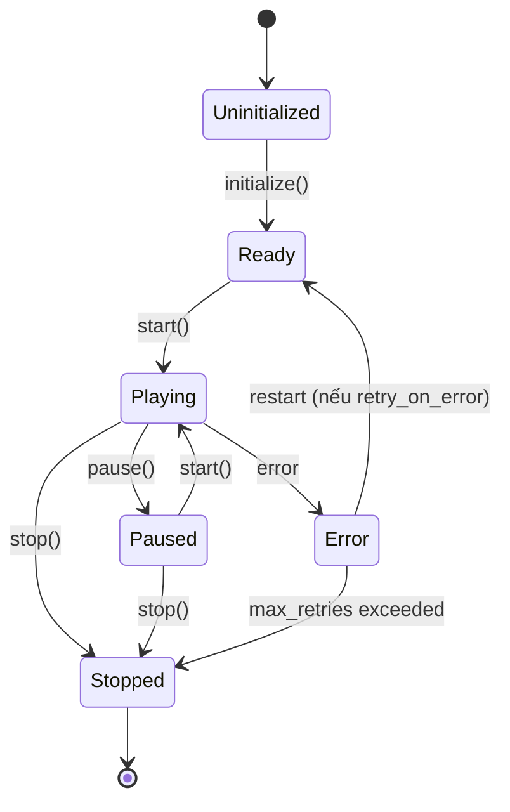
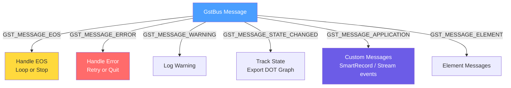

# 06. Runtime Lifecycle — GstBus & Pipeline State Machine

> **Phạm vi**: PipelineState machine, GstBus message routing, signal handling, RTSP reconnection, dynamic stream add/remove, restart logic, debugging.
>
> **Đọc trước**: [03_pipeline_building.md](03_pipeline_building.md) — pipeline phải build xong trước khi runtime lifecycle bắt đầu.

---

## Mục lục

- [06. Runtime Lifecycle — GstBus \& Pipeline State Machine](#06-runtime-lifecycle--gstbus--pipeline-state-machine)
  - [Mục lục](#mục-lục)
  - [1. Tổng quan](#1-tổng-quan)
  - [2. PipelineState Machine](#2-pipelinestate-machine)
    - [State Transitions](#state-transitions)
  - [3. GstBus — Message Routing](#3-gstbus--message-routing)
    - [Message Types](#message-types)
    - [`handle_bus_message()` — Core Handler](#handle_bus_message--core-handler)
  - [4. Signal Handling — Graceful Shutdown](#4-signal-handling--graceful-shutdown)
  - [5. RTSP Source Reconnection](#5-rtsp-source-reconnection)
  - [6. Dynamic Stream Add/Remove](#6-dynamic-stream-addremove)
    - [6.1 `nvmultiurisrcbin` path](#61-nvmultiurisrcbin-path)
    - [6.2 Manual `nvurisrcbin + nvstreammux` path](#62-manual-nvurisrcbin--nvstreammux-path)
  - [7. Restart Logic](#7-restart-logic)
  - [8. PipelineInfo Query](#8-pipelineinfo-query)
  - [9. Debugging Runtime Issues](#9-debugging-runtime-issues)
    - [Common Runtime Errors](#common-runtime-errors)
  - [Tham chiếu chéo](#tham-chiếu-chéo)

---

## 1. Tổng quan

Sau khi pipeline được build, `PipelineManager` quản lý **toàn bộ vòng đời runtime**:

- Transition qua `PipelineState` machine
- Xử lý messages từ `GstBus` (EOS, Error, State changes, Custom)
- Graceful shutdown theo SIGINT/SIGTERM
- Error recovery (retry logic)

---

## 2. PipelineState Machine



| State           | Meaning                      | GStreamer State     |
| --------------- | ---------------------------- | ------------------- |
| `Uninitialized` | Trước `initialize()`         | —                   |
| `Ready`         | Build thành công, chưa play  | `GST_STATE_READY`   |
| `Playing`       | Pipeline đang xử lý video    | `GST_STATE_PLAYING` |
| `Paused`        | Tạm dừng (buffer giữ nguyên) | `GST_STATE_PAUSED`  |
| `Stopped`       | `set_state(NULL)` đã gọi     | `GST_STATE_NULL`    |
| `Error`         | Không recover được           | —                   |

### State Transitions

```cpp
bool PipelineManager::start() {
    if (state_ != PipelineState::Ready && state_ != PipelineState::Paused) {
        LOG_W("Cannot start from state: {}", to_string(state_.load()));
        return false;
    }

    GstStateChangeReturn ret = gst_element_set_state(pipeline_, GST_STATE_PLAYING);
    if (ret == GST_STATE_CHANGE_FAILURE) {
        LOG_E("gst_element_set_state(PLAYING) failed");
        state_ = PipelineState::Error;
        return false;
    }

    state_ = PipelineState::Playing;
    LOG_I("Pipeline '{}' → PLAYING", config_name_);
    return true;
}

bool PipelineManager::stop() {
    LOG_I("Stopping pipeline '{}'", config_name_);

    // 1. Remove bus watch trước
    if (bus_watch_id_ != 0) {
        g_source_remove(bus_watch_id_);
        bus_watch_id_ = 0;
    }

    // 2. Set NULL → giải phóng resources
    if (pipeline_) {
        gst_element_set_state(pipeline_, GST_STATE_NULL);
        gst_object_unref(pipeline_);
        pipeline_ = nullptr;
    }

    state_ = PipelineState::Stopped;
    return true;
}
```

> 🔒 **Thứ tự cleanup**: Luôn `g_source_remove(bus_watch_id_)` **trước** `set_state(NULL)` — tránh callback chạy trên pipeline đang bị hủy.

---

## 3. GstBus — Message Routing

`GstBus` là kênh giao tiếp giữa pipeline thread và application. `PipelineManager` đăng ký `watch` callback:

```cpp
bool PipelineManager::initialize(PipelineConfig& config, GMainLoop* loop) {
    // ... build pipeline ...
    GstBus* bus = gst_element_get_bus(pipeline_);
    bus_watch_id_ = gst_bus_add_watch(bus,
        [](GstBus*, GstMessage* msg, gpointer data) -> gboolean {
            return static_cast<PipelineManager*>(data)->handle_bus_message(msg);
        }, this);
    gst_object_unref(bus);
    main_loop_ = loop;
    state_ = PipelineState::Ready;
    return true;
}
```

### Message Types



### `handle_bus_message()` — Core Handler

```cpp
gboolean PipelineManager::handle_bus_message(GstBus*, GstMessage* msg) {
    switch (GST_MESSAGE_TYPE(msg)) {

    case GST_MESSAGE_EOS:
        LOG_I("EOS received on pipeline '{}'", config_name_);
        if (config_.sources.loop_on_eos) {
            gst_element_seek_simple(pipeline_, GST_FORMAT_TIME,
                GST_SEEK_FLAG_FLUSH, 0);
        } else {
            stop();
            if (main_loop_) g_main_loop_quit(main_loop_);
        }
        break;

    case GST_MESSAGE_ERROR: {
        GError* err = nullptr;
        gchar* debug_info = nullptr;
        gst_message_parse_error(msg, &err, &debug_info);

        { std::lock_guard<std::mutex> lock(error_mutex_);
          last_error_ = fmt::format("{}: {}",
              err->message, debug_info ? debug_info : ""); }

        LOG_E("GStreamer ERROR from '{}': {}",
              GST_OBJECT_NAME(msg->src), last_error_);
        g_clear_error(&err);
        g_free(debug_info);

        state_ = PipelineState::Error;

        if (config_.pipeline.retry_on_error &&
            retry_count_ < config_.pipeline.max_retries) {
            ++retry_count_;
            LOG_W("Restart ({}/{})", retry_count_, config_.pipeline.max_retries);
            schedule_restart();
        } else {
            stop();
            if (main_loop_) g_main_loop_quit(main_loop_);
        }
        break;
    }

    case GST_MESSAGE_STATE_CHANGED: {
        if (GST_MESSAGE_SRC(msg) == GST_OBJECT(pipeline_)) {
            GstState old_state, new_state, pending;
            gst_message_parse_state_changed(msg, &old_state, &new_state, &pending);
            LOG_D("Pipeline state: {} → {}",
                gst_element_state_get_name(old_state),
                gst_element_state_get_name(new_state));

            if (new_state == GST_STATE_PLAYING &&
                !config_.pipeline.dot_file_dir.empty()) {
                GST_DEBUG_BIN_TO_DOT_FILE(GST_BIN(pipeline_),
                    GST_DEBUG_GRAPH_SHOW_ALL, config_.pipeline.id.c_str());
            }
        }
        break;
    }

    case GST_MESSAGE_APPLICATION: {
        const GstStructure* s = gst_message_get_structure(msg);
        const gchar* name = gst_structure_get_name(s);
        if (g_strcmp0(name, "SmartRecordStarted") == 0)
            handle_smart_record_started(s);
        else if (g_strcmp0(name, "SmartRecordStopped") == 0)
            handle_smart_record_stopped(s);
        else if (g_strcmp0(name, "StreamAdded") == 0)
            handle_stream_added(s);
        else if (g_strcmp0(name, "StreamRemoved") == 0)
            handle_stream_removed(s);
        break;
    }

    default: break;
    }
    return TRUE;  // Giữ watch (FALSE = remove)
}
```

---

## 4. Signal Handling — Graceful Shutdown

```cpp
// app/main.cpp
static void setup_signal_handlers(PipelineManager* mgr, GMainLoop* loop) {
    static SignalContext ctx{mgr, loop};

    auto handler = [](int sig) {
        LOG_I("Received signal {} — graceful shutdown", sig);
        ctx.manager->stop();
        if (ctx.loop) g_main_loop_quit(ctx.loop);
    };

    std::signal(SIGINT, handler);   // Ctrl+C
    std::signal(SIGTERM, handler);  // docker stop / systemctl stop
}
```

> 📋 **Docker stop**: Sends SIGTERM → handler gọi `stop()` → `set_state(NULL)` → clean exit.

---

## 5. RTSP Source Reconnection

`nvmultiurisrcbin` hỗ trợ auto-reconnect — không cần manual reconnect logic:

```yaml
sources:
  rtsp_reconnect_interval: 10 # Retry sau 10 giây
  rtsp_reconnect_attempts: -1 # -1 = retry forever
```

**Luồng**: Camera mất kết nối → `nvmultiurisrcbin` phát GstMessage lên bus → `PipelineManager` log warning → auto reconnect sau interval.

---

## 6. Dynamic Stream Add/Remove

VMS Engine hiện có **2 đường runtime source management**:

- `type: nvmultiurisrcbin` -> DeepStream CivetWeb REST server quản lý camera động.
- `type: nvurisrcbin` -> engine tự quản lý source bins + mux request pads qua `PipelineManager` và `RuntimeStreamManager`.

### 6.1 `nvmultiurisrcbin` path

`nvmultiurisrcbin` tích hợp CivetWeb HTTP server cho **runtime camera management** mà không restart pipeline.

```yaml
sources:
  rest_api_port: 9000 # 0=disable, >0=enable
  drop_pipeline_eos: true # BẮT BUỘC khi dynamic add/remove
  max_batch_size: 8 # ≥ tổng cameras tối đa
```

```bash
# Add camera
curl -XPOST 'http://localhost:9000/api/v1/stream/add' \
  -H 'Content-Type: application/json' \
  -d '{"key":"sensor","value":{"camera_id":"camera-03",
       "camera_url":"rtsp://192.168.1.103:554/stream",
       "change":"camera_add"}}'

# Remove camera
curl -XPOST 'http://localhost:9000/api/v1/stream/remove' \
  -H 'Content-Type: application/json' \
  -d '{"key":"sensor","value":{"camera_id":"camera-03",
       "camera_url":"rtsp://192.168.1.103:554/stream",
       "change":"camera_remove"}}'
```

> ⚠️ **DS8 SIGSEGV**: `ip-address` property gây crash — server luôn bind `0.0.0.0`. Xem [10_rest_api.md](10_rest_api.md).

### 6.2 Manual `nvurisrcbin + nvstreammux` path

Manual mode không dùng DeepStream REST của `nvmultiurisrcbin`. Thay vào đó, `PipelineManager` gọi `RuntimeStreamManager` để:

- tạo `srcbin_<camera_id>` bằng cùng builder contract như source static
- giữ `nvstreammux.sink_%u` cố định qua một `source_slot_<index>` trung gian
- link/unlink source ghost pad vào slot thay vì chạm trực tiếp mux request pad
- giữ mapping `camera.id <-> source slot index`
- theo dõi buffer activity của từng source active để cô lập source bị stall

```cpp
bool PipelineManager::add_source(const CameraConfig& camera) {
    return runtime_stream_manager_ && runtime_stream_manager_->add_stream(camera);
}

bool PipelineManager::remove_source(const std::string& camera_id) {
    return runtime_stream_manager_ && runtime_stream_manager_->remove_stream(camera_id);
}
```

Lifecycle chi tiết của manual path hiện tại:

1. Startup tạo fixed slots tới `sources.mux.max_sources` hoặc `sources.mux.batch_size`.
2. Slot không có camera thật để `idle` bằng `active-pad = nullptr`.
3. Add camera mới:
   - build `srcbin_<camera_id>` và link vào slot,
   - giữ selector ở placeholder trước,
   - attach buffer probe lên source src pad,
   - khi có decoded buffer đầu tiên thì mới switch selector sang live.
4. Poll health định kỳ trong `RuntimeStreamManager`:
   - nếu source active không ra buffer quá lâu, switch slot về placeholder và mark state `recovering`,
   - khi buffer quay lại, source tự được restore sang live mà không cần restart pipeline.
5. Remove camera:
   - switch slot về placeholder,
   - unlink source khỏi slot,
   - đưa source về `GST_STATE_NULL`, remove khỏi bin, release runtime registry entry,
   - giữ lại fixed slot và mux request pad cho reuse lần sau.

> 📋 **Capacity rule**: manual runtime add/remove vẫn bị chặn bởi `sources.mux.max_sources` và `sources.mux.batch_size` đã allocate lúc build pipeline. Không có auto-grow cho standalone mux sau khi pipeline đã chạy.

> 📋 **Head-of-line blocking mitigation**: với `sources.mux.sync_inputs=true`, steady-state output thường mượt hơn khi mọi source khỏe. Để tránh một RTSP source bị đứt/lag kéo cả pipeline, manual path hiện cô lập source stall ở `source_slot_<index>` bằng placeholder tạm thời thay vì để mux chờ vô hạn. Cách này giữ được lợi ích của `sync_inputs=true` nhưng giảm blast radius của một source lỗi.

> 📋 **Operational rule**: nếu đang dùng live RTSP ở manual mode, hãy ưu tiên giữ `sources.mux.config_file_path` tắt cho tới khi file mux được tune đúng theo FPS thực tế. Runtime add/remove vẫn hoạt động khi không dùng file config ngoài cho mux.

---

## 7. Restart Logic

```cpp
void PipelineManager::schedule_restart() {
    // g_timeout — defer restart khỏi bus callback thread (tránh deadlock)
    g_timeout_add_seconds(2, [](gpointer data) -> gboolean {
        auto* self = static_cast<PipelineManager*>(data);
        LOG_I("Restarting pipeline...");
        gst_element_set_state(self->pipeline_, GST_STATE_NULL);
        gst_element_set_state(self->pipeline_, GST_STATE_PLAYING);
        self->state_ = PipelineState::Playing;
        return G_SOURCE_REMOVE;  // Chỉ run một lần
    }, this);
}
```

> ⚠️ **Không restart trực tiếp** trong bus callback — dùng `g_timeout_add_seconds` để defer, tránh deadlock trên pipeline thread.

---

## 8. PipelineInfo Query

```cpp
PipelineInfo PipelineManager::get_info() const {
    return PipelineInfo{
        .id     = config_id_,
        .name   = config_name_,
        .state  = state_.load(),
        .last_error = [&] {
            std::lock_guard<std::mutex> lock(error_mutex_);
            return last_error_;
        }(),
        .uptime_seconds = std::chrono::duration_cast<std::chrono::seconds>(
            std::chrono::steady_clock::now() - start_time_).count()
    };
}
```

---

## 9. Debugging Runtime Issues

```bash
# Monitor state transitions
GST_DEBUG="GST_STATES:4" ./build/bin/vms_engine -c configs/default.yml

# Monitor bus messages
GST_DEBUG="GST_BUS:4" ./build/bin/vms_engine -c configs/default.yml

# DeepStream elements (verbose)
GST_DEBUG="nvinfer:5,nvtracker:4,nvmultiurisrcbin:3,nvurisrcbin:4,nvstreammux:4" ./build/bin/vms_engine ...

# GDB pipeline state
(gdb) p gst_element_get_state(pipeline_, nullptr, nullptr, 0)
```

### Common Runtime Errors

| GStreamer Message                 | Nguyên nhân                     | Fix                                   |
| --------------------------------- | ------------------------------- | ------------------------------------- |
| `Could not decode stream`         | Codec không supported           | Check CUDA/codec, GPU driver          |
| `Internal data stream error`      | Buffer overflow / decode fail   | Giảm `batch_size`, tăng queue buffers |
| `Failed to connect to RTSP`       | Camera offline                  | Kiểm tra `rtsp_reconnect_interval`    |
| `nvdsinfer: Failed to init model` | TensorRT engine fail            | Check TRT version, `.engine` file     |
| `nvtracker: Failed to init`       | Tracker `.so` không tương thích | Check `DEEPSTREAM_DIR` + tracker path |

---

## Tham chiếu chéo

| Tài liệu                                                   | Liên quan                                                |
| ---------------------------------------------------------- | -------------------------------------------------------- |
| [02_core_interfaces.md](02_core_interfaces.md)             | IPipelineManager interface, PipelineState enum           |
| [03_pipeline_building.md](03_pipeline_building.md)         | Pipeline phải build xong trước runtime                   |
| [05_configuration.md](05_configuration.md)                 | `pipeline.retry_on_error`, `pipeline.max_retries` config |
| [07_event_handlers_probes.md](07_event_handlers_probes.md) | SmartRecord messages trên GstBus                         |
| [10_rest_api.md](10_rest_api.md)                           | CivetWeb REST API chi tiết                               |
| [../RAII.md](../RAII.md)                                   | GstBus cleanup patterns                                  |
