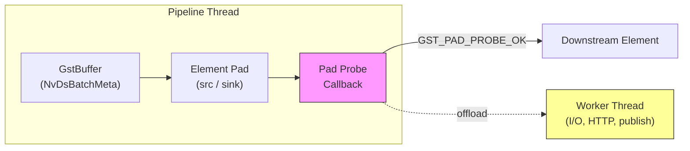
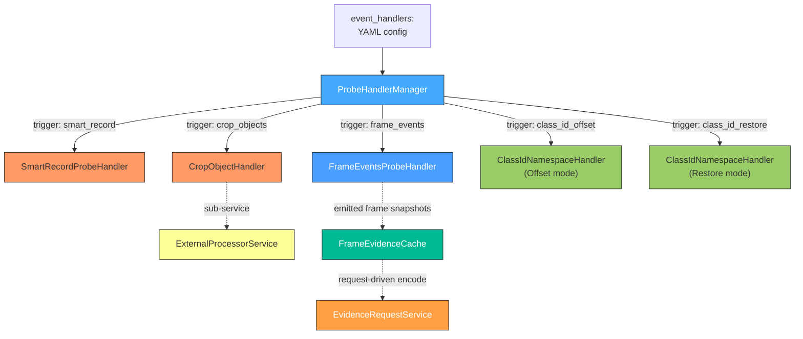
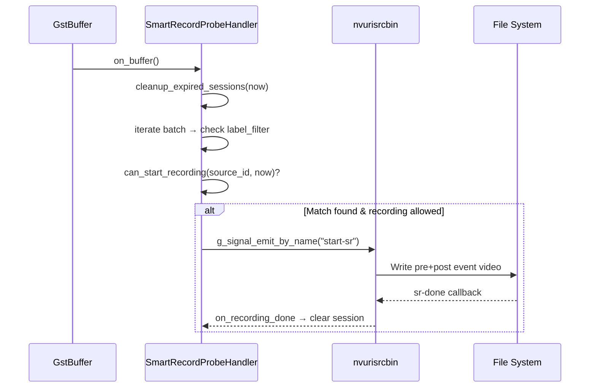
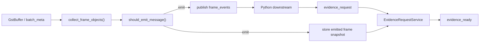
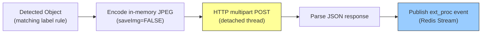
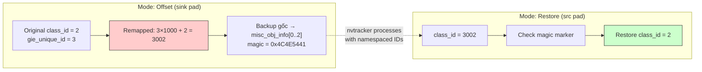
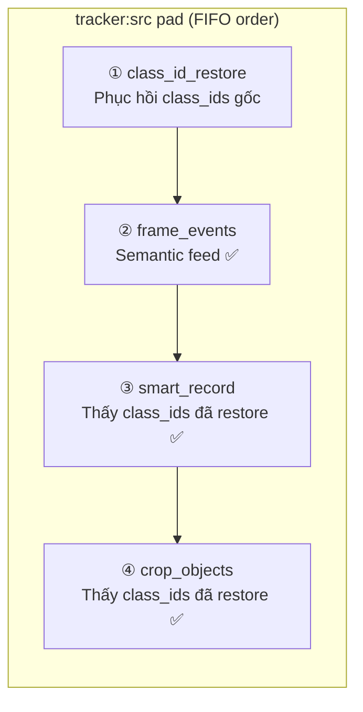

# 07. Pad Probes & Event Handlers

> **Scope**: GStreamer pad probe architecture — `ProbeHandlerManager` dispatch, 5 built-in handlers, YAML schema, callback rules.
>
> **Đọc trước**: [03 — Pipeline Building](03_pipeline_building.md) · [06 — Runtime Lifecycle](06_runtime_lifecycle.md)

---

## Mục lục

- [1. Tổng quan](#1-tổng-quan)
- [2. ProbeHandlerManager](#2-probehandlermanager)
- [3. Built-in Probe Handlers](#3-built-in-probe-handlers)
- [3.1 SmartRecordProbeHandler](#31-smartrecordprobehandler)
- [3.2 FrameEventsProbeHandler](#32-frameeventsprobehandler)
- [3.3 CropObjectHandler](#33-cropobjecthandler)
- [3.4 ExternalProcessorService](#34-externalprocessorservice)
- [3.5 ClassIdNamespaceHandler](#35-classidnamespacehandler)
- [4. EventHandlerConfig — YAML Schema](#4-eventhandlerconfig--yaml-schema)
- [5. Probe Ordering — GStreamer FIFO](#5-probe-ordering--gstreamer-fifo)
- [6. Adding a New Probe Handler](#6-adding-a-new-probe-handler)
- [7. Probe Callback Rules](#7-probe-callback-rules)
- [8. Cross-references](#8-cross-references)

---

## 1. Tổng quan

vms-engine dùng **GStreamer pad probes** làm cơ chế duy nhất để can thiệp vào pipeline buffer stream. Signal-based handlers (`g_signal_connect`) đã bị loại bỏ hoàn toàn.



> ⚠️ **Performance Rule**: Probe callback chạy **trực tiếp trên pipeline streaming thread** — phải nhanh, không block I/O, không lock mutex lâu. Offload heavy work sang worker thread.

### Handler Overview



| Handler                    | Trigger            | Pad    | Mục đích                                          |
| -------------------------- | ------------------ | ------ | ------------------------------------------------- |
| `SmartRecordProbeHandler`  | `smart_record`     | `src`  | Trigger recording khi phát hiện object khớp label |
| `FrameEventsProbeHandler`  | `frame_events`     | `src`  | Canonical semantic feed theo camera-frame         |
| `CropObjectHandler`        | `crop_objects`     | `src`  | Crop object → JPEG, publish JSON metadata         |
| `ExternalProcessorService` | _(sub của crop)_   | —      | HTTP AI enrichment (face-rec, plate lookup…)      |
| `ClassIdNamespaceHandler`  | `class_id_offset`  | `sink` | Remap class_id tránh collision multi-detector     |
| `ClassIdNamespaceHandler`  | `class_id_restore` | `src`  | Phục hồi class_id gốc                             |

---

## 2. ProbeHandlerManager

`ProbeHandlerManager` là coordinator trung tâm — đọc `EventHandlerConfig` từ YAML, tạo handler theo `trigger`, attach lên pad của `probe_element`.

```cpp
// pipeline/include/engine/pipeline/probes/probe_handler_manager.hpp
namespace engine::pipeline::probes {

class ProbeHandlerManager {
public:
    explicit ProbeHandlerManager(GstElement* pipeline);

    /// Attach probes từ event_handler configs.
    bool attach_probes(
        const engine::core::config::PipelineConfig& config,
        engine::core::messaging::IMessageProducer* producer,
        engine::pipeline::evidence::FrameEvidenceCache* cache);

    /// Remove tất cả probes (gọi trước pipeline teardown).
    void detach_all();
};
}
```

### Dispatch Logic

`attach_probes()` dựa vào `cfg.trigger` để tạo handler phù hợp:

```cpp
if (cfg.trigger == "smart_record") {
    auto* handler = new SmartRecordProbeHandler();
    handler->configure(cfg);
    gst_pad_add_probe(pad, GST_PAD_PROBE_TYPE_BUFFER,
        SmartRecordProbeHandler::on_buffer, handler,
        [](gpointer ud) { delete static_cast<SmartRecordProbeHandler*>(ud); });

} else if (cfg.trigger == "crop_objects") {
    auto* handler = new CropObjectHandler();
    handler->configure(cfg);
    gst_pad_add_probe(pad, GST_PAD_PROBE_TYPE_BUFFER,
        CropObjectHandler::on_buffer, handler,
        [](gpointer ud) { delete static_cast<CropObjectHandler*>(ud); });

} else if (cfg.trigger == "frame_events") {
    auto* handler = new FrameEventsProbeHandler();
    handler->configure(config, cfg, producer, cache);
    gst_pad_add_probe(pad, GST_PAD_PROBE_TYPE_BUFFER,
        FrameEventsProbeHandler::on_buffer, handler,
        [](gpointer ud) { delete static_cast<FrameEventsProbeHandler*>(ud); });

} else if (cfg.trigger == "class_id_offset") {
    auto* handler = new ClassIdNamespaceHandler();
    handler->configure(full_config_, ClassIdNamespaceHandler::Mode::Offset, elem_index);
    // ...

} else if (cfg.trigger == "class_id_restore") {
    auto* handler = new ClassIdNamespaceHandler();
    handler->configure(full_config_, ClassIdNamespaceHandler::Mode::Restore);
    // ...
}
```

> 📋 **Ownership**: Handler instance ownership được transfer sang GStreamer qua `GDestroyNotify` callback — GStreamer tự `delete` khi remove probe. Không cần lifecycle management thêm.

> 📋 **`pad_name` field**: `ProbeHandlerManager` đọc `cfg.pad_name` (default `"src"`) để lấy đúng pad. `class_id_offset` cần `pad_name: sink` vì phải chạy **trước** `nvtracker` xử lý metadata.

---

## 3. Built-in Probe Handlers

### 3.1 SmartRecordProbeHandler

Trigger smart recording khi phát hiện object khớp `label_filter`. Phát `start-sr` GSignal trực tiếp trên `nvurisrcbin` bên trong `nvmultiurisrcbin`.



**Core structs:**

```cpp
struct RecordingSession {
    uint32_t session_id = 0;
    GstClockTime start_time = GST_CLOCK_TIME_NONE;
    uint32_t duration_sec = 0;
};

struct SourceRecordingState {
    GstClockTime last_record_time = GST_CLOCK_TIME_NONE;
    std::optional<RecordingSession> active_session;
    gulong signal_handler_id = 0;
};
```

**Cải tiến v1 → v2:**

| Feature          | v1                          | v2 (hiện tại)                                 |
| ---------------- | --------------------------- | --------------------------------------------- |
| Timing           | `std::chrono::steady_clock` | `GstClockTime` (gst_system_clock)             |
| Interval ref     | detection time              | `actual_start = now - pre_event_ns`           |
| Stale cache      | không kiểm tra              | evict nếu element không còn trong bin         |
| Max concurrent   | không có                    | `max_concurrent_recordings` config field      |
| Expired sessions | không có                    | `cleanup_expired_sessions()` với grace period |
| Teardown safety  | không có                    | `shutting_down_` atomic flag                  |

**`on_buffer` flow:**

1. Check `shutting_down_` → return sớm nếu đang tắt
2. `get_gst_clock_now()` → lấy `GstClockTime now` một lần cho cả batch
3. `cleanup_expired_sessions(now)` → dọn sessions thiếu sr-done
4. `gst_buffer_get_nvds_batch_meta(buf)` → lấy batch metadata
5. Iterate frame → object → check `label_filter_`
6. `can_start_recording(source_id, now)` → active_session + min_interval + max_concurrent
7. Match → `start_recording(source_id, object_id, now)`
8. `on_recording_done` callback → clear `active_session`, publish `record_done`

> 📖 **Deep-dive**: [probes/smart_record_probe_handler.md](../probes/smart_record_probe_handler.md)

---

### 3.2 FrameEventsProbeHandler

`FrameEventsProbeHandler` publish đúng một semantic message cho mỗi source frame được chọn phát, rồi handoff frame snapshot sang `FrameEvidenceCache` để phục vụ `evidence_request` về sau.



| Chủ đề                  | `FrameEventsProbeHandler` |
| ----------------------- | ------------------------- |
| Publish unit            | One camera-frame          |
| Semantic payload        | Có                        |
| JPEG encode trong probe | Không                     |
| Cache emitted frame     | Có                        |
| Evidence workflow       | Request-driven            |

> 📖 **Deep-dive**: [probes/frame_events_probe_handler.md](../probes/frame_events_probe_handler.md)

---

### 3.3 CropObjectHandler

Crop detected objects từ GPU frame thành ảnh JPEG sử dụng **NvDsObjEnc** CUDA-accelerated encoder. Publish metadata JSON đến Redis Streams.

```mermaid
flowchart TB
    subgraph "on_buffer (streaming thread)"
        SYNC["cudaDeviceSynchronize()"]
        ITER["Iterate frame → object"]
        DEC["decide_capture() + compute_payload_hash()"]
        ENC["nvds_obj_enc_process()<br/>(queue CUDA encode)"]
        ACC["Accumulate PendingMessage"]
        EXT["ext_proc_svc_→process_object()<br/>(detached thread)"]
        FIN["nvds_obj_enc_finish()<br/>(block until all JPEG done)"]
        PUB["publish_pending_messages()<br/>(Redis/Kafka)"]
    end

    SYNC --> ITER --> DEC --> ENC --> ACC --> EXT --> FIN --> PUB

    style SYNC fill:#fcc,stroke:#333
    style FIN fill:#fcc,stroke:#333
    style PUB fill:#9cf,stroke:#333
```



**Publish decision system:**

```cpp
enum class PubDecisionType { None, FirstSeen, Heartbeat };

struct ObjectPubState {
    GstClockTime last_publish_pts = GST_CLOCK_TIME_NONE;
    uint64_t heartbeat_seq = 0;
    std::size_t last_payload_hash = 0;  // dedup
    std::string last_message_id;        // mid chain
};
```

**State maps (4 tổng cộng):**

| Map                 | Key        | Value          | Mục đích                     |
| ------------------- | ---------- | -------------- | ---------------------------- |
| `object_keys_`      | tracker_id | UUIDv7 string  | Persistent ID cho mỗi object |
| `object_last_seen_` | tracker_id | GstClockTime   | Stale detection              |
| `last_capture_pts_` | tracker_id | GstClockTime   | PTS throttle per object      |
| `pub_state_`        | tracker_id | ObjectPubState | Dedup + message chain        |

**Cải tiến v1 → v2:**

| Feature          | v1                   | v2 (hiện tại)                                     |
| ---------------- | -------------------- | ------------------------------------------------- |
| Publish decision | Capture = publish    | `PubDecisionType` (FirstSeen/Heartbeat/None)      |
| Heartbeat dedup  | không có             | Payload hash — suppress duplicate heartbeat       |
| Publish timing   | Ngay khi encode      | Batch-accumulate → `finish()` → publish           |
| Message ID chain | không có             | `mid` + `prev_mid` cho event correlation          |
| Stale cleanup    | 3 maps               | 4 maps (thêm `pub_state_`)                        |
| Emergency limit  | 10000                | 5000 (stricter)                                   |
| File naming      | `crop_{tid}_{uuid8}` | `crop_{label}_{tid}_{uuid8}` (sanitized label)    |
| ext_processor    | không parse          | `ExtProcessorConfig` → `ExternalProcessorService` |

> 📖 **Deep-dive**: [probes/crop_object_handler.md](../probes/crop_object_handler.md)

---

### 3.4 ExternalProcessorService

Sub-service tích hợp bên trong `CropObjectHandler` — thực hiện **HTTP-based AI enrichment** cho từng detected object.



| Feature         | Detail                                                       |
| --------------- | ------------------------------------------------------------ |
| Thread model    | **Detached thread** — không block GStreamer streaming thread |
| Throttle        | Per `(source_id, tracker_id, label)` key                     |
| JPEG encoding   | NvDsObjEnc riêng (engine context), `saveImg=FALSE`           |
| Config location | Sub-block `ext_processor:` trong `event_handlers` entry      |
| Publish channel | `event: ext_proc` đến Redis Stream                           |

> 📖 **Deep-dive**: [probes/ext_proc_svc.md](../probes/ext_proc_svc.md)

---

### 3.5 ClassIdNamespaceHandler

Giải quyết **class_id collision** trong multi-detector pipelines (PGIE + nhiều SGIE). Hai chế độ hoạt động:



| Mode      | Trigger YAML       | Pad    | Mục đích                                             |
| --------- | ------------------ | ------ | ---------------------------------------------------- |
| `Offset`  | `class_id_offset`  | `sink` | Remap `class_id → (gie_unique_id × 1000) + class_id` |
| `Restore` | `class_id_restore` | `src`  | Phục hồi `class_id` gốc từ `misc_obj_info[]`         |

> 📋 **Magic marker**: Giá trị gốc được lưu trong `misc_obj_info[0..2]` của `NvDsObjectMeta` với magic `0x4C4E5441` ("LNTA") để xác nhận data integrity khi restore.

> 📖 **Deep-dive**: [probes/class_id_namespacing_handler.md](../probes/class_id_namespacing_handler.md)

---

## 4. EventHandlerConfig — YAML Schema

```yaml
event_handlers:
  # ── Class ID Namespace (phải đứng trước smart_record/crop_objects) ──
  - id: class_id_offset
    enable: false
    type: on_detect
    probe_element: tracker
    pad_name: sink              # attach input pad (trước nvtracker)
    trigger: class_id_offset

  - id: class_id_restore
    enable: false
    type: on_detect
    probe_element: tracker
    pad_name: src
    trigger: class_id_restore

  # ── Smart Record ──
  - id: smart_record
    enable: true
    type: on_detect
    probe_element: tracker
    source_element: nvmultiurisrcbin0
    trigger: smart_record
    label_filter: [car, person, truck]
    pre_event_sec: 2
    post_event_sec: 20
    min_interval_sec: 30
    max_concurrent_recordings: 2
    channel: vms:events:smart_record

    # ── Frame Events ──
    - id: frame_events
        enable: true
        type: on_detect
        probe_element: tracker
        pad_name: src
        trigger: frame_events
        channel: worker_lsr_frame_events
        label_filter: [person, car, truck, helmet, head, hands, foot, smoke, flame]
        frame_events:
            heartbeat_interval_ms: 1000
            min_emit_gap_ms: 250
            motion_iou_threshold: 0.85
            center_shift_ratio_threshold: 0.05
            emit_on_first_frame: true
            emit_on_object_set_change: true
            emit_on_label_change: true
            emit_on_parent_change: true
            emit_empty_frames: false

  # ── Crop Objects ──
  - id: crop_objects
    enable: true
    type: on_detect
    probe_element: tracker
    trigger: crop_objects
    label_filter: [car, person, truck]
    save_dir: "/opt/engine/data/rec/objects"
    capture_interval_sec: 5
    image_quality: 85
    save_full_frame: true
    channel: worker_lsr_snap
    cleanup:
      stale_object_timeout_min: 5
      check_interval_batches: 30
      old_dirs_max_days: 7
    ext_processor:
      enable: false
      min_interval_sec: 1
      rules:
        - label: face
          endpoint: http://localhost:8000/api/v1/face/recognize
          result_path: match.external_id
          display_path: match.face_name
          params:
            threshold: "0.65"
```

### Field Reference

**Common fields (tất cả handlers):**

| Field           | Type     | Required | Notes                                                           |
| --------------- | -------- | -------- | --------------------------------------------------------------- |
| `id`            | string   | ✅       | Unique across all handlers                                      |
| `enable`        | bool     | ✅       | `false` = handler bị skip hoàn toàn                             |
| `type`          | string   | ✅       | Event category, e.g. `on_detect`                                |
| `probe_element` | string   | ✅       | Element name trong pipeline để attach probe                     |
| `pad_name`      | string   | —        | `"src"` (default) hoặc `"sink"`                                 |
| `trigger`       | string   | ✅       | `smart_record` / `frame_events` / `crop_objects` / `class_id_*` |
| `label_filter`  | string[] | —        | Empty = tất cả labels match                                     |
| `channel`       | string   | —        | Redis Stream / Kafka topic; empty = không publish               |

**SmartRecord-specific:**

| Field                       | Type   | Default | Notes                                |
| --------------------------- | ------ | ------- | ------------------------------------ |
| `source_element`            | string | —       | ✅ Required — tên `nvmultiurisrcbin` |
| `pre_event_sec`             | int    | 2       | Buffer pre-event (giây)              |
| `post_event_sec`            | int    | 20      | Thời gian record sau trigger         |
| `min_interval_sec`          | int    | 2       | Min giây giữa recordings per source  |
| `max_concurrent_recordings` | int    | 0       | 0 = unlimited                        |

**FrameEvents-specific:**

| Field                                       | Type   | Default | Notes                                    |
| ------------------------------------------- | ------ | ------- | ---------------------------------------- |
| `frame_events.heartbeat_interval_ms`        | int    | 1000    | Heartbeat semantic khi scene ổn định     |
| `frame_events.min_emit_gap_ms`              | int    | 250     | Chặn burst do jitter                     |
| `frame_events.motion_iou_threshold`         | double | 0.85    | Ngưỡng `motion_change` theo IoU          |
| `frame_events.center_shift_ratio_threshold` | double | 0.05    | Ngưỡng `motion_change` theo center shift |
| `frame_events.emit_on_first_frame`          | bool   | true    | Emit ngay frame đầu tiên có detection    |
| `frame_events.emit_on_object_set_change`    | bool   | true    | Emit khi tập object đổi                  |
| `frame_events.emit_on_label_change`         | bool   | true    | Emit khi label hoặc class đổi            |
| `frame_events.emit_on_parent_change`        | bool   | true    | Emit khi parent-child đổi                |
| `frame_events.emit_empty_frames`            | bool   | false   | Mặc định không phát frame rỗng           |

**CropObjects-specific:**

| Field                              | Type   | Default | Notes                                 |
| ---------------------------------- | ------ | ------- | ------------------------------------- |
| `save_dir`                         | string | —       | Thư mục output cho crop images        |
| `capture_interval_sec`             | int    | 5       | PTS-based throttle per object         |
| `image_quality`                    | int    | 85      | JPEG quality 1–100                    |
| `save_full_frame`                  | bool   | true    | Lưu full-frame kèm crop               |
| `cleanup.stale_object_timeout_min` | int    | 5       | Xóa state object sau N phút unseen    |
| `cleanup.check_interval_batches`   | int    | 30      | Chạy cleanup mỗi N batches            |
| `cleanup.old_dirs_max_days`        | int    | 7       | Xóa daily dirs cũ hơn N ngày; 0 = off |

**ExtProcessor sub-block:**

| Field                            | Type     | Default | Notes                                              |
| -------------------------------- | -------- | ------- | -------------------------------------------------- |
| `ext_processor.enable`           | bool     | false   | Enable external processor                          |
| `ext_processor.min_interval_sec` | int      | 1       | Min giây giữa ext processor calls                  |
| `ext_processor.rules[]`          | object[] | —       | label, endpoint, result_path, display_path, params |

---

## 5. Probe Ordering — GStreamer FIFO

GStreamer thực thi probes trên cùng một pad theo **thứ tự đăng ký (FIFO)** — chính là thứ tự entries trong `event_handlers:`.



> ⚠️ **Critical**: Nếu `class_id_restore` đứng **sau** `frame_events`/`smart_record`/`crop_objects`, các handler sẽ thấy class_ids bị offset → `label_filter` **KHÔNG khớp** → không trigger được.

> 📋 **Rule**: `class_id_offset` attach trên `sink` pad (trước tracker xử lý). `class_id_restore` + các handler khác attach trên `src` pad (sau tracker xử lý). Restore **PHẢI** đứng đầu trong list các probes cùng pad.

---

## 6. Adding a New Probe Handler

**4 bước để thêm handler mới:**

**Step 1** — Header file:

```cpp
// pipeline/include/engine/pipeline/probes/my_probe_handler.hpp
#pragma once
#include "engine/core/config/config_types.hpp"
#include <gst/gst.h>

namespace engine::pipeline::probes {

/**
 * @brief Pad probe handler for <task description>.
 */
class MyProbeHandler {
public:
    void configure(const engine::core::config::EventHandlerConfig& config);

    static GstPadProbeReturn on_buffer(
        GstPad* pad, GstPadProbeInfo* info, gpointer user_data);

private:
    std::vector<std::string> label_filter_;
};

}  // namespace engine::pipeline::probes
```

**Step 2** — Implementation:

```
pipeline/src/probes/my_probe_handler.cpp
```

**Step 3** — Register in `ProbeHandlerManager`:

```cpp
// pipeline/src/probes/probe_handler_manager.cpp — attach_probes()
else if (cfg.trigger == "my_trigger") {
    auto* handler = new MyProbeHandler();
    handler->configure(cfg);
    gst_pad_add_probe(pad, GST_PAD_PROBE_TYPE_BUFFER,
        MyProbeHandler::on_buffer, handler,
        [](gpointer ud) { delete static_cast<MyProbeHandler*>(ud); });
}
```

**Step 4** — YAML config:

```yaml
event_handlers:
  - id: my_handler
    enable: true
    type: on_detect
    probe_element: tracker
    trigger: my_trigger
    label_filter: [person]
```

---

## 7. Probe Callback Rules

```cpp
static GstPadProbeReturn on_buffer(
    GstPad*, GstPadProbeInfo* info, gpointer user_data)
{
    auto* self = static_cast<MyProbeHandler*>(user_data);
    GstBuffer* buf = GST_PAD_PROBE_INFO_BUFFER(info);
    NvDsBatchMeta* meta = gst_buffer_get_nvds_batch_meta(buf);
    if (!meta) return GST_PAD_PROBE_OK;

    for (NvDsMetaList* fl = meta->frame_meta_list; fl; fl = fl->next) {
        auto* frame = static_cast<NvDsFrameMeta*>(fl->data);
        for (NvDsMetaList* ol = frame->obj_meta_list; ol; ol = ol->next) {
            auto* obj = static_cast<NvDsObjectMeta*>(ol->data);
            // process object...
        }
    }
    return GST_PAD_PROBE_OK;
}
```

| Rule                                            | Detail                                                                        |
| ----------------------------------------------- | ----------------------------------------------------------------------------- |
| ✅ Return `GST_PAD_PROBE_OK`                    | Trừ khi intentionally dropping buffer                                         |
| ✅ `GST_PAD_PROBE_INFO_BUFFER(info)`            | Lấy buffer — **KHÔNG** take ownership                                         |
| ✅ `NvDsBatchMeta` / `FrameMeta` / `ObjectMeta` | **DO NOT FREE** — pipeline owns                                               |
| ❌ Blocking I/O                                 | Không file write, HTTP, mutex wait trên callback — offload sang worker thread |
| ❌ `gst_buffer_ref()`                           | Không ref buffer trừ khi có matching `unref()`                                |

---

## 8. Cross-references

| Topic                         | Document                                                                            |
| ----------------------------- | ----------------------------------------------------------------------------------- |
| SmartRecord probe deep-dive   | [probes/smart_record_probe_handler.md](../probes/smart_record_probe_handler.md)     |
| CropObject probe deep-dive    | [probes/crop_object_handler.md](../probes/crop_object_handler.md)                   |
| ClassId namespacing deep-dive | [probes/class_id_namespacing_handler.md](../probes/class_id_namespacing_handler.md) |
| ExternalProcessor deep-dive   | [probes/ext_proc_svc.md](../probes/ext_proc_svc.md)                                 |
| Pipeline building (5 phases)  | [03 — Pipeline Building](03_pipeline_building.md)                                   |
| Runtime lifecycle & bus       | [06 — Runtime Lifecycle](06_runtime_lifecycle.md)                                   |
| NvDs metadata ownership       | [RAII Guide](../RAII.md)                                                            |
| YAML config full schema       | [05 — Configuration](05_configuration.md)                                           |
