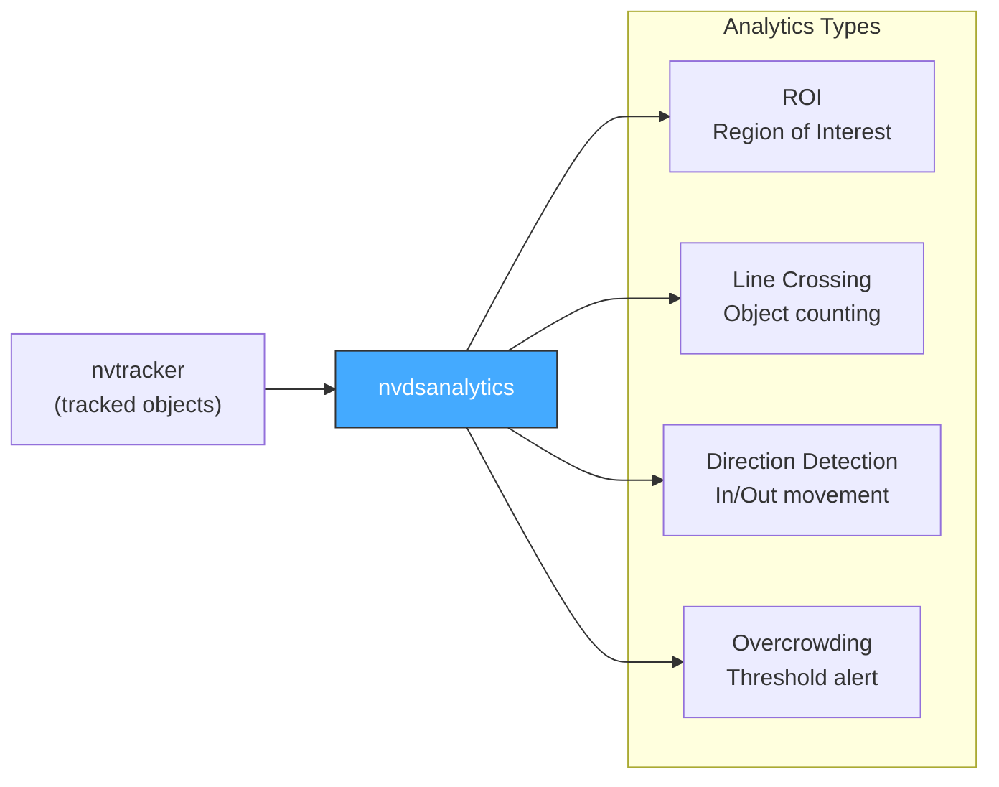
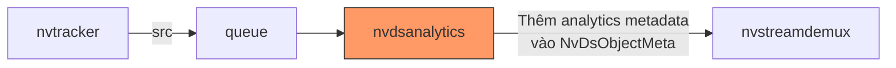
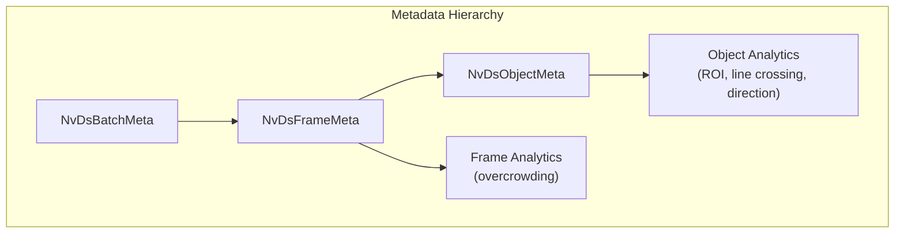

# 08. Analytics — nvdsanalytics

> **Scope**: Stream analytics bằng geometric rules (ROI, line crossing, overcrowding, direction detection) — config format, builder, metadata reading, message broker integration.
>
> **Đọc trước**: [03 — Pipeline Building](03_pipeline_building.md) · [05 — Configuration](05_configuration.md)

---

## Mục lục

- [1. Tổng quan](#1-tổng-quan)
- [2. Vị trí trong Pipeline](#2-vị-trí-trong-pipeline)
- [3. Config File Format (GKeyFile)](#3-config-file-format-gkeyfile)
- [4. YAML Pipeline Config](#4-yaml-pipeline-config)
- [5. AnalyticsBuilder](#5-analyticsbuilder)
- [6. NvDs Analytics Metadata](#6-nvds-analytics-metadata)
- [7. Runtime Config Reload](#7-runtime-config-reload)
- [8. Message Broker Integration](#8-message-broker-integration)
- [9. Performance Considerations](#9-performance-considerations)
- [10. Ví dụ: Parking Lot Analytics](#10-ví-dụ-parking-lot-analytics)
- [11. Cross-references](#11-cross-references)

---

## 1. Tổng quan

`nvdsanalytics` là GStreamer element xử lý **stream analytics** không cần AI inference — dùng geometric rules để detect event patterns:



| Analytics Type              | Mô tả                                        | Use Case                     |
| --------------------------- | --------------------------------------------- | ---------------------------- |
| **ROI (Region of Interest)**| Phát hiện object trong vùng polygon           | Parking zone occupancy       |
| **Line Crossing**           | Đếm objects qua đường thẳng                  | Vehicle entry/exit counting  |
| **Direction Detection**     | Detect hướng di chuyển (vào/ra)               | Gate direction               |
| **Overcrowding**            | Cảnh báo khi số người vượt threshold          | Crowd safety                 |

---

## 2. Vị trí trong Pipeline



> 📋 **Placement Rule**: `nvdsanalytics` **phải đặt sau `nvtracker`** — cần tracking IDs cho line crossing counting và direction detection.

---

## 3. Config File Format (GKeyFile)

`nvdsanalytics` dùng config file riêng (`.txt`) theo GKeyFile format — **tách biệt khỏi YAML pipeline config**:

```ini
# configs/analytics/nvdsanalytics_config.txt

[property]
enable=1
config-width=1920           # Phải match pipeline width
config-height=1080
display-font-size=12
osd-mode=2                  # 0=CPU, 1=GPU, 2=HW

# ── ROI ──────────────────────────────────────────────────
[roi-filtering-stream-0]
enable=1
# Format: roi-<name>=x1;y1;x2;y2;x3;y3;...  (polygon)
roi-0=0;0;400;0;400;400;0;400
roi-1=500;300;900;300;900;600;500;600
class-id=0;2                # 0=person, 2=vehicle; -1=all classes

# ── Line Crossing ────────────────────────────────────────
[line-crossing-stream-0]
enable=1
# Format: line-crossing-<id>=x1;y1;x2;y2;direction
# direction: EW (East-West) | NS (North-South) | ANY
line-crossing-0=960;0;960;1080;ANY
class-id=-1                 # -1 = all classes
mode=balanced               # balanced | strict | loose

# ── Overcrowding ─────────────────────────────────────────
[overcrowding-stream-0]
enable=1
roi-0=0;0;1920;1080         # Toàn frame
class-id=0                  # Chỉ người
object-threshold=10          # Cảnh báo khi > 10 người

# ── Direction Detection ──────────────────────────────────
[direction-detection-stream-0]
enable=1
class-id=2                  # Vehicles
```

**Config conventions:**

| Convention                   | Detail                                               |
| ---------------------------- | ---------------------------------------------------- |
| Section naming               | `[type-stream-N]` — N = source/stream index          |
| Coordinate format            | Semicolon-separated: `x1;y1;x2;y2;...`              |
| Dimensions                   | `config-width`/`config-height` **phải match** pipeline|
| Class ID                     | `-1` = all classes; `0;2` = person + vehicle         |
| Multiple ROIs / lines        | Thêm entries: `roi-0`, `roi-1`, `line-crossing-0`, `line-crossing-1`... |

---

## 4. YAML Pipeline Config

```yaml
processing:
  elements:
    - id: "pgie"
      # ...
    - id: "tracker"
      # ...
    - id: "analytics"
      role: "analytics"
      queue: {}
      enabled: true
      config_file: "configs/analytics/nvdsanalytics_config.txt"
      gpu_id: 0
    - id: "demuxer"
      role: "demuxer"
      # ...
```

> 📋 **Two config files**: `config_file` trong YAML trỏ đến GKeyFile `.txt` riêng cho analytics rules. Đây là pattern DeepStream native — analytics rules quá complex cho inline YAML.

---

## 5. AnalyticsBuilder

```cpp
// pipeline/include/engine/pipeline/builders/analytics_builder.hpp
class AnalyticsBuilder : public IElementBuilder {
public:
    GstElement* build(const PipelineConfig& config,
                      const std::string& id,
                      GstElement* pipeline) override {
        const auto* analytics_cfg = find_by_id(config.processing, id);
        if (!analytics_cfg || !analytics_cfg->enabled) {
            LOG_D("Analytics '{}' disabled, skipping", id);
            return nullptr;
        }

        auto elem = make_gst_element("nvdsanalytics", id.c_str());
        if (!elem) return nullptr;

        g_object_set(G_OBJECT(elem.get()),
            "config-file", analytics_cfg->config_file.c_str(),
            "gpu-id",      analytics_cfg->gpu_id,
            nullptr);

        if (!gst_bin_add(GST_BIN(pipeline), elem.get())) return nullptr;
        LOG_I("nvdsanalytics '{}' built: config={}",
              id, analytics_cfg->config_file);
        return elem.release();  // bin owns
    }
};
```

---

## 6. NvDs Analytics Metadata

Sau khi qua `nvdsanalytics`, metadata được attach vào `NvDsObjectMeta` và `NvDsFrameMeta`:



**Reading analytics trong pad probe:**

```cpp
GstPadProbeReturn read_analytics_probe(
    GstPad*, GstPadProbeInfo* info, gpointer)
{
    auto* buf = GST_PAD_PROBE_INFO_BUFFER(info);
    auto* batch_meta = gst_buffer_get_nvds_batch_meta(buf);

    for (auto* fl = batch_meta->frame_meta_list; fl; fl = fl->next) {
        auto* frame = static_cast<NvDsFrameMeta*>(fl->data);

        // ── Object-level analytics ──
        for (auto* ol = frame->obj_meta_list; ol; ol = ol->next) {
            auto* obj = static_cast<NvDsObjectMeta*>(ol->data);
            auto* analytics_meta = get_analytics_meta(obj);
            if (!analytics_meta) continue;

            // ROI status
            if (analytics_meta->roiStatus) {
                for (const auto& [roi_id, in_roi] : analytics_meta->roiStatus) {
                    if (in_roi)
                        LOG_D("Object {} in ROI {}", obj->object_id, roi_id);
                }
            }

            // Line crossing
            if (analytics_meta->lcStatus) {
                for (const auto& [lc_id, direction] : analytics_meta->lcStatus) {
                    LOG_I("Object {} crossed line {} going {}",
                          obj->object_id, lc_id, direction);
                }
            }

            // Direction
            if (!analytics_meta->dirStatus.empty()) {
                LOG_D("Object {} direction: {}",
                      obj->object_id, analytics_meta->dirStatus);
            }
        }

        // ── Frame-level analytics (overcrowding) ──
        auto* frame_analytics = get_frame_analytics_meta(frame);
        if (frame_analytics && frame_analytics->ocStatus) {
            LOG_W("Overcrowding in stream {}! Objects={}",
                  frame->source_id, frame_analytics->object_count);
        }
    }
    return GST_PAD_PROBE_OK;
}
```

---

## 7. Runtime Config Reload

`nvdsanalytics` hỗ trợ **hot-reload config** khi pipeline đang chạy — không cần restart:

```cpp
void PipelineManager::reload_analytics_config(
    const std::string& new_config_path)
{
    GstElement* analytics = gst_bin_get_by_name(
        GST_BIN(pipeline_), "analytics");
    if (!analytics) {
        LOG_W("Analytics element not found");
        return;
    }

    g_object_set(analytics, "config-file",
                 new_config_path.c_str(), nullptr);
    LOG_I("Analytics config reloaded: {}", new_config_path);

    gst_object_unref(analytics);  // gst_bin_get_by_name increments ref
}
```

> 📋 **Use case**: Thay đổi ROI, thêm/xóa line crossing via REST API → write new config file → call `reload_analytics_config()`. Pipeline không bị gián đoạn.

---

## 8. Message Broker Integration

Analytics events thường được publish tới Redis/Kafka qua `nvmsgconv` + `nvmsgbroker`. Analytics metadata trong `NvDsObjectMeta` được serialize tự động:

```yaml
message_broker:
  enabled: true
  msgconv:
    payload_type: 1          # MINIMAL schema
    config: "configs/msgconv_config.txt"
  broker:
    proto_lib: ".../libnvds_redis_proto.so"
    conn_str: "localhost;6379;vms_events"
    topic: "vms/analytics"
```

**Minimal Payload JSON Output:**

```json
{
  "version": "4.0",
  "type": "object",
  "id": "550e8400-e29b-41d4-a716-446655440000",
  "timestamp": "2024-01-15T10:30:00.000Z",
  "sensorId": "cam_01",
  "object": {
    "id": "1234",
    "confidence": 0.92,
    "bbox": {
      "topleftx": 100, "toplefty": 200,
      "width": 80, "height": 120
    },
    "type": "Person"
  },
  "analyticsModule": {
    "roiStatus": {"zone_entrance": true},
    "lineCrossingStatus": {},
    "overcrowdingStatus": false
  }
}
```

---

## 9. Performance Considerations

| Aspect                     | Detail                                                   |
| -------------------------- | -------------------------------------------------------- |
| Processing mode            | CPU mode đủ cho đa số use cases (process_mode=0)        |
| Latency                    | Rất thấp (~0.1–0.5ms per batch) — không cần GPU inference|
| Scaling                    | Số ROI và lines ảnh hưởng **linear** đến CPU usage       |
| Placement requirement      | **Sau tracker** — cần tracking IDs cho line crossing     |
| Config dimensions          | `config-width`/`config-height` **phải match** pipeline   |

---

## 10. Ví dụ: Parking Lot Analytics

```ini
# Bãi đỗ xe 40 chỗ, 4 khu vực + 1 cổng vào/ra

[property]
enable=1
config-width=1280
config-height=720

# ── 2 ROI zones cho khu đỗ ──
[roi-filtering-stream-0]
enable=1
roi-zone-a=0;400;480;400;480;720;0;720       # Zone A: 20 chỗ góc trái
roi-zone-b=840;400;1280;400;1280;720;840;720  # Zone B: 20 chỗ góc phải
roi-entrance=560;0;720;0;720;300;560;300      # Entrance lane
class-id=2    # Vehicles only

# ── 2 đường counting cho cổng vào/ra ──
[line-crossing-stream-0]
enable=1
line-crossing-entry=560;250;720;250;ANY       # Entry gate (horizontal)
line-crossing-exit=560;50;720;50;ANY          # Exit gate
class-id=2
mode=strict

# ── Overcrowding threshold ──
[overcrowding-stream-0]
enable=1
roi-0=0;0;1280;720
class-id=2
object-threshold=38    # Cảnh báo khi bãi > 95% capacity (40 chỗ)
```

---

## 11. Cross-references

| Topic                        | Document                                               |
| ---------------------------- | ------------------------------------------------------ |
| Pipeline building (5 phases) | [03 — Pipeline Building](03_pipeline_building.md)      |
| YAML config full schema      | [05 — Configuration](05_configuration.md)              |
| Pad probes & event handlers  | [07 — Event Handlers](07_event_handlers_probes.md)     |
| Outputs & message broker     | [09 — Outputs & Smart Record](09_outputs_smart_record.md)|
| Runtime lifecycle            | [06 — Runtime Lifecycle](06_runtime_lifecycle.md)      |
