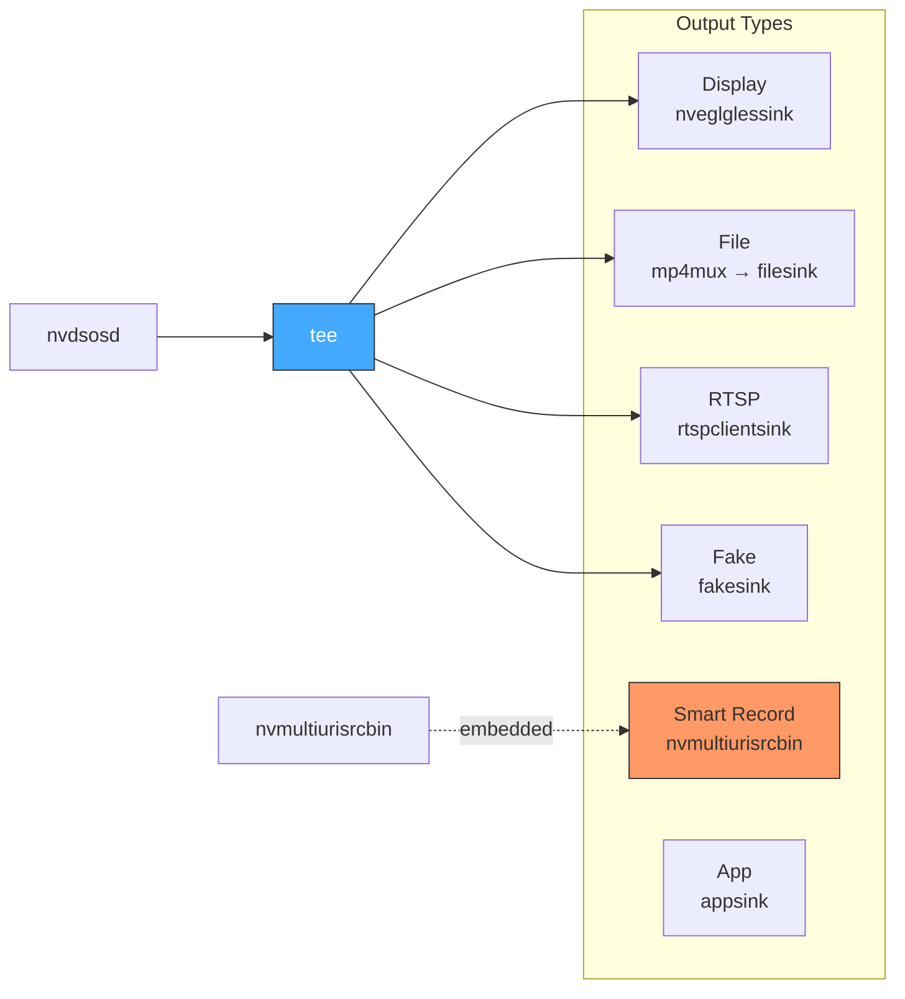
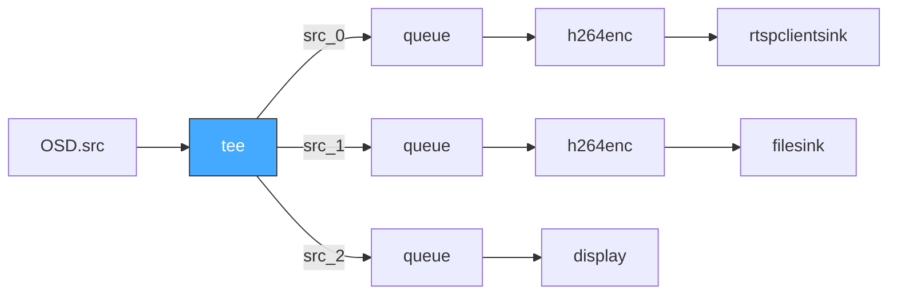
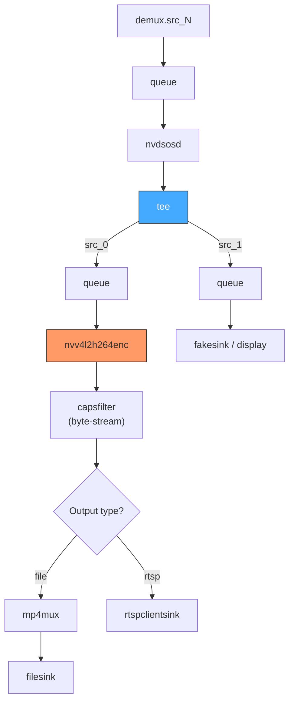

# 09. Outputs — Encoders, Sinks & Smart Record

> **Scope**: Phase 4/5 output pipeline — encoder builders (H.264/H.265), sink types (display/file/RTSP/fake/app), tee branching, Smart Record (NvDsSR) integration.
>
> **Đọc trước**: [03 — Pipeline Building](03_pipeline_building.md) · [05 — Configuration](05_configuration.md) · [07 — Event Handlers](07_event_handlers_probes.md)

---

## Mục lục

- [1. Tổng quan](#1-tổng-quan)
- [2. Encoder Support](#2-encoder-support)
- [3. Sink Builders](#3-sink-builders)
- [4. Tee Element — Multiple Outputs](#4-tee-element--multiple-outputs)
- [5. Smart Record — nvmultiurisrcbin Integration](#5-smart-record--nvmultiurisrcbin-integration)
- [6. Output Pipeline Diagram](#6-output-pipeline-diagram)
- [7. YAML Config Example](#7-yaml-config-example)
- [8. Cross-references](#8-cross-references)

---

## 1. Tổng quan

Phase 4 (Outputs) và Phase 5 (Standalone) xử lý tất cả đầu ra của pipeline:



| Output Type      | GStreamer Element                   | Mô tả                                       |
| ---------------- | ---------------------------------- | -------------------------------------------- |
| **Display**      | `nveglglessink` / `nv3dsink`       | Hiển thị trực tiếp lên màn hình              |
| **File**         | `mp4mux` → `filesink`             | Ghi file MP4/MKV                             |
| **RTSP**         | `rtspclientsink`                   | Stream qua RTSP (push to RTSP server)        |
| **Fake**         | `fakesink`                         | Testing — drop frames                        |
| **Smart Record** | `nvmultiurisrcbin.smart-record`    | Event-triggered recording với pre-buffer     |
| **App**          | `appsink`                          | Custom processing trong code                 |

---

## 2. Encoder Support

### nvv4l2h264enc — H.264 (V4L2)

```cpp
GstElement* EncoderBuilder::build_h264(
    const OutputConfig& cfg, const std::string& id, GstElement* pipeline)
{
    auto enc = make_gst_element("nvv4l2h264enc", id.c_str());
    if (!enc) return nullptr;

    g_object_set(G_OBJECT(enc.get()),
        "bitrate",        (guint) cfg.bitrate,
        "iframeinterval", (guint) cfg.iframeinterval,
        "preset-level",   (guint) cfg.preset_level,     // 1=UltraFast, 4=Medium
        "insert-sps-pps", (gboolean) cfg.insert_sps_pps,// TRUE cho RTSP!
        "maxperf-enable", (gboolean) cfg.maxperf_enable,
        "profile",        (guint) cfg.profile,           // 0=Baseline, 2=High
        nullptr);

    if (!gst_bin_add(GST_BIN(pipeline), enc.get())) return nullptr;
    return enc.release();
}
```

### nvv4l2h265enc — H.265 (HEVC)

```cpp
GstElement* EncoderBuilder::build_h265(
    const OutputConfig& cfg, const std::string& id, GstElement* pipeline)
{
    auto enc = make_gst_element("nvv4l2h265enc", id.c_str());
    if (!enc) return nullptr;

    g_object_set(G_OBJECT(enc.get()),
        "bitrate",           (guint) cfg.bitrate,
        "iframeinterval",    (guint) cfg.iframeinterval,
        "preset-level",      (guint) cfg.preset_level,
        "insert-vps-spspps", TRUE,   // H.265 equivalent of insert-sps-pps
        nullptr);

    if (!gst_bin_add(GST_BIN(pipeline), enc.get())) return nullptr;
    return enc.release();
}
```

**Encoder property reference:**

| Property         | Type  | Notes                                        |
| ---------------- | ----- | -------------------------------------------- |
| `bitrate`        | guint | bps (e.g. 4000000 = 4 Mbps)                 |
| `iframeinterval` | guint | Keyframe interval (frames)                   |
| `preset-level`   | guint | 1=UltraFast … 4=Medium                       |
| `insert-sps-pps` | bool  | **TRUE required** for RTSP streaming         |
| `maxperf-enable` | bool  | Max hardware throughput                      |
| `profile`        | guint | H.264: 0=Baseline, 2=High                   |

> ⚠️ **RTSP Requirement**: `insert-sps-pps` (H.264) / `insert-vps-spspps` (H.265) **PHẢI là TRUE** cho RTSP output — nếu không, RTSP client không decode được.

---

## 3. Sink Builders

### 3.1 Display Sink

```cpp
GstElement* SinkBuilder::build_display(
    const SinkConfig& cfg, const std::string& id, GstElement* pipeline)
{
    auto sink = make_gst_element("nveglglessink", id.c_str());
    if (!sink) {
        // Fallback cho headless/embedded
        LOG_W("nveglglessink unavailable, using fakesink for '{}'", id);
        sink = make_gst_element("fakesink", id.c_str());
    }

    if (sink) {
        g_object_set(G_OBJECT(sink.get()),
            "sync", (gboolean) cfg.sync, nullptr);
    }

    if (!gst_bin_add(GST_BIN(pipeline), sink.get())) return nullptr;
    return sink.release();
}
```

### 3.2 File Sink

Pipeline chain: `[encoder] → mp4mux → filesink`

```cpp
GstElement* SinkBuilder::build_file(
    const SinkConfig& cfg, const std::string& id, GstElement* pipeline)
{
    // 1. Muxer
    auto mux = make_gst_element("mp4mux", (id + "_mux").c_str());
    g_object_set(G_OBJECT(mux.get()),
        "faststart",         TRUE,
        "fragment-duration", 2000,  // ms — fragmented MP4
        nullptr);
    gst_bin_add(GST_BIN(pipeline), mux.get());

    // 2. File sink
    auto sink = make_gst_element("filesink", id.c_str());
    g_object_set(G_OBJECT(sink.get()),
        "location", cfg.location.c_str(),
        "sync",     FALSE,
        "async",    FALSE,
        nullptr);

    if (!gst_bin_add(GST_BIN(pipeline), sink.get())) return nullptr;
    gst_element_link(mux.get(), sink.get());

    return mux.release();  // trả về mux để linker connect encoder → mux
}
```

### 3.3 RTSP Sink

```cpp
GstElement* SinkBuilder::build_rtsp(
    const SinkConfig& cfg, const std::string& id, GstElement* pipeline)
{
    auto sink = make_gst_element("rtspclientsink", id.c_str());
    if (sink) {
        g_object_set(G_OBJECT(sink.get()),
            "location",  cfg.rtsp_location.c_str(),
            "protocols", GST_RTSP_LOWER_TRANS_TCP,
            "latency",   (guint) 200,
            nullptr);
    }

    if (!gst_bin_add(GST_BIN(pipeline), sink.get())) return nullptr;
    return sink.release();
}
```

> 📋 **RTSP Push**: `rtspclientsink` **push** tới RTSP server (e.g. mediamtx, GStreamer RTSP Server). Cần RTSP server running trước khi pipeline start.

---

## 4. Tee Element — Multiple Outputs

Khi cần nhiều outputs từ cùng một stream, dùng `tee` element:



```cpp
bool OutputsBuilder::build_with_tee(
    const OutputGroupConfig& group,
    GstElement* upstream_tail,
    GstElement* pipeline)
{
    auto tee = make_gst_element("tee", group.tee_id.c_str());
    gst_bin_add(GST_BIN(pipeline), tee.get());
    linker_->link(upstream_tail, tee.get());

    for (const auto& sink_cfg : group.sinks) {
        // Queue trước mỗi branch (REQUIRED với tee)
        auto q = make_queue(sink_cfg.id + "_q", defaults_);
        gst_bin_add(GST_BIN(pipeline), q.get());

        // Request pad từ tee → link tới queue
        GstPad* tee_src = gst_element_request_pad_simple(tee.get(), "src_%u");
        GstPad* q_sink  = gst_element_get_static_pad(q.get(), "sink");
        gst_pad_link(tee_src, q_sink);
        gst_object_unref(tee_src);
        gst_object_unref(q_sink);

        // Build encoder (if needed) + sink
        if (sink_cfg.needs_encoding()) {
            auto enc = encoder_builder_->build(config_, sink_cfg.id + "_enc", pipeline);
            linker_->link(q.get(), enc);
            GstElement* sink = build_sink(sink_cfg, pipeline);
            linker_->link(enc, sink);
        } else {
            GstElement* sink = build_sink(sink_cfg, pipeline);
            linker_->link(q.get(), sink);
        }
    }
    return true;
}
```

> 📋 **Queue required**: Mỗi branch sau tee **PHẢI có queue** — tee có separate threads per branch, queue làm buffer giữa chúng. Thiếu queue → deadlock hoặc starvation.

---

## 5. Smart Record — nvmultiurisrcbin Integration

Smart Record **embedded trong `nvmultiurisrcbin`** — không phải element tách biệt. Config và trigger qua GObject properties và signals.

### 5.1 Configuration

```yaml
sources:
  id: "src_muxer"
  smart_record: 1                 # 0=off, 1=audio+video, 2=video-only
  smart_rec_dir_path: "dev/rec"
  smart_rec_file_prefix: "sr_"
  smart_rec_cache: 20             # Pre-event buffer (seconds)
  smart_rec_default_duration: 60  # Auto-stop sau N seconds
```

### 5.2 Pre-event Buffer

```mermaid
gantt
    title Smart Record Timeline
    dateFormat X
    axisFormat %s

    section Buffer
    Pre-event buffer (luôn trong RAM) :done, 0, 20
    section Recording
    Trigger event                      :milestone, 20, 0
    Post-event recording               :active, 20, 80
    section File
    Output file (pre + post)           :crit, 0, 80
```



> 📋 **Lý do hữu ích**: Smart Record **tự động buffer** `smart_rec_cache` seconds trước khi trigger. Khi `start_record()` gọi, file chứa cả video **trước** sự kiện — rất quan trọng cho security monitoring.

### 5.3 Trigger via NvDsSR API

```cpp
#include <gst-nvdssr.h>

class SmartRecordHandler {
public:
    bool initialize(GstElement* src_element) {
        src_ = src_element;
        g_object_get(src_, "nvdssr-context", &sr_ctx_, nullptr);
        if (!sr_ctx_) {
            LOG_E("Could not get NvDsSRContext");
            return false;
        }

        g_signal_connect(src_, "sr-done",
            G_CALLBACK(on_sr_done_static), this);
        return true;
    }

    NvDsSRSessionId start_record(uint32_t stream_id,
                                  uint32_t duration = 0)
    {
        NvDsSRSessionId session_id = 0;
        NvDsSRStatus ret = NvDsSRStart(
            sr_ctx_, &session_id, stream_id,
            duration > 0 ? duration : config_.default_duration_sec,
            nullptr);

        if (ret != NVDSSR_STATUS_OK) {
            LOG_E("NvDsSRStart failed stream={}: ret={}",
                  stream_id, ret);
            return 0;
        }

        LOG_I("Smart record STARTED: stream={}, session={}, duration={}s",
              stream_id, session_id, duration);
        return session_id;
    }

    bool stop_record(NvDsSRSessionId session_id) {
        NvDsSRStatus ret = NvDsSRStop(sr_ctx_, session_id);
        if (ret != NVDSSR_STATUS_OK) {
            LOG_E("NvDsSRStop failed: session={}", session_id);
            return false;
        }
        return true;
    }

private:
    static void on_sr_done_static(
        GstElement*, NvDsSRRecordingInfo* info, gpointer data)
    {
        auto* self = static_cast<SmartRecordHandler*>(data);
        self->on_sr_done(info);
    }

    void on_sr_done(NvDsSRRecordingInfo* info) {
        LOG_I("Smart record file ready: path={}, stream={}, "
              "duration={}s, size={}MB",
              info->filename, info->source_id,
              info->duration, info->file_size / 1024 / 1024);

        event_publisher_->publish({
            .type = "smart_record_done",
            .stream_id = std::to_string(info->source_id),
            .file_path = info->filename,
            .duration_sec = info->duration
        });
    }

    NvDsSRContext*    sr_ctx_ = nullptr;
    GstElement*       src_    = nullptr;
    SmartRecordConfig config_;
    IMessageProducer* event_publisher_;
};
```

---

## 6. Output Pipeline Diagram



---

## 7. YAML Config Example

```yaml
outputs:
  - stream_id: "0"
    tee_id: "output_tee_0"
    sinks:
      # ── Display (development) ──
      - id: "display_0"
        type: "display"
        enabled: true
        sync: false

      # ── RTSP output ──
      - id: "rtsp_0"
        type: "rtsp"
        enabled: true
        rtsp_location: "rtsp://localhost:8554/stream0"
        codec: "h264"
        bitrate: 4000000        # 4 Mbps
        iframeinterval: 30
        preset_level: 1         # UltraFast
        insert_sps_pps: true    # Required cho RTSP!

      # ── File recording ──
      - id: "file_0"
        type: "file"
        enabled: false
        location: "dev/rec/output_%05d.mp4"
        codec: "h264"
        bitrate: 6000000        # 6 Mbps

  - stream_id: "1"
    sinks:
      - id: "display_1"
        type: "display"
```

---

## 8. Cross-references

| Topic                        | Document                                                                        |
| ---------------------------- | ------------------------------------------------------------------------------- |
| Pipeline building (5 phases) | [03 — Pipeline Building](03_pipeline_building.md)                               |
| Linking & tee branching      | [04 — Linking System](04_linking_system.md)                                     |
| YAML config full schema      | [05 — Configuration](05_configuration.md)                                       |
| Pad probes & Smart Record    | [07 — Event Handlers](07_event_handlers_probes.md)                              |
| SmartRecord probe deep-dive  | [probes/smart_record_probe_handler.md](../probes/smart_record_probe_handler.md) |
| RAII for GStreamer resources  | [RAII Guide](../RAII.md)                                                        |
