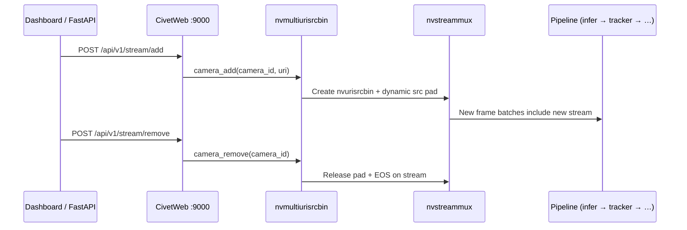
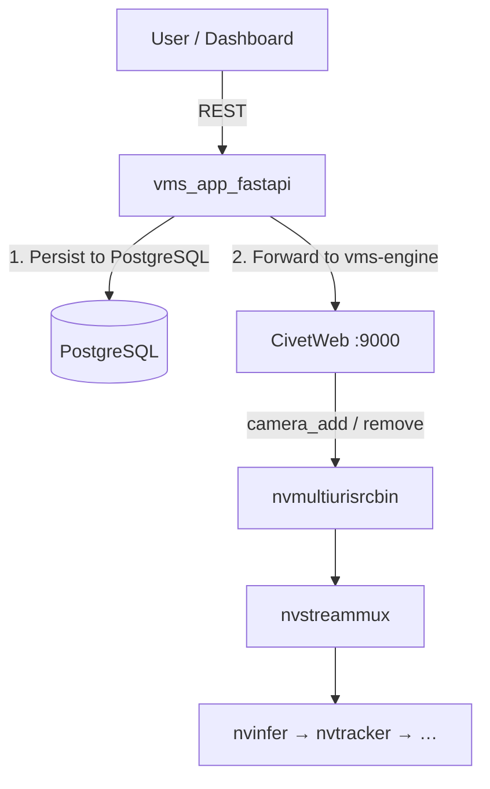

# 10. DeepStream REST API — Quản lý Stream Động

> **Scope**: CivetWeb HTTP server embedded trong `nvmultiurisrcbin` — dynamic camera add/remove trong khi pipeline đang chạy.
>
> Khi pipeline dùng manual mode `type: nvurisrcbin`, tài liệu này **không áp dụng trực tiếp**; runtime add/remove lúc đó đi qua `RuntimeStreamManager` trong engine thay vì DeepStream REST.
>
> **Đọc trước**: [05 — Configuration](05_configuration.md) · [06 — Runtime Lifecycle](06_runtime_lifecycle.md)

---

## Mục lục

- [1. Tổng quan](#1-tổng-quan)
- [2. Cấu hình YAML](#2-cấu-hình-yaml)
- [3. Endpoints](#3-endpoints)
- [4. Hành vi quan trọng](#4-hành-vi-quan-trọng)
- [5. Tích hợp FastAPI Backend](#5-tích-hợp-fastapi-backend)
- [6. Static vs Dynamic Sources](#6-static-vs-dynamic-sources)
- [7. Xử lý lỗi & Debug](#7-xử-lý-lỗi--debug)
- [8. Cross-references](#8-cross-references)

---

## 1. Tổng quan

`nvmultiurisrcbin` tích hợp sẵn **HTTP server** (CivetWeb / `nvds_rest_server`) cho phép thêm/bỏ camera **mà không restart pipeline**.



| Attribute      | Value                                             |
| -------------- | ------------------------------------------------- |
| HTTP Server    | CivetWeb (`nvds_rest_server`)                     |
| Protocol       | HTTP/1.1 (không TLS)                              |
| Default port   | `9000`                                            |
| Bind address   | `0.0.0.0` (tất cả interfaces, **không đổi được**) |
| Disable        | `rest_api_port: 0`                                |
| Available from | DeepStream 6.2+                                   |

> ⚠️ **DS8 SIGSEGV**: Property `ip-address` trên `nvmultiurisrcbin` **luôn gây SIGSEGV** trong DeepStream 8.0 khi set qua `g_object_set`. Server luôn bind `0.0.0.0` — **KHÔNG** thêm `ip_address` vào YAML hay C++ code.

---

## 2. Cấu hình YAML

```yaml
sources:
  type: nvmultiurisrcbin

  # REST API: 0 = disable, >0 = bind trên port đó
  rest_api_port: 9000 # bật REST API
  # rest_api_port: 0            # tắt REST API (mặc định)

  max_batch_size: 8 # ≥ tổng camera tối đa (static + dynamic)
  drop_pipeline_eos: true # BẮT BUỘC khi dùng dynamic add/remove
  mode: 0
```

> 📋 **Type conversion**: `rest_api_port` là **integer** trong YAML nhưng được convert sang **string** cho `g_object_set` (GStreamer property `port` là type `gchararray`).

> 📋 **`max_batch_size`**: Phải ≥ tổng số camera tối đa (gồm camera khởi động + camera add sau). Request add vượt quá batch sẽ bị từ chối.

> 📋 **Vì sao?** `nvmultiurisrcbin` vẫn bị ràng buộc bởi mux batch-size nội bộ. Dù add/remove là dynamic, số source active đồng thời vẫn chỉ tới mức batch-size đã set sẵn lúc build pipeline.

---

## 3. Endpoints

Base URL: `http://<host>:<rest_api_port>`

### 3.1 Stream Add

```
POST /api/v1/stream/add
Content-Type: application/json
```

```json
{
  "key": "sensor",
  "value": {
    "camera_id": "camera-03",
    "camera_url": "rtsp://192.168.1.103:554/stream",
    "change": "camera_add"
  }
}
```

| Field               | Required | Mô tả                                                      |
| ------------------- | -------- | ---------------------------------------------------------- |
| `value.camera_id`   | ✅       | ID duy nhất cho camera — dùng để track và remove           |
| `value.camera_url`  | ✅       | RTSP URI hoặc file URI                                     |
| `value.change`      | ✅       | **Phải chứa substring `"add"`** — e.g. `"camera_add"`      |
| `value.camera_name` | ❌       | Tên hiển thị (accept nhưng bị ignore bởi nvmultiurisrcbin) |
| `value.metadata`    | ❌       | Metadata tùy chỉnh (accept nhưng bị ignore)                |

### 3.2 Stream Remove

```
POST /api/v1/stream/remove
Content-Type: application/json
```

```json
{
  "key": "sensor",
  "value": {
    "camera_id": "camera-03",
    "camera_url": "rtsp://192.168.1.103:554/stream",
    "change": "camera_remove"
  }
}
```

| Field              | Required | Mô tả                                                       |
| ------------------ | -------- | ----------------------------------------------------------- |
| `value.camera_id`  | ✅       | ID camera muốn remove (phải match với lúc add)              |
| `value.camera_url` | ✅       | URI (nên match với lúc add)                                 |
| `value.change`     | ✅       | **Phải chứa substring `"remove"`** — e.g. `"camera_remove"` |

### 3.3 Stream Info (DS 7.0+)

```
GET /api/v1/stream/info
```

Returns list of currently active streams.

### 3.4 Pipeline Readiness (DS 8.0+)

```
GET /api/v1/stream/readiness
```

Returns whether the pipeline is ready to accept streams.

**cURL examples:**

```bash
# Add stream
curl -XPOST 'http://localhost:9000/api/v1/stream/add' \
  -H 'Content-Type: application/json' \
  -d '{"key":"sensor","value":{"camera_id":"cam03","camera_url":"rtsp://host/s","change":"camera_add"}}'

# Remove stream
curl -XPOST 'http://localhost:9000/api/v1/stream/remove' \
  -H 'Content-Type: application/json' \
  -d '{"key":"sensor","value":{"camera_id":"cam03","camera_url":"rtsp://host/s","change":"camera_remove"}}'

# Check readiness
curl 'http://localhost:9000/api/v1/stream/readiness'
```

---

## 4. Hành vi quan trọng

### 4.1 Quy tắc `change` field

`value.change` được NVIDIA match bằng **substring**:

| Value             | Action    | Vì sao                          |
| ----------------- | --------- | ------------------------------- |
| `"camera_add"`    | ✅ Add    | Chứa `"add"`                    |
| `"add_camera"`    | ✅ Add    | Chứa `"add"`                    |
| `"camera_remove"` | ✅ Remove | Chứa `"remove"`                 |
| `"remove_camera"` | ✅ Remove | Chứa `"remove"`                 |
| `"update"`        | ❌ Ignore | Không chứa `"add"` / `"remove"` |

### 4.2 Pad reuse

Khi stream bị remove rồi add stream mới → pad ID cũ được **reuse** — pipeline topology không thay đổi.

### 4.3 `drop_pipeline_eos` bắt buộc

```yaml
sources:
  drop_pipeline_eos: true # BẮT BUỘC
```

> ⚠️ Nếu thiếu `drop_pipeline_eos: true` — khi camera cuối cùng bị remove (EOS), **pipeline tắt hoàn toàn** và không nhận add request tiếp.

---

## 5. Tích hợp FastAPI Backend



```python
import httpx

DEEPSTREAM_REST_BASE = "http://vms-engine-host:9000"

async def add_camera_to_pipeline(camera_id: str, camera_url: str) -> bool:
    payload = {
        "key": "sensor",
        "value": {
            "camera_id": camera_id,
            "camera_url": camera_url,
            "change": "camera_add",
        }
    }
    async with httpx.AsyncClient() as client:
        resp = await client.post(
            f"{DEEPSTREAM_REST_BASE}/api/v1/stream/add",
            json=payload, timeout=10.0)
    return resp.status_code == 200

async def remove_camera_from_pipeline(camera_id: str, camera_url: str) -> bool:
    payload = {
        "key": "sensor",
        "value": {
            "camera_id": camera_id,
            "camera_url": camera_url,
            "change": "camera_remove",
        }
    }
    async with httpx.AsyncClient() as client:
        resp = await client.post(
            f"{DEEPSTREAM_REST_BASE}/api/v1/stream/remove",
            json=payload, timeout=10.0)
    return resp.status_code == 200
```

---

## 6. Static vs Dynamic Sources

| Approach        | Khi nào dùng                        | Cấu hình                                 |
| --------------- | ----------------------------------- | ---------------------------------------- |
| **Static list** | Biết trước tất cả cameras khi start | `cameras:` section trong YAML            |
| **Dynamic add** | Cameras thay đổi lúc runtime        | REST API `/api/v1/stream/add`            |
| **Kết hợp**     | Start với 1–2, thêm sau             | YAML `cameras:` + REST API — cả hai work |

> 📋 Static cameras auto-add qua `uri-list` property khi pipeline start. REST API add thêm on top.

> 📋 Nếu repo đang chạy `type: nvurisrcbin`, dynamic add/remove dùng `PipelineManager::add_source()` / `remove_source()` và `RuntimeStreamManager`, nhưng giới hạn concurrent source vẫn là `sources.max_batch_size` vì giá trị đó map sang `nvstreammux.batch-size`.

---

## 7. Xử lý lỗi & Debug

### Response codes

| HTTP Status | Ý nghĩa                              |
| ----------- | ------------------------------------ |
| `200`       | Stream đã được add/remove thành công |
| `4xx`       | Payload thiếu mandatory fields       |
| `5xx`       | Internal DeepStream error            |

> 📋 REST API nvmultiurisrcbin **không trả body JSON chi tiết** — chỉ có status code.

### Port conflict

```
cannot bind to 9000: 98 (Address already in use)
CivetException caught: null context when constructing CivetServer
```

Fix: đổi `rest_api_port: 9001` hoặc disable `rest_api_port: 0`.

### Debug commands

```bash
# GStreamer debug — REST server logs
GST_DEBUG="nvmultiurisrcbin:4" ./build/bin/vms_engine -c configs/default.yml

# Kiểm tra port listening
ss -tlnp | grep 9000

# Test readiness (DS 8.0+)
curl 'http://localhost:9000/api/v1/stream/readiness'
```

---

## 8. Cross-references

| Topic                                   | Document                                                                                                                    |
| --------------------------------------- | --------------------------------------------------------------------------------------------------------------------------- |
| Source builder & nvmultiurisrcbin props | [03 — Pipeline Building](03_pipeline_building.md)                                                                           |
| YAML full schema                        | [05 — Configuration](05_configuration.md)                                                                                   |
| Runtime lifecycle & bus events          | [06 — Runtime Lifecycle](06_runtime_lifecycle.md)                                                                           |
| Smart Record via nvmultiurisrcbin       | [09 — Outputs & Smart Record](09_outputs_smart_record.md)                                                                   |
| NVIDIA docs — nvmultiurisrcbin          | [DeepStream Plugin Guide](https://docs.nvidia.com/metropolis/deepstream/dev-guide/text/DS_plugin_gst-nvmultiurisrcbin.html) |
| NVIDIA docs — REST Server               | [DS REST Server](https://docs.nvidia.com/metropolis/deepstream/dev-guide/text/DS_RestServer.html)                           |
