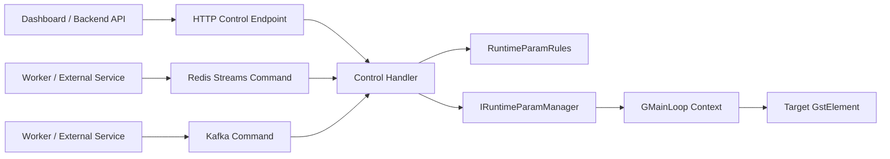

# 11. Runtime Element Control — Điều Khiển Property Lúc Pipeline Đang Chạy

> **Scope**: runtime control cho các GStreamer/DeepStream element properties khi pipeline đang chạy, không reload YAML, không rebuild topology.
>
> **Use case đầu tiên**: bật/tắt overlay của `nvdsosd` qua `display-bbox` và `display-text`.

---

## Mục lục

- [1. Nên dùng gì](#1-nên-dùng-gì)
- [2. Không nên dùng gì](#2-không-nên-dùng-gì)
- [3. Điều kiện tiên quyết](#3-điều-kiện-tiên-quyết)
- [4. Kiến trúc đề xuất](#4-kiến-trúc-đề-xuất)
- [5. Use case 1 — Runtime control cho `nvdsosd`](#5-use-case-1--runtime-control-cho-nvdsosd)
- [6. API và message contract đề xuất](#6-api-và-message-contract-đề-xuất)
- [7. Các bước triển khai trong codebase hiện tại](#7-các-bước-triển-khai-trong-codebase-hiện-tại)
- [8. Quy tắc persistence](#8-quy-tắc-persistence)
- [9. Decision matrix](#9-decision-matrix)

---

## 1. Nên dùng gì

### Khuyến nghị chính

**Dùng `IRuntimeParamManager` làm lõi để set/get trực tiếp GObject properties của element đang tồn tại trong pipeline.**

Tức là:

- YAML chỉ giữ **startup defaults**
- runtime control đi qua **element id + property + value**
- API, Redis Streams, Kafka chỉ là **transport** đi vào cùng một lõi xử lý

### Northbound transport nên dùng

**Ưu tiên HTTP API** nếu nhu cầu chính là:

- dashboard bật/tắt tính năng theo thao tác người dùng
- service backend gọi đồng bộ và cần kết quả ngay
- cần semantics kiểu `read current state` và `set new state`

**Redis Streams hoặc Kafka nên là transport bổ sung** khi:

- control đến từ service khác theo kiểu async
- cần queueing / replay / decoupling
- engine không trực tiếp host HTTP API

---

## 2. Không nên dùng gì

### Không dùng DeepStream REST API embedded cho runtime property control

Tài liệu [10_rest_api.md](10_rest_api.md) áp dụng cho **dynamic add/remove stream** của `nvmultiurisrcbin`. Nó không phải control plane cho arbitrary element properties như `nvdsosd.display-bbox`, `nvv4l2h264enc.bitrate`, hoặc `nvtracker.compute-hw`.

### Không sửa YAML rồi restart pipeline cho các toggle nhỏ

Cách này:

- làm gián đoạn stream
- tăng latency vận hành
- trộn lẫn startup config với runtime state

### Không phụ thuộc vào tên element nội bộ hardcode

Runtime control chỉ ổn định khi element có **id do config khai báo**. Ví dụ với source block, nên dùng `sources.id: sources` thay vì dựa vào tên cứng như `nvmultiurisrcbin0`.

---

## 3. Điều kiện tiên quyết

Để runtime control mở rộng được cho nhiều element về sau, nên giữ ba nguyên tắc:

### 3.1 Mỗi element cần một id ổn định

- `processing.elements[].id`
- `visuals.elements[].id`
- `outputs[].elements[].id`
- `sources.id`

### 3.2 Property names phải normalize rõ ràng

API có thể nhận:

- `display_bbox`
- `display_text`

Nhưng runtime layer phải map về GStreamer property thực:

- `display-bbox`
- `display-text`

### 3.3 Việc set property phải chạy đúng thread/context

Nếu control request đi vào từ thread REST consumer hoặc message consumer, nên marshal thao tác `g_object_set()` về GLib main context của pipeline.

---

## 4. Kiến trúc đề xuất



### Nguyên tắc quan trọng

- **Một lõi duy nhất** cho mọi update runtime
- **Transport-agnostic** ở lớp control
- **Id-based lookup** thay vì hardcoded element names
- **Typed validation** trước khi áp property

---

## 5. Use case 1 — Runtime control cho `nvdsosd`

`nvdsosd` là candidate rất tốt để bắt đầu vì việc đổi:

- `display-bbox`
- `display-text`

không làm thay đổi topology pipeline và không cần recreate encoder hoặc sink.

Trong code hiện tại, `OsdBuilder` đã set các property này lúc build:

```cpp
g_object_set(G_OBJECT(elem.get()),
             "process-mode", static_cast<gint>(elem_cfg.process_mode),
             "display-bbox", static_cast<gboolean>(elem_cfg.display_bbox),
             "display-text", static_cast<gboolean>(elem_cfg.display_text),
             "display-mask", static_cast<gboolean>(elem_cfg.display_mask),
             "gpu-id", static_cast<gint>(elem_cfg.gpu_id),
             nullptr);
```

Điều đó có nghĩa là runtime toggle nên đi theo đúng mô hình runtime property update.

---

## 6. API và message contract đề xuất

### 6.1 HTTP API tổng quát

```http
PATCH /api/v1/pipelines/{pipeline_id}/elements/{element_id}/properties
Content-Type: application/json
```

```json
{
  "properties": {
    "display_bbox": false,
    "display_text": true
  }
}
```

### 6.2 Redis Streams hoặc Kafka command tổng quát

```json
{
  "type": "set_element_properties",
  "pipeline_id": "de1",
  "element_id": "osd",
  "properties": {
    "display_bbox": "false",
    "display_text": "true"
  },
  "request_id": "3c9f4a3f"
}
```

### 6.3 Preset convenience layer

Ở control/API layer có thể thêm preset:

- `off` → bbox=false, text=false
- `bbox_only` → bbox=true, text=false
- `full` → bbox=true, text=true

Nhưng runtime param manager vẫn chỉ nên xử lý primitive property updates.

---

## 7. Các bước triển khai trong codebase hiện tại

### Bước 1 — Ổn định hóa element ids

Thêm `sources.id` vào config schema và dùng nó làm element name thực cho `nvmultiurisrcbin`.

### Bước 2 — Mở rộng runtime rules

`RuntimeParamRules` nên khai báo các field runtime-safe, ví dụ:

```cpp
rules.register_rule("osd.display_bbox",
                    {"osd.display_bbox", "Enable/disable OSD bounding boxes",
                     true, false, true, false});

rules.register_rule("osd.display_text",
                    {"osd.display_text", "Enable/disable OSD labels",
                     true, false, true, false});
```

### Bước 3 — Tạo concrete runtime param manager trong `pipeline/`

`IRuntimeParamManager` hiện mới là interface. Nên thêm concrete class ở `pipeline/` để:

- giữ `GstElement* pipeline_`
- giữ `GMainLoop* loop_` hoặc `GMainContext*`
- lookup element theo id
- normalize property aliases
- set/get property theo đúng type

### Bước 4 — Wiring vào `PipelineManager`

`PipelineManager` đang là chỗ hợp lý nhất vì đã sở hữu:

- `pipeline_`
- `loop_`
- message producer / consumer

### Bước 5 — Expose control path

Hiện `PistacheServer` còn là stub. Vậy có hai đường thực tế:

- engine host HTTP API sau khi hoàn thiện REST adapter
- backend/service ngoài forward command vào engine qua Redis Streams hoặc Kafka

---

## 8. Quy tắc persistence

### Startup default

Nằm trong YAML:

```yaml
visuals:
  enable: true
  elements:
    - id: osd
      type: nvdsosd
      display_bbox: true
      display_text: true
```

### Runtime override

Nằm ở control plane runtime, không nên ghi đè trực tiếp lên YAML đang chạy.

Khi pipeline restart, có hai lựa chọn:

- reset về default trong YAML
- backend persist state gần nhất rồi re-apply sau `initialize()`

---

## 9. Decision matrix

| Nhu cầu | Nên dùng | Lý do |
|--------|----------|------|
| UI/operator đổi property ngay | HTTP API + `IRuntimeParamManager` | đồng bộ, semantics rõ |
| Service khác gửi lệnh async | Redis Streams + `IRuntimeParamManager` | nhẹ, dễ tích hợp với hạ tầng hiện có |
| Hệ thống command bus chuẩn Kafka | Kafka + `IRuntimeParamManager` | phù hợp khi cần replay/group semantics |
| Dynamic add/remove camera | DeepStream embedded REST | đúng phạm vi của `nvmultiurisrcbin` |
| Toggle property bằng cách sửa YAML + restart | Không khuyến nghị | quá nặng cho runtime control |

### Kết luận cuối cùng

Nếu muốn runtime control mở rộng được cho nhiều element về sau, hướng đúng là:

1. chuẩn hóa **element ids trong config**
2. dùng `IRuntimeParamManager` làm lõi
3. để HTTP, Redis, Kafka cùng đi vào một handler chung
4. coi `nvdsosd` chỉ là use case đầu tiên, không phải ngoại lệ đặc biệt