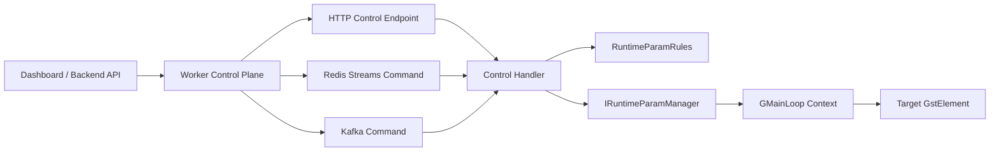

# 11. Runtime Element Control — Điều Khiển Property Lúc Pipeline Đang Chạy

> **Scope**: runtime control cho các GStreamer/DeepStream element properties khi pipeline đang chạy, không reload YAML, không rebuild topology.
>
> **Use case đầu tiên**: bật/tắt overlay của `nvdsosd` qua `display-bbox` và `display-text`.

---

## Mục lục

- [1. Nên dùng gì](#1-nên-dùng-gì)
- [2. Không nên dùng gì](#2-không-nên-dùng-gì)
- [3. Điều kiện tiên quyết](#3-điều-kiện-tiên-quyết)
- [4. Kiến trúc đề xuất](#4-kiến-trúc-đề-xuất)
- [5. Use case 1 — Runtime control cho `nvdsosd`](#5-use-case-1--runtime-control-cho-nvdsosd)
- [6. API và message contract đề xuất](#6-api-và-message-contract-đề-xuất)
- [7. Các bước triển khai trong codebase hiện tại](#7-các-bước-triển-khai-trong-codebase-hiện-tại)
- [8. Quy tắc persistence](#8-quy-tắc-persistence)
- [9. Decision matrix](#9-decision-matrix)

---

## 1. Nên dùng gì

### Khuyến nghị chính

**Dùng `IRuntimeParamManager` làm lõi để set/get trực tiếp GObject properties của element đang tồn tại trong pipeline.**

Tức là:

- YAML chỉ giữ **startup defaults**
- runtime control đi qua **element id + property + value**
- API, Redis Streams, Kafka chỉ là **transport** đi vào cùng một lõi xử lý

### Northbound transport nên dùng

Nếu hệ thống của mày có **worker quản lý nhiều pipeline container**, nên tách control plane thành hai lớp:

- `app -> worker`: **HTTP/gRPC** để lấy semantics đồng bộ, auth, timeout, và orchestration
- `worker -> engine`: **Redis Streams hoặc Kafka** để fan-out command xuống nhiều container

**HTTP API trong engine vẫn hữu ích** cho:

- dashboard bật/tắt tính năng theo thao tác người dùng
- service backend gọi đồng bộ và cần kết quả ngay
- cần semantics kiểu `read current state` và `set new state`
- debug / local admin / fallback path

**Redis Streams hoặc Kafka nên là transport thực thi giữa worker và engine** khi:

- worker phải điều phối nhiều pipeline container
- cần queueing / decoupling / retry ở command plane
- không muốn app/backend gọi trực tiếp từng engine instance

---

## 2. Không nên dùng gì

### Không dùng DeepStream REST API embedded cho runtime property control

Tài liệu [10_rest_api.md](10_rest_api.md) áp dụng cho **dynamic add/remove stream** của `nvmultiurisrcbin`. Nó không phải control plane cho arbitrary element properties như `nvdsosd.display-bbox`, `nvv4l2h264enc.bitrate`, hoặc `nvtracker.compute-hw`.

### Không sửa YAML rồi restart pipeline cho các toggle nhỏ

Cách này:

- làm gián đoạn stream
- tăng latency vận hành
- trộn lẫn startup config với runtime state

### Không phụ thuộc vào tên element nội bộ hardcode

Runtime control chỉ ổn định khi element có **id do config khai báo**. Ví dụ với source block, nên dùng `sources.id: sources` thay vì dựa vào tên cứng như `nvmultiurisrcbin0`.

---

## 3. Điều kiện tiên quyết

Để runtime control mở rộng được cho nhiều element về sau, nên giữ ba nguyên tắc:

### 3.1 Mỗi element cần một id ổn định

- `processing.elements[].id`
- `visuals.elements[].id`
- `outputs[].elements[].id`
- `sources.id`

### 3.2 Property names phải normalize rõ ràng

API có thể nhận:

- `display_bbox`
- `display_text`

Nhưng runtime layer phải map về GStreamer property thực:

- `display-bbox`
- `display-text`

### 3.3 Việc set property phải chạy đúng thread/context

Nếu control request đi vào từ thread REST consumer hoặc message consumer, nên marshal thao tác `g_object_set()` về GLib main context của pipeline.

---

## 4. Kiến trúc đề xuất



### Nguyên tắc quan trọng

- **Một lõi duy nhất** cho mọi update runtime
- **Transport-agnostic** ở lớp control
- **Id-based lookup** thay vì hardcoded element names
- **Typed validation** trước khi áp property

---

## 5. Use case 1 — Runtime control cho `nvdsosd`

`nvdsosd` là candidate rất tốt để bắt đầu vì việc đổi:

- `display-bbox`
- `display-text`

không làm thay đổi topology pipeline và không cần recreate encoder hoặc sink.

Trong code hiện tại, `OsdBuilder` đã set các property này lúc build:

```cpp
g_object_set(G_OBJECT(elem.get()),
             "process-mode", static_cast<gint>(elem_cfg.process_mode),
             "display-bbox", static_cast<gboolean>(elem_cfg.display_bbox),
             "display-text", static_cast<gboolean>(elem_cfg.display_text),
             "display-mask", static_cast<gboolean>(elem_cfg.display_mask),
             "gpu-id", static_cast<gint>(elem_cfg.gpu_id),
             nullptr);
```

Điều đó có nghĩa là runtime toggle nên đi theo đúng mô hình runtime property update.

---

## 6. API và message contract đề xuất

### 6.0 YAML bật API

```yaml
control_api:
  enable: true
  bind_address: "0.0.0.0"
  port: 18080

control_messaging:
  enable: true
  channel: worker_lsr_runtime_control
  reply_channel: worker_lsr_runtime_control_reply
```

Nếu block này không tồn tại hoặc `enable: false` thì HTTP control API không start.
Nếu `control_messaging.enable: true` thì engine sẽ subscribe một command channel generic bằng consumer abstraction hiện có, nên có thể đổi qua Redis Streams hoặc Kafka chỉ bằng `messaging.type`.

### 6.1 HTTP API tổng quát

```http
PATCH /api/v1/pipelines/{pipeline_id}/elements/{element_id}/properties
Content-Type: application/json
```

```json
{
  "properties": {
    "display_bbox": false,
    "display_text": true
  }
}
```

Các route đang được implement trong engine:

- `GET /health`
- `GET /api/v1/pipelines/{pipeline_id}/state`
- `GET /api/v1/pipelines/{pipeline_id}/sources`
- `POST /api/v1/pipelines/{pipeline_id}/sources`
- `DELETE /api/v1/pipelines/{pipeline_id}/sources/{camera_id}`
- `GET /api/v1/pipelines/{pipeline_id}/elements/{element_id}/properties/{property}`
- `PATCH /api/v1/pipelines/{pipeline_id}/elements/{element_id}/properties`

Ví dụ `curl` để test nhanh HTTP API:

```bash
BASE_URL="http://127.0.0.1:8081"
PIPELINE_ID="de1"
ELEMENT_ID="osd"
CAMERA_ID="camera-03"
```

Health check:

```bash
curl -sS "${BASE_URL}/health"
```

Lấy state của pipeline:

```bash
curl -sS "${BASE_URL}/api/v1/pipelines/${PIPELINE_ID}/state"
```

Liệt kê source hiện tại:

```bash
curl -sS "${BASE_URL}/api/v1/pipelines/${PIPELINE_ID}/sources"
```

Thêm source runtime:

```bash
curl -sS -X POST "${BASE_URL}/api/v1/pipelines/${PIPELINE_ID}/sources" \
  -H "Content-Type: application/json" \
  -d '{
    "camera": {
      "id": "camera-03",
      "uri": "rtsp://192.168.1.103:554/stream"
    }
  }'
```

Xóa source runtime:

```bash
curl -sS -X DELETE \
  "${BASE_URL}/api/v1/pipelines/${PIPELINE_ID}/sources/${CAMERA_ID}"
```

Đọc một property runtime của element:

```bash
curl -sS \
  "${BASE_URL}/api/v1/pipelines/${PIPELINE_ID}/elements/${ELEMENT_ID}/properties/display_bbox"
```

Patch nhiều property runtime cùng lúc:

```bash
curl -sS -X PATCH \
  "${BASE_URL}/api/v1/pipelines/${PIPELINE_ID}/elements/${ELEMENT_ID}/properties" \
  -H "Content-Type: application/json" \
  -d '{
    "properties": {
      "display_bbox": false,
      "display_text": true
    }
  }'
```

Manual `nvurisrcbin` source control hiện trả JSON typed để backend Python map message ổn định cho client. Field tối thiểu của error response là:

- `error`
- `error_code`
- `message`
- `status_code`
- `pipeline_id`
- `camera_id` khi request có target source cụ thể

Field tối thiểu của source-mutation success response là:

- `message`
- `camera_id`
- `source_index`
- `active_source_count`
- `source`
- `dot_file` nếu DOT snapshot được tạo
- `warning` và `warning_code` nếu mutate thành công nhưng DOT snapshot không resolve được

Ở bản hiện tại, allowlist runtime param mặc định đang mở cho:

- `osd.display_bbox`
- `osd.display_text`

Các param generic cũ như `confidence_threshold`, `tracker_enabled`, `inference_interval`,
và `bitrate` hiện đã bị gỡ khỏi default allowlist để giữ runtime control scope nhỏ và ổn định.
Khi cần mở rộng, thêm lại từng rule một cách tường minh trong `RuntimeParamRules::create_default()`.

### 6.2 Redis Streams hoặc Kafka command tổng quát

```json
{
  "type": "set_element_properties",
  "request_id": "3c9f4a3f",
  "pipeline_id": "de1",
  "element_id": "osd",
  "properties": {
    "display_bbox": false,
    "display_text": true
  },
  "reply_to": "worker_lsr_runtime_control_reply"
}
```

Engine hiện hỗ trợ cùng một handler chung cho các command type:

- `health`
- `get_pipeline_state`
- `list_sources`
- `add_source`
- `remove_source`
- `get_element_property`
- `set_element_properties`

Response trả về qua broker sẽ giữ `request_id`, `status_code`, `ok`, và payload business tương ứng.

Payload command cho manual source control:

```json
{
  "type": "add_source",
  "request_id": "3c9f4a3f",
  "pipeline_id": "de1",
  "camera": {
    "id": "camera-03",
    "uri": "rtsp://192.168.1.103:554/stream"
  },
  "reply_to": "worker_lsr_runtime_control_reply"
}
```

```json
{
  "type": "remove_source",
  "request_id": "3c9f4a40",
  "pipeline_id": "de1",
  "camera_id": "camera-03",
  "reply_to": "worker_lsr_runtime_control_reply"
}
```

```json
{
  "type": "list_sources",
  "request_id": "3c9f4a41",
  "pipeline_id": "de1",
  "reply_to": "worker_lsr_runtime_control_reply"
}
```

Error code typed hiện được dùng cho manual source control:

| error_code                       | Ý nghĩa                                                   |
| -------------------------------- | --------------------------------------------------------- |
| `SRCCTL_INVALID_REQUEST`         | Payload thiếu field bắt buộc hoặc JSON không hợp lệ       |
| `SRCCTL_PIPELINE_NOT_FOUND`      | `pipeline_id` request không match pipeline đang chạy      |
| `SRCCTL_UNSUPPORTED_SOURCE_MODE` | Pipeline không chạy manual `nvurisrcbin` mode             |
| `SRCCTL_DUPLICATE_CAMERA_ID`     | `camera_id` đã tồn tại trong active source set            |
| `SRCCTL_CAMERA_NOT_FOUND`        | Remove target không tồn tại trong active source set       |
| `SRCCTL_MAX_SOURCES_REACHED`     | Số source active đã chạm trần `max_sources`               |
| `SRCCTL_BUILD_SOURCE_FAILED`     | Tạo source bin thất bại                                   |
| `SRCCTL_REQUEST_PAD_FAILED`      | Xin `nvstreammux` sink pad thất bại                       |
| `SRCCTL_LINK_SOURCE_FAILED`      | Link source pad vào mux thất bại                          |
| `SRCCTL_OPERATION_TIMEOUT`       | Add/remove bị timeout ở control layer                     |
| `SRCCTL_DOT_DUMP_FAILED`         | Mutation thành công nhưng DOT snapshot không resolve được |
| `SRCCTL_INTERNAL_ERROR`          | Lỗi nội bộ còn lại                                        |

### 6.3 Preset convenience layer

Ở control/API layer có thể thêm preset:

- `off` → bbox=false, text=false
- `bbox_only` → bbox=true, text=false
- `full` → bbox=true, text=true

Nhưng runtime param manager vẫn chỉ nên xử lý primitive property updates.

---

## 7. Các bước triển khai trong codebase hiện tại

### Bước 1 — Ổn định hóa element ids

Thêm `sources.id` vào config schema và dùng nó làm element name thực cho `nvmultiurisrcbin`.

### Bước 2 — Mở rộng runtime rules

Hiện tại `RuntimeParamRules` chỉ nên giữ hai field runtime-safe cho OSD. Về sau nếu cần
thêm tracker, inference, hoặc encoder properties thì thêm từng rule riêng sau khi xác nhận
semantics runtime của từng element. Default allowlist lúc này là:

```cpp
rules.register_rule("osd.display_bbox",
                    {"osd.display_bbox", "Enable/disable OSD bounding boxes",
                     true, false, true, false});

rules.register_rule("osd.display_text",
                    {"osd.display_text", "Enable/disable OSD labels",
                     true, false, true, false});
```

### Bước 3 — Tạo concrete runtime param manager trong `pipeline/`

`IRuntimeParamManager` hiện mới là interface. Nên thêm concrete class ở `pipeline/` để:

- giữ `GstElement* pipeline_`
- giữ `GMainLoop* loop_` hoặc `GMainContext*`
- lookup element theo id
- normalize property aliases
- set/get property theo đúng type

### Bước 4 — Wiring vào `PipelineManager`

`PipelineManager` đang là chỗ hợp lý nhất vì đã sở hữu:

- `pipeline_`
- `loop_`
- message producer / consumer

### Bước 5 — Expose control path

`PistacheServer` hiện đã được thay bằng lightweight HTTP server dựa trên GLib/GIO và được wire trong `app/main.cpp` qua block YAML `control_api:`.

Song song với đó, engine đã có `control_messaging:` để consume command generic qua cùng abstraction `IMessageConsumer`. Cả HTTP adapter và broker consumer đều gọi vào cùng `RuntimeControlHandler`, rồi handler này mới gọi `IRuntimeParamManager`.

---

## 8. Quy tắc persistence

### Startup default

Nằm trong YAML:

```yaml
visuals:
  enable: true
  elements:
    - id: osd
      type: nvdsosd
      display_bbox: true
      display_text: true
```

### Runtime override

Nằm ở control plane runtime, không nên ghi đè trực tiếp lên YAML đang chạy.

Khi pipeline restart, có hai lựa chọn:

- reset về default trong YAML
- backend persist state gần nhất rồi re-apply sau `initialize()`

---

## 9. Decision matrix

| Nhu cầu                                      | Nên dùng                       | Lý do                                  |
| -------------------------------------------- | ------------------------------ | -------------------------------------- |
| App gọi worker để đổi property ngay          | HTTP/gRPC app -> worker        | đồng bộ, dễ auth/orchestrate           |
| Worker fan-out command xuống nhiều pipeline  | Redis Streams + handler chung  | nhẹ, phù hợp command plane             |
| Hệ thống command bus chuẩn Kafka             | Kafka + `IRuntimeParamManager` | phù hợp khi cần replay/group semantics |
| Debug hoặc admin gọi thẳng vào engine        | HTTP API + handler chung       | quan sát và can thiệp trực tiếp        |
| Dynamic add/remove camera                    | DeepStream embedded REST       | đúng phạm vi của `nvmultiurisrcbin`    |
| Toggle property bằng cách sửa YAML + restart | Không khuyến nghị              | quá nặng cho runtime control           |

### Kết luận cuối cùng

Nếu muốn runtime control mở rộng được cho nhiều element về sau, hướng đúng là:

1. chuẩn hóa **element ids trong config**
2. dùng `IRuntimeParamManager` làm lõi
3. để HTTP, Redis, Kafka cùng đi vào một **handler chung**
4. coi `nvdsosd` chỉ là use case đầu tiên, không phải ngoại lệ đặc biệt
