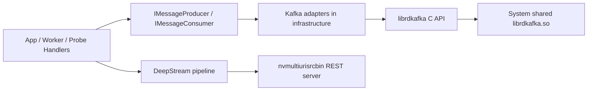

# 12. Kafka Compatibility với DeepStream REST

> **Scope**: cách VMS Engine tích hợp Kafka mà vẫn tương thích với `nvmultiurisrcbin` DeepStream REST trong cùng process.
>
> **Đọc trước**: [10 — REST API](10_rest_api.md) · [11 — Runtime Element Control](11_runtime_element_control.md) · [../CMAKE.md](../CMAKE.md)

---

## Mục lục

- [1. Bài toán](#1-bài-toán)
- [2. Triệu chứng đã gặp](#2-triệu-chứng-đã-gặp)
- [3. Quyết định kỹ thuật hiện tại](#3-quyết-định-kỹ-thuật-hiện-tại)
- [4. Kiến trúc tích hợp Kafka hiện tại](#4-kiến-trúc-tích-hợp-kafka-hiện-tại)
- [5. Build và dependency rules](#5-build-và-dependency-rules)
- [6. Runtime validation](#6-runtime-validation)
- [7. Guardrails](#7-guardrails)
- [8. Alternative designs](#8-alternative-designs)
- [9. Cross-references](#9-cross-references)

---

## 1. Bài toán

`vms_engine` cần đồng thời hỗ trợ:

- DeepStream pipeline với `nvmultiurisrcbin`
- DeepStream embedded REST API cho dynamic stream management
- Kafka messaging cho event publish / command consume

Trong một giai đoạn debug thực tế, binary có Kafka linkage đã gây crash khi gọi chính DeepStream REST endpoint:

```text
GET /api/v1/stream/get-stream-info
```

trong khi cùng pipeline logic đó vẫn ổn ở binary không kéo Kafka vào process.

Điểm quan trọng: vấn đề không biểu hiện như lỗi business logic ở producer/consumer call path, mà giống một vấn đề **process composition / linkage compatibility** khi DeepStream REST server và Kafka stack cùng nằm trong một executable.

---

## 2. Triệu chứng đã gặp

### 2.1 Hành vi lỗi

- Pipeline start được bình thường.
- DeepStream REST server mở port thành công.
- Khi gọi endpoint stream info, process bị `SIGSEGV`.
- Stack trace trước đó rơi vào nhánh CivetWeb / `nvds_rest_server`.

### 2.2 Điều đã được loại trừ

Trong quá trình cô lập lỗi, các giả thuyết sau đã bị loại trừ:

- Redis adapter
- YAML parser
- control API nội bộ của engine
- lifecycle thread của `PipelineManager`
- `nvmultiurisrcbin` source builder logic thông thường
- việc Kafka có thực sự publish/consume message hay không

Kết quả cô lập mạnh nhất là:

- binary không có Kafka linkage: DeepStream REST ổn
- binary có Kafka linkage theo kiểu cũ: DeepStream REST crash

Điều đó cho thấy vấn đề nằm gần lớp **cách Kafka được đưa vào binary** hơn là ở logic command/event thông thường.

---

## 3. Quyết định kỹ thuật hiện tại

Để giữ Kafka nhưng tránh tái hiện lỗi tương thích với DeepStream REST, VMS Engine dùng chiến lược sau:

### 3.1 Không dùng `FetchContent` Kafka trong root CMake

Kafka không còn được kéo vào như một third-party static dependency cùng kiểu với `spdlog`, `yaml-cpp`, hay `hiredis`.

Thay vào đó, build hiện tại yêu cầu **system `librdkafka` development files** có sẵn trong image / host build environment.

### 3.2 Dùng shared system `librdkafka`

Root CMake import trực tiếp shared library đã cài trong môi trường hệ thống:

```cmake
find_path(RDKAFKA_INCLUDE_DIR NAMES rdkafka.h PATH_SUFFIXES librdkafka)
find_library(RDKAFKA_LIBRARY NAMES rdkafka)

add_library(RdKafka::rdkafka SHARED IMPORTED GLOBAL)
set_target_properties(RdKafka::rdkafka PROPERTIES
    IMPORTED_LOCATION "${RDKAFKA_LIBRARY}"
    INTERFACE_INCLUDE_DIRECTORIES "${RDKAFKA_INCLUDE_DIR}")
```

### 3.3 Dùng C API thay vì C++ wrapper API

Kafka adapter không còn dùng `rdkafkacpp.h` / `RdKafka::*` nữa.

Code hiện tại dùng trực tiếp `rd_kafka_*` C API, ví dụ:

- `rd_kafka_new()`
- `rd_kafka_producev()`
- `rd_kafka_subscribe()`
- `rd_kafka_consumer_poll()`

Lý do chính:

- giảm thêm một lớp wrapper runtime vào process
- bớt khác biệt ABI / object model giữa C++ wrapper và shared runtime
- dễ kiểm soát lifecycle hơn trong binary tích hợp DeepStream

### 3.4 Giữ abstraction ở lớp core

Quyết định này **không** làm thay đổi contract phía trên:

- `IMessageProducer`
- `IMessageConsumer`

Ứng dụng và control plane vẫn làm việc qua abstraction của `core`, chỉ phần adapter implementation ở `infrastructure/` thay đổi.

---

## 4. Kiến trúc tích hợp Kafka hiện tại



### 4.1 Boundary giữ nguyên

- `core/` chỉ định nghĩa messaging interfaces
- `infrastructure/` implement Kafka cụ thể
- `app/` không phụ thuộc vào `rdkafka.h`

### 4.2 Build-time contract

Nếu bật `VMS_ENGINE_WITH_KAFKA=ON`, configure step phải tìm được:

- Kafka headers
- Kafka shared library

Nếu không tìm thấy, CMake fail sớm với thông báo rõ ràng, thay vì build ra một binary nửa đúng nửa sai.

---

## 5. Build và dependency rules

### 5.1 Docker / container requirement

Dev image phải cài `librdkafka-dev`:

```dockerfile
RUN apt-get update && DEBIAN_FRONTEND=noninteractive apt-get install -y \
    librdkafka-dev
```

Điều này đảm bảo đồng thời có:

- `rdkafka.h`
- linker metadata cho `librdkafka.so`

### 5.2 CMake policy cho Kafka

Kafka là ngoại lệ so với các third-party dependencies khác.

| Dependency      | Strategy hiện tại         |
| --------------- | ------------------------- |
| `spdlog`        | `FetchContent`            |
| `yaml-cpp`      | `FetchContent`            |
| `hiredis`       | `FetchContent`            |
| `nlohmann_json` | `FetchContent`            |
| `librdkafka`    | **system shared library** |

Kafka bị đối xử khác vì mục tiêu ở đây không chỉ là build được, mà là **tương thích runtime với DeepStream REST trong cùng executable**.

### 5.3 Khi nào nên fail configure

Nếu user bật:

```cmake
VMS_ENGINE_WITH_KAFKA=ON
```

nhưng môi trường không có `librdkafka-dev`, configure phải fail ngay. Không nên tự động fallback sang FetchContent cũ, vì như vậy có thể kéo lại đúng tổ hợp binary composition từng gây crash.

---

## 6. Runtime validation

### 6.1 Repro path chuẩn

Validation path đang dùng cho tương thích Kafka + DeepStream REST là:

- runtime compose: `docker-compose.run.yml`
- config: `dev/configs/deepstream_default.yml`
- DeepStream REST port: `9111`

### 6.2 Signal pass mong đợi

Pipeline được coi là pass compatibility check khi:

1. engine start được với `messaging.type: kafka`
2. DeepStream REST port mở bình thường
3. gọi được:

```text
GET /api/v1/stream/get-stream-info
```

1. process không bị `SIGSEGV`

### 6.3 Ý nghĩa của kết quả pass

Khi test path trên pass, điều đó cho thấy ít nhất trong tổ hợp runtime hiện tại:

- shared system `librdkafka`
- Kafka C API adapter
- `nvmultiurisrcbin` REST server

đang coexist ổn trong cùng process.

Nó không chứng minh root cause tuyệt đối ở cấp vendor library internals, nhưng đủ mạnh để đóng vai trò **production-facing compatibility decision**.

---

## 7. Guardrails

### 7.1 Không reintroduce `rdkafkacpp.h`

Không dùng lại C++ wrapper API trong adapter hiện tại trừ khi có một đợt revalidation đầy đủ với DeepStream REST.

### 7.2 Không silent fallback về FetchContent Kafka cũ

Nếu system `librdkafka` không có, nên fail configure. Không nên lén chuyển sang một bản Kafka build khác.

### 7.3 Tách validation theo 2 lớp

Mỗi thay đổi liên quan Kafka nên được test ở cả hai lớp:

- compile/link validation
- DeepStream REST compatibility validation

### 7.4 Ưu tiên config/runtime parity

Khi debug tương thích, luôn chạy trên config càng gần runtime thật càng tốt, thay vì chỉ test trên harness tối giản.

---

## 8. Alternative designs

### 8.1 Sidecar Kafka bridge

Engine chỉ publish sang Redis hoặc local IPC; một process khác bridge ra Kafka.

Ưu điểm:

- cô lập crash domain tốt nhất
- engine không phải link Kafka trực tiếp

Nhược điểm:

- thêm service phải vận hành
- tăng complexity ở control plane và deployment

### 8.2 Runtime plugin / `dlopen`

Kafka backend được nạp động khi config chọn Kafka, thay vì link thẳng từ đầu.

Ưu điểm:

- giảm coupling ở binary composition
- tránh kéo Kafka vào process khi không dùng

Nhược điểm:

- code phức tạp hơn đáng kể
- error handling và packaging khó hơn

### 8.3 Build profile tách riêng có/không Kafka

Giữ hai biến thể executable hoặc image khác nhau.

Ưu điểm:

- dễ triển khai
- containment rõ ràng

Nhược điểm:

- không giải quyết bản chất incompatibility nếu vẫn cần Kafka + REST cùng lúc

### 8.4 Tại sao chưa chọn các hướng này

Ở thời điểm hiện tại, shared system `librdkafka` + C API cho điểm cân bằng tốt nhất giữa:

- mức thay đổi code chấp nhận được
- giữ được abstraction hiện tại
- ít phá kiến trúc tổng thể
- đã có tín hiệu runtime pass trên repro thật

---

## 9. Cross-references

- DeepStream stream management: [10_rest_api.md](10_rest_api.md)
- Engine runtime property control: [11_runtime_element_control.md](11_runtime_element_control.md)
- CMake dependency strategy: [../CMAKE.md](../CMAKE.md)
- Root architecture overview: [../ARCHITECTURE_BLUEPRINT.md](../ARCHITECTURE_BLUEPRINT.md)
