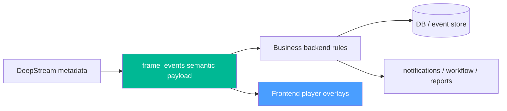

# 13. Business Apps → FE-first Signal Strategy

> **Scope**: Chiến lược giữ **DeepStream engine đơn giản nhất có thể**: engine chỉ publish semantic signals đủ chuẩn và đủ nhanh, còn **rendering / overlays / visualization** được ưu tiên thực hiện ở frontend player hoặc backend business layer.
>
> **Đọc trước**: [05 — Configuration](05_configuration.md) · [07 — Event Handlers & Probes](07_event_handlers_probes.md) · [08 — Analytics](08_analytics.md) · [../runtime_components/frame_events_probe_handler.md](../runtime_components/frame_events_probe_handler.md)

---

## Mục lục

- [1. Bài toán](#1-bài-toán)
- [2. Kết luận kiến trúc](#2-kết-luận-kiến-trúc)
- [3. Tại sao không nên làm 1 app = 1 probe](#3-tại-sao-không-nên-làm-1-app--1-probe)
- [4. Ranh giới trách nhiệm: FE vs Backend vs Engine](#4-ranh-giới-trách-nhiệm-fe-vs-backend-vs-engine)
- [5. Minimal Engine Capability Set](#5-minimal-engine-capability-set)
- [6. Mapping 5 business apps hiện tại](#6-mapping-5-business-apps-hiện-tại)
- [7. Rendering Strategy](#7-rendering-strategy)
- [8. Payload Strategy](#8-payload-strategy)
- [9. Config Strategy](#9-config-strategy)
- [10. Migration Plan](#10-migration-plan)
- [11. Rủi ro & Guardrails](#11-rủi-ro--guardrails)
- [12. Kết luận](#12-kết-luận)

---

## 1. Bài toán

Các tài liệu business app hiện tại ở backend mô tả 5 nhóm nghiệp vụ chính:

1. Phát hiện xâm nhập
2. Phát hiện cháy và khói
3. Giám sát bảo hộ lao động
4. Phát hiện rời bỏ vị trí
5. Chấm công nhận diện khuôn mặt

Những nghiệp vụ này đều cần một hoặc nhiều nhu cầu dưới đây:

- Thấy trạng thái trực tiếp trên video ngay tại thời điểm object xuất hiện.
- Tô trực quan vùng, quỹ đạo, trạng thái vi phạm, hoặc text nhận diện ngay trên player.
- Giữ semantic theo đúng frame đang xem thay vì chờ downstream worker xử lý xong.
- Hạn chế vòng lặp `engine -> broker -> backend -> UI` đối với các tín hiệu trực quan chỉ phục vụ live view.

Nhu cầu đó là hợp lý. Tuy nhiên, sau khi rà lại use cases thực tế, hướng tối ưu hơn là:

- **zone overlays cố định** được vẽ ở từng video player
- **các trạng thái trực quan khác** cũng ưu tiên vẽ ở frontend nếu tín hiệu đến đủ nhanh
- DeepStream engine chỉ giữ vai trò **semantic signal producer** và tránh ôm phần rendering nếu không thật cần thiết

Điều này giúp engine giữ được tính đơn giản, ít state hơn, ít config hơn, và không bị trộn UI concerns vào pipeline runtime.

---

## 2. Kết luận kiến trúc

> **Khuyến nghị chính**: không thiết kế theo hướng **mỗi business app là một probe riêng**.
>
> Đồng thời, cũng **không nên mặc định đẩy rendering xuống engine**. Trừ khi có một tín hiệu nào đó chỉ có thể render chính xác tại DeepStream layer hoặc latency buộc phải xử lý tại đó, mặc định nên chọn **FE-first rendering**.

Kiến trúc đích:



Nói ngắn gọn:

- **Engine** làm semantic normalization, timestamping, stable tracking identity, optional enrichment, và publish tín hiệu nhanh.
- **Frontend** làm rendering: polygons, badges, labels, highlights, trajectories, scene annotations.
- **Backend business app** làm workflow, persistence, notification, escalation, lịch, và tích hợp hệ thống ngoài.

### 2.1 Rule thực dụng

> Nếu một thứ có thể vẽ đúng ở frontend từ `frame_events` hoặc semantic feed tương đương, **đừng vẽ ở DeepStream**.

DeepStream chỉ nên giữ rendering tại engine cho các trường hợp hiếm:

- output video cần được burn-in để ghi file hoặc restream cho hệ ngoài
- có consumer không có frontend overlay layer
- latency hoặc sync constraint khiến roundtrip qua FE không chấp nhận được
- overlay cần dữ liệu chỉ có trong engine và không muốn publish thêm ra ngoài

---

## 3. Tại sao không nên làm 1 app = 1 probe

`Probe callback` chạy trên **pipeline streaming thread**. Theo nguyên tắc ở [07_event_handlers_probes.md](07_event_handlers_probes.md), callback phải nhanh, không block I/O, không giữ lock lâu, và không mang logic stateful phức tạp kéo dài.

Nếu làm `1 app = 1 probe`, engine sẽ nhanh chóng gánh các loại logic không phù hợp với pipeline layer:

- debounce dài hạn theo phút hoặc theo ca trực
- merge timeline sự kiện
- xác nhận vi phạm / nhận diện sai
- escalation nhiều mức
- gửi notification theo role/user/channel
- export báo cáo
- attendance workflow, HR rules, anti-spoofing
- persistence và recovery state qua process restart

Hệ quả là:

- pipeline thread bị phình logic và khó giữ deterministic latency
- code engine bị kéo sang workflow/app concerns
- khó test vì rule business và video runtime dính chặt vào nhau
- khó mở rộng khi mỗi app lại thêm một probe mới có state machine riêng
- khó tái sử dụng vì các app khác nhau lại lặp lại cùng primitives như polygon hit, dwell, absence, association, identity overlay

Vì vậy, **app-centric probes** là hướng dễ đi lúc đầu nhưng sai về trung hạn.

---

## 4. Ranh giới trách nhiệm: FE vs Backend vs Engine

### 4.1 Những gì nên đặt trong Engine

Các tác vụ sau nằm rất gần `NvDsBatchMeta`, `NvDsObjectMeta`, `tracker_id`, `bbox`, `SGIE labels`, hoặc khó tái tạo chính xác bên ngoài pipeline:

- object filtering theo label / class / tracker state
- stable object identity (`object_key`, `instance_key`, `tracker_id`)
- source/frame identity (`source_id`, `source_name`, `frame_key`, `frame_ts_ms`, `emitted_at_ms`)
- đọc classifier labels từ SGIE và tạo semantic snapshot ổn định
- parent-child relationship nếu có multi-stage inference
- optional async ext-proc enrichment nếu cần attach kết quả gần nguồn nhất
- semantic pre-processing tối thiểu để downstream nhận payload sạch hơn

### 4.2 Những gì nên đặt ở Frontend

Các tác vụ sau mặc định nên ở frontend/video player:

- vẽ polygon zones cố định theo từng player
- vẽ bbox, label, icon, badge, severity color
- highlight người vi phạm, xe vi phạm, vùng đang active
- hiển thị tên face, plate, PPE warning, intrusion badge
- trajectory, breadcrumbs, hover info, panel state cạnh player
- bất kỳ styling nào phụ thuộc layout UI hoặc theme sản phẩm

Frontend là nơi phù hợp nhất vì:

- zones là cố định theo player/view context
- dễ đổi style mà không phải restart pipeline
- không buộc engine gánh rendering concern
- một semantic feed có thể phục vụ nhiều kiểu UI khác nhau

### 4.3 Những gì nên giữ ở Backend Business Layer

Các tác vụ sau nên ở app/backend thay vì probe:

- event lifecycle (`OPEN`, `ACK`, `FALSE_POSITIVE`, `CLOSED`)
- timeline merge và query lịch sử
- debounce dài hạn theo business semantics
- ca trực, lịch hoạt động theo ngày/giờ, holiday calendar
- phân quyền người xem và người nhận cảnh báo
- push notification, email, SMS, desktop popup
- export báo cáo, dashboard KPI, audit log
- HR / attendance logic và tích hợp hệ thống ngoài
- cấu hình workflow có transaction hoặc cần rollback

### 4.4 Rule ngắn gọn

> Nếu logic đó tồn tại chủ yếu để **vẽ trên player**, mặc định đặt ở frontend.
>
> Nếu logic đó tồn tại chủ yếu để **chuẩn hóa tín hiệu gần metadata**, giữ ở engine.
>
> Nếu logic đó tồn tại chủ yếu để **quản lý sự kiện như một business object**, giữ ở backend.

---

## 5. Minimal Engine Capability Set

Để giữ DeepStream đơn giản nhất có thể, engine **không nên bắt đầu** bằng việc thêm nhiều capability probes mới. Mức tối thiểu nên có là:

### 5.1 Canonical `frame_events`

Engine cần tiếp tục giữ và làm tốt `frame_events` như semantic feed chuẩn:

- stable object identity
- stable timestamps và frame identity
- object bbox, labels, classifier labels
- parent/child links khi cần
- source-level semantic snapshot theo frame

Đây là nền tảng để frontend và backend cùng dựa vào một contract duy nhất.

### 5.2 Optional async enrichment

Nếu cần face recognition hoặc external AI lookup, engine chỉ nên giữ pattern async sidecar hiện có:

- `frame_events.ext_processor`
- publish enrichment result ra stream riêng hoặc attach semantic-safe fields
- không block streaming thread

### 5.3 Evidence on demand

Evidence/crop/full-frame chỉ nên materialize khi downstream thực sự cần:

- không encode ảnh trong semantic hot path nếu không cần
- cache ngắn hạn theo `frame_key`
- phục vụ `evidence_request -> evidence_ready`

### 5.4 Những gì chưa nên thêm sớm

Để giữ engine mỏng, chưa nên thêm sớm:

- zone hit-test riêng trong engine nếu FE/backend làm được
- app-specific probes cho intrusion/PPE/leave-zone/attendance
- OSD directives hoặc styling directives trong payload
- state machines dài hạn theo nghiệp vụ

---

## 6. Mapping 5 business apps hiện tại

### 6.1 App 01 — Intrusion Detection

Nguồn nghiệp vụ: tài liệu backend `01_intrusion_detection.md`.

Nên để frontend/backend:

- zone polygons cố định trên từng player
- hit-test bbox với polygon
- intrusion badge / highlight trên player
- debounce và event merge ở backend

Engine chỉ cần:

- publish người / xe / object bbox đủ chuẩn và đủ nhanh
- giữ stable tracker identity để FE/backend theo object liên tục

Kết luận:

> Intrusion không cần DeepStream OSD. Nếu player đã có zone overlay cố định, nên làm rule và vẽ ở FE/backend.

### 6.2 App 02 — Fire & Smoke Detection

Nguồn nghiệp vụ: tài liệu backend `02_fire_smoke_detection.md`.

Nên để frontend/backend:

- banner, badge, highlight trên player
- hazard zone overlay ở FE nếu zone là cố định theo view
- business incident và escalation ở backend

Engine chỉ cần:

- publish detection `smoke` / `flame` sạch, ổn định, không quá delay
- giữ timestamps chuẩn để FE ghép frame/player state tốt

Kết luận:

> Fire/smoke không nhất thiết cần `incident_probe` ngay. Nếu raw semantic đủ sạch, FE có thể render toàn bộ cảnh báo.

### 6.3 App 03 — PPE Compliance

Nguồn nghiệp vụ: tài liệu backend `03_ppe_detection.md`.

Nên để frontend/backend:

- render vi phạm PPE trên player
- severity, workflow, compliance state ở backend

Engine chỉ cần:

- publish raw detections và classifier labels đủ giàu
- chỉ làm association trong engine nếu downstream thật sự không thể làm chính xác hoặc độ trễ vượt ngưỡng chấp nhận

Kết luận:

> PPE là trường hợp cần giữ kỷ luật nhất. Chỉ nên thêm logic trong engine nếu raw feed không đủ để downstream xác định thiếu PPE một cách đáng tin cậy.

### 6.4 App 04 — Leave Zone / Position Abandonment

Nguồn nghiệp vụ: tài liệu backend `04_area_abandonment.md`.

Nên để frontend/backend:

- zone overlay cố định và trạng thái hiển thị ở player
- absence logic ở backend hoặc FE state layer nếu stream semantic đủ đều

Engine chỉ cần:

- publish sự hiện diện object/person ổn định theo frame
- duy trì tracker continuity càng tốt để downstream không rung trạng thái

Kết luận:

> Leave-zone cũng không cần thêm probe riêng nếu FE/backend đã có zone definition và semantic feed ổn định.

### 6.5 App 05 — Face Recognition Attendance

Nguồn nghiệp vụ: tài liệu backend `05_face_recognition_attendance.md`.

Nên để frontend/backend:

- render tên người, attendance badges, vào/ra state trên player
- attendance records và HR rules ở backend

Engine chỉ cần:

- face detection feed sạch
- optional async face recognition enrichment nếu đó là nơi hợp lý nhất để gọi service
- mặc định không cần OSD override trong engine nếu FE đã render được

Kết luận:

> Attendance vẫn là bài toán backend. Engine chỉ nên dừng ở detect + enrich signal nếu cần.

### 6.6 App 06 — Smart Parking

Tài liệu backend hiện vẫn ghi nhận là chưa phân tích đầy đủ.

Dự kiến mapping:

- FE vẽ slot polygons và lane overlays
- backend tính occupancy/business state
- engine publish line-crossing / direction / plate semantics nếu thật cần

---

## 7. Rendering Strategy

Mặc định mới là **FE-first rendering**.

### 7.1 Frontend là renderer mặc định

Frontend nên chịu trách nhiệm cho:

- polygons cố định theo từng player
- bbox và label styles
- state badges, icons, severity colors
- animation, blinking, trajectory, tooltips
- mọi thứ phụ thuộc context của màn hình xem camera

### 7.2 Engine chỉ render khi có lý do rõ ràng

DeepStream engine chỉ nên render hoặc override text khi có một trong các điều kiện:

- phải burn overlay vào recorded/restreamed video
- downstream viewer không có overlay layer
- một external consumer cần video đã render sẵn
- latency budget quá chặt và FE roundtrip không đạt

### 7.3 `override_osd_text` nên là opt-in

Các tính năng như:

- `frame_events.ext_processor.rules[].display_path`
- `frame_events.ext_processor.override_osd_text`

nên được xem là **opt-in debug/viewer convenience**, không phải mặc định kiến trúc.

Nếu FE đã render được tên face hoặc label đã enrich, nên để `override_osd_text: false` để tránh engine phải gánh thêm phần presentation.

### 7.4 Semantic là contract chính

Frontend render từ semantic contract. Semantic contract phải ổn định hơn UI style hoặc text render tại engine.

---

## 8. Payload Strategy

### 8.1 Không bẻ hướng `frame_events`

`frame_events` hiện là canonical semantic feed cho downstream business rules. Capability probes nên **làm giàu** payload này, không tạo ra 5 stream độc lập cho 5 apps nếu không thật cần thiết.

Hướng khuyến nghị:

- tiếp tục giữ `frame_events` là primary feed
- thêm field semantic theo namespace rõ ràng
- FE và backend cùng consume từ feed này

Ví dụ namespace mở rộng:

- `zones.*`
- `incident.*`
- `ppe.*`
- `identity.*`

Tuy nhiên, các namespace này chỉ nên được thêm khi thật sự cần. Với mục tiêu giữ engine mỏng, mặc định nên bắt đầu bằng raw-but-clean payload trước.

### 8.2 Tránh app-specific payload bùng nổ

Không nên publish song song các stream như:

- `intrusion_frame_events`
- `ppe_frame_events`
- `leave_zone_frame_events`
- `attendance_frame_events`

trừ khi có lý do rõ ràng về isolation. Mặc định, downstream business engine nên đọc một semantic feed thống nhất rồi match theo app rules.

---

## 9. Config Strategy

### 9.1 Không nhồi mọi rule business vào `event_handlers`

`EventHandlerConfig` nên chứa đủ để publish semantic feed sạch, nhưng không nên biến thành business rules DSL hay rendering DSL.

Nên có 2 tầng config:

1. **Engine-capable config**
   - semantic publish knobs
   - ext-proc endpoints và result mapping
   - ext-proc display mapping
   - các ngưỡng kỹ thuật thực sự nằm sát media/runtime

2. **Backend business config**
   - zone polygons nếu zones thuộc context UI/business
   - debounce windows dài
   - schedules / shifts
   - notification routing
   - role-based handling
   - reporting semantics

### 9.2 Gợi ý schema

Ví dụ hướng config đơn giản ưu tiên cho engine:

```yaml
event_handlers:
  - id: frame_events
    enable: true
    type: on_detect
    probe_element: tracker
    pad_name: src
    trigger: frame_events
    channel: worker_lsr_frame_events
    label_filter:
      [person, car, truck, smoke, flame, face, helmet, gloves, shoes]
    frame_events:
      heartbeat_interval_ms: 1000
      min_emit_gap_ms: 250
      emit_on_first_frame: true
      emit_on_object_set_change: true
      emit_on_label_change: true
      emit_empty_frames: false
      ext_processor:
        enable: true
        publish_channel: worker_lsr_ext_proc
        override_osd_text: false
```

Zone definitions, UI colors, player overlays, severity badges nên nằm ở frontend/backend config, không nằm trong engine config mặc định.

---

## 10. Migration Plan

### Phase 1 — Không thêm probe mới

Ưu tiên:

1. củng cố `frame_events` contract
2. đảm bảo timestamps / keys / labels đủ tốt cho FE render
3. để `override_osd_text = false` theo mặc định

Lý do:

- giữ DeepStream simple nhất có thể
- chuyển rendering concern sang đúng nơi là FE
- tận dụng player overlay cố định cho zones

### Phase 2 — FE/backend rule execution

Ưu tiên:

1. intrusion / leave-zone hit-test ở FE hoặc business backend
2. fire/smoke rendering ở FE
3. attendance labels và PPE badges ở FE

Lý do:

- không tăng độ phức tạp engine
- có thể đổi UI/UX nhanh mà không đụng pipeline

### Phase 3 — Chỉ thêm engine logic nếu bị ép bởi độ trễ hoặc độ chính xác

Ưu tiên:

1. đo thực tế end-to-end delay FE render
2. xác định rule nào downstream không làm đủ chính xác
3. chỉ khi đó mới cân nhắc thêm minimal semantic helper vào engine

Lý do:

- tránh over-engineering quá sớm

### Phase 4 — Backend simplification

Sau khi semantic contract ổn định:

- frontend và backend chia nhau rendering/rule execution theo nhu cầu thực tế
- engine chỉ tăng scope khi có số đo chứng minh cần thiết

---

## 11. Rủi ro & Guardrails

### 11.1 Guardrail 1 — Không block probe callback

Probe không được:

- gọi DB
- gọi HTTP sync
- thực hiện business transaction
- giữ mutex global lâu

Nếu cần external enrichment, phải giữ pattern async sidecar như `FrameEventsExtProcService`.

### 11.2 Guardrail 2 — Không biến engine thành app server

Engine không nên sở hữu:

- event tables
- workflow status
- notification orchestration
- HR attendance ledger

### 11.3 Guardrail 3 — Reuse capability trước, app specialization sau

Mỗi capability mới cần trả lời:

1. Nó có tái sử dụng được cho hơn một app không?
2. Nó có thực sự cần live OSD không?
3. Nó có phụ thuộc long-lived business workflow không?

Nếu câu trả lời cho (3) là có, phần đó nên ở backend.

### 11.4 Guardrail 4 — Semantic payload là contract chính

OSD text có thể đổi theo UI nhu cầu. Payload semantic phải ổn định hơn text OSD và phải là contract được downstream dựa vào.

### 11.5 Guardrail 5 — Default to `off`

Mọi tính năng presentation-side ở engine nên là opt-in:

- `override_osd_text` mặc định `false`
- engine-side OSD rules mặc định không bật
- app-specific probes không thêm nếu chưa có measurement chứng minh cần

---

## 12. Kết luận

Với thực tế hiện tại, hướng phù hợp hơn là:

- DeepStream chỉ phát **semantic signals chuẩn, ổn định, ít delay**
- Frontend vẽ **zones, overlays, badges, labels** trên từng player
- Backend giữ **business workflow, persistence, notifications, scheduling**

Nói cách khác, mục tiêu không phải là làm DeepStream “thông minh hơn về UI”, mà là làm nó **đơn giản hơn nhưng phát tín hiệu tốt hơn**. Chỉ khi measurement cho thấy FE/backend không đáp ứng được độ trễ hoặc độ chính xác, mới nên cân nhắc đẩy thêm một phần semantic helper xuống engine.
