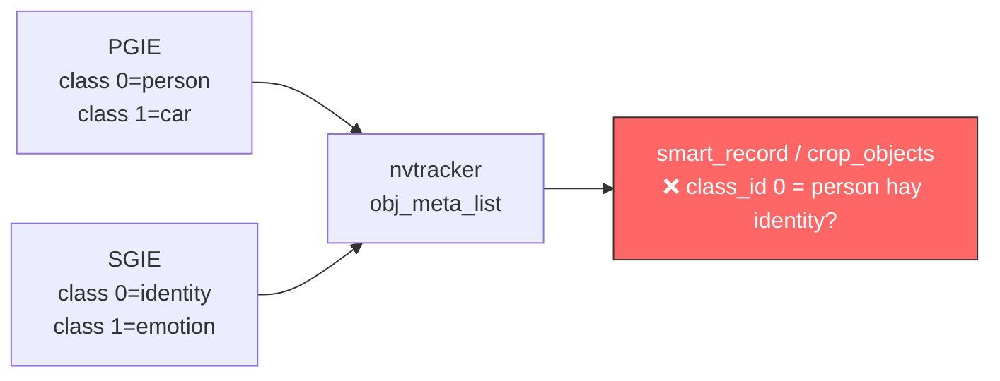
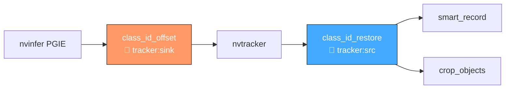
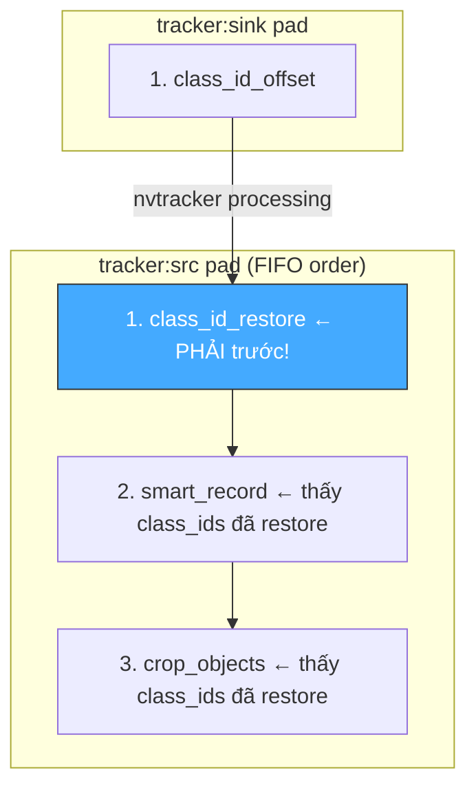

# Class ID Namespace Handler — Multi-GIE Collision Resolution

> **Scope**: Two-probe system (Offset + Restore) giải quyết `class_id` collision khi pipeline có nhiều nvinfer (PGIE + SGIE).
>
> **Đọc trước**: [07 — Event Handlers & Probes](../deepstream/07_event_handlers_probes.md)

---

## Mục lục

- [1. Vấn đề — Class ID Collision](#1-vấn-đề--class-id-collision)
- [2. Kiến trúc — Hai Probe, Hai Pad](#2-kiến-trúc--hai-probe-hai-pad)
- [3. Offset Formula](#3-offset-formula)
- [4. Lưu trữ giá trị gốc — misc_obj_info](#4-lưu-trữ-giá-trị-gốc--misc_obj_info)
- [5. Probe Ordering — GStreamer FIFO](#5-probe-ordering--gstreamer-fifo)
- [6. YAML Config](#6-yaml-config)
- [7. Code Reference](#7-code-reference)
- [8. Khi nào bật / tắt](#8-khi-nào-bật--tắt)
- [9. Cross-references](#9-cross-references)

---

## 1. Vấn đề — Class ID Collision

Khi pipeline dùng **nhiều nvinfer** (PGIE + SGIE), mỗi detector dùng `class_id` bắt đầu từ `0`:

| GIE              | `unique_component_id` | Class 0    | Class 1 |
| ---------------- | --------------------- | ---------- | ------- |
| PGIE (detection) | 1                     | person     | car     |
| SGIE (face)      | 2                     | identity   | emotion |
| SGIE (vehicle)   | 3                     | sedan      | truck   |

Sau `nvtracker`, tất cả objects nằm chung `obj_meta_list` → **class_id 0 của PGIE trùng class_id 0 của SGIE** → `label_filter` trong `smart_record` / `crop_objects` match **sai label**.



**Giải pháp**: Offset `class_id` theo `unique_component_id` **trước tracker**, restore **sau tracker**.

---

## 2. Kiến trúc — Hai Probe, Hai Pad



| Handler            | Pad              | Thời điểm     | Mục đích                                     |
| ------------------ | ---------------- | ------------- | -------------------------------------------- |
| `class_id_offset`  | `tracker` — **sink** | Trước tracker | Remap `class_id → base_offset + class_id`   |
| `class_id_restore` | `tracker` — **src**  | Sau tracker   | Phục hồi `class_id` gốc từ `misc_obj_info[]` |

---

## 3. Offset Formula

```
base_offset = gie_unique_id × offset_step     (offset_step default = 1000)
```

| GIE ID | base_offset | Class 0 → offset | Class 1 → offset |
| ------ | ----------- | ----------------- | ----------------- |
| 1      | 1000        | 1000              | 1001              |
| 2      | 2000        | 2000              | 2001              |
| 3      | 3000        | 3000              | 3001              |

Sau offset → tất cả class IDs **globally unique** trong batch.

### Explicit Overrides

```cpp
handler.set_explicit_offsets({
    {1, 0},    // PGIE: giữ 0..N (không offset)
    {2, 100},  // SGIE face: 100..199
    {3, 200},  // SGIE vehicle: 200..299
});
```

---

## 4. Lưu trữ giá trị gốc — misc_obj_info

`NvDsObjectMeta::misc_obj_info` là mảng `gint64[4]` dự phòng. Handler dùng 3 slot:

| Index | Giá trị                        | Mô tả                        |
| ----- | ------------------------------ | ---------------------------- |
| `[0]` | `0x4C4E5441` = `"LNTA"`       | **Magic marker** — đã offset |
| `[1]` | `original_class_id`           | `class_id` gốc trước offset |
| `[2]` | `original_unique_component_id` | `unique_component_id` gốc   |

> 📋 **Idempotency**: Offset probe check `misc_obj_info[0] == MAGIC_MARKER` — nếu đã mark thì **skip** (tránh double-offset khi pipeline state changes). Restore probe clear cả 3 slot về 0 sau khi phục hồi.

> 📋 **Fallback restore**: Nếu tracker copy metadata mà mất `misc_obj_info[]`, handler tính ngược offset theo `unique_component_id` hiện tại và de-namespace `class_id`. Tránh class_id offset (1000/2000/…) lọt xuống downstream.

---

## 5. Probe Ordering — GStreamer FIFO

GStreamer thực thi probes trên cùng pad theo **thứ tự đăng ký (FIFO)**:



> ⚠️ **Nếu `class_id_restore` đứng SAU `smart_record`/`crop_objects`** trong config → các handler đó thấy class_ids đã bị offset → `label_filter` **KHÔNG khớp**.

---

## 6. YAML Config

```yaml
event_handlers:
  # ── Probe ordering: FIFO registration ──────────────────────────
  # class_id_offset  → tracker:sink  (before nvtracker)
  # class_id_restore → tracker:src   (MUST be before smart_record/crop_objects)
  # smart_record     → tracker:src   (sees restored IDs)
  # crop_objects     → tracker:src   (sees restored IDs)
  # ────────────────────────────────────────────────────────────────

  - id: class_id_offset
    enable: false              # true khi multi-GIE pipeline
    type: on_detect
    probe_element: tracker
    pad_name: sink             # IMPORTANT: sink pad = BEFORE tracker
    trigger: class_id_offset

  - id: class_id_restore
    enable: false
    type: on_detect
    probe_element: tracker
    pad_name: src              # src pad = AFTER tracker (default)
    trigger: class_id_restore

  - id: smart_record
    enable: true
    type: on_detect
    probe_element: tracker
    trigger: smart_record
    label_filter: [car, person, truck]

  - id: crop_objects
    enable: true
    type: on_detect
    probe_element: tracker
    trigger: crop_objects
    label_filter: [car, person]
    save_dir: "/opt/engine/data/rec/objects"
```

| `pad_name` | Pad              | Dùng khi nào                      |
| ---------- | ---------------- | --------------------------------- |
| `"src"`    | Element output   | Default — hầu hết probe handlers  |
| `"sink"`   | Element input    | `class_id_offset` trước tracker   |

---

## 7. Code Reference

| File                                                         | Nội dung                                            |
| ------------------------------------------------------------ | --------------------------------------------------- |
| `pipeline/include/.../probes/class_id_namespace_handler.hpp` | Header — `ClassIdNamespaceHandler`, `Mode` enum     |
| `pipeline/src/probes/class_id_namespace_handler.cpp`         | `process_offset()` / `process_restore()`            |
| `pipeline/src/probes/probe_handler_manager.cpp`              | Dispatch `"class_id_offset"` / `"class_id_restore"` |

```cpp
namespace engine::pipeline::probes {

class ClassIdNamespaceHandler {
public:
    enum class Mode { Offset, Restore };

    void configure(const PipelineConfig& config, Mode mode, int element_index = -1);
    void set_explicit_offsets(const std::unordered_map<int, int>& offsets);
    static GstPadProbeReturn on_buffer(GstPad*, GstPadProbeInfo*, gpointer);

private:
    Mode mode_ = Mode::Offset;
    int  base_offset_ = 0;
    int  offset_step_ = 1000;
    static constexpr int64_t MAGIC_MARKER = 0x4C4E5441;  // "LNTA"
};
} // namespace engine::pipeline::probes
```

---

## 8. Khi nào bật / tắt

| Scenario                             | `class_id_offset` | `class_id_restore` |
| ------------------------------------ | ------------------ | ------------------ |
| Single PGIE, no SGIE                 | `false`            | `false`            |
| PGIE + 1 SGIE (no label conflict)   | `false`            | `false`            |
| PGIE + multiple SGIEs               | **`true`**         | **`true`**         |
| `label_filter` matching sai bất thường | Check collision → `true` | `true`       |

---

## 9. Cross-references

| Topic                    | Document                                                                         |
| ------------------------ | -------------------------------------------------------------------------------- |
| Probe system overview    | [07 — Event Handlers & Probes](../deepstream/07_event_handlers_probes.md)        |
| Pipeline building        | [03 — Pipeline Building](../deepstream/03_pipeline_building.md)                  |
| RAII for pad probes      | [RAII Guide](../RAII.md)                                                         |
| SmartRecord probe        | [smart_record_probe_handler.md](smart_record_probe_handler.md)                   |
| CropObject probe         | [crop_object_handler.md](crop_object_handler.md)                                 |
