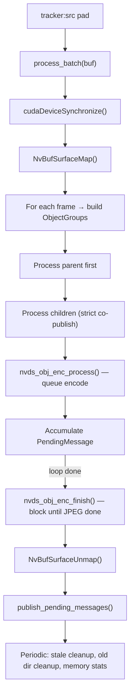
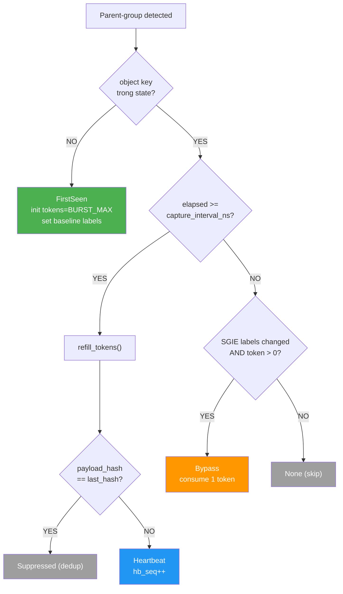
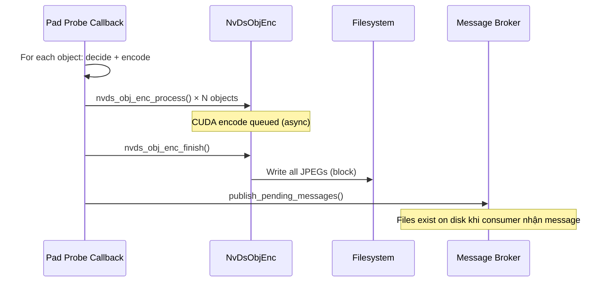
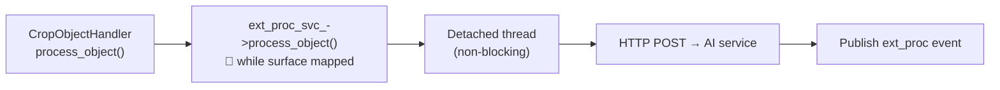

# CropObject Probe Handler

> **Scope**: GPU-accelerated object cropping (NvDsObjEnc), publish decision system (first_seen / bypass / heartbeat / exit), batch-accumulate-then-publish pattern.
>
> **Đọc trước**: [07 — Event Handlers & Probes](../deepstream/07_event_handlers_probes.md) · [ext_proc_svc.md](ext_proc_svc.md)

---

## Mục lục

- [1. Tổng quan](#1-tổng-quan)
- [2. YAML Config](#2-yaml-config)
- [3. Publish Decision System](#3-publish-decision-system)
- [4. Per-Object State & Dedup](#4-per-object-state--dedup)
- [5. Batch-Accumulate-Then-Publish](#5-batch-accumulate-then-publish)
- [6. CUDA Encoding — NvDsObjEnc](#6-cuda-encoding--nvdsobjenc)
- [7. Message Schema (JSON)](#7-message-schema-json)
- [8. Directory Structure & Cleanup](#8-directory-structure--cleanup)
- [9. So sánh vms-engine vs lantanav2](#9-so-sánh-vms-engine-vs-lantanav2)
- [10. External Processor Integration](#10-external-processor-integration)
- [11. Troubleshooting](#11-troubleshooting)
- [12. Cross-references](#12-cross-references)

---

## 1. Tổng quan

`CropObjectHandler` là pad probe cắt (crop) detected objects từ GPU frame thành ảnh JPEG, sử dụng **NvDsObjEnc** CUDA-accelerated encoder. Publish metadata qua `IMessageProducer` (Redis Streams / Kafka).



### Processing flow (per batch)

1. Map `NvBufSurface`, `cudaDeviceSynchronize()`
2. Iterate frame → build parent/child groups (`ObjectGroup`)
3. Per group: parent trước, children sau — **strict co-publish** (parent phải publish → child mới publish)
4. `nvds_obj_enc_finish()` — block đến khi tất cả JPEG ghi xong
5. `publish_pending_messages()` — publish tất cả accumulated messages
6. Periodic maintenance (stale cleanup, old dir cleanup, memory stats)

---

## 2. YAML Config

```yaml
event_handlers:
  - id: crop_objects
    enable: true
    type: on_detect
    probe_element: tracker          # Element ID để gắn probe
    trigger: crop_objects           # pad_name default "src"
    label_filter: [bike, bus, car, person, truck]
    save_dir: "/opt/vms_engine/dev/rec/objects"
    capture_interval_sec: 5         # PTS-based throttle
    image_quality: 85               # JPEG quality 1-100
    save_full_frame: true
    channel: worker_lsr_snap        # Redis/Kafka topic (rỗng = không publish)
    cleanup:
      stale_object_timeout_min: 5
      check_interval_batches: 30
      old_dirs_max_days: 7          # 0 = tắt
    ext_processor:                  # → xem ext_proc_svc.md
      enable: true
      min_interval_sec: 1
      rules:
        - label: face
          endpoint: "http://face-rec-svc:8080/api/v1/recognize"
          result_path: "match.external_id"
          display_path: "match.face_name"
```

| Field                          | Type     | Default | Mô tả                                          |
| ------------------------------ | -------- | ------- | ----------------------------------------------- |
| `probe_element`                | string   | —       | Element ID gắn probe (thường `tracker`)         |
| `label_filter`                 | string[] | `[]`    | Label filter; rỗng = tất cả                     |
| `save_dir`                     | string   | —       | Thư mục gốc lưu crop                            |
| `capture_interval_sec`         | int      | `5`     | PTS-based throttle giữa 2 captures cùng object  |
| `image_quality`                | int      | `85`    | JPEG quality 1–100                               |
| `save_full_frame`              | bool     | `true`  | Lưu full-frame cùng crop                        |
| `channel`                      | string   | `""`    | Publish channel; rỗng = tắt                     |
| `cleanup.stale_object_timeout_min` | int  | `5`     | Xóa state nếu không thấy object sau N phút     |
| `cleanup.check_interval_batches`   | int  | `30`    | Chạy cleanup mỗi N batches                      |
| `cleanup.old_dirs_max_days`        | int  | `7`     | Xóa daily dirs cũ hơn N ngày; 0=tắt            |

---

## 3. Publish Decision System

### 3.1 PubDecisionType

```cpp
enum class PubDecisionType {
    None,       // Không publish (throttled / dedup suppressed)
    FirstSeen,  // Object lần đầu xuất hiện (tracker ID mới)
    Bypass,     // SGIE label thay đổi + token available (burst capture)
    Heartbeat,  // Periodic re-publish sau capture_interval_sec
    Exit        // Object bị xóa do stale timeout (metadata-only)
};
```

### 3.2 Decision Flow



### 3.3 Token Bucket (Bypass)

Bypass fires **chỉ khi** SGIE label string thay đổi so với `last_sgie_labels` baseline.

| Thông số             | Giá trị  | Mô tả                                              |
| -------------------- | -------- | --------------------------------------------------- |
| `BURST_MAX`          | 3        | Max tokens per object                               |
| `TOKEN_REFILL_NS`    | 5s       | Refill 1 token mỗi 5s (PTS-based)                  |
| `BYPASS_MIN_GAP_NS`  | 1s       | Debounce tối thiểu giữa 2 bypass                   |
| `K_ON_FRAMES`        | 5        | Object phải ổn định 5 frames trước publish          |
| `K_OFF_FRAMES`       | 2        | Cho phép gap 2 frames khi tính ON hysteresis        |
| `K_LABEL_FRAMES`     | 5        | Label change phải ổn định 5 frames mới bypass       |

> 📋 `group_sgie_signature` = parent SGIE labels + aggregated child SGIE labels → quyết định first_seen/bypass/heartbeat cho group. Khi publish, `labels` field chỉ chứa classifier labels của chính object đó.

---

## 4. Per-Object State & Dedup

### 4.1 ObjectPubState

```cpp
struct ObjectPubState {
    GstClockTime last_publish_pts;
    uint64_t heartbeat_seq;           // Đếm heartbeat (bypass không tăng)
    std::size_t last_payload_hash;    // Hash cho dedup
    std::string last_message_id;      // mid → prev_mid chain
    std::string last_instance_key;    // Reuse cho child khi parent dedup
    int bypass_tokens;                // Token bucket
    GstClockTime last_refill_pts;
    std::string last_sgie_labels;     // SGIE baseline cho bypass trigger
};
```

### 4.2 State Maps

| Map                       | Key                                    | Mô tả                                     |
| ------------------------- | -------------------------------------- | ------------------------------------------ |
| `object_keys_`            | `compose_key(source_id, tracker_id)`   | Persistent UUIDv7 per tracker              |
| `object_last_seen_`       | same                                   | PTS lần cuối thấy object                   |
| `last_capture_pts_`       | same                                   | PTS lần cuối capture                       |
| `pub_state_`              | same                                   | Publish state (hash, seq, tokens)          |
| `child_parent_oid_cache_` | `compose_key(src, child_tid)`          | Fallback parent lookup khi obj->parent null |

### 4.3 Payload Hash Dedup

```cpp
// Hash combine: class_id + label + sgie_labels + quantized_bbox (7 components)
// Include sgie_labels → khi SGIE re-classify, hash invalidate → dedup não suppress
```

Object đứng yên (bbox + labels không đổi) → heartbeat bị suppress → giảm message volume.

---

## 5. Batch-Accumulate-Then-Publish



**Tại sao batch-accumulate:**
1. `nvds_obj_enc_finish()` block cho đến khi tất cả JPEG ghi xong
2. Publish SAU finish → consumer nhận message khi file đã tồn tại
3. Giảm thời gian giữ mutex — accumulate nhanh, publish một lần

---

## 6. CUDA Encoding — NvDsObjEnc

```cpp
// 1. Create context (1 lần trong configure)
enc_ctx_ = nvds_obj_enc_create_context(0);  // GPU 0

// 2. Queue encode per object
NvDsObjEncUsrArgs enc_args{};
enc_args.saveImg = TRUE;
enc_args.quality = image_quality_;
enc_args.isFrame = 0;  // 0=crop, 1=full-frame
snprintf(enc_args.fileNameImg, ..., crop_path.c_str());
nvds_obj_enc_process(enc_ctx_, &enc_args, ip_surf, obj, frame_meta);

// 3. Finish (PHẢI gọi mỗi batch)
nvds_obj_enc_finish(enc_ctx_);
```

> ⚠️ **CRITICAL**: `cudaDeviceSynchronize()` PHẢI chạy trước encode — nếu không, decoder chưa ghi xong GPU buffer → ảnh JPEG bị mờ/corrupted.

**Full-frame dedup**: Chỉ encode 1 lần per `frame_num` per batch — reuse path cho các objects cùng frame.

---

## 7. Message Schema (JSON)

### 7.1 Published Fields

```json
{
  "event": "crop_bb",
  "pid": "pipeline_01",
  "sid": 0, "sname": "camera-01",
  "instance_key": "019785f3-...",
  "oid": 42, "object_key": "019785f2-...",
  "parent_object_key": "", "parent": "", "parent_instance_key": "",
  "class": "car", "conf": 0.92, "class_id": 2,
  "labels": "sport_car:0:0.87|sedan:1:0.11",
  "top": 200.3, "left": 120.5, "w": 80.0, "h": 60.0,
  "s_w_ff": 1920, "s_h_ff": 1080, "w_ff": 1920, "h_ff": 1080,
  "fname": "20250711/s0_RT20250711_143022_456_car_id42.jpg",
  "fname_ff": "20250711/s0_RT20250711_143022_456_frame_ff.jpg",
  "event_ts": "1720700000000",
  "mid": "019785f3-...", "prev_mid": "",
  "pub_type": "first_seen", "pub_reason": "New object detected",
  "hb_seq": 0, "frame_num": 1234, "tracker_id": 42
}
```

### 7.2 pub_type Values

| pub_type     | Trigger                              | Image | hb_seq    |
| ------------ | ------------------------------------ | ----- | --------- |
| `first_seen` | Tracker ID mới                       | Có    | 0         |
| `bypass`     | SGIE label change + token available  | Có    | Giữ nguyên|
| `heartbeat`  | Periodic sau capture_interval_sec    | Có    | +1        |
| `exit`       | Stale timeout cleanup                | Không | Giữ nguyên|

### 7.3 Message Chain Example

```
first_seen: mid=A, prev_mid="",  labels="",                           hb_seq=0
→ bypass:   mid=B, prev_mid=A,   labels="sport_car:0:0.87",           hb_seq=0
→ bypass:   mid=C, prev_mid=B,   labels="sedan:1:0.95",               hb_seq=0
→ heartbeat:mid=D, prev_mid=C,   labels="sedan:1:0.95",               hb_seq=1
→ exit:     mid=E, prev_mid=D,   fname="", fname_ff="", labels="",    hb_seq=1
```

Consumer dùng `object_key` + `prev_mid` xây dựng event timeline per object.

> 📋 **Redis flat publish**: `IMessageProducer::publish_json()` → Redis XADD với flat fields (không có `data` wrapper). Kafka → JSON string as payload.

---

## 8. Directory Structure & Cleanup

### 8.1 Daily Rotation

```
save_dir/
  └── 20250711/                                       ← YYYYMMDD, tự tạo mỗi ngày
       ├── s0_RT20250711_143022_456_car_id42.jpg      ← crop
       ├── s0_RT20250711_143022_456_frame_ff.jpg      ← full-frame
       └── s1_RT20250711_143025_789_truck_id15.jpg
```

| File Type  | Format                                                 |
| ---------- | ------------------------------------------------------ |
| Crop       | `s{sid}_RT{YYYYMMDD_HHMMSS_mmm}_{label}_id{oid}.jpg`  |
| Full-frame | `s{sid}_RT{YYYYMMDD_HHMMSS_mmm}_frame_ff.jpg`         |

> 📋 Flat directory — không có `src_N/` subdir (aligned lantanav2). `fname`/`fname_ff` là **relative paths** từ `save_dir`.

### 8.2 Stale Object Cleanup

Mỗi `check_interval_batches` batch:
1. Tìm entries `(current_pts - last_seen) > timeout_ns`
2. Tạo Exit `PendingMessage` (metadata-only)
3. Xóa đồng bộ: `object_keys_`, `object_last_seen_`, `last_capture_pts_`, `pub_state_`, `child_parent_oid_cache_`

### 8.3 Emergency Hard Limit

```cpp
static constexpr size_t MAX_TRACKED_OBJECTS = 5000;
// Vượt → clear ALL maps (prevent unbounded memory growth)
```

### 8.4 Memory Stats Logging

```
CropObjectHandler: memory stats — tracked=42 last_seen=42 capture_pts=38 pub_state=42 parent_cache=17 ~9KB
```

### 8.5 Teardown Safety

```cpp
CropObjectHandler::~CropObjectHandler() {
    shutting_down_.store(true, std::memory_order_release);
    if (enc_ctx_) nvds_obj_enc_destroy_context(enc_ctx_);
}
// on_buffer checks shutting_down_ early → skip processing
```

---

## 9. So sánh vms-engine vs lantanav2

### 9.1 Cải thiện

| Cải thiện                   | lantanav2                                   | vms-engine                                     |
| --------------------------- | ------------------------------------------- | ---------------------------------------------- |
| Redis publish               | `data` wrapper (consumer parse 2 lần)       | Flat fields (consumer đọc trực tiếp)           |
| Config                      | Semicolon string (dễ lỗi)                   | Typed C++ structs từ YAML                      |
| Transport                   | `RedisStreamProducer` (coupled)             | `IMessageProducer` (Redis/Kafka abstract)      |
| JSON types                  | All string (`std::to_string`)               | Native float/int                                |
| Heartbeat dedup             | Track hash nhưng không suppress             | Suppress duplicate (object đứng yên)           |
| Memory safety               | Không có limit                              | `MAX_TRACKED_OBJECTS=5000` + memory stats log  |
| Source dims                 | `frame_meta->source_frame_width`            | `NvBufSurface` (actual GPU buffer)             |

### 9.2 Giữ nguyên

Event name `"crop_bb"` · File naming `s{sid}_RT...` · Flat `YYYYMMDD/` dirs · Message fields (28+ fields) · Token bucket `BURST_MAX=3` / `TOKEN_REFILL=5s` · Batch-accumulate-then-publish · Full-frame dedup per batch · 5 state maps + stale cleanup · `mid`/`prev_mid` chain · `cudaDeviceSynchronize` · Label-change bypass

### 9.3 Không port

| Feature                       | Lý do                                            |
| ----------------------------- | ------------------------------------------------ |
| `ChildPresenceStateV2` hysteresis | vms-engine dùng PTS-based + parent-link fallback |
| WSL GPU detect                | Container-native, không cần                      |
| Redis per-message `is_connected()` | Fire-and-forget + LOG_W                      |
| hb_seq conditional push       | Luôn include trong mọi pub_type                  |

---

## 10. External Processor Integration

`ext_processor` sub-block → tạo `ExternalProcessorService` trong `configure()`.



Chi tiết → [ext_proc_svc.md](ext_proc_svc.md)

---

## 11. Troubleshooting

| Vấn đề                      | Nguyên nhân                            | Fix                                          |
| ---------------------------- | -------------------------------------- | -------------------------------------------- |
| JPEG mờ/corrupted           | `cudaDeviceSynchronize()` fail/skip    | Kiểm tra GPU load, CUDA driver               |
| Không tạo file JPEG          | Encoder context null                   | Kiểm tra GPU ID, DeepStream encoder libs     |
| Memory tăng không ngừng      | Tracker ID churn (crowded scene)       | Giảm `stale_object_timeout_min`, tracker config |
| Publish thất bại             | Redis connection issue                 | Kiểm tra broker host/port                    |
| Heartbeat bị suppress nhiều  | Object đứng yên (dedup đúng behavior) | Tắt dedup hoặc set `capture_interval_sec=0`  |

---

## 12. Cross-references

| Topic                     | Document                                                        |
| ------------------------- | --------------------------------------------------------------- |
| Probe system overview     | [07 — Event Handlers](../deepstream/07_event_handlers_probes.md)|
| External Processor detail | [ext_proc_svc.md](ext_proc_svc.md)                             |
| SmartRecord probe         | [smart_record_probe_handler.md](smart_record_probe_handler.md)  |
| Class ID namespacing      | [class_id_namespacing_handler.md](class_id_namespacing_handler.md) |
| RAII for encoder contexts | [RAII Guide](../RAII.md)                                        |
| Pipeline building         | [03 — Pipeline Building](../deepstream/03_pipeline_building.md) |
