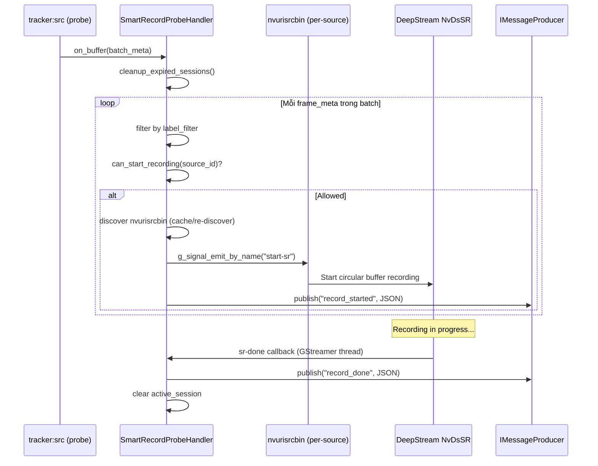
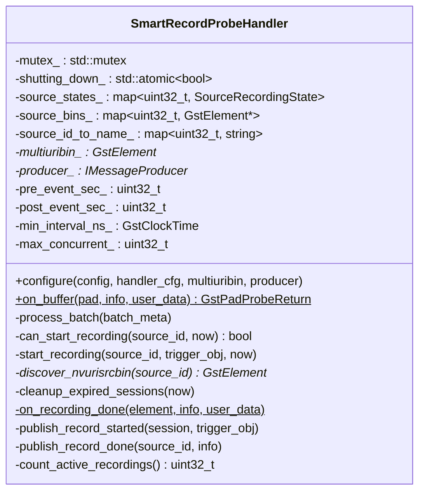
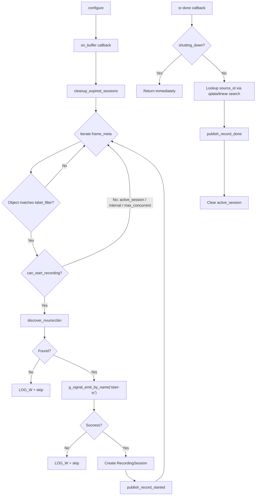
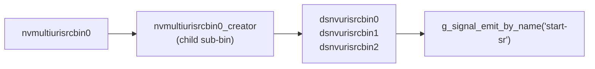

# SmartRecordProbeHandler — Deep Dive

> **Scope**: `SmartRecordProbeHandler` — pad probe trên `tracker:src` điều khiển NvDsSR smart recording theo object detection.
>
> 📖 **Liên quan**: [07 — Event Handlers & Probes](../deepstream/07_event_handlers_probes.md) · [09 — Outputs & Smart Record](../deepstream/09_outputs_smart_record.md) · [ClassIdNamespacingHandler](class_id_namespacing_handler.md)

---

## Mục Lục

- [1. Tổng Quan](#1-tổng-quan)
- [2. YAML Config](#2-yaml-config)
- [3. Event Publishing (JSON)](#3-event-publishing-json)
- [4. Code Structure](#4-code-structure)
- [5. Lifecycle Flow](#5-lifecycle-flow)
- [6. Design Decisions](#6-design-decisions)
- [7. Thread Safety](#7-thread-safety)
- [8. Tích Hợp ProbeHandlerManager](#8-tích-hợp-probehandlermanager)
- [9. Checklist & Troubleshooting](#9-checklist--troubleshooting)
- [10. Quan Hệ với ClassIdNamespaceHandler](#10-quan-hệ-với-classidnamespacehandler)
- [11. Config Field Logic (pre / post / min_interval)](#11-config-field-logic-pre--post--min_interval)
- [12. So Sánh với lantanav2](#12-so-sánh-với-lantanav2)
- [13. File References](#13-file-references)

---

## 1. Tổng Quan

`SmartRecordProbeHandler` sử dụng **NvDsSR API** (Smart Record) của DeepStream để ghi video clip khi phát hiện object. Probe gắn trên `tracker:src` pad, khi detect object khớp `label_filter` → emit signal `start-sr` trên `nvurisrcbin` tương ứng → DeepStream back-fill từ circular buffer và ghi file `.mp4`.



**Pipeline position**:

```
nvmultiurisrcbin → muxer → PGIE → tracker ──[probe:src]──→ ...
                                                 ↑
                                      SmartRecordProbeHandler
                                      (signal start-sr trên nvurisrcbin)
```

---

## 2. YAML Config

### 2.1 Sources Block (nvmultiurisrcbin)

```yaml
sources:
  type: nvmultiurisrcbin
  smart_record: 2              # 0=off, 1=cloud-only, 2=multi (recommended)
  smart_rec_dir_path: "/opt/engine/data/rec"
  smart_rec_file_prefix: "vms_rec"
  smart_rec_cache: 10          # circular buffer (giây) — phải ≥ pre_event_sec
  smart_rec_default_duration: 30
  cameras:
    - id: camera-01
      uri: "rtsp://192.168.1.100:554/stream"
```

### 2.2 Event Handler Entry

```yaml
event_handlers:
  - id: smart_record
    enable: true
    type: on_detect
    probe_element: tracker
    pad_name: src
    source_element: nvmultiurisrcbin0   # tên element trong pipeline
    trigger: smart_record
    label_filter: [car, person, truck]
    pre_event_sec: 5
    post_event_sec: 20
    min_interval_sec: 2
    max_concurrent_recordings: 4
    broker:
      channel: "smart_record:events"     # Redis/Kafka channel
```

### 2.3 Field Reference

| Field                      | Type     | Default | Mô tả                                                    |
| -------------------------- | -------- | ------- | -------------------------------------------------------- |
| `pre_event_sec`            | uint32   | `5`     | Giây back-fill từ circular buffer trước detection        |
| `post_event_sec`           | uint32   | `20`    | Giây ghi sau detection                                   |
| `min_interval_sec`         | uint32   | `2`     | Khoảng cách tối thiểu giữa 2 actual_start (giây)        |
| `max_concurrent_recordings`| uint32   | `4`     | Số recording đồng thời tối đa (tất cả source cộng lại)  |
| `label_filter`             | string[] | `[]`    | Labels cho phép trigger; rỗng = accept all               |
| `source_element`           | string   | `""`    | Tên `nvmultiurisrcbin` element — bắt buộc               |
| `broker.channel`           | string   | `""`    | Channel publish events; rỗng = không publish             |

> ⚠️ `smart_rec_cache` (sources block) phải ≥ `pre_event_sec` (handler block). Nếu cache nhỏ hơn, DeepStream chỉ back-fill được phần cache có sẵn.

---

## 3. Event Publishing (JSON)

Handler publish 2 loại event qua `IMessageProducer::publish()`. Field names tương thích lantanav2 để consumer side xử lý cả hai.

### 3.1 record_started

Publish ngay sau `g_signal_emit_by_name("start-sr")` thành công:

```json
{
  "event": "record_started",
  "pid": "pipeline-01",
  "sid": 0,
  "sname": "camera-01",
  "session_id": 42,
  "start_time": 5,
  "duration": 25000,
  "trigger_obj": 12345,
  "event_ts": 1741000000000
}
```

### 3.2 record_done

Publish trong `on_recording_done` callback (GStreamer internal thread):

```json
{
  "event": "record_done",
  "pid": "pipeline-01",
  "sid": 0,
  "sname": "camera-01",
  "session_id": 42,
  "width": 1920,
  "height": 1080,
  "filename": "/opt/engine/data/rec/vms_rec_cam0_1741000000.mp4",
  "duration": 25000000000,
  "event_ts": 1741000025000
}
```

### 3.3 Field Comparison

| Field         | record_started     | record_done          | Notes                                         |
| ------------- | ------------------ | -------------------- | --------------------------------------------- |
| `event`       | `"record_started"` | `"record_done"`      | Event type identifier                         |
| `pid`         | pipeline id        | pipeline id          | `config.pipeline.id`                          |
| `sid`         | source_id          | source_id            | `frame_meta->source_id`                       |
| `sname`       | camera name        | camera name          | `cameras[source_id].id`                       |
| `session_id`  | NvDsSR session ID  | NvDsSR session ID    | Consumer match started↔done                   |
| `start_time`  | pre_event_sec      | —                    | Circular buffer back-fill (giây)              |
| `duration`    | **milliseconds**   | **nanoseconds**      | ⚠️ Đơn vị khác nhau!                          |
| `trigger_obj` | tracker object ID  | —                    | Object trigger recording                      |
| `width/height`| —                  | video dimensions     | Từ `NvDsSRRecordingInfo`                      |
| `filename`    | —                  | full file path       | Từ `NvDsSRRecordingInfo`                      |
| `event_ts`    | epoch ms           | epoch ms             | `now_epoch_ms()`                              |

> ⚠️ **Duration units khác nhau**: `record_started.duration` = **milliseconds** (`(pre+post)*1000`); `record_done.duration` = **nanoseconds** (trực tiếp từ `NvDsSRRecordingInfo::duration`). Convert sang giây: `ns / 1_000_000_000.0`.

---

## 4. Code Structure

### 4.1 Core Structs

```cpp
struct RecordingSession {
    uint32_t session_id;     // NvDsSR session ID
    uint32_t source_id;
    std::string source_name;
    GstClockTime start_time; // GstClockTime at session start
    uint32_t duration_sec;   // pre_event_sec + post_event_sec
};

struct SourceRecordingState {
    GstClockTime last_record_time = 0;         // actual_start timestamp
    std::optional<RecordingSession> active_session;
    gulong signal_handler_id = 0;              // sr-done signal
};
```

### 4.2 Class Overview



---

## 5. Lifecycle Flow



**`can_start_recording()` decision chain**:

```
1. active_session != nullopt?       → FALSE (source đang ghi)
2. count_active_recordings() >= max? → FALSE (global limit)
3. now - last_record_time < min_interval_ns? → FALSE (quá sớm)
4. Else → TRUE
```

---

## 6. Design Decisions

### 6.1 GstClockTime Only (không dùng std::chrono)

| Aspect    | lantanav2                              | vms-engine                                   |
| --------- | -------------------------------------- | -------------------------------------------- |
| Interval  | `std::chrono::steady_clock`            | `GstClockTime` via `gst_clock_get_time()`    |
| Session   | Mixed `chrono` + `GstClockTime`        | Thuần `GstClockTime`                         |
| Risk      | Clock drift giữa 2 domain             | Một clock domain — không drift               |

```cpp
GstClock* clock = gst_system_clock_obtain();
GstClockTime now = gst_clock_get_time(clock);
gst_object_unref(clock);
```

> 📋 `now_epoch_ms()` chỉ dùng cho `event_ts` trong JSON publish — không dùng cho timing logic.

### 6.2 actual_start Interval Reference

`last_record_time` lưu **actual_start** (đầu circular buffer), không phải thời điểm detect:

```
actual_start = now - pre_event_ns
last_record_time = actual_start
```

Trace với `pre=2, post=20, min_interval=2`:

```
T=10  Detect → actual_start = 8  → last_record_time = 8
T=12  Detect → active_session ≠ null → BLOCK
T=30  sr-done → active_session = null
T=32  Detect → 32-8=24 ≥ 2 → ALLOW
```

### 6.3 Stale Cache Detection

`source_bins_` cache `GstElement*` per source_id. Khi source bị hot-swap → element cũ bị destroy → cache stale.

**Validation**: mỗi lần lookup, kiểm tra bằng `gst_bin_get_by_name()`:
- Match → dùng cache
- Mismatch → re-discover, cập nhật cache

### 6.4 nvurisrcbin Discovery Path



Naming convention: `dsnvurisrcbin{source_id}` — **DS8 specific**, version khác có thể thay đổi.

### 6.5 cleanup_expired_sessions

Chạy mỗi `on_buffer` call, trước khi xử lý detection:

```
deadline = session.start_time + duration_sec * GST_SECOND + 5s grace
if (now > deadline) → clear active_session, LOG_W
```

Grace period 5s cho phép sr-done callback đến muộn (vi dụ: I/O flush delay).

### 6.6 max_concurrent_recordings

`count_active_recordings()` đếm tất cả source có `active_session != nullopt`, dưới `mutex_` lock. Khi đạt limit → source mới bị block cho đến khi session khác kết thúc.

### 6.7 shutting_down Atomic Guard

```cpp
shutting_down_.store(true);     // Set TRƯỚC disconnect_all_signals()
disconnect_all_signals();       // Ngắt tất cả sr-done signal handlers
```

Trong `on_recording_done`:
```cpp
if (shutting_down_.load()) return;  // Skip processing — pipeline đang shutdown
```

### 6.8 qdata source_id Mapping

`sr-done` callback nhận `GstElement* nvurisrcbin` nhưng không biết `source_id`. Giải pháp:

```cpp
// Khi discover: gắn source_id vào element
g_object_set_data(G_OBJECT(urisrcbin), "source_id",
                  GUINT_TO_POINTER(source_id));

// Trong sr-done callback: đọc lại
gpointer data = g_object_get_data(G_OBJECT(element), "source_id");
uint32_t source_id = GPOINTER_TO_UINT(data);
```

Fallback: linear search trong `source_bins_` nếu qdata missing.

> 📋 qdata tồn tại ngay cả khi `source_bins_` cache bị evicted (stale).

---

## 7. Thread Safety

| Resource             | Guard                  | Notes                                              |
| -------------------- | ---------------------- | -------------------------------------------------- |
| `source_states_`     | `mutex_`               | Đọc/ghi từ probe thread + sr-done callback thread  |
| `source_bins_`       | Probe thread only      | Không cần mutex — single-thread access              |
| `source_id_to_name_` | Configure phase only   | Read-only sau `configure()` — safe without lock     |
| `shutting_down_`     | `std::atomic<bool>`    | Lock-free flag cho callback threads                 |

> 📋 **Probe thread**: `on_buffer` → `process_batch` → `can_start_recording` → `start_recording` — tất cả cùng 1 GStreamer streaming thread.
> **sr-done thread**: `on_recording_done` chạy trên internal thread của `nvurisrcbin` — **khác** probe thread.

---

## 8. Tích Hợp ProbeHandlerManager

```cpp
// pipeline/src/probes/probe_handler_manager.cpp
} else if (cfg.trigger == "smart_record") {
    GstElement* multiuribin = nullptr;
    if (!cfg.source_element.empty()) {
        multiuribin = find_element(cfg.source_element);
    }

    auto* handler = new SmartRecordProbeHandler();
    handler->configure(full_config_, cfg, multiuribin, producer_);

    gst_pad_add_probe(
        pad, GST_PAD_PROBE_TYPE_BUFFER,
        SmartRecordProbeHandler::on_buffer, handler,
        [](gpointer ud) { delete static_cast<SmartRecordProbeHandler*>(ud); });
}
```

**Ownership**: `new` tạo handler → GStreamer nhận ownership qua `GDestroyNotify` lambda → `delete` khi probe bị remove (pipeline shutdown).

---

## 9. Checklist & Troubleshooting

### 9.1 Điều Kiện Hoạt Động

| Điều Kiện                              | Nơi Config              | Notes                                      |
| -------------------------------------- | ---------------------- | ------------------------------------------ |
| `sources.smart_record > 0`            | YAML `sources:`        | `2` = multi (recommended)                  |
| `smart_rec_dir_path` writable         | YAML + host filesystem | Thư mục phải tồn tại + có quyền ghi       |
| `source_element` trỏ đúng element     | YAML `event_handlers:` | Tên `nvmultiurisrcbin` trong pipeline      |
| `enable: true`                         | YAML `event_handlers:` |                                            |
| `label_filter` khớp PGIE model labels | YAML `event_handlers:` | Rỗng = accept all                          |
| `libnvdsgst_smartrecord.so`           | DeepStream install     | `/opt/nvidia/deepstream/deepstream/lib/`   |
| Probe callback không blocking I/O     | Implementation         | Non-blocking requirement                   |

### 9.2 Lỗi Thường Gặp

| Log Message                              | Nguyên Nhân                                        | Giải Pháp                                     |
| ---------------------------------------- | ------------------------------------------------- | --------------------------------------------- |
| `nvurisrcbin not found for source N`     | `source_element` sai tên / stream chưa connect    | Kiểm tra element name; inspect DOT graph      |
| `max concurrent recordings (4) reached`  | Global limit đạt                                  | Tăng `max_concurrent_recordings` / giảm `post_event_sec` |
| `session N expired without sr-done`      | Source disconnect khi đang ghi / pipeline error    | Handler tự clear sau grace period — auto-recover |
| `cached nvurisrcbin stale, re-discovering`| Source hot-swap tạo element mới                   | Auto-handled — không cần can thiệp            |

---

## 10. Quan Hệ với ClassIdNamespaceHandler

Khi pipeline dùng cả `class_id_offset/restore` và `smart_record`, **thứ tự YAML quan trọng**:

```yaml
event_handlers:
  - id: class_id_offset
    probe_element: tracker
    pad_name: sink              # TRƯỚC tracker xử lý
    trigger: class_id_offset

  - id: class_id_restore
    probe_element: tracker
    pad_name: src               # SAU tracker
    trigger: class_id_restore

  - id: smart_record            # PHẢI sau class_id_restore
    probe_element: tracker
    pad_name: src
    trigger: smart_record
    label_filter: [car, person]
```

> 📋 GStreamer probe FIFO — `class_id_restore` chạy trước `smart_record` trên cùng `tracker:src` pad → `label_filter` nhận class_ids gốc.
>
> 📖 Chi tiết: [ClassIdNamespacingHandler](class_id_namespacing_handler.md)

---

## 11. Config Field Logic (pre / post / min_interval)

### 11.1 Giá Trị Truyền DeepStream

```
start_time_sec  = pre_event_sec                 → circular buffer back-fill
total_duration  = pre_event_sec + post_event_sec → tổng độ dài video
```

Ví dụ `pre=2, post=20`: `start-sr(start=2, total=22)` → video = 2s trước + 20s sau = 22s.

### 11.2 Trace Đầy Đủ

```
pre=2, post=20, min_interval=2

T=10  Detect car
      actual_start = 10-2 = 8
      last_record_time = 8
      active_session = {session_id=5, duration_sec=22}
      → start-sr(start=2, total=22) → ghi T=8..T=30
      → publish record_started {duration=22000ms}

T=12  Detect car → active_session ≠ null → BLOCK

T=30  sr-done → active_session = null
      → publish record_done {duration=22000000000ns, filename="..."}

T=32  Detect car → 32-8=24 ≥ 2 → ALLOW → recording mới
```

### 11.3 sr-done Bị Mất (Stream Ngắt)

```
T=10  Detect → active_session bắt đầu, duration=22s
T=15  Stream ngắt → sr-done không đến

deadline = start_time + 22s + 5s grace = T=37
T=37  cleanup_expired_sessions() → clear → source hoạt động lại bình thường
```

### 11.4 Ý Nghĩa Từng Field

| Field              | Ảnh Hưởng                                     | Constraint                                    |
| ------------------ | --------------------------------------------- | --------------------------------------------- |
| `pre_event_sec`    | Nội dung trước detection trong video          | `smart_rec_cache` ≥ `pre_event_sec`           |
| `post_event_sec`   | Nội dung sau detection trong video            | Video dài = `pre + post` giây                 |
| `min_interval_sec` | Khoảng cách tối thiểu giữa 2 actual_start    | Tính từ actual_start, không phải detect time  |

---

## 12. So Sánh với lantanav2

| Khía Cạnh            | lantanav2                                | vms-engine                                            |
| -------------------- | ---------------------------------------- | ----------------------------------------------------- |
| **Messaging**        | `RedisStreamProducer` hardcode           | `IMessageProducer*` interface — pluggable              |
| **Config API**       | `init_context(string, std::any)` parse   | `configure(PipelineConfig&, ...)` type-safe            |
| **Callback typing**  | Typed `NvDsSRRecordingInfo*` param       | `gpointer` + cast nội bộ                              |
| **Mutex**            | 2 mutex: `elements_` + `state_`         | 1 mutex duy nhất — ít deadlock risk                   |
| **Element cache**    | `GstElementRef` RAII class (~50 LOC)     | Raw `GstElement*` + stale check via `gst_bin_get_by_name` |
| **Per-object debounce**| `object_last_seen` map per source      | Bỏ — session-level guard đủ, ít memory                |
| **Clock**            | Mixed `chrono` + `GstClockTime`          | Thuần `GstClockTime` — 1 clock domain                 |
| **Publish format**   | Redis XADD flat key-value                | JSON qua `IMessageProducer::publish(channel, json)`   |
| **Publish methods**  | Inline trong start/done                  | Tách `publish_record_started/done` — testable          |

**Cải thiện chính**:
1. **IMessageProducer interface** → pluggable broker (Redis/Kafka/custom)
2. **Type-safe config** → lỗi phát hiện lúc YAML parse, không phải runtime
3. **Một clock domain** → không drift giữa `chrono` và `GstClockTime`
4. **Bỏ per-object map** → `active_session` + `min_interval` đủ ngăn overlap
5. **Tách publish methods** → có Doxygen, unit-testable riêng

> ✅ Field names JSON tương thích 100% với lantanav2 — consumer side xử lý cả hai mà không cần sửa.

---

## 13. File References

| File                                                     | Vai Trò                                    |
| -------------------------------------------------------- | ------------------------------------------ |
| `pipeline/include/.../probes/smart_record_probe_handler.hpp` | Header — structs, class declaration     |
| `pipeline/src/probes/smart_record_probe_handler.cpp`     | Implementation                             |
| `pipeline/src/probes/probe_handler_manager.cpp`          | Registration dispatch (`"smart_record"`)   |
| `core/include/.../config/config_types.hpp`               | `EventHandlerConfig` struct                |
| `infrastructure/config_parser/src/yaml_parser_handlers.cpp` | YAML → EventHandlerConfig parsing       |
| `docs/architecture/deepstream/07_event_handlers_probes.md` | Probe handler overview                   |
| `docs/configs/deepstream_default.yml`                    | Full YAML config example                   |
