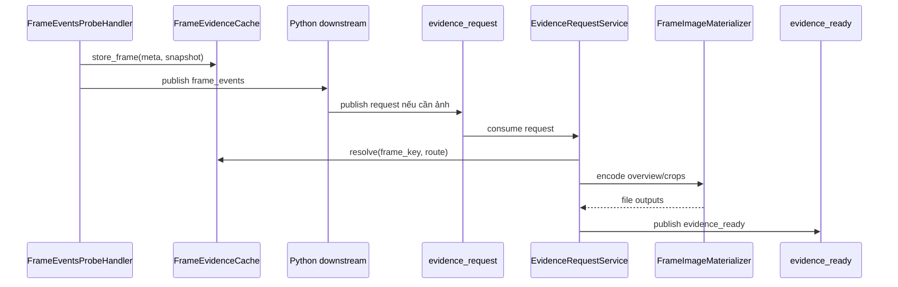

# Evidence Workflow — Request-Driven Media Materialization

> **Scope**: `FrameEvidenceCache`, `EvidenceRequestService`, `FrameImageMaterializer`, và contract `frame_events -> evidence_request -> evidence_ready`.
>
> **Đọc trước**: [frame_events_probe_handler.md](frame_events_probe_handler.md) · [frame_events_ext_proc_service.md](frame_events_ext_proc_service.md)

---

## Mục lục

- [1. Tổng quan](#1-tổng-quan)
- [2. Khi nào subsystem được bật](#2-khi-nào-subsystem-được-bật)
- [3. YAML Config](#3-yaml-config)
- [4. Vai trò từng thành phần](#4-vai-trò-từng-thành-phần)
- [5. Lifecycle của emitted frame](#5-lifecycle-của-emitted-frame)
- [6. Message Contracts](#6-message-contracts)
- [7. Materialization Rules](#7-materialization-rules)
- [8. Cache Resolution và Retention](#8-cache-resolution-và-retention)
- [9. Failure Semantics](#9-failure-semantics)
- [10. Vận hành & Debug](#10-vận-hành--debug)
- [11. Cross-references](#11-cross-references)

---

## 1. Tổng quan

Evidence subsystem của `vms-engine` được thiết kế theo hướng `semantic first, media later`.

`FrameEventsProbeHandler` chỉ publish `frame_events` và cache lại snapshot của những frame đã emit. Việc encode JPEG overview hoặc crop chỉ diễn ra khi downstream thực sự cần ảnh và publish một message `evidence_request`.



Mục tiêu của mô hình này là:

1. Không block semantic path bằng I/O hoặc JPEG encode.
2. Cho downstream quyết định frame nào thực sự cần evidence.
3. Giữ contract `frame_key`, `overview_ref`, `crop_ref` ổn định giữa semantic layer và media layer.

---

## 2. Khi nào subsystem được bật

Subsystem evidence có 2 lớp activation khác nhau:

### 2.1 Cache layer

Chỉ cần:

1. `evidence.enable = true`

Khi đó `PipelineManager` sẽ tạo `FrameEvidenceCache` để:

- cache emitted frame cho workflow evidence
- và đồng thời phục vụ `FrameEventsExtProcService`

### 2.2 Request-processing layer

Để `EvidenceRequestService` thực sự chạy vòng consume/publish, cần thêm:

1. `producer_` đã được wire
2. `consumer_` đã được wire
3. `request_channel` subscribe thành công

Nếu producer hoặc consumer chưa đủ, cache vẫn có thể tồn tại nhưng request loop sẽ không start.

---

## 3. YAML Config

### 3.1 Ví dụ cấu hình

```yaml
evidence:
  enable: true
  request_channel: worker_lsr_evidence_request
  ready_channel: worker_lsr_evidence_ready
  save_dir: "/opt/vms_engine/dev/rec/frames"
  frame_cache_ttl_ms: 10000
  max_frame_gap_ms: 250
  overview_jpeg_quality: 85
  cache_on_frame_events: true
  cache_backend: nvbufsurface_copy
  max_frames_per_source: 16
  encode_dedupe_ttl_ms: 30000
  max_recent_encoded_refs: 256
```

### 3.2 Field reference

<!-- markdownlint-disable MD060 -->

| Field                     | Default                          | Ý nghĩa                                                     |
| ------------------------- | -------------------------------- | ----------------------------------------------------------- |
| `enable`                  | `false`                          | Bật evidence subsystem                                      |
| `request_channel`         | `""`                             | Stream/topic để engine consume `evidence_request`           |
| `ready_channel`           | `""`                             | Stream/topic để engine publish `evidence_ready`             |
| `save_dir`                | `/opt/vms_engine/dev/rec/frames` | Root directory materialize JPEG ra đĩa                      |
| `frame_cache_ttl_ms`      | `10000`                          | TTL của cached emitted frames                               |
| `max_frame_gap_ms`        | `250`                            | Fallback nearest-frame tolerance khi exact `frame_key` miss |
| `overview_jpeg_quality`   | `85`                             | JPEG quality dùng cho overview và crop                      |
| `cache_on_frame_events`   | `true`                           | Có cache frame đã emit từ `frame_events` hay không          |
| `cache_backend`           | `nvbufsurface_copy`              | Backend snapshot hiện tại                                   |
| `max_frames_per_source`   | `16`                             | Hard bound cho mỗi `(pipeline_id, source_name, source_id)`  |
| `encode_dedupe_ttl_ms`    | `30000`                          | TTL cho recent dedupe map sau khi artifact đã được encode   |
| `max_recent_encoded_refs` | `256`                            | Hard bound cho recent dedupe map                            |

<!-- markdownlint-enable MD060 -->

---

## 4. Vai trò từng thành phần

| Thành phần                | Vai trò                                                                   |
| ------------------------- | ------------------------------------------------------------------------- |
| `FrameEventsProbeHandler` | Chọn frame cần emit, build naming contract, và handoff snapshot vào cache |
| `FrameEvidenceCache`      | Sở hữu frame snapshot đã emit cùng metadata/object snapshot               |
| `EvidenceRequestService`  | Parse request, resolve cache, encode evidence, publish completion         |
| `FrameImageMaterializer`  | Shared helper để encode overview hoặc crop từ cached frame                |
| `PipelineManager`         | Tạo cache, tạo request loop, start/stop worker threads liên quan          |

Điểm quan trọng là `FrameImageMaterializer` không chỉ phục vụ evidence workflow. Nó cũng được tái sử dụng bởi `FrameEventsExtProcService` để materialize crop bytes cho external enrichment.

---

## 5. Lifecycle của emitted frame

### 5.1 Tại thời điểm semantic emit

Khi `FrameEventsProbeHandler` quyết định một frame cần publish:

1. Build `frame_key`
2. Build `overview_ref`
3. Build `objects[].crop_ref`
4. Gọi `FrameEvidenceCache::store_frame(...)`
5. Chỉ sau đó mới publish `frame_events`

Thứ tự này giúp downstream có thể bắn `evidence_request` ngay sau khi nhận `frame_events` mà không đụng race cache.

### 5.2 Naming contract

`overview_ref` và `crop_ref` hiện là **filename/ref only**.

Ví dụ:

```text
de1_camera-01_150_1735825200000_overview.jpg
de1_camera-01_150_1735825200000_crop_42.jpg
```

Những ref này:

- không phải absolute path
- không prepend `save_dir`
- được downstream echo lại trong `evidence_request`
- chỉ được join với `save_dir` khi engine thực sự ghi file ra đĩa

---

## 6. Message Contracts

### 6.1 `evidence_request`

Downstream gửi request theo routing envelope của frame đã nhận từ `frame_events`.

```json
{
  "event": "evidence_request",
  "request_id": "req-0001",
  "pipeline_id": "de1",
  "source_id": 0,
  "source_name": "camera-01",
  "frame_key": "de1:camera-01:150:1735825200000",
  "frame_ts_ms": 1735825200000,
  "evidence_types": ["overview", "crop"],
  "overview_ref": "de1_camera-01_150_1735825200000_overview.jpg",
  "objects": [
    {
      "object_key": "de1:camera-01:42",
      "instance_key": "de1:camera-01:150:42",
      "object_id": 42,
      "crop_ref": "de1_camera-01_150_1735825200000_crop_42.jpg"
    }
  ]
}
```

### 6.2 `evidence_ready` success

```json
{
  "event": "evidence_ready",
  "request_id": "req-0001",
  "pipeline_id": "de1",
  "source_id": 0,
  "source_name": "camera-01",
  "frame_key": "de1:camera-01:150:1735825200000",
  "frame_ts_ms": 1735825200000,
  "status": "ok",
  "encode_reason": "encoded",
  "overview_ref": "de1_camera-01_150_1735825200000_overview.jpg",
  "objects": [
    {
      "object_key": "de1:camera-01:42",
      "instance_key": "de1:camera-01:150:42",
      "object_id": 42,
      "crop_ref": "de1_camera-01_150_1735825200000_crop_42.jpg"
    }
  ]
}
```

### 6.3 Routing rule

Các field sau phải đi cùng nhau để tránh resolve nhầm frame giữa nhiều pipeline hoặc nhiều source:

- `pipeline_id`
- `source_id`
- `source_name`
- `frame_key`
- `frame_ts_ms`

`frame_key` là key ưu tiên. `frame_ts_ms` đóng vai trò fallback để nearest-match trong ngưỡng `max_frame_gap_ms` khi exact key không còn.

---

## 7. Materialization Rules

### 7.1 Resolve output path

`EvidenceRequestService` chỉ join output path theo công thức:

```text
<save_dir>/<overview_ref hoặc crop_ref>
```

Service sẽ reject các ref có dấu hiệu không an toàn như:

- absolute path
- path traversal kiểu `..`

### 7.2 Overview và crop fallback

- Overview ưu tiên `job.overview_ref`, nếu rỗng thì dùng `entry.meta.overview_ref`
- Crop ưu tiên `request_object.crop_ref`, fallback sang `cached_object.crop_ref`
- Nếu request không match được cached object nhưng vẫn có bbox fallback hợp lệ thì service có thể generate output ref nội bộ cho path đó

### 7.3 Encode backend

Encode hiện chạy trên cached frame snapshot bằng `FrameImageMaterializer`, không đụng live `NvBufSurface` từ pad probe.

### 7.4 Duplicate request handling

- Engine giữ một recent-materialization map trong memory, keyed theo `(pipeline_id, source_name, source_id, frame_key, ref)`.
- Entry trong map được stale theo `evidence.encode_dedupe_ttl_ms` và bounded bởi `evidence.max_recent_encoded_refs`, nên không phụ thuộc file local còn tồn tại hay đã bị media service upload/xóa.
- Nếu toàn bộ artifact trong request đã có recent entry còn sống, completion event vẫn được publish với `status = "ok"` và `encode_reason = "already_encoded"`.
- Nếu request còn thiếu ít nhất một artifact chưa có recent entry, engine chỉ encode phần thiếu và completion event dùng `encode_reason = "encoded"`.

---

## 8. Cache Resolution và Retention

### 8.1 Resolution strategy

`FrameEvidenceCache::resolve(...)` dùng 2 tầng lookup:

1. exact match theo `frame_key`
2. nearest timestamp match trong ngưỡng `max_frame_gap_ms`

### 8.2 Retention strategy

Cache được prune theo:

- TTL `frame_cache_ttl_ms`
- hard bound `max_frames_per_source`

Điều này giúp evidence workflow không giữ snapshot vô hạn khi camera đông hoặc downstream request chậm.

---

## 9. Failure Semantics

| Tình huống                       | Hành vi                                                                 |
| -------------------------------- | ----------------------------------------------------------------------- |
| Không parse được payload request | Bỏ job hoặc publish status lỗi tùy giai đoạn parse                      |
| Artifact đã encode gần đây       | Publish `evidence_ready(status=ok, encode_reason=already_encoded)`      |
| Cache miss                       | Publish `evidence_ready(status=not_found)`                              |
| Ref không hợp lệ                 | Publish `evidence_ready(status=error)` với lỗi như `invalid_output_ref` |
| Encode fail                      | Publish `evidence_ready(status=error)`                                  |
| Downstream gửi request quá trễ   | Có thể miss exact frame vì TTL hết hạn                                  |

Evidence path là asynchronous completion path. Nó không phải synchronous response cho `frame_events`.

---

## 10. Vận hành & Debug

### 10.1 Log quan trọng

Khi subsystem start thành công, log thường có dạng:

```text
PipelineManager: evidence subsystem initialized (request='worker_lsr_evidence_request' ready='worker_lsr_evidence_ready' save_dir='/opt/vms_engine/dev/rec/frames')
PipelineManager: evidence loop started on 'worker_lsr_evidence_request'
```

### 10.2 Checklist debug

1. Xác nhận `evidence.enable = true`
2. Xác nhận producer và consumer đều được wire
3. Xác nhận subscribe được `request_channel`
4. Kiểm tra TTL cache nếu downstream request chậm
5. Kiểm tra downstream có echo đúng `frame_key`, `overview_ref`, `crop_ref`

### 10.3 Triệu chứng phổ biến

<!-- markdownlint-disable MD060 -->

| Triệu chứng                                       | Nguyên nhân hay gặp                                                         |
| ------------------------------------------------- | --------------------------------------------------------------------------- |
| Có `frame_events` nhưng không có `evidence_ready` | consumer chưa subscribe hoặc request chưa được publish                      |
| `evidence_ready:not_found` nhiều                  | cache TTL ngắn hoặc downstream gửi quá muộn                                 |
| `invalid_output_ref`                              | downstream gửi absolute path hoặc ref chứa `..`                             |
| RAM tăng                                          | `max_frames_per_source` hoặc `max_recent_encoded_refs` lớn, hay TTL quá dài |

<!-- markdownlint-enable MD060 -->

---

## 11. Cross-references

| Topic                  | Document                                                                               |
| ---------------------- | -------------------------------------------------------------------------------------- |
| Semantic primary feed  | [frame_events_probe_handler.md](frame_events_probe_handler.md)                         |
| frame_events ext-proc  | [frame_events_ext_proc_service.md](frame_events_ext_proc_service.md)                   |
| Legacy crop media path | [crop_object_handler.md](crop_object_handler.md)                                       |
| Event handler overview | [../deepstream/07_event_handlers_probes.md](../deepstream/07_event_handlers_probes.md) |
