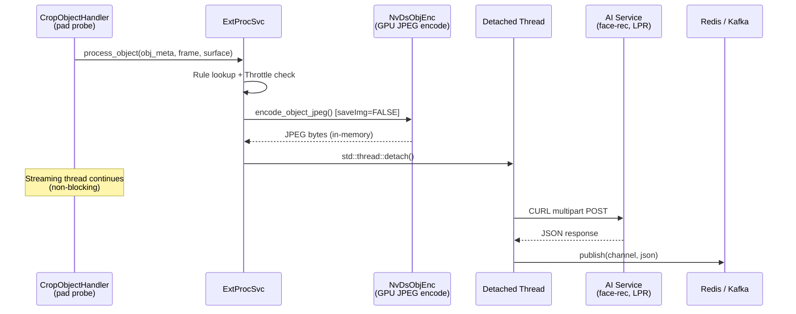
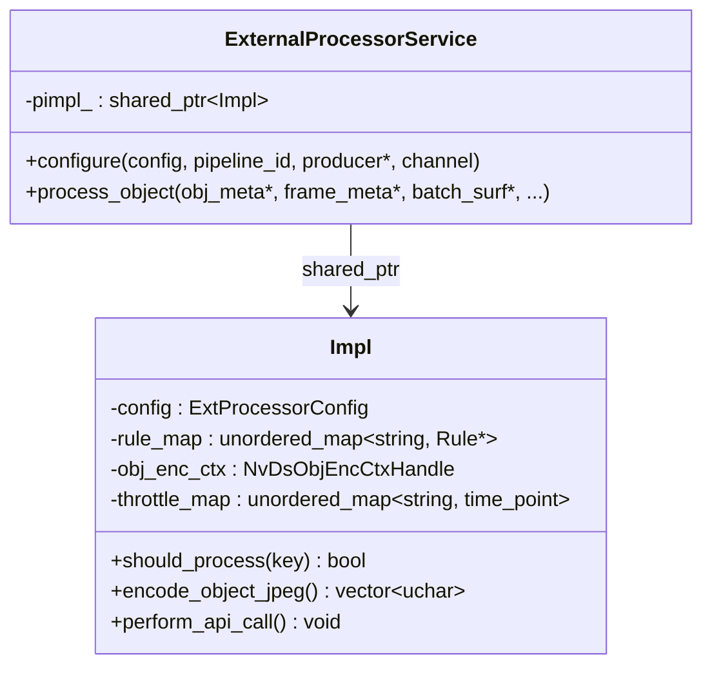
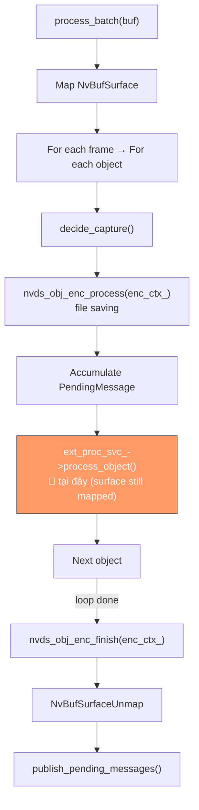

# External Processor Service (ExtProcSvc) — HTTP AI Enrichment

> **Scope**: HTTP-based AI enrichment (face recognition, license plate lookup, etc.) cho detected objects, chạy non-blocking trong detached threads.
>
> **Đọc trước**: [07 — Event Handlers & Probes](../deepstream/07_event_handlers_probes.md) · [crop_object_handler.md](crop_object_handler.md) · [frame_events_ext_proc_service.md](frame_events_ext_proc_service.md) · [evidence_workflow.md](evidence_workflow.md)

<!-- markdownlint-disable MD040 MD060 -->

---

## Mục lục

- [External Processor Service (ExtProcSvc) — HTTP AI Enrichment](#external-processor-service-extprocsvc--http-ai-enrichment)
  - [Mục lục](#mục-lục)
  - [1. Tổng quan](#1-tổng-quan)
    - [So sánh lantanav2 vs vms-engine](#so-sánh-lantanav2-vs-vms-engine)
  - [2. YAML Config](#2-yaml-config)
  - [3. Cơ chế hoạt động](#3-cơ-chế-hoạt-động)
    - [3.1 Throttle (Per-object Rate Limiting)](#31-throttle-per-object-rate-limiting)
    - [3.2 In-Memory JPEG Encoding](#32-in-memory-jpeg-encoding)
    - [3.3 HTTP POST (CURL Multipart)](#33-http-post-curl-multipart)
    - [3.4 JSON Response Parsing](#34-json-response-parsing)
  - [4. Code Structure](#4-code-structure)
    - [Pimpl với `shared_ptr` — Lifetime Safety](#pimpl-với-shared_ptr--lifetime-safety)
  - [5. Message Publish Schema](#5-message-publish-schema)
  - [6. Tích hợp CropObjectHandler](#6-tích-hợp-cropobjecthandler)
  - [7. Ví dụ: Face Recognition](#7-ví-dụ-face-recognition)
  - [8. Vận hành \& Debug](#8-vận-hành--debug)
  - [9. Cross-references](#9-cross-references)

---

## 1. Tổng quan

`ExternalProcessorService` — service standalone thực hiện **HTTP POST** gửi JPEG crop lên external AI endpoint, nhận JSON response, parse kết quả và publish qua `IMessageProducer`.

`FrameEventsExtProcService` hiện cũng dùng cùng pattern live-surface encode + detached HTTP thread, và giống legacy service ở chỗ được probe handler sở hữu trực tiếp. Khác biệt là nó được `FrameEventsProbeHandler` gọi sau `frame_events` semantic publish và publish payload ext-proc giàu correlation hơn.

Mặc dù được `CropObjectHandler` gọi từ probe path, implementation của legacy service hiện đã được đặt dưới `pipeline/extproc/` để gom toàn bộ external-enrichment services vào cùng một nhóm module.



### So sánh lantanav2 vs vms-engine

| Khía cạnh            | lantanav2 V2                      | vms-engine ExtProcSvc                    |
| -------------------- | --------------------------------- | ---------------------------------------- |
| Throttle key         | `parent_id:label`                 | `source_id:tracker_id:label`             |
| Messaging            | `RedisStreamProducer*` (concrete) | `IMessageProducer*` (interface)          |
| OSD support          | Có (pending*osd_results*)         | **Không**                                |
| Impl lifetime safety | Raw pointer capture               | `shared_ptr<Impl>` trong detached thread |

---

## 2. YAML Config

`ext_processor` là **sub-block** trong `event_handlers` entry có `trigger: crop_objects`:

```yaml
event_handlers:
  - id: crop_objects
    enable: true
    trigger: crop_objects
    label_filter: [face, person]
    # ...crop object config...

    ext_processor:
      enable: true
      min_interval_sec: 5 # Throttle per (source:tracker_id:label)
      rules:
        - label: face
          endpoint: "http://192.168.1.99:8765/api/v1/face/recognize/upload"
          result_path: "match.external_id" # Dot-notation JSON path
          display_path: "match.face_name" # Dot-notation JSON path
          params:
            threshold: "0.65"
            skip_detection: "false"

        - label: license_plate
          endpoint: "http://lpr-svc:9090/api/recognize"
          result_path: "plate.number"
          display_path: "plate.owner"
```

| Trường                 | Kiểu                  | Mô tả                                                 |
| ---------------------- | --------------------- | ----------------------------------------------------- |
| `enable`               | `bool`                | Bật/tắt service                                       |
| `min_interval_sec`     | `int`                 | Khoảng cách tối thiểu (s) giữa 2 API call cùng object |
| `rules[].label`        | `string`              | Label để áp dụng rule                                 |
| `rules[].endpoint`     | `string`              | HTTP POST endpoint (multipart/form-data)              |
| `rules[].result_path`  | `string`              | Dot-notation đến kết quả chính trong JSON             |
| `rules[].display_path` | `string`              | Dot-notation đến text hiển thị                        |
| `rules[].params`       | `map<string, string>` | Query parameters (auto URL-escaped)                   |

---

## 3. Cơ chế hoạt động

### 3.1 Throttle (Per-object Rate Limiting)

```
key = "<source_id>:<tracker_id>:<label>"     e.g. "0:42:face"
```

Dùng `std::chrono::steady_clock` (monotonic). Nếu `now - last < min_interval_sec` → skip.

### 3.2 In-Memory JPEG Encoding

Service dùng **encoder context riêng** (`obj_enc_ctx`), độc lập với `enc_ctx_` của `CropObjectHandler`:

```cpp
NvDsObjEncUsrArgs enc_args{};
enc_args.saveImg       = FALSE;    // Không ghi file — chỉ in-memory
enc_args.attachUsrMeta = TRUE;     // Attach JPEG vào obj_meta
enc_args.quality       = 80;

nvds_obj_enc_process(obj_enc_ctx, &enc_args, batch_surf, obj_meta, frame_meta);
nvds_obj_enc_finish(obj_enc_ctx);  // Block per-object (không tích lũy)
// Read NVDS_CROP_IMAGE_META → vector<uchar>
```

> ⚠️ **Timing**: `encode_object_jpeg()` PHẢI chạy khi `NvBufSurface` còn mapped — tức **bên trong vòng lặp object** của `CropObjectHandler::process_batch()`.

### 3.3 HTTP POST (CURL Multipart)

```
POST http://endpoint?param1=val1
Content-Type: multipart/form-data
  - file: image.jpg (JPEG bytes)
Timeout: connect=5s, total=10s
```

### 3.4 JSON Response Parsing

Dot-notation paths: `"match.external_id"` → `json["match"]["external_id"]`

Nếu parse fail → publish với `result=""`, `display=""`.

---

## 4. Code Structure

```text
pipeline/include/engine/pipeline/extproc/ext_proc_svc.hpp   ← Public interface
pipeline/src/extproc/ext_proc_svc.cpp                       ← Implementation (pimpl)
```



### Pimpl với `shared_ptr` — Lifetime Safety

```cpp
auto impl_ref = pimpl_;  // copy shared_ptr → extend Impl lifetime

std::thread([impl_ref = std::move(impl_ref), jpeg = std::move(jpeg_data), ...] {
    impl_ref->perform_api_call(...);  // Impl alive dù service bị destroy
}).detach();
```

> 📋 Nếu pipeline teardown xảy ra khi thread đang chạy → `shared_ptr` giữ `Impl` alive đủ lâu để API call hoàn thành.

---

## 5. Message Publish Schema

```json
{
  "event": "ext_proc",
  "pid": "pipeline-01",
  "sid": 0,
  "sname": "camera-01",
  "instance_key": "01956abc-...",
  "oid": 42,
  "object_key": "01956def-...",
  "class": "face",
  "class_id": 0,
  "conf": 0.92,
  "labels": "emp_001|Le Van A",
  "result": "emp_001",
  "display": "Le Van A",
  "event_ts": "1735825200000"
}
```

| Trường          | Nguồn                                              |
| --------------- | -------------------------------------------------- |
| `event`         | Constant `"ext_proc"`                              |
| `pid`           | `config.pipeline.id`                               |
| `sid` / `sname` | `frame_meta->source_id` / live `camera.id` mapping |
| `oid`           | `obj_meta->object_id` (tracker ID)                 |
| `labels`        | `result \| display` (lantanav2-compatible)         |
| `result`        | Parse từ `result_path`                             |
| `display`       | Parse từ `display_path`                            |
| `event_ts`      | `system_clock` epoch ms (string)                   |

> 📋 **Tương thích lantanav2**: JSON giữ nguyên tất cả fields — downstream consumers không cần thay đổi.

---

## 6. Tích hợp CropObjectHandler



---

## 7. Ví dụ: Face Recognition

```yaml
ext_processor:
  enable: true
  min_interval_sec: 5
  rules:
    - label: face
      endpoint: "http://192.168.1.99:8765/api/v1/face/recognize/upload"
      result_path: "match.external_id"
      display_path: "match.face_name"
      params:
        threshold: "0.65"
        skip_detection: "false"
```

**Flow**: detect `face` → throttle check `"0:42:face"` → JPEG encode → POST → response `{"match":{"external_id":"emp_001","face_name":"Le Van A"}}` → publish `"ext_proc"` event.

---

## 8. Vận hành & Debug

| Concern      | Guideline                                                        |
| ------------ | ---------------------------------------------------------------- |
| CPU overload | Mỗi API call = 1 OS thread. Tăng `min_interval_sec` nếu overload |
| HTTP timeout | connect=5s, total=10s. Service chậm → thread tồn tại lâu         |
| JPEG encode  | ~1-3ms/object (GPU). Context riêng, không block file saver       |
| Dependencies | DeepStream 8.0, libcurl 7.x+, nlohmann/json 3.11+, C++17         |

```bash
# Debug ext_proc calls
GST_DEBUG=2 ./build/bin/vms_engine -c configs/default.yml 2>&1 | grep ext_proc
```

---

## 9. Cross-references

| Topic                        | Document                                                             |
| ---------------------------- | -------------------------------------------------------------------- |
| Probe system overview        | [07 — Event Handlers](../deepstream/07_event_handlers_probes.md)     |
| CropObject handler detail    | [crop_object_handler.md](crop_object_handler.md)                     |
| frame_events ext-proc detail | [frame_events_ext_proc_service.md](frame_events_ext_proc_service.md) |
| Evidence workflow            | [evidence_workflow.md](evidence_workflow.md)                         |
| SmartRecord probe            | [smart_record_probe_handler.md](smart_record_probe_handler.md)       |
| RAII for encoder contexts    | [RAII Guide](../RAII.md)                                             |

<!-- markdownlint-enable MD040 MD060 -->
