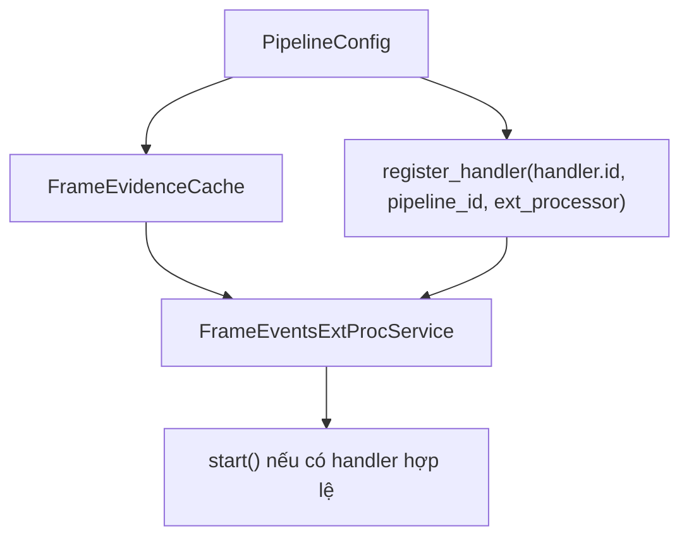

# FrameEventsExtProcService — Async External Enrichment for frame_events

> **Scope**: Service enrichment bất đồng bộ dành riêng cho `trigger: frame_events`.
>
> **Đọc trước**: [frame_events_probe_handler.md](frame_events_probe_handler.md) · [ext_proc_svc.md](ext_proc_svc.md) · [evidence_workflow.md](evidence_workflow.md)

---

## Mục lục

- [1. Tổng quan](#1-tổng-quan)
- [2. Khi nào service được bật](#2-khi-nào-service-được-bật)
- [3. YAML Config](#3-yaml-config)
- [4. Wiring trong pipeline](#4-wiring-trong-pipeline)
- [5. Runtime Flow](#5-runtime-flow)
- [6. Queue, Worker và Throttle](#6-queue-worker-và-throttle)
- [7. HTTP Request và Parse Result](#7-http-request-và-parse-result)
- [8. Payload Publish](#8-payload-publish)
- [9. Failure Semantics](#9-failure-semantics)
- [10. Vận hành & Debug](#10-vận-hành--debug)
- [11. Cross-references](#11-cross-references)

---

## 1. Tổng quan

`FrameEventsExtProcService` là sidecar bất đồng bộ dùng để enrich từng object đã nằm trong message `frame_events` bằng external HTTP API như face recognition hoặc license-plate recognition.

Khác với nhánh legacy `ExternalProcessorService` chạy trực tiếp trong `CropObjectHandler` trên live `NvBufSurface`, service này chạy **sau semantic publish**, sử dụng frame snapshot đã được giữ trong `FrameEvidenceCache`.

Hiện tại cả legacy service và service mới đều nằm trong module `pipeline/extproc/`, nhưng lifecycle và execution model của chúng khác nhau:

- `ext_proc_svc.*` phục vụ `crop_objects`, detached-thread per request.
- `frame_events_ext_proc_service.*` phục vụ `frame_events`, bounded worker pool.

Điều đó cho phép semantic path của `frame_events` giữ đúng thứ tự:

1. Chọn frame cần emit.
2. Cache frame snapshot.
3. Publish `frame_events`.
4. Enqueue ext-proc job.
5. Worker xử lý HTTP enrichment và publish `ext_proc`.

```mermaid
flowchart LR
    FE["FrameEventsProbeHandler"] --> CACHE["FrameEvidenceCache::store_frame()"]
    CACHE --> PUB["publish frame_events"]
    PUB --> ENQ["enqueue FrameEventsExtProcJob"]
    ENQ --> POOL["FrameEventsExtProcService"]
    POOL --> MAT["FrameImageMaterializer\nencode_crop_to_bytes()"]
    MAT --> API["HTTP API"]
    API --> MQ["publish ext_proc"]

    style FE fill:#4a9eff,color:#fff
    style CACHE fill:#00b894,color:#fff
    style POOL fill:#ff9f43,color:#fff
```



---

## 2. Khi nào service được bật

Service chỉ thực sự được tạo và start khi thỏa đồng thời các điều kiện sau:

1. `evidence.enable = true` để `PipelineManager` tạo `FrameEvidenceCache`.
2. `messaging` đã wire được `IMessageProducer`.
3. Có ít nhất một `event_handlers[]` với `trigger: frame_events` và `frame_events.ext_processor.enable = true`.
4. Handler đó có `publish_channel` hợp lệ và `rules` không rỗng.

Nếu thiếu cache hoặc producer thì semantic `frame_events` vẫn chạy bình thường, chỉ có ext-proc sidecar bị tắt.

---

## 3. YAML Config

### 3.1 Ví dụ cấu hình

```yaml
event_handlers:
  - id: frame_events
    enable: true
    trigger: frame_events
    channel: worker_lsr_frame_events
    frame_events:
      heartbeat_interval_ms: 1000
      min_emit_gap_ms: 250
      ext_processor:
        enable: true
        publish_channel: worker_lsr_ext_proc
        min_interval_sec: 5
        queue_capacity: 256
        worker_threads: 2
        jpeg_quality: 80
        connect_timeout_ms: 5000
        request_timeout_ms: 10000
        emit_empty_result: false
        include_overview_ref: true
        rules:
          - label: face
            endpoint: "http://face-rec-svc:8080/api/recognize"
            result_path: "match.external_id"
            display_path: "match.face_name"
            crop_ref_preferred: true
            params:
              threshold: "0.7"
```

### 3.2 Field reference

| Field                        | Default | Ý nghĩa                                                                 |
| ---------------------------- | ------- | ----------------------------------------------------------------------- |
| `enable`                     | `false` | Bật sidecar ext-proc cho handler `frame_events`                         |
| `publish_channel`            | `""`    | Stream/topic riêng để publish message `ext_proc`                        |
| `min_interval_sec`           | `5`     | Throttle cho cùng một object đã track                                   |
| `queue_capacity`             | `256`   | Dung lượng queue nội bộ trước khi drop job mới                          |
| `worker_threads`             | `2`     | Số worker xử lý HTTP request song song                                  |
| `jpeg_quality`               | `80`    | JPEG quality khi materialize crop bytes                                 |
| `connect_timeout_ms`         | `5000`  | Timeout kết nối HTTP                                                    |
| `request_timeout_ms`         | `10000` | Timeout tổng request                                                    |
| `emit_empty_result`          | `false` | Nếu `result_path` rỗng thì có publish `ext_proc` hay không              |
| `include_overview_ref`       | `true`  | Có echo `overview_ref` vào payload `ext_proc` hay không                 |
| `rules[].label`              | none    | Label object cần enrich, ví dụ `face`                                   |
| `rules[].endpoint`           | none    | HTTP endpoint URL                                                       |
| `rules[].result_path`        | none    | Dot-path tới kết quả chính trong JSON response                          |
| `rules[].display_path`       | none    | Dot-path tới text hiển thị trong JSON response                          |
| `rules[].params`             | `{}`    | Query parameters được append vào URL                                    |
| `rules[].crop_ref_preferred` | `true`  | Field config đã parse sẵn; hiện chưa ảnh hưởng runtime path của service |

> `crop_ref_preferred` đã tồn tại trong config model nhưng implementation hiện tại luôn ưu tiên `job.crop_ref`, rồi mới fallback về cached object crop ref nếu job chưa có giá trị.

---

## 4. Wiring trong pipeline

### 4.1 PipelineManager

`PipelineManager::initialize(...)` tạo service theo flow sau:

1. Tạo `FrameEvidenceCache` nếu `evidence.enable = true`.
2. Tạo `FrameEventsExtProcService(producer, cache)`.
3. Duyệt tất cả `event_handlers[]` để `register_handler(...)` cho từng handler `frame_events` có `ext_processor.enable = true`.
4. Nếu có ít nhất một handler đăng ký thành công thì gọi `start()`.



### 4.2 ProbeHandlerManager và FrameEventsProbeHandler

`ProbeHandlerManager` truyền pointer service vào riêng nhánh `frame_events`. `FrameEventsProbeHandler::configure(...)` giữ pointer này như dependency runtime.

Trong `on_buffer(...)`, sau khi `store_frame(...)` thành công và `publish_frame_message(...)` hoàn tất, handler sẽ tạo `FrameEventsExtProcJob` cho từng object phù hợp và gọi `enqueue(...)`.

Service mới không được gọi từ `crop_objects`; nhánh đó vẫn dùng `ExternalProcessorService` legacy trong `pipeline/extproc/ext_proc_svc.*`.

---

## 5. Runtime Flow

### 5.1 Job enqueue

`FrameEventsProbeHandler` điền các field chính của `FrameEventsExtProcJob`:

- routing: `handler_id`, `schema_version`, `pipeline_id`, `source_id`, `source_name`
- frame identity: `frame_key`, `frame_ts_ms`, `overview_ref`
- object identity: `object_key`, `instance_key`, `object_id`, `tracker_id`
- object semantics: `class_id`, `object_type`, `confidence`
- bbox snapshot: `left`, `top`, `width`, `height`
- crop naming: `crop_ref`

Nếu queue đầy thì `enqueue(...)` trả `false`, ghi warning, nhưng không ảnh hưởng `frame_events` đã publish trước đó.

### 5.2 Worker side

Mỗi worker thread tự tạo một `NvDsObjEncCtxHandle` riêng bằng `nvds_obj_enc_create_context(0)` và hủy context đó khi worker dừng.

Khi lấy được một job, `process_job(...)` chạy tuần tự:

1. Load `RegisteredHandler` từ `handler_id`.
2. Kiểm tra throttle.
3. Tìm `rule` theo `job.object_type`.
4. Resolve cached frame từ `FrameEvidenceCache` bằng `pipeline_id`, `source_name`, `source_id`, `frame_key`, `frame_ts_ms`.
5. Tìm object snapshot phù hợp theo thứ tự `object_key -> instance_key -> object_id`.
6. Dùng bbox/object info mới nhất từ cache nếu có.
7. Gọi `FrameImageMaterializer::encode_crop_to_bytes(...)` để lấy JPEG bytes.
8. Gửi HTTP request.
9. Parse JSON response.
10. Publish `ext_proc`.

---

## 6. Queue, Worker và Throttle

### 6.1 Queue model

Service dùng một queue nội bộ kiểu `std::deque<FrameEventsExtProcJob>` được bảo vệ bởi `mutex_` và `condition_variable`.

Đặc tính hiện tại:

- bounded queue theo `queue_capacity`
- khi full thì **drop job mới**, không block probe thread
- `start()` spawn tối đa `worker_threads`
- `stop()` set cờ `stop_`, đánh thức worker, `join()` toàn bộ thread, rồi clear queue

### 6.2 Throttle key

Throttle key hiện tại được build như sau:

```text
<pipeline_id>:<source_id>:<object_id>:<object_type>
```

Ví dụ:

```text
de1:0:42:face
```

Timestamp throttle dùng `steady_clock` millisecond, nên không phụ thuộc wall-clock drift.

### 6.3 Concurrency boundary

Pad probe chỉ enqueue job. Mọi tác vụ nặng như encode crop, CURL, parse JSON, publish broker đều diễn ra ở worker thread.

Điều này giữ cho semantic emit path không bị block bởi external API latency.

---

## 7. HTTP Request và Parse Result

### 7.1 Request shape

Service build URL từ `rule.endpoint` và append `rule.params` thành query string đã URL-escape.

HTTP body hiện dùng `multipart/form-data` với một part duy nhất:

```text
name="file"
filename="image.jpg"
content-type="image/jpeg"
```

Các option CURL chính:

- `CURLOPT_CONNECTTIMEOUT_MS = connect_timeout_ms`
- `CURLOPT_TIMEOUT_MS = request_timeout_ms`
- `CURLOPT_USERAGENT = FrameEventsExtProcService/1.0`

### 7.2 Parse result

Response body được parse bằng `nlohmann::json`. Dot-path như `match.external_id` được convert sang JSON pointer nội bộ `/match/external_id`.

Hai field được extract:

- `result` từ `rule.result_path`
- `display` từ `rule.display_path`

Nếu `result` rỗng và `emit_empty_result = false` thì service không publish gì.

### 7.3 JPEG bytes materialization

`FrameImageMaterializer::encode_crop_to_bytes(...)` hiện đang dùng cách an toàn nhưng chưa tối ưu nhất:

1. Encode crop ra file JPEG tạm trong thư mục temp của hệ điều hành.
2. Đọc file đó vào `std::vector<unsigned char>`.
3. Xóa file tạm.

Implementation này đúng chức năng, nhưng chi phí I/O sẽ cao hơn phương án lấy bytes trực tiếp từ encoder metadata trong tương lai.

---

## 8. Payload Publish

Message publish ra broker có event cố định là `ext_proc`.

### 8.1 Payload example

```json
{
  "event": "ext_proc",
  "schema_version": "1.0",
  "status": "ok",
  "pid": "de1",
  "pipeline_id": "de1",
  "sid": 0,
  "source_id": 0,
  "sname": "camera-01",
  "source_name": "camera-01",
  "frame_key": "de1:camera-01:150:1735825200000",
  "frame_ts_ms": 1735825200000,
  "instance_key": "de1:camera-01:150:42",
  "oid": 42,
  "tracker_id": 42,
  "object_key": "de1:camera-01:42",
  "class": "face",
  "class_id": 0,
  "conf": 0.92,
  "labels": "emp_001|Le Van A",
  "result": "emp_001",
  "display": "Le Van A",
  "crop_ref": "de1_camera-01_150_1735825200000_crop_42.jpg",
  "overview_ref": "de1_camera-01_150_1735825200000_overview.jpg",
  "event_ts": "1735825201234"
}
```

### 8.2 Field notes

| Field                   | Nguồn                                     |
| ----------------------- | ----------------------------------------- |
| `status`                | `ok` hoặc `empty_result`                  |
| `pid` / `pipeline_id`   | `job.pipeline_id`                         |
| `sid` / `source_id`     | `job.source_id`                           |
| `sname` / `source_name` | `job.source_name`                         |
| `oid`                   | `job.object_id`                           |
| `tracker_id`            | `job.tracker_id`                          |
| `labels`                | `result` hoặc `result\|display`           |
| `crop_ref`              | `job.crop_ref`, fallback từ cached object |
| `overview_ref`          | Chỉ có khi `include_overview_ref = true`  |
| `event_ts`              | wall-clock epoch ms tại thời điểm publish |

Service hiện publish song song các field legacy-style (`pid`, `sid`, `sname`, `oid`, `class`, `conf`) và field rõ nghĩa hơn (`pipeline_id`, `source_id`, `source_name`, `tracker_id`, `object_key`) để downstream cũ và downstream mới cùng dùng được.

---

## 9. Failure Semantics

Service ưu tiên fail-closed ở ext-proc path nhưng không làm hỏng semantic path. Một số hành vi quan trọng:

| Tình huống                                 | Hành vi                 |
| ------------------------------------------ | ----------------------- |
| Không tìm thấy handler/rule                | Bỏ qua job              |
| Queue đầy                                  | Drop job, log warning   |
| Cache miss                                 | Bỏ qua job, log debug   |
| Crop encode fail                           | Bỏ qua job, log warning |
| `curl_easy_init()` fail                    | Bỏ qua job              |
| HTTP request fail                          | Bỏ qua job, log warning |
| JSON parse fail                            | Bỏ qua job, log warning |
| `result` rỗng và `emit_empty_result=false` | Không publish           |

Không có retry queue, không có dead-letter queue, và không có back-pressure ngược lên pad probe ở implementation hiện tại.

---

## 10. Vận hành & Debug

### 10.1 Log đáng chú ý

Khi startup thành công, service log thông tin kiểu:

```text
FrameEventsExtProcService: registered handler='frame_events' channel='worker_lsr_ext_proc' workers=2 queue=256 min_interval_sec=5 jpeg_quality=80 rules=2
```

Khi queue đầy:

```text
FrameEventsExtProcService: dropping ext-proc job handler='frame_events' frame_key='...' object_key='...' because queue is full (256)
```

Khi cache miss:

```text
FrameEventsExtProcService: skip ext-proc handler='frame_events' frame_key='...' because frame is not in cache
```

### 10.2 Debug checklist

1. Xác nhận `evidence.enable = true`, nếu không sẽ không có `FrameEvidenceCache`.
2. Xác nhận handler `frame_events` có `frame_events.ext_processor.enable = true`.
3. Xác nhận `publish_channel` không rỗng.
4. Kiểm tra API endpoint reachable từ container/process runtime.
5. Nếu không thấy ext-proc event nhưng vẫn thấy `frame_events`, kiểm tra cache TTL, queue pressure, và label rule match.

### 10.3 Gợi ý grep log

```bash
GST_DEBUG=2 ./build/bin/vms_engine -c configs/default.yml 2>&1 | grep -E "FrameEventsExtProcService|frame_events|ext_proc"
```

---

## 11. Cross-references

| Topic                        | Document                                                                                                 |
| ---------------------------- | -------------------------------------------------------------------------------------------------------- |
| Semantic primary feed        | [frame_events_probe_handler.md](frame_events_probe_handler.md)                                           |
| Ext-proc overview hai nhánh  | [ext_proc_svc.md](ext_proc_svc.md)                                                                       |
| Request-driven evidence path | [evidence_workflow.md](evidence_workflow.md)                                                             |
| Phase 2 implementation plan  | [../plans/phase2/02_frame_events_ext_proc_phase2.md](../plans/phase2/02_frame_events_ext_proc_phase2.md) |
