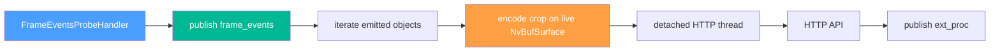

# FrameEventsExtProcService — Live-Surface External Enrichment for frame_events

> **Scope**: Service enrichment bất đồng bộ dành riêng cho `trigger: frame_events`.
>
> **Đọc trước**: [frame_events_probe_handler.md](frame_events_probe_handler.md) · [ext_proc_svc.md](ext_proc_svc.md) · [evidence_workflow.md](evidence_workflow.md)

---

## Mục lục

- [1. Tổng quan](#1-tổng-quan)
- [2. Khi nào service được bật](#2-khi-nào-service-được-bật)
- [3. YAML Config](#3-yaml-config)
- [4. Wiring trong pipeline](#4-wiring-trong-pipeline)
- [5. Runtime Flow](#5-runtime-flow)
- [6. HTTP Request và Parse Result](#6-http-request-và-parse-result)
- [7. Payload Publish](#7-payload-publish)
- [8. Failure Semantics](#8-failure-semantics)
- [9. Vận hành và Debug](#9-vận-hành-và-debug)
- [10. Cross-references](#10-cross-references)

---

## 1. Tổng quan

`FrameEventsExtProcService` là sidecar enrich bất đồng bộ cho `frame_events`, nhưng không còn đi qua `FrameEvidenceCache`, queue bounded, hay worker pool riêng. Service này hiện được `FrameEventsProbeHandler` tạo và sở hữu trực tiếp trong `configure(...)`, giống pattern `CropObjectHandler -> ExternalProcessorService` của nhánh `crop_objects`. Flow hiện tại đơn giản hơn:

1. `FrameEventsProbeHandler` chọn frame cần emit.
2. Nếu evidence đang bật thì cache frame snapshot cho workflow `evidence_request` độc lập.
3. Handler publish `frame_events`.
4. Ngay trong cùng probe callback, handler duyệt toàn bộ object vừa emit.
5. Object nào có `object_type` khớp `rules[].label` thì service encode crop ngay trên live `NvBufSurface`.
6. JPEG bytes được chuyển sang detached thread để gọi HTTP API và publish `ext_proc`.



Khác biệt chính so với phiên bản trước:

- không resolve frame lại từ cache
- không materialize crop qua file tạm
- không có queue capacity hay worker thread config riêng
- không có throttle riêng; cadence phụ thuộc trực tiếp vào emit policy của `frame_events`

---

## 2. Khi nào service được bật

Service được tạo và usable theo từng `FrameEventsProbeHandler` khi thỏa đồng thời các điều kiện sau:

1. `messaging` đã wire được `IMessageProducer`.
2. Có ít nhất một `event_handlers[]` với `trigger: frame_events`.
3. Handler đó có `frame_events.ext_processor.enable = true`.
4. Handler đó có `publish_channel` hợp lệ và `rules` không rỗng.

`evidence.enable` không còn là điều kiện để ext-proc này hoạt động. Evidence cache chỉ còn phục vụ nhánh `evidence_request -> evidence_ready`.

---

## 3. YAML Config

### 3.1 Ví dụ cấu hình

```yaml
event_handlers:
  - id: frame_events
    enable: true
    trigger: frame_events
    channel: worker_lsr_frame_events
    frame_events:
      heartbeat_interval_ms: 1000
      min_emit_gap_ms: 250
      ext_processor:
        enable: true
        publish_channel: worker_lsr_ext_proc
        jpeg_quality: 85
        connect_timeout_ms: 5000
        request_timeout_ms: 10000
        emit_empty_result: false
        include_overview_ref: true
        rules:
          - label: face
            endpoint: "http://192.168.1.99:8765/api/v1/face/recognize/upload"
            result_path: "match.external_id"
            display_path: "match.face_name"
            params:
              threshold: "0.65"
              skip_detection: "false"

          - label: license_plate
            endpoint: "http://lpr-svc:9090/api/recognize"
            result_path: "plate.number"
            display_path: "plate.owner"
```

### 3.2 Field reference

| Field                  | Default | Ý nghĩa                                                    |
| ---------------------- | ------- | ---------------------------------------------------------- |
| `enable`               | `false` | Bật sidecar ext-proc cho handler `frame_events`            |
| `publish_channel`      | `""`    | Stream/topic riêng để publish message `ext_proc`           |
| `jpeg_quality`         | `85`    | JPEG quality khi encode crop ngay trên live surface        |
| `connect_timeout_ms`   | `5000`  | Timeout kết nối HTTP                                       |
| `request_timeout_ms`   | `10000` | Timeout tổng request                                       |
| `emit_empty_result`    | `false` | Nếu `result_path` rỗng thì có publish `ext_proc` hay không |
| `include_overview_ref` | `true`  | Có echo `overview_ref` vào payload `ext_proc` hay không    |
| `rules[].label`        | none    | Label object cần enrich, ví dụ `face`                      |
| `rules[].endpoint`     | none    | HTTP endpoint URL                                          |
| `rules[].result_path`  | none    | Dot-path tới kết quả chính trong JSON response             |
| `rules[].display_path` | none    | Dot-path tới text hiển thị trong JSON response             |
| `rules[].params`       | `{}`    | Query parameters được append vào URL                       |

---

## 4. Wiring trong pipeline

`PipelineManager` không còn tạo `FrameEventsExtProcService` ở mức pipeline nữa. Ownership được dời xuống từng `FrameEventsProbeHandler`, và mỗi handler sẽ tự:

1. `std::make_unique<FrameEventsExtProcService>(producer)`
2. `register_handler(handler_id, pipeline_id, ext_processor_config)`
3. `start()` để tạo encoder context

Nếu một bước fail thì handler chỉ log warning và tắt ext-proc sidecar của chính nó; semantic `frame_events` vẫn chạy bình thường.

`ProbeHandlerManager` giờ chỉ truyền `producer` và `cache` vào `FrameEventsProbeHandler`. Trong `on_buffer(...)`, sau khi `publish_frame_message(...)` hoàn tất, handler map emitted objects trở lại `NvDsObjectMeta` tương ứng của frame hiện tại rồi gọi `process_object(...)` cho từng object.

---

## 5. Runtime Flow

### 5.1 Object filtering

Service không tự scan toàn bộ frame metadata. Việc scan object được làm ở chính `FrameEventsProbeHandler` đang sở hữu service:

1. build semantic `FrameEventObject[]`
2. publish `frame_events`
3. build map `object_id -> FrameEventObject`
4. duyệt lại `frame_meta->obj_meta_list`
5. object nào đã được emit thì gọi `FrameEventsExtProcService::process_object(...)`

Sau đó service lookup `rule` bằng `object_type`. Nếu không có rule cho label đó thì return ngay.

### 5.2 Crop encoding

`FrameEventsExtProcService::process_object(...)` encode crop ngay trong probe path theo đúng pattern của `ExternalProcessorService` legacy:

```cpp
NvDsObjEncUsrArgs enc_args{};
enc_args.saveImg = FALSE;
enc_args.attachUsrMeta = TRUE;
enc_args.quality = jpeg_quality;

nvds_obj_enc_process(obj_enc_ctx, &enc_args, batch_surf, obj_meta, frame_meta);
nvds_obj_enc_finish(obj_enc_ctx);
```

Service đọc `NVDS_CROP_IMAGE_META` từ `obj_meta->obj_user_meta_list`, copy bytes sang `std::vector<unsigned char>`, rồi detached thread chỉ giữ bytes này chứ không giữ DeepStream pointer nào.

### 5.3 Async boundary

Async boundary nằm sau bước encode crop. Điều đó có nghĩa là:

- probe thread vẫn trả về mà không chờ HTTP response
- network, JSON parse, và broker publish chạy ở detached thread
- ext-proc này vẫn phụ thuộc live surface để encode crop, nhưng không phụ thuộc live surface cho phần HTTP

### 5.4 Không còn queue/throttle riêng

Phiên bản hiện tại cố ý **không có**:

- `queue_capacity`
- `worker_threads`
- throttle map riêng theo `(pipeline_id, source_id, object_id, label)`

Cadence của ext-proc bây giờ bám trực tiếp theo cadence của `frame_events`, vốn đã được điều khiển bởi `heartbeat_interval_ms`, `min_emit_gap_ms`, và emit policy của probe.

---

## 6. HTTP Request và Parse Result

### 6.1 Request shape

Service build URL từ `rule.endpoint` và append `rule.params` thành query string đã URL-escape.

HTTP body dùng `multipart/form-data` với một part duy nhất:

```text
name="file"
filename="image.jpg"
content-type="image/jpeg"
```

Các option CURL chính:

- `CURLOPT_CONNECTTIMEOUT_MS = connect_timeout_ms`
- `CURLOPT_TIMEOUT_MS = request_timeout_ms`
- `CURLOPT_USERAGENT = FrameEventsExtProcService/1.0`

### 6.2 Parse result

Response body được parse bằng `nlohmann::json`. Dot-path như `match.external_id` được convert sang JSON pointer nội bộ `/match/external_id`.

Hai field được extract:

- `result` từ `rule.result_path`
- `display` từ `rule.display_path`

Nếu `result` rỗng và `emit_empty_result = false` thì service không publish gì.

---

## 7. Payload Publish

Message publish ra broker có event cố định là `ext_proc`.

### 7.1 Payload example

```json
{
  "event": "ext_proc",
  "status": "ok",
  "pid": "de1",
  "pipeline_id": "de1",
  "sid": 0,
  "source_id": 0,
  "sname": "camera-01",
  "source_name": "camera-01",
  "frame_key": "de1:camera-01:150:1735825200000",
  "frame_ts_ms": 1735825200000,
  "instance_key": "de1:camera-01:150:42",
  "oid": 42,
  "tracker_id": 42,
  "object_key": "de1:camera-01:42",
  "class": "face",
  "class_id": 0,
  "conf": 0.92,
  "labels": "emp_001|Le Van A",
  "result": "emp_001",
  "display": "Le Van A",
  "crop_ref": "de1_camera-01_150_1735825200000_crop_42.jpg",
  "overview_ref": "de1_camera-01_150_1735825200000_overview.jpg",
  "event_ts": "1735825201234"
}
```

`oid` tiếp tục mirror tracker/object id để downstream cũ không phải đổi schema handling.

---

## 8. Failure Semantics

Service fail-closed ở ext-proc path nhưng không làm hỏng semantic path.

| Tình huống                                 | Hành vi                    |
| ------------------------------------------ | -------------------------- |
| Không tìm thấy handler/rule                | Bỏ qua object              |
| Encoder context chưa sẵn sàng              | Bỏ qua object              |
| JPEG encode fail                           | Bỏ qua object, log warning |
| `curl_easy_init()` fail                    | Bỏ qua object              |
| HTTP request fail                          | Bỏ qua object, log warning |
| JSON parse fail                            | Bỏ qua object, log warning |
| `result` rỗng và `emit_empty_result=false` | Không publish              |

Không có retry queue, không có dead-letter queue, và không có back-pressure ngược lên pad probe ngoài chi phí encode crop ngay tại callback.

---

## 9. Vận hành và Debug

### 9.1 Startup log

Khi register thành công, service log kiểu:

```text
FrameEventsExtProcService: registered handler='frame_events' channel='worker_lsr_ext_proc' jpeg_quality=80 connect_timeout_ms=5000 request_timeout_ms=10000 rules=2
```

Nếu handler không khởi tạo được service, log sẽ có dạng:

```text
FrameEventsProbeHandler: failed to initialize ext-proc service for handler='frame_events'
```

### 9.2 Debug checklist

1. Xác nhận handler `frame_events` có `frame_events.ext_processor.enable = true`.
2. Xác nhận `publish_channel` không rỗng.
3. Kiểm tra API endpoint reachable từ container/process runtime.
4. Nếu không thấy ext-proc event nhưng vẫn thấy `frame_events`, kiểm tra `rules[].label` có khớp `object_type` thực tế hay không.
5. Nếu API chậm, nhớ rằng detached threads sẽ tăng theo số object match trên mỗi semantic emit.

### 9.3 Gợi ý grep log

```bash
GST_DEBUG=2 ./build/bin/vms_engine -c configs/default.yml 2>&1 | grep -E "FrameEventsExtProcService|frame_events|ext_proc"
```

---

## 10. Cross-references

| Topic                        | Document                                                                                                 |
| ---------------------------- | -------------------------------------------------------------------------------------------------------- |
| Semantic primary feed        | [frame_events_probe_handler.md](frame_events_probe_handler.md)                                           |
| Legacy crop_objects ext-proc | [ext_proc_svc.md](ext_proc_svc.md)                                                                       |
| Request-driven evidence path | [evidence_workflow.md](evidence_workflow.md)                                                             |
| Phase 2 implementation plan  | [../plans/phase2/02_frame_events_ext_proc_phase2.md](../plans/phase2/02_frame_events_ext_proc_phase2.md) |
