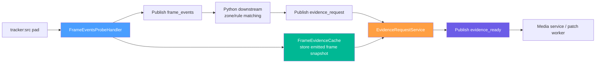
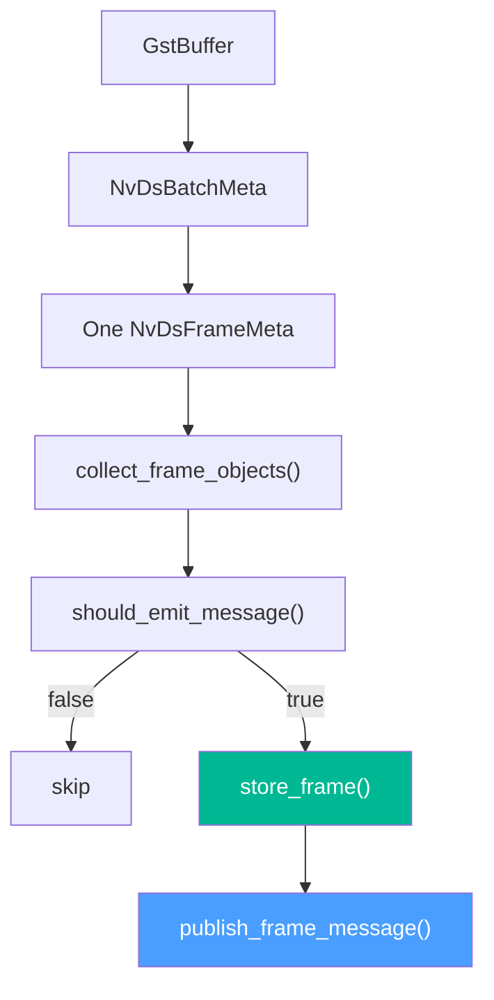
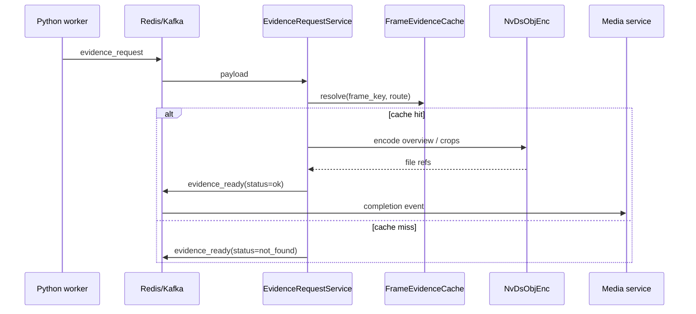

# FrameEventsProbeHandler — Semantic Primary Feed & Evidence Workflow

> **Scope**: `FrameEventsProbeHandler`, `FrameEvidenceCache`, `EvidenceRequestService`, `FrameEventsExtProcService`, và contract `frame_events -> evidence_request -> evidence_ready`.
>
> **Đọc trước**: [07 — Event Handlers & Probes](../deepstream/07_event_handlers_probes.md) · [05 — Configuration System](../deepstream/05_configuration.md) · [crop_object_handler.md](crop_object_handler.md) · [frame_events_ext_proc_service.md](frame_events_ext_proc_service.md) · [evidence_workflow.md](evidence_workflow.md)

---

## Mục lục

- [1. Tổng quan](#1-tổng-quan)
- [2. Tại sao tách khỏi crop_objects](#2-tại-sao-tách-khỏi-crop_objects)
- [3. YAML Config](#3-yaml-config)
- [4. Emit Policy](#4-emit-policy)
- [5. Logic Từng Hàm](#5-logic-từng-hàm)
- [6. Cache & Evidence Lifecycle](#6-cache--evidence-lifecycle)
- [7. Payload Schemas](#7-payload-schemas)
- [8. Downstream Guidance](#8-downstream-guidance)
- [9. Startup Logs](#9-startup-logs)
- [10. Troubleshooting](#10-troubleshooting)
- [11. Cross-references](#11-cross-references)

---

## 1. Tổng quan

`FrameEventsProbeHandler` là **canonical primary detection feed** cho downstream business-event generation. Nó publish theo **camera-frame**, không publish theo từng object riêng lẻ, và không encode JPEG trong semantic path.



Kiến trúc mới theo đúng tinh thần `semantic first, evidence later`:

1. DeepStream publish `frame_events` nhanh theo `state change + heartbeat`.
2. Python downstream match zone, polygon, debounce, hoặc business rule trên chính payload này.
3. Chỉ khi rule thực sự cần ảnh cho UI hoặc bằng chứng, Python mới publish `evidence_request`.
4. Engine resolve `frame_key` trong cache, encode overview hoặc crop theo yêu cầu, rồi publish `evidence_ready` cho media service.

`frame_events` và `evidence_ready` là hai loại message khác nhau:

- `frame_events` mang **detection semantics**.
- `evidence_ready` mang **media materialization result**.

Phần evidence subsystem hiện đã có tài liệu riêng tại [evidence_workflow.md](evidence_workflow.md). Tài liệu này giữ trọng tâm vào semantic emit path của `FrameEventsProbeHandler`, còn workflow request-driven media materialization được mô tả chi tiết ở doc evidence.

---

## 2. Tại sao tách khỏi crop_objects

`crop_objects` là luồng **media-first**: crop JPEG, full-frame JPEG, ext processor, cleanup thư mục, và publish metadata sau `nvds_obj_enc_finish()`.

`frame_events` giải quyết đúng các vấn đề mà `crop_objects` không phù hợp:

| Vấn đề                              | `crop_objects`                    | `frame_events`                                 |
| ----------------------------------- | --------------------------------- | ---------------------------------------------- |
| Canonical primary feed              | Không phù hợp                     | Có                                             |
| Same-frame PPE alignment            | Yếu vì per-object publish         | Có, vì 1 message chứa toàn bộ object của frame |
| Zone/rule matching ở Python         | Ảnh hưởng bởi encode/crop cadence | Phù hợp                                        |
| Alert trước, ảnh về sau             | Khó                               | Chủ đích                                       |
| Block semantic path bởi JPEG encode | Có                                | Không                                          |

`frame_events` cũng giải quyết bài toán jitter theo cách ổn định hơn `crop_objects`.

Trong code hiện tại, `object_set_change` dùng một signature ổn định, được build từ:

- `object_id`
- `class_id`
- `object_type`
- `parent_object_id`

Các phần tử được sort trước khi join, nên reorder metadata trong cùng frame sẽ **không** tạo false-positive change event. Đây là ý nghĩa của helper `build_signature(...)` trong implementation.

`objects[].labels` là contract riêng cho **SGIE classifier results**, dùng cùng verbose format với `CropObjectHandler`: mỗi phần tử có dạng `result_label:label_id:result_prob`. Tuy nhiên sliding-window majority vote chỉ lấy `result_label` (phần trước dấu `:` đầu tiên) để build signature ổn định. Các classifier labels này **không** đi vào `object_set_change`; chúng được so sánh riêng để suy ra `label_change`.

---

## 3. YAML Config

### 3.1 Minimal example

```yaml
messaging:
  type: redis
  host: 192.168.1.99
  port: 6379

evidence:
  enable: true
  request_channel: worker_lsr_evidence_request
  ready_channel: worker_lsr_evidence_ready
  save_dir: "/opt/vms_engine/dev/rec/frames"
  frame_cache_ttl_ms: 10000
  max_frame_gap_ms: 250
  overview_jpeg_quality: 85
  cache_on_frame_events: true
  cache_backend: nvbufsurface_copy
  max_frames_per_source: 16

event_handlers:
  - id: frame_events
    enable: true
    type: on_detect
    probe_element: tracker
    pad_name: src
    trigger: frame_events
    channel: worker_lsr_frame_events
    label_filter:
      [bike, bus, car, person, truck, helmet, head, hands, foot, smoke, flame]
    frame_events:
      heartbeat_interval_ms: 1000
      min_emit_gap_ms: 250
      motion_iou_threshold: 0.85
      center_shift_ratio_threshold: 0.05
      emit_on_motion_change: false
      emit_on_first_frame: true
      emit_on_object_set_change: true
      emit_on_label_change: true
      label_vote_window_frames: 5
      emit_on_parent_change: true
      emit_empty_frames: false
      ext_processor:
        enable: true
        publish_channel: worker_lsr_ext_proc
        min_interval_sec: 5
        queue_capacity: 256
        worker_threads: 2
        jpeg_quality: 80
        connect_timeout_ms: 5000
        request_timeout_ms: 10000
        emit_empty_result: false
        include_overview_ref: true
        rules:
          - label: face
            endpoint: "http://face-rec-svc:8080/api/recognize"
            result_path: "match.external_id"
            display_path: "match.face_name"
            crop_ref_preferred: true
```

### 3.2 `frame_events:` block

| Field                          | Default | Mô tả                                                             |
| ------------------------------ | ------- | ----------------------------------------------------------------- |
| `heartbeat_interval_ms`        | `1000`  | Heartbeat semantic khi scene ổn định                              |
| `min_emit_gap_ms`              | `250`   | Chặn burst quá dày do tracker jitter                              |
| `motion_iou_threshold`         | `0.85`  | Ngưỡng IoU dùng cho `motion_change` khi cờ motion bật             |
| `center_shift_ratio_threshold` | `0.05`  | Ngưỡng dịch chuyển tâm dùng cho `motion_change` khi cờ motion bật |
| `emit_on_motion_change`        | `false` | Chỉ emit `motion_change` khi explicitly bật                       |
| `emit_on_first_frame`          | `true`  | Emit ngay frame đầu tiên có detection                             |
| `emit_on_object_set_change`    | `true`  | Emit khi tập object thay đổi                                      |
| `emit_on_label_change`         | `true`  | Emit khi primary class hoặc stable SGIE labels đổi                |
| `label_vote_window_frames`     | `5`     | Kích thước cửa sổ majority vote cho SGIE labels của từng object   |
| `emit_on_parent_change`        | `true`  | Emit khi parent relationship đổi                                  |
| `emit_empty_frames`            | `false` | Mặc định không spam frame rỗng                                    |

### 3.3 `evidence:` block

<!-- markdownlint-disable MD060 -->

| Field                   | Default                          | Mô tả                                                     |
| ----------------------- | -------------------------------- | --------------------------------------------------------- |
| `enable`                | `false`                          | Bật workflow request-driven evidence                      |
| `request_channel`       | `""`                             | Redis Stream name hoặc Kafka topic cho `evidence_request` |
| `ready_channel`         | `""`                             | Redis Stream name hoặc Kafka topic cho `evidence_ready`   |
| `save_dir`              | `/opt/vms_engine/dev/rec/frames` | Root directory chứa overview/crop materialized            |
| `frame_cache_ttl_ms`    | `10000`                          | TTL của cached emitted frames                             |
| `max_frame_gap_ms`      | `250`                            | Fallback nearest-frame tolerance theo `frame_ts_ms`       |
| `overview_jpeg_quality` | `85`                             | JPEG quality hiện được dùng cho cả overview và crop       |
| `cache_on_frame_events` | `true`                           | Cache các frame đã emit khi evidence subsystem bật        |
| `cache_backend`         | `nvbufsurface_copy`              | Backend snapshot hiện tại                                 |
| `max_frames_per_source` | `16`                             | Bound per `(pipeline_id, source_name, source_id)`         |

<!-- markdownlint-enable MD060 -->

> 📋 `evidence_request` và `evidence_ready` luôn dùng **cùng backend broker** với `messaging.type`.

`frame_events` hiện publish deterministic `overview_ref` và `crop_ref` theo dạng **flat filename/ref only**, với prefix kiểu `pipelineid_sourcename_...jpg`. Payload semantic không prepend `evidence.save_dir`; path đó chỉ được dùng sau này ở evidence materialization path khi engine thực sự ghi file ra đĩa. File chưa tồn tại ở thời điểm semantic publish; nó chỉ là naming contract để downstream echo lại khi cần evidence chính xác.

### 3.4 `frame_events.ext_processor:` block

| Field                  | Default | Mô tả                                                     |
| ---------------------- | ------- | --------------------------------------------------------- |
| `enable`               | `false` | Bật sidecar ext-proc cho `frame_events`                   |
| `publish_channel`      | `""`    | Stream/topic riêng để publish `ext_proc`                  |
| `min_interval_sec`     | `5`     | Throttle per `(pipeline_id, source_id, object_id, label)` |
| `queue_capacity`       | `256`   | Bounded queue cho ext-proc worker pool                    |
| `worker_threads`       | `2`     | Số worker xử lý HTTP enrichment                           |
| `jpeg_quality`         | `80`    | Chất lượng JPEG crop in-memory                            |
| `connect_timeout_ms`   | `5000`  | Timeout kết nối HTTP                                      |
| `request_timeout_ms`   | `10000` | Timeout tổng request                                      |
| `emit_empty_result`    | `false` | Có publish khi `result_path` rỗng hay không               |
| `include_overview_ref` | `true`  | Có echo `overview_ref` trong payload `ext_proc`           |

Nhánh này chỉ enqueue sau khi `store_frame(...)` thành công. Nếu cache fail thì ext-proc job bị skip để tránh publish enrichment không còn tương ứng đúng với semantic frame đã emit.

---

## 4. Emit Policy

### 4.1 Một frame, một message

`FrameEventsProbeHandler` iterate `NvDsBatchMeta -> NvDsFrameMeta -> NvDsObjectMeta`, rồi publish đúng **một** message cho mỗi source frame được chọn để emit.



### 4.2 Emit reasons

`emit_reason[]` hiện chỉ dùng các giá trị chuẩn sau:

| Reason              | Khi nào                                                              |
| ------------------- | -------------------------------------------------------------------- |
| `first_frame`       | Nguồn này trước đó chưa có detection đang active                     |
| `object_set_change` | Signature tập object thay đổi                                        |
| `label_change`      | Object cũ nhưng primary class hoặc stable SGIE labels đổi            |
| `parent_change`     | Parent-child relationship đổi                                        |
| `motion_change`     | IoU hoặc center shift vượt ngưỡng khi `emit_on_motion_change = true` |
| `heartbeat`         | Không có thay đổi nào khác nhưng đã quá heartbeat                    |

`empty_frame` là reserved contract value, nhưng với default hiện tại `emit_empty_frames = false`, implementation sẽ reset source state và **không publish** frame rỗng.

### 4.3 Motion detection rule

`motion_change` chỉ được evaluate khi `emit_on_motion_change = true`.

Một object được coi là thay đổi hình học khi rơi vào một trong hai điều kiện:

1. `IoU(previous_bbox, current_bbox) < motion_iou_threshold`
2. Độ dịch chuyển tâm bbox / đường chéo bbox cũ `>= center_shift_ratio_threshold`

### 4.4 Empty frame behavior

Khi object list rỗng, source state bị reset nhưng không publish message mới. Downstream phải coi camera là stale nếu trước đó đang có detection mà quá lâu không còn nhận được `frame_events`.

Guidance hiện tại:

- Dùng stale timeout tối thiểu `2500 ms` cho leave-zone/occupancy style consumers.
- Không chờ frame rỗng định kỳ để xác nhận absence.

---

## 5. Logic Từng Hàm

### 5.1 `FrameEventsProbeHandler::configure(...)`

Hàm này bind runtime dependency cho probe:

- giữ `pipeline_id`, `broker_channel`, `label_filter`
- copy `handler.frame_events` nếu YAML có override
- build map `source_id -> source_name`
- giữ pointer tới `IMessageProducer` và `FrameEvidenceCache`

Nó không tạo state detect mới; `emit_state_` chỉ được populate dần trong `should_emit_message(...)` khi buffer thực sự chạy qua.

### 5.2 `FrameEventsProbeHandler::on_buffer(...)`

Đây là main entrypoint của semantic path:

1. lấy `NvDsBatchMeta` từ `GstBuffer`
2. map `NvBufSurface` để sau đó có thể snapshot đúng batch item nếu frame được emit
3. iterate từng `NvDsFrameMeta`
4. lấy wall-clock epoch milliseconds cho `frame_ts_ms`, rồi dựng `frame_key`
5. gọi `collect_frame_objects(...)`
6. gọi `should_emit_message(...)`
7. nếu phải emit, build `FrameCaptureMetadata`, gán `overview_ref`, gán `crop_ref` cho từng object
8. nếu evidence cache bật, handoff cùng metadata/snapshot sang `FrameEvidenceCache::store_frame(...)`
9. publish JSON qua `publish_frame_message(...)`
10. nếu `frame_events.ext_processor.enable = true` và cache thành công, enqueue ext-proc job cho từng object khớp rule

Điểm quan trọng là naming contract được chốt ngay tại bước 7, và cache phải xong trước khi downstream nhìn thấy `frame_events` để tránh race khi Python bắn `evidence_request` ngay lập tức. Ref hiện không tạo folder lồng; nó là một filename phẳng prefix bởi `pipeline_id` và `source_name`.

Ext-proc sidecar mới cũng bám vào ordering này. Semantic publish luôn xảy ra trước; ext-proc chỉ là worker-scoped enrichment dùng lại frame snapshot đã cache, không chạy trên live mapped `NvBufSurface` của pad probe.

Phần chi tiết về queue model, throttle key, HTTP request shape, payload `ext_proc`, và failure semantics của sidecar được tách riêng trong [frame_events_ext_proc_service.md](frame_events_ext_proc_service.md). Legacy `ExternalProcessorService` dùng bởi `crop_objects` hiện cũng đã được gom về module `pipeline/extproc/`, nhưng vẫn là nhánh runtime riêng.

### 5.3 `FrameEventsProbeHandler::collect_frame_objects(...)`

Hàm này đọc `NvDsObjectMeta` của một source-frame và normalize về `FrameEventObject`:

- skip object không có tracker id hợp lệ
- áp `label_filter` nếu config có
- giữ `object_type` là primary detector label từ `obj_label`
- extract raw SGIE labels từ `NvDsClassifierMeta` theo cùng verbose format với `CropObjectHandler`: `result_label:label_id:result_prob`
- dựng `object_key` ổn định theo `pipeline_id + source_name + object_id`
- dựng `instance_key` riêng cho đúng frame emit hiện tại
- kéo theo `parent_object_key`, `parent_instance_key`, `parent_object_id` nếu metadata có parent

Nếu object không có classifier metadata thì raw labels sẽ là mảng rỗng. Ở bước này object mới chỉ mang semantic snapshot; `crop_ref` được gán sau khi `FrameCaptureMetadata` đã hoàn chỉnh.

### 5.4 `FrameEventsProbeHandler::should_emit_message(...)`

Đây là nơi quyết định cadence:

- nếu `objects.empty()`, source state bị reset và không publish
- chạy sliding-window majority vote cho SGIE labels của từng object
- build stable signature để detect `object_set_change`
- so sánh với state frame trước để suy ra `label_change`, `parent_change`, và optional `motion_change`
- nếu không có change nào nhưng quá `heartbeat_interval_ms`, thêm reason `heartbeat`
- cuối cùng áp `min_emit_gap_ms` như burst guard

`label_change` hiện bám theo hai nguồn: primary detector identity (`class_id`, `object_type`) và stable SGIE label signature. Signature này chỉ lấy `result_label` của từng entry trong `labels[]`, sort, rồi majority vote trên `label_vote_window_frames` frame quan sát gần nhất của chính object đó. Như vậy classifier drift theo `label_id` hoặc `result_prob` sẽ không tự tạo false positive.

Ở `first_frame`, payload sẽ giữ **labels quan sát được ở frame đầu tiên của chính object đó** như provisional labels. Trong các frame warm-up tiếp theo, nếu vote chưa đủ cửa sổ thì payload vẫn giữ provisional labels này; chỉ `label_change` mới phải chờ committed voted signature.

Nếu pass toàn bộ điều kiện, hàm update `emit_state_` bằng snapshot mới nhất của từng object. Như vậy state chỉ đại diện cho **last emitted frame**, không phải last seen frame.

#### `apply_label_majority_vote(...)` làm gì

Hàm này chạy trên **mọi frame được quan sát**, không chỉ trên frame đã emit trước đó. Với mỗi object đang thấy ở frame hiện tại, logic là:

1. Lấy raw SGIE labels của frame hiện tại.
2. Build `signature` chỉ từ `result_label` của từng entry trong `labels[]`.
3. Đẩy sample vào sliding window có kích thước `label_vote_window_frames`.
4. Khi trong cửa sổ đã có một signature thắng đa số, commit signature đó.
5. `object.labels` được thay bằng committed labels của sample thắng mới nhất.

Điểm đáng chú ý:

- Vote dùng **cả cửa sổ** gần nhất, không yêu cầu tất cả frame phải giống hệt nhau.
- `label_id` và `result_prob` không tham gia stability decision; chúng chỉ được giữ lại trong payload từ sample thắng gần nhất.
- Nếu object mới chưa đủ cửa sổ vote, committed label vẫn rỗng nhưng payload vẫn có thể giữ provisional labels từ frame đầu tiên của object.

Khác gì với consecutive-frame confirm?

- **Consecutive-frame confirm**: cần cùng một label/signature lặp lại liên tiếp `K` frame. Chỉ một frame nhiễu chen vào là reset đếm.
- **Sliding window majority vote**: nhìn toàn bộ `K` frame gần nhất và chọn signature thắng đa số. Một frame nhiễu ở giữa chưa đủ làm flip state nếu phần lớn cửa sổ vẫn ổn định.

Ví dụ với cửa sổ `3`:

- Raw signatures: `helmet|vest`, `helmet|vest`, `no_helmet|vest`
- Consecutive confirm `K=3`: chưa commit gì vì frame thứ 3 làm gãy chuỗi liên tiếp.
- Majority vote `window=3`: vẫn commit `helmet|vest` vì thắng `2/3` sample.

Đó là khác biệt chính: majority vote chịu nhiễu tốt hơn, còn consecutive confirm phản ứng gắt hơn nhưng cũng dễ bị reset bởi jitter ngắn.

### 5.5 `FrameEventsProbeHandler::publish_frame_message(...)`

Hàm này build canonical JSON cho downstream. Ngoài envelope semantic cũ, nó còn publish thêm:

- `overview_ref`: ref overview ổn định của frame
- `objects[].crop_ref`: ref crop ổn định cho từng object

Các ref này là input contract cho `evidence_request`, không phải tín hiệu rằng file đã được encode xong. Chúng luôn là filename/ref only, không mang absolute path và cũng không tự prepend `save_dir`.

`frame_ts_ms` trong payload dùng cùng time domain với `emitted_at_ms`: đều là wall-clock epoch milliseconds tại thời điểm frame được emit. Engine không export trực tiếp `NvDsFrameMeta::buf_pts / GST_MSECOND` nữa vì giá trị đó là pipeline-relative running time, nhìn giống millisecond nhưng không cùng format/time domain với timestamp downstream đang dùng.

### 5.6 `FrameEventsProbeHandler::reset_source_state(...)` và `compute_iou(...)`

- `reset_source_state(...)` xóa state emit của source khi source-frame hiện tại rỗng
- `compute_iou(...)` chỉ dùng để phát hiện `motion_change` khi `emit_on_motion_change = true`, không phục vụ crop hoặc cache lookup

### 5.7 `FrameEvidenceCache::store_frame(...)` và `resolve(...)`

- `store_frame(...)` chỉ chạy cho frame đã emit, clone đúng batch item sang `NvBufSurface` engine-owned, rồi lưu cùng `overview_ref`/`crop_ref`
- Thứ tự đúng là `store_frame(...)` trước rồi mới `publish_frame_message(...)` để downstream có thể request evidence ngay sau khi nhận `frame_events` mà không bị cache race
- `resolve(...)` lookup exact theo `frame_key` trước, sau đó mới fallback nearest timestamp trong `max_frame_gap_ms`

Cache không sinh naming mới; nó giữ nguyên naming contract do `frame_events` đã publish.

### 5.8 `EvidenceRequestService::parse_request_payload(...)`

Hàm này parse JSON broker payload thành `EvidenceRequestJob`:

- validate routing metadata bắt buộc
- parse optional `overview_ref`
- parse `objects[].crop_ref`
- giữ `bbox` fallback cho object request không match được cached object

Nhờ vậy downstream có thể echo lại ref đã thấy ở `frame_events`, hoặc bỏ trống để service fallback về ref mặc định đã cache.

### 5.9 `EvidenceRequestService::process_job(...)`

Flow của job:

1. resolve cached frame theo route + `frame_key`
2. nếu miss, publish `evidence_ready(status=not_found)`
3. nếu hit, encode overview/crop tùy `evidence_types`
4. publish `evidence_ready(status=ok|error)`

Job này không tự tạo tên file ngẫu nhiên nữa; nó dùng ref từ request hoặc ref mặc định đang nằm trong cache entry.

### 5.10 `encode_overview(...)`, `encode_crops(...)`, `resolve_output_path(...)`

- `encode_overview(...)` lấy `job.overview_ref` nếu có, nếu không thì dùng `entry.meta.overview_ref`
- `encode_crops(...)` ưu tiên `request_object.crop_ref`, fallback sang `cached_object.crop_ref`, cuối cùng mới generate fallback ref nội bộ cho bbox-only request
- `resolve_output_path(...)` join ref tương đối với `config.save_dir`, reject absolute path hoặc traversal kiểu `..`, và create parent dir trước khi gọi `NvDsObjEnc`

Nghĩa là path thật chỉ được materialize ở evidence service, còn tên file đã được quyết định từ semantic publish. Naming hiện là flat filename, không tạo subfolder theo pipeline/source.

### 5.11 `publish_ready(...)`

Completion event luôn echo routing envelope, `status`, và output refs đã materialize thành path thực tế trên disk. Đây là signal cho media service hoặc patch worker, không phải synchronous response quay lại Python.

---

## 6. Cache & Evidence Lifecycle

### 5.1 `FrameEvidenceCache` là worker-scoped

Cache **không** nằm trong probe-local state. Nó được sở hữu bởi `PipelineManager` và được truyền vào `FrameEventsProbeHandler` dưới dạng dependency.

| Thành phần                | Vai trò                                                  |
| ------------------------- | -------------------------------------------------------- |
| `FrameEventsProbeHandler` | Chọn frame nào được emit và handoff snapshot sang cache  |
| `FrameEvidenceCache`      | Sở hữu emitted-frame snapshot keyed by `frame_key`       |
| `EvidenceRequestService`  | Resolve cache, encode evidence, publish completion event |

`FrameEvidenceCache` hiện lưu:

- `FrameCaptureMetadata`
- `FrameObjectSnapshot[]`
- engine-owned `NvBufSurface*` clone của đúng batch item
- `cached_at_ms`

Trong đó `FrameCaptureMetadata` giữ `overview_ref`, còn từng `FrameObjectSnapshot` giữ `crop_ref` đã publish ra `frame_events`.

Snapshot ownership hiện dùng `NvBufSurfaceCreate(...) + NvBufSurfaceCopy(...)`, không giữ borrowed `GstBuffer*` hay `NvDsBatchMeta*` sau callback.

### 5.2 Routing envelope

Tất cả request/ready messages phải giữ chung routing envelope:

- `schema_version`
- `request_id`
- `pipeline_id`
- `source_name`
- `source_id`
- `frame_key`
- `frame_ts_ms`

`frame_key` vẫn là lookup key chính, nhưng `pipeline_id + source_name + source_id` là guard bắt buộc để tránh resolve nhầm frame khi một worker phục vụ nhiều pipeline.

### 5.3 Resolution strategy

`FrameEvidenceCache::resolve(...)` dùng hai tầng lookup:

1. Exact match theo `frame_key`
2. Nếu không có, nearest match theo `frame_ts_ms` nhưng chỉ trong `max_frame_gap_ms`

Cache cũng tự prune theo:

- TTL `frame_cache_ttl_ms`
- hard bound `max_frames_per_source`

### 6.4 Encode path

`EvidenceRequestService` chỉ encode **sau khi** request tới.



Implementation hiện tại materialize evidence JPEG theo công thức:

```text
<save_dir>/<overview_ref or crop_ref>
```

Trong đó:

- `<save_dir>` lấy từ `evidence.save_dir`
- `overview_ref` và `crop_ref` là ref tương đối đã được publish từ `frame_events`
- ref hiện là flat filename với prefix `pipeline_id_source_name_...`, không tạo subfolder bên dưới `save_dir`

`evidence_ready` publish lại chính `overview_ref` / `crop_ref` dạng flat filename này, không prepend thêm `/opt/vms_engine/dev/rec/frames/`. Việc join với `save_dir` chỉ xảy ra nội bộ bên trong engine lúc ghi file ra đĩa.

> 📋 `overview_jpeg_quality` hiện được dùng cho cả overview và crop path. Nếu sau này cần tách quality riêng cho crop, đó là config mở rộng tiếp theo chứ chưa có trong implementation hiện tại.

---

## 7. Payload Schemas

### 7.1 `frame_events`

```json
{
  "event": "frame_events",
  "schema_version": "1.0",
  "pipeline_id": "de1",
  "source_id": 0,
  "source_name": "camera-01",
  "frame_num": 1234,
  "frame_ts_ms": 1741593005123,
  "emitted_at_ms": 1741593005123,
  "frame_key": "de1:camera-01:1234:1741593005123",
  "overview_ref": "de1_camera-01_1234_1741593005123_overview.jpg",
  "emit_reason": ["first_frame", "object_set_change"],
  "object_count": 1,
  "objects": [
    {
      "object_key": "de1:camera-01:42",
      "instance_key": "de1:camera-01:1234:1741593005123:42",
      "crop_ref": "de1_camera-01_1234_1741593005123_crop_42.jpg",
      "object_id": 42,
      "tracker_id": 42,
      "class_id": 0,
      "object_type": "person",
      "confidence": 0.98,
      "labels": ["helmet:1:0.98", "vest:1:0.91"],
      "bbox": {
        "left": 412.0,
        "top": 126.0,
        "width": 188.0,
        "height": 421.0,
        "frame_width": 1920,
        "frame_height": 1080
      },
      "parent_object_key": "",
      "parent_instance_key": "",
      "parent_object_id": -1
    }
  ]
}
```

Ghi chú cho object payload:

- `frame_ts_ms` và `emitted_at_ms` cùng là epoch milliseconds, và trong implementation hiện tại chúng được chốt bằng cùng một wall-clock value tại thời điểm emit semantic frame.
- `object_type` là label của primary detector (`NvDsObjectMeta::obj_label`).
- `labels[]` là stable SGIE classifier results theo format `result_label:label_id:result_prob`, khớp với contract đang dùng trong `CropObjectHandler`.
- Majority vote chỉ dùng `result_label` để build signature; `label_id` và `result_prob` vẫn được giữ lại từ sample thắng vote gần nhất.
- `bbox.frame_width` và `bbox.frame_height` dùng trực tiếp `sources.width` / `sources.height` trong config, tức canvas mà downstream đang vẽ full-frame snapshot và overlay. Không cần dùng source decode size gốc kiểu `s_w_ff` / `s_h_ff` cho `frame_events`.
- Nếu object đã có classifier metadata nhưng chưa đủ `label_vote_window_frames`, payload vẫn giữ provisional labels từ frame đầu tiên của object. `labels[]` chỉ rỗng khi object thực sự không có classifier metadata.

#### Ví dụ object mới: giữ labels của frame đầu rồi ổn định sau 5 frame

Giả sử config có `label_vote_window_frames: 5`, object `42` vừa mới xuất hiện, và raw SGIE outputs của 5 frame đầu là:

- frame `1234`: `helmet:1:0.81`, `vest:1:0.90`
- frame `1235`: `helmet:3:0.78`, `vest:4:0.88`
- frame `1236`: `no_helmet:2:0.51`, `vest:1:0.89`
- frame `1237`: `helmet:2:0.84`, `vest:1:0.87`
- frame `1238`: `helmet:2:0.92`, `vest:1:0.91`

Mặc dù `label_id` và `result_prob` dao động, và frame `1236` có một sample nhiễu `no_helmet`, vote signature của 5 frame vẫn cho `helmet|vest` thắng `4/5`, nên đến frame thứ 5 system mới có đủ cửa sổ để commit.

Ví dụ payload rút gọn:

```json
{
  "event": "frame_events",
  "frame_num": 1234,
  "emit_reason": ["first_frame", "object_set_change"],
  "objects": [
    {
      "object_id": 42,
      "object_type": "person",
      "labels": ["helmet:1:0.81", "vest:1:0.90"]
    }
  ]
}
```

```json
{
  "event": "frame_events",
  "frame_num": 1235,
  "emit_reason": ["heartbeat"],
  "objects": [
    {
      "object_id": 42,
      "object_type": "person",
      "labels": ["helmet:1:0.81", "vest:1:0.90"]
    }
  ]
}
```

```json
{
  "event": "frame_events",
  "frame_num": 1238,
  "emit_reason": ["label_change"],
  "objects": [
    {
      "object_id": 42,
      "object_type": "person",
      "labels": ["helmet:2:0.92", "vest:1:0.91"]
    }
  ]
}
```

Ví dụ log/debug tương ứng:

```text
frame=1234 object=42 raw_label_signature='helmet|vest' vote_window=1/5 provisional='helmet|vest' committed=''
frame=1235 object=42 raw_label_signature='helmet|vest' vote_window=2/5 provisional='helmet|vest' committed=''
frame=1236 object=42 raw_label_signature='no_helmet|vest' vote_window=3/5 provisional='helmet|vest' committed=''
frame=1237 object=42 raw_label_signature='helmet|vest' vote_window=4/5 provisional='helmet|vest' committed=''
frame=1238 object=42 raw_label_signature='helmet|vest' vote_window=5/5 provisional='helmet|vest' committed='helmet|vest'
```

Ý nghĩa của ví dụ này là:

- `first_frame` không đảm bảo object đã có stable classifier labels ngay, nhưng payload vẫn có thể mang provisional labels của frame đầu tiên.
- Trong giai đoạn warm-up, payload giữ provisional labels của object thay vì để trống.
- Khi cửa sổ vote đủ lớn và có majority rõ ràng, payload mới chuyển từ provisional labels sang voted stable labels.

### 7.2 `evidence_request`

```json
{
  "schema_version": "1.0",
  "request_id": "req-1741593006200",
  "pipeline_id": "de1",
  "source_name": "camera-01",
  "source_id": 0,
  "frame_key": "de1:camera-01:1234:1741593005123",
  "frame_ts_ms": 1741593005123,
  "overview_ref": "de1_camera-01_1234_1741593005123_overview.jpg",
  "evidence_types": ["overview", "crop"],
  "objects": [
    {
      "object_key": "de1:camera-01:42",
      "instance_key": "de1:camera-01:1234:1741593005123:42",
      "crop_ref": "de1_camera-01_1234_1741593005123_crop_42.jpg",
      "object_id": 42,
      "bbox": {
        "left": 412.0,
        "top": 126.0,
        "width": 188.0,
        "height": 421.0,
        "frame_width": 1920,
        "frame_height": 1080
      }
    }
  ]
}
```

Rules hiện tại của service:

- Nếu `evidence_types` rỗng, mặc định chỉ encode `overview`.
- Nếu `overview_ref` rỗng, service fallback sang `overview_ref` đã cache từ `frame_events`.
- Nếu request `crop` nhưng `objects[]` rỗng, service sẽ crop **mọi object đang có trong cached frame**.
- Nếu `objects[].crop_ref` rỗng, service fallback sang `crop_ref` đã cache từ `frame_events`.
- Nếu object không còn trong cache object list nhưng request có `bbox`, service vẫn cố encode theo bbox fallback.

### 7.3 `evidence_ready` — success

```json
{
  "event": "evidence_ready",
  "schema_version": "1.0",
  "request_id": "req-1741593006200",
  "pipeline_id": "de1",
  "source_name": "camera-01",
  "source_id": 0,
  "frame_key": "de1:camera-01:1234:1741593005123",
  "frame_ts_ms": 1741593005123,
  "status": "ok",
  "generated_at_ms": 1741593006314,
  "overview_ref": "de1_camera-01_1234_1741593005123_overview.jpg",
  "crop_refs": ["de1_camera-01_1234_1741593005123_crop_42.jpg"]
}
```

Rules cho `evidence_ready` hiện tại:

- `overview_ref` và `crop_refs[]` là filename/ref đã publish từ semantic contract, không phải absolute filesystem path.
- File thật vẫn được engine ghi dưới `evidence.save_dir`.
- Downstream nào cần full path hoặc URL thì tự join thêm `save_dir` hoặc materialize sang storage layer của riêng nó.

### 7.4 `evidence_ready` — cache miss

```json
{
  "event": "evidence_ready",
  "schema_version": "1.0",
  "request_id": "req-1741593009000",
  "pipeline_id": "de1",
  "source_name": "camera-01",
  "source_id": 0,
  "frame_key": "de1:camera-01:1220:1741592999000",
  "frame_ts_ms": 1741592999000,
  "status": "not_found",
  "generated_at_ms": 1741593009058,
  "failure_reason": "frame_not_in_cache"
}
```

---

## 8. Downstream Guidance

### 7.1 PPE

PPE downstream phải match trên **cùng `frame_events` message**. Không nên ghép `person` và `helmet` từ hai message cách nhau hàng giây như luồng crop-based cũ.

### 7.2 Intrusion / fire / smoke

Dùng `frame_events` làm primary feed, rồi tiếp tục áp debounce hoặc timeline accumulation ở lớp application. `frame_events` không thay thế business rule; nó chỉ thay detection source.

### 7.3 Leave-zone / occupancy

Dùng stale timeout thay vì empty-frame spam. Guidance mặc định là `>= 2500 ms` khi trước đó source đang có detection.

### 7.4 UI image flow

UI phải chấp nhận lifecycle `alert first, image later`:

1. Tạo event hoặc timeline ngay khi Python match rule.
2. Publish `evidence_request` nếu cần ảnh chính xác.
3. Để media service hoặc patch worker consume `evidence_ready` và cập nhật `snapshot_ff_url` hoặc `snapshot_crop_url` sau.

Python worker không cần synchronous reply từ engine.

### 8.5 Consumer offset semantics

Consumer side của evidence workflow hiện được thiết kế theo kiểu **shared worker channel + pipeline-scoped consumer identity**:

- `RedisStreamConsumer` subscribe bằng cursor `$`, nên chỉ đọc entry được publish sau thời điểm subscribe.
- Khi Redis consumer reconnect hoặc resubscribe, cursor cũng bị reset lại về `$`, nên không replay backlog cũ. Redis implementation hiện không dùng consumer group; `pipeline_id` chỉ được giữ như consumer scope cho logging và vận hành.
- `KafkaConsumer` dùng fixed `group.id = pipeline_id`, tức identity ổn định theo pipeline cho request channel dùng chung của worker. `auto.offset.reset=latest` vẫn áp dụng cho lần đầu group đó xuất hiện.

Điều này phù hợp với workflow realtime của engine: request channel là message chung của worker, còn identity để vận hành/commit được gắn ổn định theo `pipeline_id`. Nếu cần replay lịch sử, phải dùng consumer/tooling khác ở downstream.

---

## 9. Startup Logs

Ví dụ log khi config + evidence được bật:

```text
Messaging: creating Redis consumer (192.168.1.99:6379) stream='worker_lsr_evidence_request' scope='de1'
PipelineManager: evidence subsystem initialized (request='worker_lsr_evidence_request' ready='worker_lsr_evidence_ready' save_dir='/opt/vms_engine/dev/rec/frames')
FrameEventsProbeHandler: configured channel='worker_lsr_frame_events' heartbeat_ms=1000 min_gap_ms=250 label_vote_window_frames=5 emit_on_motion_change=false emit_empty_frames=false filters=11
ProbeHandlerManager: attached 'frame_events' probe on 'tracker' for handler 'frame_events'
PipelineManager: evidence loop started on 'worker_lsr_evidence_request'
```

Các log này trả lời ba câu hỏi vận hành quan trọng:

- Engine có tạo consumer evidence hay không.
- Probe `frame_events` có attach đúng pad hay không.
- Semantic path và evidence path có đang dùng đúng channel và `save_dir` hay không.

---

## 10. Troubleshooting

<!-- markdownlint-disable MD060 -->

| Vấn đề                                             | Dấu hiệu                                                                    | Hướng xử lý                                                                                               |
| -------------------------------------------------- | --------------------------------------------------------------------------- | --------------------------------------------------------------------------------------------------------- |
| Không có `frame_events`                            | Probe attach thành công nhưng channel rỗng hoặc producer không kết nối      | Kiểm tra `event_handlers[].channel` và `messaging`                                                        |
| Có `frame_events` nhưng không có `evidence_ready`  | Consumer không tạo hoặc không subscribe được                                | Kiểm tra `evidence.enable`, `request_channel`, `ready_channel`, `save_dir`                                |
| `labels[]` thường xuyên không ổn định ở object mới | Cửa sổ majority vote chưa commit hoặc object không có SGIE metadata         | Giảm `label_vote_window_frames` nếu cần phản ứng sớm hơn, hoặc chấp nhận provisional labels trong warm-up |
| `evidence_ready:not_found` nhiều                   | TTL quá ngắn hoặc Python gửi request quá muộn                               | Tăng `frame_cache_ttl_ms` hoặc giảm độ trễ downstream                                                     |
| Crop không đúng object                             | `objects[]` không gửi `object_key` hoặc `instance_key` và bbox fallback sai | Gửi đủ routing + object metadata từ Python                                                                |
| `evidence_ready:error` với `invalid_output_ref`    | Request gửi absolute path hoặc ref có `..`                                  | Chỉ echo lại `overview_ref` / `crop_ref` đã nhận từ `frame_events`                                        |
| RAM tăng                                           | `max_frames_per_source` quá lớn hoặc camera quá nhiều                       | Giảm TTL hoặc giảm bound per source                                                                       |

<!-- markdownlint-enable MD060 -->

---

## 11. Cross-references

| Topic             | Document                                                                  |
| ----------------- | ------------------------------------------------------------------------- |
| Probe overview    | [07 — Event Handlers & Probes](../deepstream/07_event_handlers_probes.md) |
| Config schema     | [05 — Configuration System](../deepstream/05_configuration.md)            |
| Evidence workflow | [evidence_workflow.md](evidence_workflow.md)                              |
| Legacy media path | [crop_object_handler.md](crop_object_handler.md)                          |
| Smart Record      | [smart_record_probe_handler.md](smart_record_probe_handler.md)            |
| Phase plan        | [phase2/01_deepstream_phase2.md](../plans/phase2/01_deepstream_phase2.md) |
